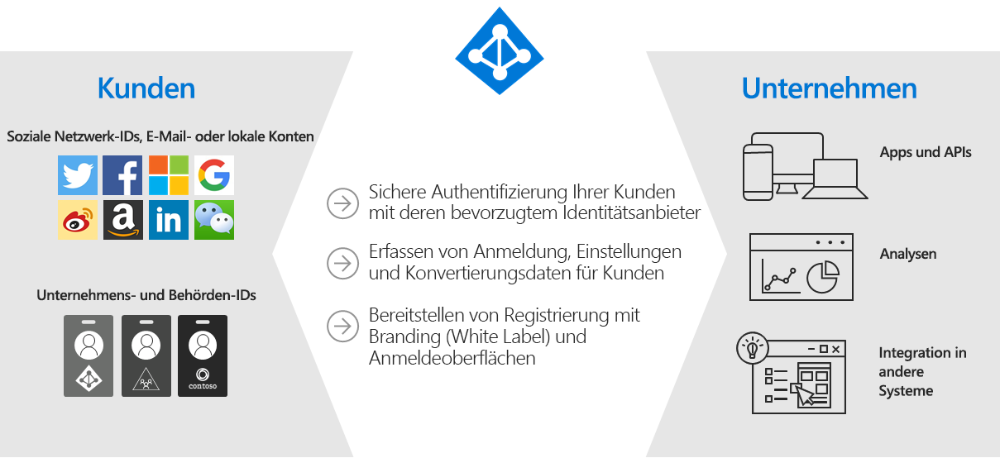
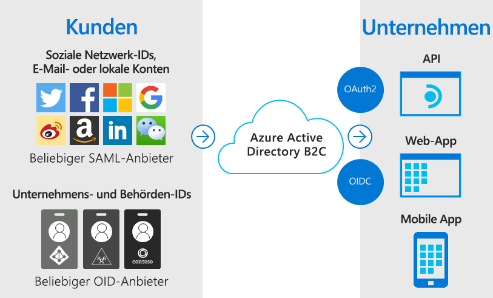
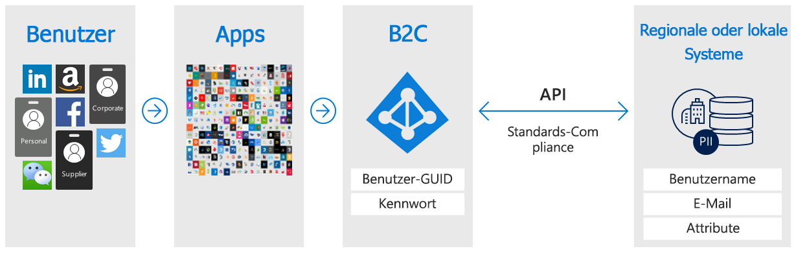
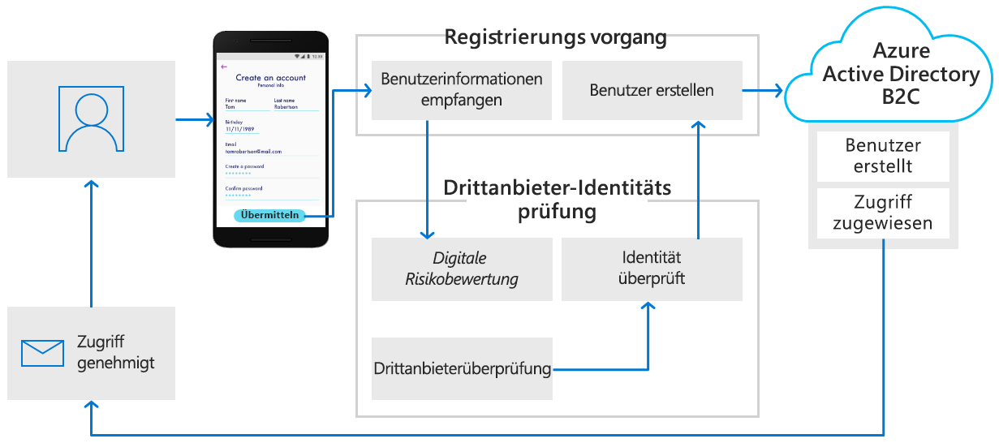
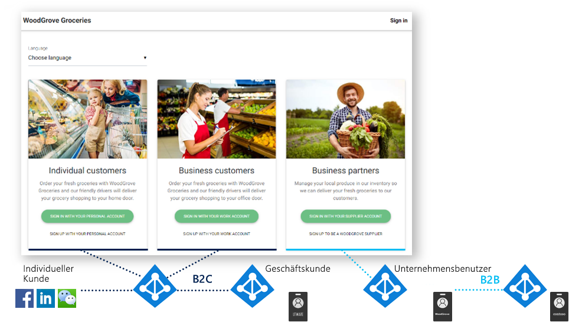

# Was ist Azure Active Directory B2C?

Azure Active Directory B2C ermöglicht die Benutzeridentifizierung für Unternehmen. Ihre Kunden verwenden ihre bevorzugten Identitäten für soziale Netzwerke, Unternehmen oder lokale Konten, um mit einmaligem Anmelden Zugriff auf Ihre Anwendungen und APIs zu erhalten.

Azure Active Directory B2C (Azure AD B2C) ist eine CIAM-Lösung (Customer Identity Access Management), die Millionen von Benutzern und Milliarden von Authentifizierungen pro Tag unterstützt. Sie sorgt für die Skalierung und Sicherheit der Authentifizierungsplattform sowie die Überwachung und automatische Behandlung von Bedrohungen wie Denial-of-Service-, Kennwort-Spray- oder Brute-Force-Angriffen.

## Identitätslösung mit benutzerdefiniertem Branding

Azure AD B2C ist eine White-Label-Authentifizierungslösung. Sie können das gesamte Benutzererlebnis an Ihr Branding anpassen, um es nahtlos in Ihre Web-und mobilen Anwendungen zu integrieren.

Passen Sie jede Seite an, die von Azure AD B2C angezeigt wird, wenn sich die Benutzer registrieren, anmelden und ihre Profilinformationen ändern. Passen Sie den HTML-, CSS-und JavaScript-Code in den User Journeys an, damit Azure AD B2C dem Aussehen und Verhalten Ihrer Anwendung entspricht.

## Zugriff per einmaligem Anmelden mit einer vom Benutzer bereitgestellten Identität

Azure AD B2C verwendet auf Standards basierende Authentifizierungsprotokolle, einschließlich OpenID Connect, OAuth 2.0 und SAML. Es lässt sich in die meisten modernen Anwendungen und COTS-Software (Commercial Off-The-Shelf) integrieren.

Da Azure AD B2C als zentrale Authentifizierungsstelle für Ihre Webanwendungen, mobilen Apps und APIs fungiert, können Sie für diese alle eine SSO-Lösung (Single Sign-On, einmaliges Anmelden) erstellen. Zentralisieren Sie das Sammeln der Informationen zu Benutzerprofilen und -einstellungen, und erfassen Sie ausführliche Analysen zum Anmeldeverhalten und zum Abschluss von Registrierungen.

## Integration in externe Benutzerspeicher

Azure AD B2C stellt ein Verzeichnis bereit, das 100 benutzerdefinierte Attribute pro Benutzer enthalten kann. Sie können Azure AD B2C jedoch auch in externe Systeme integrieren. Verwenden Sie z. B. Azure AD B2C für die Authentifizierung, und nutzen Sie als Quelle für Kundendaten eine externe CRM-Datenbank (Customer Relationship Management) oder Kundendatenbank.

Ein weiteres Szenario für die Verwendung eines externen Benutzerspeichers: Die Authentifizierung für Ihre Anwendung erfolgt durch Azure AD B2C, Sie integrieren es jedoch in ein externes System, in dem Benutzerprofildaten oder personenbezogene Daten gespeichert werden. So können Sie u. a. Anforderungen an die Datenresidenz, z. B. Richtlinien für die regionale oder lokale Datenspeicherung, erfüllen.

Azure AD B2C kann das Sammeln von Informationen vom Benutzer während der Registrierung oder Profilbearbeitung unterstützen und diese Daten dann an das externe System übergeben. Bei zukünftigen Authentifizierungen können dann die Daten von Azure AD B2C aus dem externen System abgerufen und ggf. in die Authentifizierungstokenantwort eingeschlossen werden, die an Ihre Anwendung gesendet wird.

## Progressive Profilerstellung

Eine weitere User Journey-Option umfasst die progressive Profilerstellung. Mit progressiver Profilerstellung können Ihre Kunden ihre erste Transaktion schnell durchführen, indem eine minimale Menge an Informationen gesammelt wird. Sammeln Sie dann nach und nach bei zukünftigen Anmeldungen weitere Profildaten vom Kunden.

## Identitätsüberprüfung durch Drittanbieter

Verwenden Sie Azure AD B2C zur Unterstützung der Identitätsüberprüfung durch das Sammeln von Benutzerdaten, und übergeben Sie diese dann an ein Drittanbietersystem zur Validierung, Vertrauensbewertung und Genehmigung für die Erstellung eines Benutzerkontos.

Dies sind nur einige der Möglichkeiten, die Ihnen Azure AD B2C als Plattform für die Benutzeridentifizierung für Unternehmen bietet. In den folgenden Abschnitten dieser Übersicht wird eine Demoanwendung vorgestellt, die Azure AD B2C verwendet. Sie können auch direkt zu einer ausführlicheren [technischen Übersicht über Azure AD B2C](technical-overview.md) wechseln.

## Beispiel: WoodGrove Groceries

[Woodgrove Groceries][woodgrove] ist eine von Microsoft erstellte Livewebanwendung zur Veranschaulichung verschiedener Features von Azure AD B2C. In den nächsten Abschnitten werden einige Authentifizierungsoptionen beschrieben, die von Azure AD B2C für die Woodgrove-Website bereitgestellt werden.

### Übersicht über das Unternehmen

Woodgrove ist ein Online-Lebensmittelgeschäft für Privat- und Geschäftskunden. Die Geschäftskunden kaufen Lebensmittel im Auftrag ihres Unternehmens oder von Unternehmen, die von ihnen geleitet werden.

### Anmeldeoptionen

Woodgrove Groceries bietet abhängig von der Beziehung der Kunden zu dem Geschäft verschiedene Anmeldeoptionen:

* **Einzelkunden** können sich mit persönlichen Konten registrieren oder anmelden, z. B. mit einem sozialen Netzwerk als Identitätsanbieter oder einer E-Mail-Adresse und einem Kennwort.
* **Geschäftskunden** können sich mit ihren Unternehmensanmeldeinformationen registrieren oder anmelden.
* **Partner** und Lieferanten sind Personen, die das Lebensmittelgeschäft mit Produkten für den Verkauf beliefern. Die Partneridentität wird von [Azure Active Directory B2B](../active-directory/b2b/what-is-b2b.md) bereitgestellt.

### Authentifizieren von Einzelkunden

Wenn ein Kunde **Mit Ihrem persönlichen Konto anmelden** auswählt, wird er zu einer angepassten Anmeldeseite umgeleitet, die von Azure AD B2C gehostet wird. In der folgenden Abbildung ist zu erkennen, dass das Aussehen und Verhalten der Benutzeroberfläche an die Website von Woodgrove Groceries angepasst wurden. Für die Kunden von Woodgrove sollte nicht erkennbar sein, dass die Authentifizierung von Azure AD B2C gehostet und gesichert wird.

Die Kunden von Woodgrove können sich mit ihrem Google-, Facebook- oder Microsoft-Konto als Identitätsanbieter registrieren und anmelden. Oder sie können sich mit ihrer E-Mail-Adresse und einem Kennwort anmelden, um ein sogenanntes *lokales Konto* zu erstellen.

Wenn ein Kunde **Sign up with your personal account** (Mit Ihrem persönlichen Konto registrieren) und dann **Sign up now** (Jetzt registrieren) auswählt, wird eine benutzerdefinierte Registrierungsseite angezeigt.

Nachdem der Kunde eine E-Mail-Adresse eingegeben und **Überprüfungscode senden** ausgewählt hat, wird ihm von Azure AD B2C der Überprüfungscode gesendet. Nachdem der Kunde den Code eingegeben, **Code überprüfen** ausgewählt und die restlichen Informationen im Formular eingegeben hat, muss er den Vertragsbedingungen zustimmen.

Das Klicken auf die Schaltfläche **Erstellen** bewirkt, dass Azure AD B2C den Benutzer an die Woodgrove Groceries-Website umleitet. Azure AD B2C übergibt beim Umleiten ein OpenID Connect-Authentifizierungstoken an die Woodgrove-Webanwendung. Der Benutzer ist jetzt angemeldet und kann die Website nutzen. In der rechten oberen Ecke wird sein Anzeigename angezeigt, um anzugeben, dass er angemeldet ist.

### Authentifizieren von Geschäftskunden

Wenn ein Kunde eine der Optionen unter **Business Customers** (Geschäftskunden) auswählt, ruft die Woodgrove Groceries-Website eine andere Azure AD B2C-Richtlinie als die Richtlinie für Einzelkunden auf.

Mit dieser Richtlinie wird dem Benutzer die Möglichkeit geboten, für die Registrierung und Anmeldung seine Unternehmensanmeldeinformationen zu verwenden. Im Woodgrove-Beispiel werden Benutzer aufgefordert, sich mit einem beliebigen Office 365- oder Azure AD-Konto anzumelden. Diese Richtlinie verwendet eine [mehrinstanzenfähige Azure AD-Anwendung](../active-directory/develop/howto-convert-app-to-be-multi-tenant.md) und den Azure AD-Endpunkt `/common`, um einen Verbund von Azure AD B2C mit einem beliebigen Office 365-Kunden an einem beliebigen Standort zu bilden.

### Authentifizieren von Partnern

Für den Link **Sign in with your supplier account** (Mit Ihrem Lieferantenkonto anmelden) wird die Zusammenarbeitsfunktion von Azure Active Directory B2B verwendet. Bei Azure AD B2B handelt es sich um eine Gruppe von Features in Azure Active Directory zum Verwalten von Partneridentitäten. Mit diesen Identitäten kann über Azure Active Directory ein Verbund für den Zugriff auf Anwendungen gebildet werden, die durch Azure AD B2C geschützt werden.

Weitere Informationen zu Azure AD B2B finden Sie unter [Was ist der Gastzugriff in Azure Active Directory-B2B?](../active-directory/b2b/what-is-b2b.md).

<!-- UNCOMMENT WHEN REPO IS UPDATED WITH LATEST DEMO CODE
### Sample code

If you'd like to jump right into the code to see how the WoodGrove Groceries application is built, you can find the repository on GitHub:

[Azure-Samples/active-directory-external-identities-woodgrove-demo][woodgrove-repo] (GitHub)
-->

## Nächste Schritte

Nachdem Sie nun Azure AD B2C und einige der Szenarien für seine Verwendung kennengelernt haben, können Sie sich näher mit seinen Features und technischen Aspekten befassen.

> [!div class="nextstepaction"]
> [Technische Übersicht über Azure AD B2C >](technical-overview.md)

<!-- LINKS - External -->
[woodgrove]: https://aka.ms/ciamdemo
[woodgrove-repo]: https://github.com/Azure-Samples/active-directory-external-identities-woodgrove-demo
