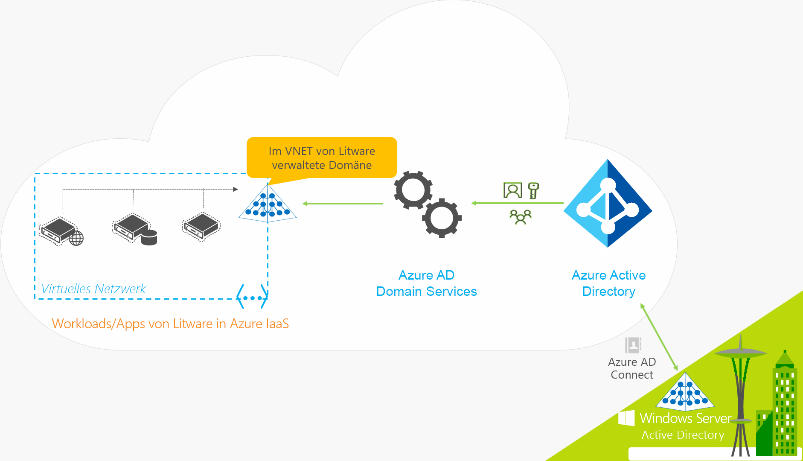
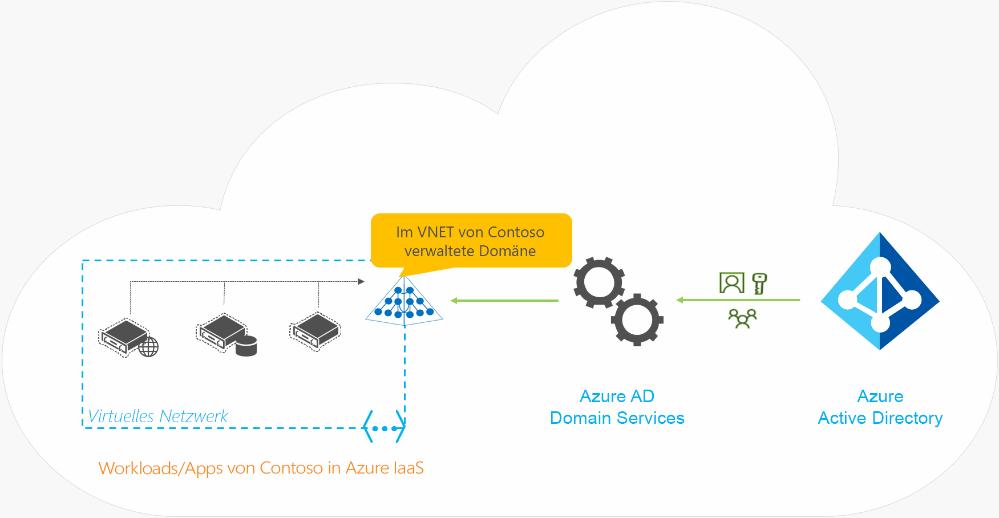

# Was ist Azure Active Directory Domain Services?

Azure Active Directory Domain Services (Azure AD DS) stellt verwaltete Domänendienste bereit, z. B. Domänenbeitritt, Gruppenrichtlinie, LDAP (Lightweight Directory Access Protocol) und Kerberos-/NTLM-Authentifizierung, die mit Windows Server Active Directory vollständig kompatibel sind. Sie können diese Domänendienste nutzen, ohne Domänencontroller in der Cloud bereitstellen, verwalten und patchen zu müssen. Azure AD DS lässt sich in Ihren vorhandenen Azure AD-Mandanten integrieren, sodass Benutzer sich mit ihren vorhandenen Anmeldeinformationen anmelden können. Sie können auch vorhandene Gruppen und Benutzerkonten verwenden, um den Zugriff auf Ressourcen zu sichern. So können Sie für eine reibungslosere Lift & Shift-Migration lokaler Ressourcen zu Azure sorgen.

Azure AD DS repliziert Identitätsinformationen aus Azure AD und lässt sich daher für rein cloudbasierte Azure AD-Mandanten sowie für Mandanten einsetzen, die mit einer lokalen AD DS-Umgebung synchronisiert werden. Für beide Umgebungen stehen die gleichen Azure AD DS-Features zur Verfügung.

* Wenn Sie bereits über eine lokale AD DS-Umgebung verfügen, können Sie Benutzerkontoinformationen synchronisieren, um eine konsistente Identität für Benutzer bereitzustellen.
* In reinen Cloudumgebungen benötigen Sie keine herkömmliche AD DS-Umgebung, um die zentralisierten Identitätsdienste von Azure AD DS zu nutzen.

Das folgende Video bietet einen Überblick über die Integration von Azure AD DS in Ihre Anwendungen und Workloads zum Bereitstellen von Identitätsdiensten in der Cloud:

 

>[!VIDEO https://www.youtube.com/embed/T1Nd9APNceQ]

## Allgemeine Methoden zum Bereitstellen von Identitätslösungen in der Cloud

Wenn Sie vorhandene Workloads zur Cloud migrieren, können verzeichnisbasierte Anwendungen LDAP verwenden, um Lese- oder Schreibzugriff auf ein lokales AD DS-Verzeichnis zu erhalten. Unter Windows Server ausgeführte Anwendungen werden normalerweise auf virtuellen Computern bereitgestellt, die in eine Domäne eingebunden sind. So können sie per Gruppenrichtlinie auf sichere Weise verwaltet werden. Zum Authentifizieren von Endbenutzern nutzen die Anwendungen möglicherweise auch eine integrierte Windows-Authentifizierung wie Kerberos oder NTLM.

IT-Administratoren verwenden häufig eine der folgenden Lösungen, um in Azure ausgeführten Anwendungen einen Identitätsdienst bereitzustellen:

* Konfigurieren einer Site-to-Site-VPN-Verbindung zwischen in Azure ausgeführten Workloads und der lokalen AD DS-Umgebung
* Erstellen von Replikatdomänencontrollern mithilfe von virtuellen Azure-Computern (VMs), um die AD DS-Domäne bzw. -Struktur zu erweitern
* Bereitstellen einer eigenständigen AD DS-Umgebung in Azure mithilfe von Domänencontrollern, die auf Azure-VMs ausgeführt werden

Bei diesen Ansätzen sind Anwendungen aufgrund der VPN-Verbindungen zum lokalen Verzeichnis anfällig für vorübergehende Netzwerkprobleme oder -ausfälle. Wenn Sie Domänencontroller auf VMs in Azure bereitstellen, muss das IT-Team diese VMs verwalten, schützen, patchen, überwachen und sichern sowie mögliche Probleme beheben.

Mit Azure AD DS entfällt die Notwendigkeit, VPN-Verbindungen zurück zu einer lokalen AD DS-Umgebung zu erstellen oder VMs in Azure auszuführen und zu verwalten, um Identitätsdienste bereitzustellen. Azure AD DS ist ein verwalteter Dienst und vereinfacht als solcher die Erstellung einer integrierten Identitätslösung für hybride und rein cloudbasierte Umgebungen erheblich.

## Azure AD DS: Features und Vorteile

Azure AD DS bietet Identitätsdienste für Anwendungen und VMs in der Cloud. Dabei ist der Dienst bei Prozessen wie Domänenbeitritt, Secure LDAP (LDAPS), der Verwaltung von Gruppenrichtlinien und DNS sowie der Unterstützung für LDAP-basierte Bindungs- und Lesevorgänge vollständig kompatibel mit herkömmlichen AD DS-Umgebungen. Unterstützung für LDAP-Schreibvorgänge ist für Objekte verfügbar, die in der verwalteten Azure AD DS-Domäne erstellt wurden, aber nicht für Ressourcen, die aus Azure AD synchronisiert wurden. Die folgenden Features von Azure AD DS vereinfachen die Bereitstellung und Verwaltung:

* **Vereinfachte Bereitstellung**: Sie können Azure AD DS-Funktionen für Ihren Azure AD-Mandanten über einen einzelnen Assistenten im Azure-Portal einrichten und verwalten.
* **In Azure AD integriert:** Benutzerkonten, Gruppenmitgliedschaften und Anmeldeinformationen stehen aus dem Azure AD-Mandanten automatisch zur Verfügung. Neue Benutzer, neue Gruppen oder Änderungen an Attributen in Ihrem Azure AD-Mandanten oder Ihrem lokalen AD DS-Verzeichnis werden automatisch mit Azure AD DS synchronisiert.
    * Konten in externen Verzeichnissen, die mit Ihrer Azure AD-Instanz verknüpft sind, sind in Azure AD DS nicht verfügbar. Anmeldeinformationen sind für diese externen Verzeichnisse nicht verfügbar, daher können diese nicht mit einer verwalteten Azure AD DS-Domäne synchronisiert werden.
* **Verwenden der Anmeldeinformationen/Kennwörter Ihres Unternehmens:** Kennwörter für Benutzer in Ihrem Azure AD-Mandanten sind mit denen in Azure AD DS identisch. Benutzer können ihre Unternehmensanmeldeinformationen verwenden, um Computer in die Domäne einzubinden, sich interaktiv oder per Remotedesktop anzumelden und sich bei der verwalteten Azure AD DS-Domäne zu authentifizieren.
* **NTLM- und Kerberos-Authentifizierung:** Durch die Unterstützung der NTLM- und Kerberos-Authentifizierung können Sie Anwendungen bereitstellen, die auf der integrierten Windows-Authentifizierung beruhen.
* **Hochverfügbarkeit:** Azure AD DS umfasst mehrere Domänencontroller, die Hochverfügbarkeit für Ihre verwaltete Domäne bereitstellen. Diese Hochverfügbarkeit garantiert eine hohe Betriebszeit der Dienste und Ausfallsicherheit bei Fehlern.
    * In Regionen, die [Azure-Verfügbarkeitszonen][availability-zones] unterstützen, werden diese Domänencontroller für zusätzliche Resilienz ebenfalls über Zonen hinweg verteilt. 

Einige wichtige Aspekte einer verwalteten Azure AD DS-Domäne:

* Eine verwaltete Azure AD DS-Domäne ist eine eigenständige Domäne. Es handelt sich nicht um eine Erweiterung einer lokalen Domäne.
* Ihr IT-Team muss keine Domänencontroller für die verwaltete Azure AD DS-Domäne verwalten, patchen oder überwachen.

In Hybridumgebungen, in denen lokales AD DS ausgeführt wird, müssen Sie sich nicht um die AD-Replikation zur verwalteten Azure AD DS-Domäne kümmern. Benutzerkonten, Gruppenmitgliedschaften und Anmeldeinformationen aus Ihrem lokalen Verzeichnis werden über [Azure AD Connect][azure-ad-connect] mit Azure AD synchronisiert. Diese Benutzerkonten, Gruppenmitgliedschaften und Anmeldeinformationen stehen innerhalb der verwalteten Azure AD DS-Domäne automatisch zur Verfügung.

## Wie funktioniert Azure AD DS?

Zum Bereitstellen von Identitätsdiensten erstellt Azure eine AD DS-Instanz in einem virtuellen Netzwerk Ihrer Wahl. Ein Windows Server-Domänencontrollerpaar sorgt im Hintergrund für Redundanz – Sie müssen sich weder um Verwaltung noch um Sicherung oder Aktualisierung kümmern.

Die verwaltete Azure AD DS-Domäne ist so konfiguriert, dass sie eine unidirektionale Synchronisierung von Azure AD durchführt, um Zugriff auf einen zentralen Satz Benutzer, Gruppen und Anmeldeinformationen zu bieten. Sie können Ressourcen direkt in der verwalteten Azure AD DS-Domäne erstellen, diese werden aber nicht wieder mit Azure AD synchronisiert. Anwendungen, Dienste und VMs in Azure, die eine Verbindung mit diesem virtuellen Netzwerk herstellen, können gemeinsame AD DS-Features wie Domänenbeitritt, Gruppenrichtlinien, LDAP und Kerberos- bzw. NTLM-Authentifizierung nutzen.

In einer Hybridumgebung mit lokalem AD DS synchronisiert [Azure AD Connect][azure-ad-connect] Identitätsinformationen mit Azure AD.

Sehen wir uns die Funktionsweise von Azure AD DS an einigen Beispielen an:

* [Azure AD DS für Hybridorganisationen](#azure-ad-ds-for-hybrid-organizations)
* [Azure AD DS für rein cloudbasierte Organisationen](#azure-ad-ds-for-cloud-only-organizations)

### Azure AD DS für Hybridorganisationen

Viele Organisationen betreiben eine hybride Infrastruktur, die sowohl cloudbasierte als auch lokale Anwendungsworkloads umfasst. Ältere Anwendungen, die im Rahmen einer Lift & Shift-Strategie zu Azure migriert wurden, verwenden möglicherweise herkömmliche LDAP-Verbindungen, um Identitätsinformationen bereitzustellen. Zur Unterstützung einer solchen Hybridinfrastruktur können Identitätsinformationen aus einer lokalen AD DS-Umgebung mit einem Azure AD-Mandanten synchronisiert werden. Azure AD DS stellt für diese älteren Anwendungen in Azure dann eine Identitätsquelle bereit, ohne dass die Anwendungskonnektivität wieder in lokalen Verzeichnisdiensten konfiguriert und verwaltet werden muss.

Sehen Sie sich dieses Beispiel der Litware Corporation an, eine hybride Organisation, die sowohl lokale als auch Azure-basierte Ressourcen ausführt:

* Die Anwendungen und Serverworkloads, die Domänendienste erfordern, sind in einem virtuellen Netzwerk in Azure bereitgestellt.
    * Hierzu gehören möglicherweise auch ältere Anwendungen, die im Rahmen einer Lift & Shift-Strategie zu Azure migriert wurden.
* Um Identitätsinformationen aus dem lokalen Verzeichnis mit dem Azure AD-Mandanten zu synchronisieren, stellt die Litware Corporation [Azure AD Connect][azure-ad-connect] bereit.
    * Die synchronisierten Identitätsinformationen umfassen Benutzerkonten und Gruppenmitgliedschaften.
* Das IT-Team von Litware aktiviert Azure AD DS für den Azure AD-Mandanten in diesem Netzwerk oder in einem virtuellen Peeringnetzwerk.
* Anwendungen und VMs, die auf virtuellen Computern im virtuellen Azure-Netzwerk bereitgestellt werden, können dann Azure AD DS-Features wie Domänenbeitritt, LDAP-Lesevorgänge, LDAP-Bindung, NTLM- und Kerberos-Authentifizierung sowie Gruppenrichtlinien nutzen.

### Azure AD DS für rein cloudbasierte Organisationen

Ein rein cloudbasierter Azure AD-Mandant besitzt keine lokale Identitätsquelle. Benutzerkonten und Gruppenmitgliedschaften werden beispielsweise direkt in Azure AD erstellt und verwaltet.

Sehen wir uns jetzt ein Beispiel für Contoso an, eine reine Cloudorganisation, die zur Identitätsverwaltung nur Azure AD verwendet. Alle Benutzeridentitäten sowie die zugehörigen Anmeldeinformationen und Gruppenmitgliedschaften werden in Azure AD erstellt und verwaltet. Es ist keine zusätzliche Konfiguration von Azure AD Connect erforderlich, um Identitätsinformationen aus einem lokalen Verzeichnis zu synchronisieren.

* Die Anwendungen und Serverworkloads, die Domänendienste erfordern, sind in einem virtuellen Netzwerk in Azure bereitgestellt.
* Das IT-Team von Contoso aktiviert Azure AD DS für den Azure AD-Mandanten in diesem Netzwerk oder in einem virtuellen Peeringnetzwerk.
* Anwendungen und VMs, die auf virtuellen Computern im virtuellen Azure-Netzwerk bereitgestellt werden, können dann Azure AD DS-Features wie Domänenbeitritt, LDAP-Lesevorgänge, LDAP-Bindung, NTLM- und Kerberos-Authentifizierung sowie Gruppenrichtlinien nutzen.

## Nächste Schritte

Einen Vergleich zwischen Azure AD DS und anderen Identitätslösungen sowie Informationen zur Funktionsweise der Synchronisierung finden Sie in den folgenden Artikeln:

* [Vergleichen von Azure AD DS mit Azure AD, Active Directory Domain Services auf Azure-VMs und lokalen Active Directory Domain Services][compare]
* [Synchronisierung in einer durch Azure AD Domain Services verwalteten Domäne][synchronization]

Für den Einstieg [erstellen Sie eine verwaltete Azure AD DS-Domäne im Azure-Portal][tutorial-create].

<!-- INTERNAL LINKS -->
[compare]: compare-identity-solutions.md
[synchronization]: synchronization.md
[tutorial-create]: tutorial-create-instance.md
[azure-ad-connect]: ../active-directory/hybrid/whatis-azure-ad-connect.md
[password-hash-sync]: ../active-directory/hybrid/how-to-connect-password-hash-synchronization.md
[availability-zones]: ../availability-zones/az-overview.md
