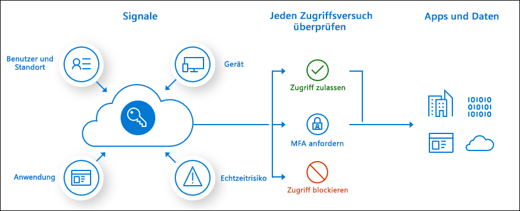

# Was ist bedingter Zugriff?

Der moderne Sicherheitsperimeter erstreckt sich jetzt über das Netzwerk einer Organisation hinaus und bezieht auch die Benutzer- und Geräteidentität mit ein. Organisationen können diese Identitätssignale als Teil ihrer Entscheidungen in Bezug auf die Zugriffssteuerung nutzen. 

Der bedingte Zugriff ist das Tool, das von Azure Active Directory verwendet wird, um Signale zusammenzuführen, Entscheidungen zu treffen und Organisationsrichtlinien zu erzwingen. Der bedingte Zugriff ist der Kern der neuen identitätsbasierten Steuerungsebene.

Die einfachsten Richtlinien für den bedingten Zugriff sind if-Anweisungen: Wenn ein Benutzer auf eine Ressource zugreifen möchte, muss er eine Aktion ausführen. Beispiel: Der Leiter der Lohnbuchhaltung möchte auf die Gehaltsabrechnungsanwendung zugreifen und muss für den Zugriff auf die Anwendung eine mehrstufige Authentifizierung durchführen.

Administratoren haben zwei primäre Ziele:

- Schaffen von Bedingungen für Benutzer, unter denen sie an jedem Ort und zu jeder Zeit produktiv sein können
- Schützen der Ressourcen einer Organisation

Mithilfe von Richtlinien für den bedingten Zugriff können Sie bei Bedarf die richtigen Zugriffssteuerungen anwenden, um die Sicherheit Ihrer Organisation zu gewährleisten, und behindern die Benutzer nicht unnötig.

Richtlinien für den bedingten Zugriff werden durchgesetzt, nachdem die First-Factor-Authentifizierung abgeschlossen ist. Der bedingte Zugriff nicht ist als erste Abwehrmaßnahme einer Organisation für Szenarien wie Denial-of-Service-Angriffe (DoS) gedacht, sondern kann Signale von diesen Ereignissen nutzen, um den Zugriff zu bestimmen.

## Häufige Signale

Häufige Signale, die der bedingte Zugriff bei der Entscheidungsfindung in Bezug auf eine Richtlinie berücksichtigen kann, sind unter anderem folgende:

- Benutzer oder Gruppenmitgliedschaft
   - Richtlinien können auf bestimmte Benutzer und Gruppen ausgerichtet werden, sodass Administratoren eine differenzierte Kontrolle über den Zugriff haben.
- IP-Standortinformationen
   - Organisationen können vertrauenswürdige IP-Adressbereiche erstellen, die beim Treffen von Richtlinienentscheidungen verwendet werden können. 
   - Administratoren können IP-Bereiche ganzer Länder angeben, um den Datenverkehr zu blockieren oder zuzulassen.
- Gerät
   - Benutzer mit Geräten bestimmter Plattformen oder mit einer Kennzeichnung zu einem bestimmten Zustand können beim Erzwingen von Richtlinien für den bedingten Zugriff verwendet werden.
- Anwendung
   - Benutzer, die auf bestimmte Anwendungen zugreifen, können unterschiedliche Richtlinien für den bedingten Zugriff auslösen. 
- Erkennung in Echtzeit und kalkulierte Risiken
   - Die Signalintegration in Azure AD Identity Protection ermöglicht bedingte Zugriffsrichtlinien, um riskantes Anmeldeverhalten zu erkennen. Richtlinien können dann erzwingen, dass Benutzer Kennwortänderungen vornehmen oder die mehrstufige Authentifizierung durchführen, um ihr Risiko zu verringern oder den Zugriff zu blockieren, bis ein Administrator manuelle Maßnahmen ergreift.
- Microsoft Cloud App Security (MCAS)
   - Ermöglicht es, den Benutzerzugriff auf Anwendungen und Sitzungen zu kontrollieren und in Echtzeit zu überwachen, was die Transparenz und die Kontrolle über den Zugriff auf Ihre Cloudumgebung sowie über darin ausgeführte Aktivitäten ermöglicht.

## Häufige Entscheidungen

- Zugriff blockieren
   - Stark restriktive Entscheidung
- Gewähren von Zugriff
   - Kaum restriktive Entscheidungen, unter Umständen ist weiterhin mindestens eine der folgenden Optionen erforderlich:
      - Mehrstufige Authentifizierung erforderlich
      - Markieren des Geräts als kompatibel erforderlich
      - In Azure AD eingebundenes Hybridgerät erforderlich
      - Genehmigte Client-App erforderlich
      - App-Schutzrichtlinie erforderlich (Vorschau)

## Häufig verwendete Richtlinien

Viele Organisationen haben allgemeine Bedenken in Bezug auf den Zugriff, bei denen Richtlinien für den bedingten Zugriff wie etwa die folgenden hilfreich sein können:

- Erzwingen der mehrstufigen Authentifizierung für Benutzer mit Administratorrollen
- Erzwingen der mehrstufigen Authentifizierung für Azure-Verwaltungsaufgaben
- Blockieren von Anmeldungen für Benutzer, die ältere Authentifizierungsprotokolle verwenden
- Erzwingen vertrauenswürdiger Speicherorte für die Azure Multi-Factor Authentication-Registrierung
- Blockieren oder Gewähren von Zugriff von bestimmten Standorten aus
- Blockieren riskanter Anmeldeverhalten
- Erzwingen von durch die Organisation verwaltete Geräte für bestimmte Anwendungen

## Lizenzanforderungen

[!INCLUDE [Active Directory P1 license](../../../includes/active-directory-p1-license.md)]

Kunden mit [Microsoft 365 Business-Lizenzen](https://docs.microsoft.com/office365/servicedescriptions/microsoft-365-service-descriptions/microsoft-365-business-service-description) haben auch Zugriff auf Funktionen für bedingten Zugriff. 

## Nächste Schritte

[Erstellen einer Richtlinie für bedingten Zugriff](concept-conditional-access-policies.md)

Unter [Anleitung: Planen der Bereitstellung von bedingtem Zugriff in Azure Active Directory](plan-conditional-access.md) erfahren Sie, wie Sie bedingten Zugriff in Ihrer Umgebung implementieren.

[Informationen zu Identity Protection](../identity-protection/overview-v2.md)

[Informationen zu Microsoft Cloud App Security](https://docs.microsoft.com/cloud-app-security/what-is-cloud-app-security)

[Informationen zu Microsoft Intune](https://docs.microsoft.com/intune/index)