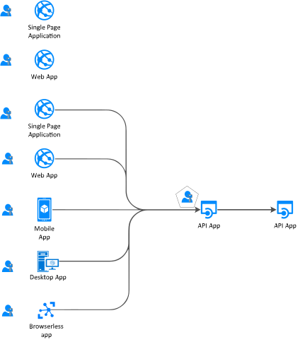
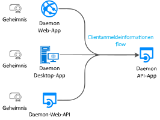
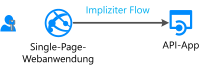
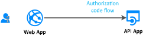
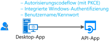
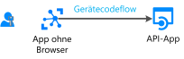
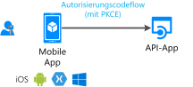
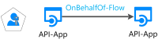

# Authentifizierungsflows und Anwendungsszenarien

Der Microsoft Identity Platform (v2.0)-Endpunkt unterstützt die Authentifizierung für verschiedene moderne Anwendungsarchitekturen. Diese Architekturen basieren jeweils auf den branchenüblichen Protokollen [OAuth 2.0 und OpenID Connect](active-directory-v2-protocols.md).  Anwendungen authentifizieren mithilfe von [Authentifizierungsbibliotheken](reference-v2-libraries.md) Identitäten und rufen Token für den Zugriff auf geschützte APIs ab.

In diesem Artikel werden die verschiedenen Authentifizierungsflows und Anwendungsszenarien beschrieben, in denen sie zur Anwendung kommen. Dieser Artikel enthält auch Listen mit Folgendem:
- [Anwendungsszenarien und unterstützte Authentifizierungsflows](#scenarios-and-supported-authentication-flows)
- [Anwendungsszenarien sowie unterstützte Plattformen und Sprachen](#scenarios-and-supported-platforms-and-languages)

## Anwendungskategorien

Token können von verschiedenen Arten von Anwendungen abgerufen werden. Hierzu zählen:

- Web-Apps
- Mobile Apps
- Desktop-Apps
- Web-APIs

Sie können auch von Apps auf Geräten abgerufen werden, die über keinen Browser verfügen oder als IoT-Geräte verwendet werden.

Anwendungen lassen sich wie folgt kategorisieren:

- [Geschützte Ressourcen oder Clientanwendungen:](#protected-resources-vs-client-applications) In einigen Szenarien steht der Schutz von Ressourcen (beispielsweise Web-Apps oder Web-APIs) im Vordergrund. In anderen Szenarien geht es darum, ein Sicherheitstoken zum Aufrufen einer geschützten Web-API abzurufen.
- [Mit Benutzern oder ohne Benutzer:](#with-users-or-without-users) Bei einigen Szenarien gibt es einen angemeldeten Benutzer, bei anderen ist kein Benutzer beteiligt (etwa bei Daemon-Szenarien).
- [Single-Page-Webanwendungen, öffentliche Clientanwendungen und vertrauliche Clientanwendungen:](#single-page-public-client-and-confidential-client-applications) Diese Anwendungen bilden drei große Kategorien von Anwendungstypen. Jede wird mit unterschiedlichen Bibliotheken und Objekten verwendet.
- [Zielgruppe für die Anmeldung:](v2-supported-account-types.md#certain-authentication-flows-dont-support-all-the-account-types) Die verfügbaren Authentifizierungsflows hängen von der Zielgruppe für die Anmeldung ab. Einige Flows stehen nur für Geschäfts-, Schul- oder Unikonten zur Verfügung. Andere sind sowohl für Geschäfts-, Schul- oder Unikonten als auch für persönliche Microsoft-Konten verfügbar. Die zulässige Zielgruppe hängt von den Authentifizierungsflows ab.
- [Unterstützte OAuth 2.0-Authentifizierungsflows:](#scenarios-and-supported-authentication-flows)  Authentifizierungsflows dienen zur Implementierung der Anwendungsszenarien mit Tokenanforderung. Anwendungsszenarien und Authentifizierungsflows lassen sich nicht eins zu eins zuordnen.
- [Unterstützte Plattformen:](#scenarios-and-supported-platforms-and-languages) Nicht alle Anwendungsszenarien sind für jede Plattform verfügbar.

### Geschützte Ressourcen oder Clientanwendungen

Die Authentifizierungsszenarien beinhalten zwei Aktivitäten:

- **Abrufen von Sicherheitstoken für eine geschützte Web-API:** Für den Tokenabruf empfiehlt Microsoft die Verwendung von [Authentifizierungsbibliotheken](reference-v2-libraries.md#microsoft-supported-client-libraries) – genauer gesagt: die MSAL-Familie (Microsoft Authentification Libraries).
- **Schützen einer Web-API oder einer Web-App:** Eine der Herausforderungen im Zusammenhang mit dem Schutz einer Web-API oder einer Web-App-Ressource besteht in der Überprüfung des Sicherheitstokens. Für einige Plattformen bietet Microsoft [Middlewarebibliotheken](reference-v2-libraries.md#microsoft-supported-server-middleware-libraries) an.

### Mit Benutzern oder ohne Benutzer

In den meisten Authentifizierungsszenarien werden Token im Namen angemeldeter Benutzer abgerufen.

Es gibt jedoch auch Szenarien mit Daemon-Apps, in denen Anwendungen Token für sich selbst (also ohne Benutzer) abrufen.

### Single-Page-Webanwendungen, öffentliche Clientanwendungen und vertrauliche Clientanwendungen

Die Sicherheitstoken können von verschiedenen Arten von Anwendungen abgerufen werden. Diese Anwendungen werden in der Regel in drei Kategorien unterteilt:

- **Single-Page-Webanwendungen:** Bei diesen auch als SPAs bezeichneten Web-Apps werden Token über eine im Browser ausgeführte JavaScript- oder TypeScript-App abgerufen. Viele moderne Apps verfügen über ein hauptsächlich in JavaScript geschriebenes Single-Page-Webanwendungs-Front-End. Die Anwendung nutzt häufig ein Framework wie Angular, React oder Vue. „MSAL.js“ ist die einzige Microsoft-Authentifizierungsbibliothek, die Single-Page-Webanwendungen unterstützt.

- **Öffentliche Clientanwendungen:** Folgende Anwendungen melden immer Benutzer an:
  - Desktop-Apps, die Web-APIs im Namen des angemeldeten Benutzers aufrufen
  - Mobile Apps
  - Apps, die auf Geräten ohne Browser ausgeführt werden (etwa IoT-Geräte)

  Diese Apps werden durch die MSAL-Klasse [PublicClientApplication](msal-client-applications.md) dargestellt.

- **Vertrauliche Clientanwendungen:**
  - Web-Apps, die eine Web-API aufrufen
  - Web-APIs, die eine Web-API aufrufen
  - Daemon-Apps (auch bei Implementierung als Konsolendienst – etwa im Falle eines Linux-Daemons oder eines Windows-Diensts)
 
  Diese App-Typen verwenden die Klasse [ConfidentialClientApplication](msal-client-applications.md).

## Anwendungsszenarien

Der Microsoft Identity Platform-Endpunkt unterstützt die Authentifizierung für verschiedene App-Architekturen:

- Einseitige Apps
- Web-Apps
- Web-APIs
- Mobile Apps
- Native Apps
- Daemon-Apps
- Serverseitige Apps

Anwendungen verwenden die verschiedenen Authentifizierungsflows, um Benutzer anzumelden und Token für den Aufruf geschützter APIs zu beziehen.

### Single-Page-Webanwendungen

Viele moderne Web-Apps sind als clientseitige Single-Page-Webanwendung konzipiert, die mithilfe eines JavaScript- oder SPA-Frameworks wie Angular, Vue.js oder React.js geschrieben werden. Diese Anwendungen werden in einem Webbrowser ausgeführt. Ihre Authentifizierungsmerkmale unterscheiden sich von denen herkömmlicher serverseitiger Web-Apps. Durch die Nutzung von Microsoft Identity Platform können Single-Page-Webanwendungen Benutzer anmelden und Token für den Zugriff auf Back-End-Dienste oder Web-APIs beziehen.

Weitere Informationen finden Sie unter [Szenario: Einseitige Anwendung](scenario-spa-overview.md).

### Web-App, die einen Benutzer anmeldet

So schützen Sie eine Web-App, die einen Benutzer anmeldet:

- .NET-Entwickler verwenden ASP.NET oder ASP.NET Core mit der Open ID Connect-Middleware für ASP.NET. Der Schutz einer Ressource beinhaltet die Überprüfung des Sicherheitstokens. Diese erfolgt nicht durch MSAL-Bibliotheken, sondern durch die Bibliothek [IdentityModel-Erweiterungen für .NET](https://github.com/AzureAD/azure-activedirectory-identitymodel-extensions-for-dotnet/wiki).

- Node.js-Entwickler verwenden Passport.js.

Weitere Informationen finden Sie unter [Szenario: Web-App, die Benutzer anmeldet](scenario-web-app-sign-user-overview.md).

### Web-App, die einen Benutzer anmeldet und eine Web-API im Namen des Benutzers aufruft

Wenn Sie im Namen eines Benutzers eine Web-API über eine Web-App aufrufen möchten, verwenden Sie die MSAL-Klasse **ConfidentialClientApplication**. Sie verwenden den Autorisierungscodeflow und speichern die abgerufenen Token im Tokencache. Bei Bedarf werden Token von MSAL aktualisiert, und der Controller ruft automatisch Token aus dem Cache ab.

Weitere Informationen finden Sie unter [Szenario: Web-App, die Web-APIs aufruft](scenario-web-app-call-api-overview.md).

### Desktop-App, die eine Web-API im Namen eines angemeldeten Benutzers aufruft

Wenn eine Desktop-App eine Web-API für die Benutzeranmeldung aufrufen soll, verwenden Sie die interaktiven Tokenabrufmethoden der MSAL-Klasse **PublicClientApplication**. Mit diesen interaktiven Methoden können Sie die Benutzeroberfläche für die Anmeldeumgebung steuern. MSAL verwendet für diese Interaktion einen Webbrowser.

Für von Windows gehostete Anwendungen auf Computern, die entweder einer Windows-Domäne angehören oder über Azure Active Directory (AAD) miteinander verknüpft sind, gibt es noch eine weitere Möglichkeit. Diese Anwendungen können unter Verwendung der [integrierten Windows-Authentifizierung](https://aka.ms/msal-net-iwa) automatisch ein Token abrufen.

Anwendungen, die auf einem Gerät ohne Browser ausgeführt werden, können weiterhin eine API im Namen eines Benutzers aufrufen. Zur Authentifizierung muss sich der Benutzer auf einem anderen Gerät mit Webbrowser anmelden. In diesem Szenario muss der [Gerätecodeflow](https://aka.ms/msal-net-device-code-flow) verwendet werden.

Für öffentliche Clientanwendungen steht zwar auch der [Benutzername/Kennwort-Flow](https://aka.ms/msal-net-up) zur Verfügung, die Verwendung dieses Flows wird jedoch nicht empfohlen. Er wird beispielsweise in DevOps-Szenarien benötigt.

Die Verwendung dieses Flows ist allerdings mit Einschränkungen für Ihre Anwendungen verbunden. Anwendungen, die diesen Flow nutzen, können beispielsweise keine Benutzer anmelden, die eine mehrstufige Authentifizierung durchführen müssen oder bedingten Zugriff benötigen. Auch einmaliges Anmelden steht für Ihre Anwendungen nicht zur Verfügung.

Die Authentifizierung mit dem Benutzername/Kennwort-Flow widerspricht den Prinzipien der modernen Authentifizierung und wird lediglich aus Legacygründen bereitgestellt.

Wenn Sie in Desktop-Apps den Tokencache dauerhaft beibehalten möchten, müssen Sie die [Serialisierung des Tokencaches anpassen](https://aka.ms/msal-net-token-cache-serialization). Die Implementierung einer [dualen Tokencacheserialisierung](https://aka.ms/msal-net-dual-cache-serialization) ermöglicht die Verwendung abwärts- und aufwärtskompatibler Tokencaches mit früheren Generationen von Authentifizierungsbibliotheken. Zu den spezifischen Bibliotheken zählen die Versionen 3 und 4 der Azure AD-Authentifizierungsbibliothek für .NET (ADAL.NET).

Weitere Informationen finden Sie unter [Szenario: Desktop-App, die Web-APIs aufruft](scenario-desktop-overview.md).

### Mobile App, die eine Web-API im Namen eines interaktiven Benutzers aufruft

Eine mobile App ruft ähnlich wie eine Desktop-App die interaktiven Tokenabrufmethoden der MSAL-Klasse **PublicClientApplication** auf, um ein Token für den Aufruf einer Web-API abzurufen.

MSAL iOS und MSAL Android verwenden standardmäßig den Webbrowser des Systems. Sie können jedoch auch festlegen, dass die eingebettete Webansicht verwendet werden soll. Es gibt bestimmte Besonderheiten für die jeweilige mobile Plattform: universelle Windows-Plattform (UWP), iOS oder Android.

In einigen Szenarien (beispielsweise in Szenarien mit bedingtem Zugriff im Zusammenhang mit einer Geräte-ID oder einer Geräteregistrierung) muss ein [Broker](https://github.com/AzureAD/azure-activedirectory-library-for-dotnet/wiki/leveraging-brokers-on-Android-and-iOS) auf dem Gerät installiert sein. Beispiele für Broker sind das Microsoft-Unternehmensportal (Android) und Microsoft Authenticator (Android und iOS). Darüber hinaus kann MSAL nun mit Brokern interagieren.

> [!NOTE]
> Auf eine mobile App, die MSAL.iOS, MSAL.Android oder MSAL.NET unter Xamarin verwendet, können App-Schutzrichtlinien angewendet werden. Mit diesen Richtlinien kann beispielsweise verhindert werden, dass ein Benutzer geschützten Text kopiert. Die mobile App wird [von Intune verwaltet](https://docs.microsoft.com/intune/app-sdk) und von Intune als verwaltete App erkannt. Das [Intune App SDK](https://docs.microsoft.com/intune/app-sdk-get-started) ist von den MSAL-Bibliotheken getrennt und interagiert eigenständig mit Azure AD.

Weitere Informationen finden Sie unter [Szenario: Mobile App, die Web-APIs aufruft](scenario-mobile-overview.md).

### Geschützte Web-API

Mit dem Microsoft Identity Plattform-Endpunkt können Sie Webdienste wie etwa die RESTful-Web-API Ihrer App schützen. Eine geschützte Web-API wird mit einem Zugriffstoken aufgerufen, um die Daten der API zu schützen und eingehende Anforderungen zu authentifizieren. Der Aufrufer einer Web-API fügt an den Autorisierungsheader einer HTTP-Anforderung ein Zugriffstoken an.

Wenn Sie Ihre ASP.NET- oder ASP.NET Core-Web-API schützen möchten, müssen Sie das Zugriffstoken validieren. Für diese Validierung wird die JWT-Middleware für ASP.NET verwendet. Die Validierung wird nicht von MSAL.NET, sondern von der Bibliothek [IdentityModel-Erweiterungen für .NET](https://github.com/AzureAD/azure-activedirectory-identitymodel-extensions-for-dotnet/wiki) durchgeführt.

Weitere Informationen finden Sie unter [Szenario: Geschützte Web-API](scenario-protected-web-api-overview.md).

### Web-API, die eine andere Web-API im Namen eines Benutzers aufruft

Damit Ihre durch ASP.NET oder ASP.NET Core geschützte Web-API eine andere Web-API im Namen eines Benutzers aufrufen kann, muss Ihre App ein Token für die Downstream-Web-API abrufen. Hierzu wird die Methode [AcquireTokenOnBehalfOf](https://aka.ms/msal-net-on-behalf-of) der Klasse **ConfidentialClientApplication** aufgerufen. Aufrufe dieser Art werden auch als Dienst-zu-Dienst-Aufrufe bezeichnet. Web-APIs, die andere Web-APIs aufrufen, müssen auch eine benutzerdefinierte Cacheserialisierung bereitstellen.

  

Weitere Informationen finden Sie unter [Szenario: Web-API, die Web-APIs aufruft](scenario-web-api-call-api-overview.md).

### Daemon-App, die eine Web-API im Namen des Daemons aufruft

Apps, die Prozesse mit langer Ausführungszeit enthalten oder ohne Benutzerinteraktion ausgeführt werden, benötigen ebenfalls eine Möglichkeit, um auf sichere Web-APIs zuzugreifen. Eine solche App kann sich mithilfe der App-Identität (anstelle der delegierten Benutzeridentität) authentifizieren und Token abrufen. Die App weist ihre Identität mit einem geheimen Clientschlüssel oder einem Zertifikat nach.

Wenn Sie solche Daemon-Apps schreiben möchten, die ein Token für die aufrufende App abrufen, verwenden Sie die Abrufmethoden für [Clientanmeldeinformationen](https://aka.ms/msal-net-client-credentials) der Klasse **ConfidentialClientApplication**. Dabei wird allerdings vorausgesetzt, dass die aufrufende App ein Geheimnis bei Azure AD registriert hat. Die App gibt das Geheimnis dann an den aufgerufenen Daemon weiter. Beispiele für solche Geheimnisse wären etwa Anwendungskennwörter, Zertifikatassertion und Clientassertion.

Weitere Informationen finden Sie unter [Szenario: Daemon-App zum Aufrufen von Web-APIs](scenario-daemon-overview.md).

## Szenarien und unterstützte Authentifizierungsflows

Szenarien mit Tokenabruf lassen sich auch OAuth 2.0-Authentifizierungsflows zuordnen. Ausführliche Informationen finden Sie unter [Microsoft Identity Platform-Protokolle](active-directory-v2-protocols.md).

<table>
 <thead>
  <tr><th>Szenario</th> <th>Detaillierte Vorgehensweise für das Szenario</th> <th>OAuth 2.0-Flow und -Zuweisung</th> <th>Zielgruppe</th></tr>
 </thead>
 <tbody>
  <tr>
   <td></td>
   <td><a href="scenario-spa-overview.md">Einseitige App</a></td>
   <td><a href="v2-oauth2-implicit-grant-flow.md">Implizit</a></td>
   <td>Geschäfts-, Schul- oder Unikonten, persönliche Konten und Microsoft Azure Active Directory B2C (Azure AD B2C)</td>
 </tr>

  <tr>
   <td></td>
   <td><a href="scenario-web-app-sign-user-overview.md">Web-App, die Benutzer anmeldet</a></td>
   <td><a href="v2-oauth2-auth-code-flow.md">Autorisierungscode</a></td>
   <td>Geschäfts-, Schul- oder Unikonten, persönliche Konten und Azure AD B2C</td>
 </tr>

  <tr>
   <td></td>
   <td><a href="scenario-web-app-call-api-overview.md">Web-App, die Web-APIs aufruft</a></td>
   <td><a href="v2-oauth2-auth-code-flow.md">Autorisierungscode</a></td>
   <td>Geschäfts-, Schul- oder Unikonten, persönliche Konten und Azure AD B2C</td>
 </tr>

  <tr>
   <td rowspan="3"></td>
   <td rowspan="4"><a href="scenario-desktop-overview.md">Desktop-App, die Web-APIs aufruft</a></td>
   <td>Interaktiv unter Verwendung eines <a href="v2-oauth2-auth-code-flow.md">Autorisierungscodes</a> mit PKCE</td>
   <td>Geschäfts-, Schul- oder Unikonten, persönliche Konten und Azure AD B2C</td>
 </tr>

  <tr>
   <td>In Windows-Authentifizierung integriert</td>
   <td>Geschäfts-, Schul- oder Unikonten</td>
 </tr>

  <tr>
   <td><a href="v2-oauth-ropc.md">Kennwort des Ressourcenbesitzers</a></td>
   <td>Geschäfts-, Schul- oder Unikonten und Azure AD B2C</td>
 </tr>

  <tr>
   <td></td>
   <td><a href="v2-oauth2-device-code.md">Gerätecode</a></td>
   <td>Geschäfts-, Schul- oder Unikonten</td>
 </tr>

 <tr>
   <td rowspan="2"></td>
   <td rowspan="2"><a href="scenario-mobile-overview.md">Mobile App, die Web-APIs aufruft</a></td>
   <td>Interaktiv unter Verwendung eines <a href="v2-oauth2-auth-code-flow.md">Autorisierungscodes</a> mit PKCE</td>
   <td>Geschäfts-, Schul- oder Unikonten, persönliche Konten und Azure AD B2C</td>
 </tr>

  <tr>
   <td><a href="v2-oauth-ropc.md">Kennwort des Ressourcenbesitzers</a></td>
   <td>Geschäfts-, Schul- oder Unikonten und Azure AD B2C</td>
 </tr>

  <tr>
   <td></td>
   <td><a href=scenario-daemon-overview.md">Daemon-App, die Web-APIs aufruft</a></td>
   <td><a href="v2-oauth2-client-creds-grant-flow.md">Clientanmeldeinformationen</a></td>
   <td>Nur für die App geltende Berechtigungen ohne Benutzer sowie ausschließliche Verwendung in Azure AD-Organisationen</td>
 </tr>

  <tr>
   <td></td>
   <td><a href=scenario-web-api-call-api-overview.md">Web-API, die Web-APIs aufruft</a></td>
   <td><a href="v2-oauth2-on-behalf-of-flow.md">Im Namen von</a></td>
   <td>Geschäfts-, Schul- oder Unikonten und persönliche Konten</td>
 </tr>

 </tbody>
</table>

## Szenarien und unterstützte Plattformen und Sprachen

Microsoft-Authentifizierungsbibliotheken unterstützen verschiedene Plattformen:

- JavaScript
- .NET Framework
- .NET Core
- Windows 10/UWP
- Xamarin.iOS
- Xamarin.Android
- Natives iOS
- macOS
- Natives Android
- Java
- Python

Sie können zum Erstellen Ihrer Anwendungen auch verschiedene Sprachen verwenden. Beachten Sie allerdings, dass einige Anwendungstypen nicht auf jeder Plattform zur Verfügung stehen.

Wenn in der Windows-Spalte der folgenden Tabelle .NET Core angegeben ist, ist immer auch .NET Framework möglich. Letzteres wurde zur besseren Übersichtlichkeit der Tabelle weggelassen.

|Szenario  | Windows | Linux | Mac | iOS | Android
|--|--|--|--|--|--|--|
| [Einseitige App](scenario-spa-overview.md)   |  MSAL.js |  MSAL.js |  MSAL.js |  MSAL.js |  MSAL.js
| [Web-App, die Benutzer anmeldet](scenario-web-app-sign-user-overview.md)   |  ASP.NET Core |  ASP.NET Core |  ASP.NET Core
| [Web-App, die Web-APIs aufruft](scenario-web-app-call-api-overview.md)     |  ASP.NET Core + MSAL.NET   msal4j  Flask + MSAL Python|  ASP.NET Core + MSAL.NET  msal4j  Flask + MSAL Python|  ASP.NET Core + MSAL.NET  msal4j   Flask + MSAL Python
| [Desktop-App, die Web-APIs aufruft](scenario-desktop-overview.md)      | MSAL.NET  msal4j   MSAL Python| MSAL.NET msal4j  MSAL Python| MSAL.NET  msal4j  MSAL Python   MSAL.objc |
| [Mobile App, die Web-APIs aufruft](scenario-mobile-overview.md)    |  MSAL.NET  MSAL.NET | | |  MSAL.objc |  MSAL.Android
| [Daemon-App](scenario-daemon-overview.md)    | MSAL.NET  msal4j  MSAL Python|  MSAL.NET  msal4j  MSAL Python| MSAL.NET  msal4j  MSAL Python
| [Web-API, die Web-APIs aufruft](scenario-web-api-call-api-overview.md)     |  ASP.NET Core + MSAL.NET  msal4j  MSAL Python|  ASP.NET Core + MSAL.NET  msal4j  MSAL Python|  ASP.NET Core + MSAL.NET  msal4j  MSAL Python

Weitere Informationen finden Sie unter [Von Microsoft unterstützte Bibliotheken nach Betriebssystem/Sprache](reference-v2-libraries.md#microsoft-supported-libraries-by-os--language).

## Nächste Schritte
Erfahren Sie mehr über [Authentifizierungsgrundlagen](authentication-scenarios.md) und [Zugriffstoken](access-tokens.md).
