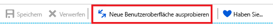
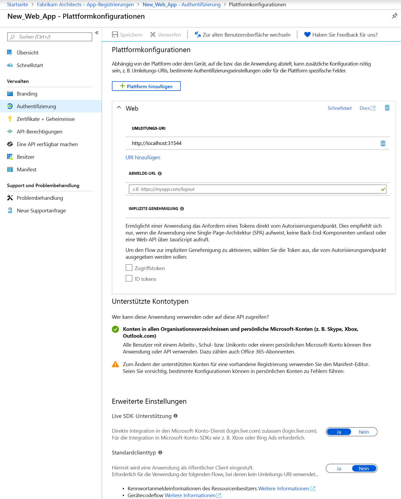
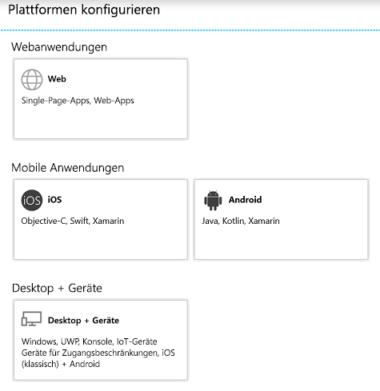

# Schnellstart: Konfigurieren einer Clientanwendung für den Zugriff auf Web-APIs

Damit eine Webanwendung oder vertrauliche Clientanwendung an einem Flow zur Autorisierungsgenehmigung teilnehmen kann, bei dem eine Authentifizierung (und das Abrufen eines Zugriffstokens) erforderlich ist, benötigt sie sichere Anmeldeinformationen. Die Standardauthentifizierungsmethode im Azure-Portal ist „Client-ID + geheimer Schlüssel“.

Bevor ein Client Zugriff auf eine Web-API erhält, die durch eine Ressourcenanwendung (z.B. Microsoft Graph-API) bereitgestellt wird, stellt das Zustimmungs-Framework außerdem sicher, dass dem Client die erforderlichen Berechtigungen basierend auf den angeforderten Berechtigungen erteilt werden. Standardmäßig können alle Anwendungen Berechtigungen aus der Microsoft Graph-API wählen. Die [Graph-API-Berechtigung „Anmelden und Benutzerprofil lesen“](https://developer.microsoft.com/graph/docs/concepts/permissions_reference#user-permissions) ist standardmäßig ausgewählt. Sie können für jede gewünschte Web-API zwischen [zwei Arten von Berechtigungen](developer-glossary.md#permissions) wählen:

* **Anwendungsberechtigungen**: Ihre Clientanwendung benötigt direkten Zugriff auf die Web-API als sie selbst (kein Benutzerkontext). Für diese Art von Berechtigung ist die Zustimmung des Administrators erforderlich, und sie steht nicht für öffentliche Clientanwendungen (Desktop und mobil) zur Verfügung.
* **Delegierte Berechtigungen**: Ihre Clientanwendung benötigt als angemeldeter Benutzer Zugriff auf die Web-API. Der Zugriff ist aber durch die ausgewählte Berechtigung eingeschränkt. Diese Art von Berechtigung kann von einem Benutzer erteilt werden, sofern für die Berechtigung nicht die Zustimmung durch einen Administrator erforderlich ist.

  > [!NOTE]
  > Durch Hinzufügen einer delegierten Berechtigung zu einer Anwendung erteilen Sie den Benutzern im Mandanten nicht automatisch Ihre Zustimmung. Benutzer müssen den zusätzlichen delegierten Berechtigungen weiterhin zur Laufzeit manuell zustimmen, sofern der Administrator nicht im Namen aller Benutzer die Zustimmung erteilt hat.

In dieser Schnellstartanleitung wird veranschaulicht, wie Sie Ihre App für folgende Zwecke konfigurieren:

* [Hinzufügen von Umleitungs-URIs zur Anwendung](#add-redirect-uris-to-your-application)
* [Konfigurieren von erweiterten Einstellungen für Ihre Anwendung](#configure-advanced-settings-for-your-application)
* [Ändern der unterstützten Kontotypen](#modify-supported-account-types)
* [Hinzufügen von Anmeldeinformationen zu Ihrer Webanwendung](#add-credentials-to-your-web-application)
* [Hinzufügen von Zugriffsberechtigungen für Web-APIs](#add-permissions-to-access-web-apis)

## Voraussetzungen

Stellen Sie zunächst sicher, dass die folgenden Voraussetzungen erfüllt sind:

* Sie sind über die Unterstützung von [Berechtigungen und Zustimmung](v2-permissions-and-consent.md) informiert. Hiermit sollten Sie vertraut sein, wenn Sie Anwendungen erstellen, die von anderen Benutzern oder Anwendungen verwendet werden müssen.
* Sie verfügen über einen Mandanten, unter dem Anwendungen registriert wurden.
  * Wenn Sie keine Apps registriert haben, sollten Sie sich darüber informieren, [wie Sie Anwendungen bei der Microsoft Identity Platform registrieren](quickstart-register-app.md).

## Anmelden beim Azure-Portal und Auswählen der App

Sie müssen die folgenden Schritte ausführen, bevor Sie die App konfigurieren können:

1. Melden Sie sich mit einem Geschäfts-, Schul- oder Unikonto oder mit einem persönlichen Microsoft-Konto beim [Azure-Portal](https://portal.azure.com) an.
1. Wenn Sie mit Ihrem Konto auf mehrere Mandanten zugreifen können, klicken Sie rechts oben auf Ihr Konto, und legen Sie Ihre Portalsitzung auf den gewünschten Azure AD-Mandanten fest.
1. Suchen Sie nach **Azure Active Directory**, und wählen Sie diese Option aus. 
1. Wählen Sie im linken Bereich die Option **App-Registrierungen** aus.
1. Wählen Sie die Anwendung aus, die Sie konfigurieren möchten. Nachdem Sie die App ausgewählt haben, wird die Seite **Übersicht** oder die Hauptseite für die Registrierung angezeigt.
1. Führen Sie die Schritte zum Konfigurieren Ihrer Anwendung für den Zugriff auf Web-APIs aus:
    * [Hinzufügen von Umleitungs-URIs zur Anwendung](#add-redirect-uris-to-your-application)
    * [Konfigurieren von erweiterten Einstellungen für Ihre Anwendung](#configure-advanced-settings-for-your-application)
    * [Ändern der unterstützten Kontotypen](#modify-supported-account-types)
    * [Hinzufügen von Anmeldeinformationen zu Ihrer Webanwendung](#add-credentials-to-your-web-application)
    * [Hinzufügen von Zugriffsberechtigungen für Web-APIs](#add-permissions-to-access-web-apis)

## Hinzufügen von Umleitungs-URIs zur Anwendung

Fügen Sie Ihrer Anwendung wie folgt einen Umleitungs-URI hinzu:

1. Wählen Sie auf der Seite **Übersicht** der App den Abschnitt **Authentifizierung**.
1. Führen Sie diese Schritte aus, um einen benutzerdefinierten Umleitungs-URI für Web-Apps und öffentliche Clientanwendungen hinzuzufügen:
   1. Suchen Sie nach dem Abschnitt **Umleitungs-URI**.
   1. Wählen Sie den Typ der zu erstellenden Anwendung aus: **Web** oder **Öffentlicher Client (Mobilgerät und Desktop)** .
   1. Geben Sie den Umleitungs-URI für Ihre Anwendung ein.
      * Geben Sie für Webanwendungen die Basis-URL Ihrer Anwendung an. `http://localhost:31544` kann beispielsweise die URL für eine Webanwendung sein, die auf einem lokalen Computer ausgeführt wird. Benutzer können diese URL nutzen, um sich an einer Webclientanwendung anzumelden.
      * Geben Sie für öffentliche Anwendungen den URI an, der von Azure AD zum Zurückgeben von Tokenantworten verwendet wird. Geben Sie einen für Ihre Anwendung spezifischen Wert ein, z.B. `https://MyFirstApp`.

1. Führen Sie diese Schritte aus, um eine Auswahl aus den vorgeschlagenen Umleitungs-URIs für öffentliche Clients (Mobilgerät, Desktop) zu treffen:
    1. Suchen Sie nach dem Abschnitt mit den Vorschlägen zu **Umleitungs-URIs für öffentliche Clients (Mobilgerät, Desktop)** .
    1. Wählen Sie die passenden Umleitungs-URIs für Ihre Anwendung aus, indem Sie die Kontrollkästchen verwenden. Sie können auch einen benutzerdefinierten Umleitungs-URI eingeben. Wenn Sie nicht sicher sind, was Sie verwenden sollen, finden Sie in der Bibliotheksdokumentation weitere Informationen.

Für Umleitungs-URIs gelten bestimmte Einschränkungen. Erfahren Sie mehr über [Umleitungs-URI/Antwort-URL: Einschränkungen](https://docs.microsoft.com/azure/active-directory/develop/reply-url).
> [!NOTE]
> Testen Sie die neue Benutzeroberfläche für die **Authentifizierung**, auf der Sie Einstellungen für Ihre Anwendung basierend auf der Zielplattform oder dem Zielgerät konfigurieren können.
>
> Um diese Ansicht anzuzeigen, wählen Sie auf der Standardseite für die **Authentifizierung** die Option **Neue Benutzeroberfläche ausprobieren** aus.
>
> 
>
> Dadurch gelangen Sie zur [neuen Seite **Plattformkonfigurationen**](#configure-platform-settings-for-your-application).

### Konfigurieren von erweiterten Einstellungen für Ihre Anwendung

Je nachdem, welche Anwendung Sie registrieren, müssen Sie möglicherweise einige zusätzliche Einstellungen konfigurieren, wie z.B. folgende:

* **Abmelde-URL**
* Bei Einzelseiten-Apps können Sie **Implizite Genehmigung** aktivieren und die Token auswählen, die vom Autorisierungsendpunkt ausgegeben werden sollen.
* Bei Desktop-Apps, die Token per integrierter Windows-Authentifizierung, Gerätecodeflow oder Benutzername/Kennwort im Abschnitt **Standardclienttyp** erhalten, legen Sie die Einstellung **Anwendung als öffentlichen Client behandeln** auf **Ja** fest.
* Bei Legacy-Apps, die das Live SDK für die Integration in den Microsoft-Kontodienst verwendet haben, konfigurieren Sie **Live SDK-Unterstützung**. Für neue Apps ist diese Einstellung nicht erforderlich.
* **Standardclienttyp**

### Ändern der unterstützten Kontotypen

**Unterstützte Kontotypen** geben an, wer die Anwendung verwenden oder auf die API zugreifen darf.

Sobald Sie bei der ersten Registrierung der Anwendung [die unterstützten Kontotypen konfiguriert](quickstart-register-app.md) haben, können Sie diese Einstellung nur in folgenden Fällen mithilfe des Anwendungsmanifest-Editors ändern:

* Sie ändern den Kontotyp von **AzureADMyOrg** oder **AzureADMultipleOrgs** in **AzureADandPersonalMicrosoftAccount** oder umgekehrt.
* Sie ändern den Kontotyp von **AzureADMyOrg** in **AzureADMultipleOrgs** oder umgekehrt.

So ändern Sie die unterstützten Kontotypen für eine vorhandene App-Registrierung:

* Lesen Sie die Anweisungen unter [Konfigurieren des Anwendungsmanifests](reference-app-manifest.md), und aktualisieren Sie den `signInAudience`-Schlüssel.

## Konfigurieren von Plattformeinstellungen für Ihre Anwendung

Um Anwendungseinstellungen basierend auf der Plattform oder dem Gerät zu konfigurieren, gehen Sie folgendermaßen vor:

1. Klicken Sie auf der Seite **Plattformkonfigurationen** auf **Plattform hinzufügen**, und wählen Sie eine der verfügbaren Optionen aus.

   

1. Geben Sie die Einstellungsinformationen für die von Ihnen ausgewählte Plattform ein.

   | Plattform                | Auswahl              | Konfigurationseinstellungen            |
   |-------------------------|----------------------|-----------------------------------|
   | **Webanwendungen**    | **Web**              | Geben Sie den **Umleitungs-URI** für Ihre Anwendung ein. |
   | **Mobile Anwendungen** | **iOS**              | Geben Sie die **Bundle-ID** der App ein, die Sie in Xcode in der Datei „Info.plist“ oder in den Buildeinstellungen finden. Durch Hinzufügen der Bundle-ID wird automatisch ein Umleitungs-URI für die Anwendung erstellt. |
   |                         | **Android**          | * Geben Sie den **Paketnamen** der App an, den Sie in der AndroidManifest.xml-Datei finden. * Generieren Sie den **Signaturhash**, und geben Sie ihn ein. Durch Hinzufügen des Signaturhashs wird automatisch ein Umleitungs-URI für die Anwendung erstellt.  |
   | **Desktop + Geräte**   | **Desktop + Geräte** | * Optional. Wählen Sie einen der **vorgeschlagenen Umleitungs-URIs** aus, wenn Sie Apps für Desktops und Geräte erstellen. * Optional. Geben Sie einen **benutzerdefinierten Umleitungs-URI** ein, an den Benutzer als Antwort auf Authentifizierungsanforderungen von Azure AD umgeleitet werden. Verwenden Sie beispielsweise `https://localhost` für .NET Core-Anwendungen, bei denen eine Interaktion erwünscht ist. |

   > [!IMPORTANT]
   > Bei mobilen Anwendungen, die nicht die neueste MSAL oder keinen Broker verwenden, müssen Sie die Umleitungs-URIs für diese Anwendungen unter **Desktop + Geräte** konfigurieren.

1. Je nach ausgewählter Plattform können Sie möglicherweise weitere Einstellungen konfigurieren. Bei **Web-Apps** haben Sie folgende Möglichkeiten:
    * Hinzufügen weiterer Umleitungs-URIs
    * Konfigurieren einer **impliziten Genehmigung**, um die Token auszuwählen, die vom Autorisierungsendpunkt ausgegeben werden sollen:
        * Wählen Sie bei Einzelseiten-Apps sowohl **Zugriffstoken** als auch **ID-Token** aus.
        * Wählen Sie bei Web-Apps **ID-Token** aus.

## Hinzufügen von Anmeldeinformationen zu Ihrer Webanwendung

Fügen Sie Ihrer Webanwendung wie folgt Anmeldeinformationen hinzu:

1. Wählen Sie auf der Seite **Übersicht** der App den Abschnitt **Certificates & secrets** (Zertifikate und Geheimnisse).

1. Führen Sie diese Schritte aus, um ein Zertifikat hinzuzufügen:

    1. Wählen Sie **Zertifikat hochladen**.
    1. Wählen Sie die Datei aus, die Sie hochladen möchten. Die Datei muss einen der folgenden Dateitypen aufweisen: CER, PEM, CRT.
    1. Wählen Sie **Hinzufügen**.

1. Führen Sie diese Schritte aus, um einen geheimen Clientschlüssel hinzuzufügen:

    1. Wählen Sie **Neuer geheimer Clientschlüssel**.
    1. Fügen Sie eine Beschreibung für Ihren geheimen Clientschlüssel hinzu.
    1. Wählen Sie eine Dauer aus.
    1. Wählen Sie **Hinzufügen**.

> [!NOTE]
> Nach dem Speichern der Konfigurationsänderungen enthält die Spalte ganz rechts den Wert für den geheimen Clientschlüssel. **Kopieren Sie den Wert** zur Verwendung im Code Ihrer Clientanwendung, da er nach dem Verlassen dieser Seite nicht mehr zugänglich ist.

## Hinzufügen von Zugriffsberechtigungen für Web-APIs

Fügen Sie Berechtigungen für den Zugriff auf Ressourcen-APIs von Ihrem Client wie folgt hinzu:

1. Wählen Sie auf der Seite **Übersicht** der App die Option **API-Berechtigungen**.
1. Wählen Sie im Abschnitt **Konfigurierte Berechtigungen** die Schaltfläche **Berechtigung hinzufügen** aus.
1. Standardmäßig ermöglicht Ihnen die Ansicht die Auswahl von **Microsoft-APIs**. Wählen Sie den Abschnitt mit den APIs aus, die für Sie interessant sind:
    * **Microsoft-APIs**: Sie können Berechtigungen für Microsoft-APIs auswählen, z.B. Microsoft Graph.
    * **Von meiner Organisation verwendete APIs**: Sie können Berechtigungen für APIs auswählen, die von Ihrer Organisation verfügbar gemacht wurden, oder APIs, für die Ihre Organisation die Integration durchgeführt hat.
    * **Meine APIs**: Sie können Berechtigungen für APIs auswählen, die Sie verfügbar gemacht haben.
1. Nachdem Sie die APIs ausgewählt haben, wird die Seite **API-Berechtigungen anfordern** angezeigt. Wenn die API sowohl delegierte Berechtigungen als auch Anwendungsberechtigungen verfügbar macht, können Sie auswählen, welche Art von Berechtigung für Ihre Anwendung erforderlich ist.
1. Wählen Sie abschließend die Option **Berechtigungen hinzufügen**. Sie gelangen zurück auf die Seite **API-Berechtigungen**, auf der die Berechtigungen gespeichert und der Tabelle hinzugefügt wurden.

## Grundlegendes zur Benutzeroberfläche für API-Berechtigungen und die Administratoreinwilligung

### Konfigurierte Berechtigungen

In diesem Abschnitt werden die Berechtigungen angezeigt, die explizit für das Anwendungsobjekt konfiguriert wurden (die Berechtigungen, die Teil der erforderlichen Ressourcenzugriffsliste der App sind). Sie können dieser Tabelle Berechtigungen hinzufügen oder Berechtigungen daraus entfernen. Als Administrator können Sie in diesem Abschnitt auch eine Administratoreinwilligung für eine Gruppe von Berechtigungen einer API oder für einzelne Berechtigungen erteilen bzw. widerrufen.

### Weitere gewährte Berechtigungen

Wenn Ihre Anwendung bei einem Mandanten registriert ist, wird ggf. ein zusätzlicher Abschnitt namens **Weitere für „Mandant“ gewährte Berechtigungen** angezeigt. In diesem Abschnitt werden Berechtigungen angezeigt, die für den Mandanten gewährt, aber nicht explizit für das Anwendungsobjekt konfiguriert wurden (etwa dynamisch angeforderte Berechtigungen mit dynamischer Einwilligung). Dieser Abschnitt wird nur angezeigt, wenn mindestens eine entsprechende Berechtigung vorhanden ist.

Sie können eine Gruppe von Berechtigungen einer API oder einzelne Berechtigungen, die in diesem Abschnitt angezeigt werden, dem Abschnitt **Konfigurierte Berechtigungen** hinzufügen. Als Administrator können Sie auch die Administratoreinwilligung für einzelne APIs oder Berechtigungen in diesem Abschnitt widerrufen.

### Schaltfläche „Administratorzustimmung“

Wenn Ihre Anwendung bei einem Mandanten registriert ist, wird die Schaltfläche **Administratorzustimmung für „Mandant“ erteilen** angezeigt. Falls Sie kein Administrator sind oder für die Anwendung keine Berechtigungen konfiguriert wurden, ist diese Schaltfläche deaktiviert.
Mithilfe dieser Schaltfläche kann ein Administrator problemlos eine Administratoreinwilligung für die Berechtigungen erteilen, die für die Anwendung konfiguriert sind. Nach dem Klicken auf die Schaltfläche „Administratoreinwilligung“ wird ein neues Fenster mit einer Zustimmungsaufforderung und allen konfigurierten Berechtigungen geöffnet.

> [!NOTE]
> Es dauert etwas, bis Berechtigungen, die für die Anwendung konfiguriert werden, in der Zustimmungsaufforderung erscheinen. Sollten nicht alle konfigurierten Berechtigungen in der Zustimmungsaufforderung angezeigt werden, schließen Sie sie, und starten Sie sie erneut.

Wenn Sie über Berechtigungen verfügen, die gewährt, aber nicht konfiguriert wurden, werden Sie nach dem Klicken auf die Schaltfläche „Administratoreinwilligung“ aufgefordert, zu entscheiden, wie mit diesen Berechtigungen verfahren werden soll. Sie können sie entweder den konfigurierten Berechtigungen hinzufügen oder sie entfernen.

Die Zustimmungsaufforderung bietet zwei Optionen: **Akzeptieren** und **Abbrechen**. Wenn Sie **Akzeptieren** auswählen, wird die Administratoreinwilligung erteilt. Wenn Sie **Abbrechen**auswählen, wird keine Administratoreinwilligung erteilt, und es wird ein Fehler mit dem Hinweis angezeigt, dass die Einwilligung abgelehnt wurde.

> [!NOTE]
> Nachdem die Administratoreinwilligung erteilt wurde (durch Auswählen von **Akzeptieren** in der Zustimmungsaufforderung), dauert es etwas, bis der Status der Administratoreinwilligung auf der Benutzeroberfläche angezeigt wird.

## Nächste Schritte

Sehen Sie sich die anderen Schnellstartanleitungen zur App-Verwaltung an:

* [Registrieren einer Anwendung bei der Microsoft Identity Platform](quickstart-register-app.md)
* [Konfigurieren einer Anwendung für das Verfügbarmachen von Web-APIs](quickstart-configure-app-expose-web-apis.md)
* [Ändern der von einer Anwendung unterstützten Konten](quickstart-modify-supported-accounts.md)
* [Entfernen einer bei der Microsoft Identity Platform registrierten Anwendung](quickstart-remove-app.md)

Um mehr über die beiden Azure AD-Objekte, die eine registrierte Anwendung darstellen, und die Beziehung zwischen ihnen zu erfahren, lesen Sie [Anwendungsobjekte und Dienstprinzipalobjekte](app-objects-and-service-principals.md).

Weitere Informationen zu den Brandingrichtlinien, die Sie bei der Entwicklung von Anwendungen mit Azure Active Directory verwenden sollten, finden Sie unter [Brandingrichtlinien für Anwendungen](howto-add-branding-in-azure-ad-apps.md).
