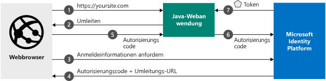

# <a name="quickstart-add-sign-in-with-microsoft-to-a-java-web-app"></a>Schnellstart: Hinzufügen von „Mit Microsoft anmelden“ zu einer Java-Web-App

[!INCLUDE [active-directory-develop-applies-v2](../../../includes/active-directory-develop-applies-v2.md)]

In dieser Schnellstartanleitung wird die Integration einer Java-Webanwendung in Microsoft Identity Platform beschrieben. Ihre App meldet einen Benutzer an, ruft ein Zugriffstoken zum Aufrufen der Microsoft Graph-API ab und sendet eine Anforderung an die Microsoft Graph-API.

Am Ende dieser Schnellstartanleitung akzeptiert Ihre Anwendung Anmeldungen von persönlichen Microsoft-Konten (outlook.com, live.com und Ähnliche) sowie von Geschäfts,- Schul- oder Unikonten von allen Unternehmen oder Organisationen, die Azure Active Directory nutzen.



## <a name="prerequisites"></a>Voraussetzungen

Für dieses Beispiel benötigen Sie Folgendes:

- [Java Development Kit (JDK)](https://openjdk.java.net/) 8 oder höher und [Maven](https://maven.apache.org/).
- Azure AD-Mandant (Azure Active Directory). Wie Sie einen Azure AD-Mandanten erhalten, erfahren Sie [hier](https://azure.microsoft.com/documentation/articles/active-directory-howto-tenant/).

> [!div renderon="docs"]
> ## <a name="register-and-download-your-quickstart-app"></a>Registrieren und Herunterladen Ihrer Schnellstart-App
> Die Schnellstartanwendung kann auf zwei Arten gestartet werden: Express (Option 1) oder manuell (Option 2).
>
> ### <a name="option-1-register-and-auto-configure-your-app-and-then-download-your-code-sample"></a>Option 1: Registrieren und automatisches Konfigurieren Ihrer App und anschließendes Herunterladen des Codebeispiels
>
> 1. Navigieren Sie zu [Azure-Portal – App-Registrierungen](https://portal.azure.com/#blade/Microsoft_AAD_IAM/ActiveDirectoryMenuBlade/RegisteredApps).
> 1. Geben Sie einen Namen für Ihre Anwendung ein, und wählen Sie **Registrieren** aus.
> 1. Befolgen Sie die Anweisungen zum Herunterladen und automatischen Konfigurieren der neuen Anwendung.
>
> ### <a name="option-2-register-and-manually-configure-your-application-and-code-sample"></a>Option 2: Registrieren und manuelles Konfigurieren Ihrer Anwendung und des Codebeispiels
>
> #### <a name="step-1-register-your-application"></a>Schritt 1: Anwendung registrieren
>
> Führen Sie die folgenden Schritte aus, um Ihre Anwendung zu registrieren und Ihrer Projektmappe manuell die Registrierungsinformationen Ihrer App hinzuzufügen:
>
> 1. Melden Sie sich mit einem Geschäfts-, Schul- oder Unikonto oder mit einem persönlichen Microsoft-Konto beim [Azure-Portal](https://portal.azure.com) an.
> 1. Wenn Sie mit Ihrem Konto auf mehrere Mandanten zugreifen können, klicken Sie rechts oben auf Ihr Konto, und legen Sie Ihre Portalsitzung auf den gewünschten Azure AD-Mandanten fest.
>
> 1. Navigieren Sie zur Seite [App-Registrierungen](/azure/active-directory/develop/) von Microsoft Identity Platform für Entwickler.
> 1. Wählen Sie **Neue Registrierung** aus.
> 1. Geben Sie auf der daraufhin angezeigten Seite **Anwendung registrieren** die Registrierungsinformationen für Ihre Anwendung ein:
>    - Geben Sie im Abschnitt **Name** einen aussagekräftigen Anwendungsnamen ein, der den Benutzern der App angezeigt wird (beispielsweise `java-webapp`).
>    - Lassen Sie **Umleitungs-URI** vorerst noch leer, und wählen Sie **Registrieren** aus.
> 1. Suchen Sie auf der Seite **Übersicht** die Werte **Anwendungs-ID (Client)** und **Verzeichnis-ID (Mandant)** der Anwendung. Kopieren Sie diese Werte für später.
> 1. Wählen Sie im Menü die Option **Authentifizierung** aus, und fügen Sie anschließend folgende Informationen hinzu:
>    - Fügen Sie unter **Umleitungs-URI** Folgendes hinzu: `http://localhost:8080/msal4jsamples/secure/aad` und `http://localhost:8080/msal4jsamples/graph/me`.
>    - Wählen Sie **Speichern** aus.
> 1. Wählen Sie im Menü **Certificates & secrets** (Zertifikate und Geheimnisse) aus, und klicken Sie im Abschnitt **Geheime Clientschlüssel** auf **Neuer geheimer Clientschlüssel**:
>
>    - Geben Sie eine Schlüsselbeschreibung ein (beispielsweise „app secret“).
>    - Wählen Sie als Schlüsseldauer die Option **In 1 Jahr** aus.
>    - Der Schlüsselwert wird angezeigt, wenn Sie **Hinzufügen** auswählen.
>    - Kopieren Sie den Wert des Schlüssels zur späteren Verwendung. Der Schlüsselwert wird nicht erneut angezeigt und kann auch nicht auf andere Weise abgerufen werden. Erfassen Sie ihn daher, sobald er im Azure-Portal angezeigt wird.
>
> [!div class="sxs-lookup" renderon="portal"]
> #### <a name="step-1-configure-your-application-in-the-azure-portal"></a>Schritt 1: Konfigurieren Ihrer Anwendung im Azure-Portal
>
> Damit das Codebeispiel in dieser Schnellstartanleitung funktioniert, sind folgende Schritte erforderlich:
>
> 1. Fügen Sie Antwort-URLs als `http://localhost:8080/msal4jsamples/secure/aad` und `http://localhost:8080/msal4jsamples/graph/me` hinzu.
> 1. Erstellen Sie einen geheimen Clientschlüssel.
> > [!div renderon="portal" id="makechanges" class="nextstepaction"]
> > [Make these changes for me]() (Diese Änderungen für mich vornehmen)
>
> > [!div id="appconfigured" class="alert alert-info"]
> > : Ihre Anwendung ist mit diesen Attributen konfiguriert.

#### <a name="step-2-download-the-code-sample"></a>Schritt 2: Herunterladen des Codebeispiels

 [Codebeispiel herunterladen](https://github.com/Azure-Samples/ms-identity-java-webapp/archive/master.zip)

#### <a name="step-3-configure-the-code-sample"></a>Schritt 3: Konfigurieren des Codebeispiels

 1. Extrahieren Sie die ZIP-Datei in einen lokalen Ordner.
 1. Falls Sie eine integrierte Entwicklungsumgebung (Integrated Development Environment, IDE) verwenden, können Sie das Beispiel in Ihrer bevorzugten IDE öffnen. (Dieser Schritt ist optional.)

 1. Öffnen Sie die Datei „application.properties“ (im Ordner „src/main/resources/“), und ersetzen Sie die Werte der Felder *aad.clientId*, *aad.authority* und *aad.secretKey* durch die entsprechenden Werte für **Anwendungs-ID**, **Mandanten-ID** und **Geheimer Clientschlüssel**:

    ```file
    aad.clientId=Enter_the_Application_Id_here
    aad.authority=https://login.microsoftonline.com/Enter_the_Tenant_Info_Here/
    aad.secretKey=Enter_the_Client_Secret_Here
    aad.redirectUriSignin=http://localhost:8080/msal4jsample/secure/aad
    aad.redirectUriGraph=http://localhost:8080/msal4jsample/graph/me
    ```

> [!div renderon="docs"]
> Hierbei gilt:
>
> - `Enter_the_Application_Id_here` ist die Anwendungs-ID für die von Ihnen registrierte Anwendung.
> - `Enter_the_Client_Secret_Here` ist der **geheime Clientschlüssel**, den Sie unter **Certificates & Secrets** (Zertifikate und Geheimnisse) für die registrierte Anwendung erstellt haben.
> - `Enter_the_Tenant_Info_Here` ist der Wert der **Verzeichnis-ID (Mandant)** der Anwendung, die Sie registriert haben.

#### <a name="step-4-run-the-code-sample"></a>Schritt 4: Ausführen des Codebeispiels

Bei der Projektausführung haben Sie folgende Möglichkeiten:

Sie können das Projekt entweder direkt über Ihre IDE ausführen, indem Sie den eingebetteten Spring Boot-Server verwenden, oder es mithilfe von [Maven](https://maven.apache.org/plugins/maven-war-plugin/usage.html) als WAR-Datei packen und diese in einer J2EE-Containerlösung wie [Apache Tomcat](http://tomcat.apache.org/) bereitstellen.

##### <a name="running-from-ide"></a>Ausführen per IDE

Wenn Sie die Webanwendung über eine IDE ausführen möchten, klicken Sie auf „Ausführen“, und navigieren Sie zur Startseite des Projekts. In diesem Beispiel lautet die Standard-URL der Startseite http://localhost:8080.

1. Wählen Sie auf der ersten Seite die Schaltfläche **Anmelden** aus, um den Benutzer zu Azure Active Directory umzuleiten und zur Eingabe der Anmeldeinformationen aufzufordern.

1. Nach Abschluss der Benutzerauthentifizierung wird der Benutzer zu *http://localhost:8080/msal4jsamples/secure/aad* umgeleitet. Der Benutzer ist nun angemeldet, und auf der Seite werden Informationen zum angemeldeten Konto angezeigt. Auf der Beispielbenutzeroberfläche stehen folgende Schaltflächen zur Verfügung:
    - *Sign Out* (Abmelden): Meldet den aktuellen Benutzer von der Anwendung ab und leitet ihn zur Startseite um.
    - *Show User Info* (Benutzerinformationen anzeigen): Ruft ein Token für Microsoft Graph ab und ruft Microsoft Graph mit einer Anforderung auf, die das Token enthält, woraufhin grundlegende Informationen zum angemeldeten Benutzer zurückgegeben werden.

> [!IMPORTANT]
> Für die Anwendung in dieser Schnellstartanleitung wird ein Clientgeheimnis verwendet, um sich selbst als vertraulicher Client zu identifizieren. Da der geheime Clientschlüssel Ihren Projektdateien als Nur-Text hinzugefügt wird, empfiehlt es sich aus Sicherheitsgründen, ein Zertifikat anstelle eines Clientgeheimnisses zu verwenden, bevor die Anwendung in der Produktion genutzt wird. Weitere Informationen zur Verwendung eines Zertifikats finden Sie unter [Zertifikatanmeldeinformationen für die Anwendungsauthentifizierung](https://docs.microsoft.com/azure/active-directory/develop/active-directory-certificate-credentials).

## <a name="more-information"></a>Weitere Informationen

### <a name="getting-msal"></a>Abrufen von MSAL

MSAL4J ist die Java-Bibliothek zum Anmelden von Benutzern und Anfordern von Token, die für den Zugriff auf eine durch Microsoft Identity Platform geschützte API verwendet wird.

Sie können Ihrer Anwendung MSAL4J hinzufügen, indem Sie Maven oder Gradle für die Verwaltung Ihrer Abhängigkeiten verwenden. Hierzu sind in Ihrer Anwendung folgende Änderungen an der Datei „pom.xml“ (Maven) oder „build.gradle“ (Gradle) erforderlich:

```XML
<dependency>
    <groupId>com.microsoft.azure</groupId>
    <artifactId>msal4j</artifactId>
    <version>1.0.0</version>
</dependency>
```

```$xslt
compile group: 'com.microsoft.azure', name: 'msal4j', version: '1.0.0'
```

### <a name="msal-initialization"></a>MSAL-Initialisierung

Fügen Sie einen Verweis auf MSAL4J hinzu, indem Sie am Anfang der Datei, in der Sie MSAL4J verwenden möchten, den folgenden Code hinzufügen:

```Java
import com.microsoft.aad.msal4j.*;
```

## <a name="next-steps"></a>Nächste Schritte

Informieren Sie sich über Berechtigungen und die Einwilligung:

> [!div class="nextstepaction"]
> [Berechtigungen und Einwilligung](https://docs.microsoft.com/azure/active-directory/develop/v2-permissions-and-consent)

Weitere Informationen zum Authentifizierungsfluss für dieses Szenario finden Sie unter dem OAuth 2.0-Autorisierungscodeflow:

> [!div class="nextstepaction"]
> [Microsoft Identity Platform und der OAuth 2.0-Autorisierungscodeflow](https://docs.microsoft.com/azure/active-directory/develop/v2-oauth2-auth-code-flow)

Helfen Sie uns, Microsoft Identity Platform zu verbessern. Teilen Sie uns Ihre Meinung mit, indem Sie eine kurze Umfrage mit zwei Fragen beantworten.

> [!div class="nextstepaction"]
> [Umfrage zu Microsoft Identity Platform](https://forms.office.com/Pages/ResponsePage.aspx?id=v4j5cvGGr0GRqy180BHbRyKrNDMV_xBIiPGgSvnbQZdUQjFIUUFGUE1SMEVFTkdaVU5YT0EyOEtJVi4u)

[!INCLUDE [Help and support](../../../includes/active-directory-develop-help-support-include.md)]
