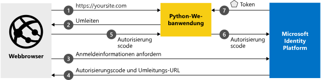

# <a name="quickstart-add-sign-in-with-microsoft-to-a-python-web-app"></a>Schnellstart: Hinzufügen von „Mit Microsoft anmelden“ zu einer Python-Web-App

[!INCLUDE [active-directory-develop-applies-v2](../../../includes/active-directory-develop-applies-v2.md)]

In dieser Schnellstartanleitung wird die Integration einer Python-Webanwendung in Microsoft Identity Platform beschrieben. Ihre App meldet einen Benutzer an, ruft ein Zugriffstoken zum Aufrufen der Microsoft Graph-API ab und sendet eine Anforderung an die Microsoft Graph-API.

Am Ende dieses Leitfadens akzeptiert Ihre Anwendung Anmeldungen von persönlichen Microsoft-Konten (z.B. outlook.com, live.com u.a.) sowie von Geschäfts,- Schul- oder Unikonten von allen Unternehmen oder Organisationen, die Azure Active Directory nutzen.



## <a name="prerequisites"></a>Voraussetzungen

Für dieses Beispiel benötigen Sie Folgendes:

- [Python 2.7+](https://www.python.org/downloads/release/python-2713) oder [Python 3+](https://www.python.org/downloads/release/python-364/)
- [Flask](http://flask.pocoo.org/), [Flask-Sitzung](https://pythonhosted.org/Flask-Session/), [Anforderungen](https://requests.kennethreitz.org//en/master/)
- [MSAL Python](https://github.com/AzureAD/microsoft-authentication-library-for-python)

> [!div renderon="docs"]
>
> ## <a name="register-and-download-your-quickstart-app"></a>Registrieren und Herunterladen Ihrer Schnellstart-App
>
> Die Schnellstartanwendung kann auf zwei Arten gestartet werden: Express (Option 1) oder manuell (Option 2).
>
> ### <a name="option-1-register-and-auto-configure-your-app-and-then-download-your-code-sample"></a>Option 1: Registrieren und automatisches Konfigurieren Ihrer App und anschließendes Herunterladen des Codebeispiels
>
> 1. Navigieren Sie zu [Azure-Portal – App-Registrierungen](https://portal.azure.com/#blade/Microsoft_AAD_IAM/ActiveDirectoryMenuBlade/RegisteredApps).
> 1. Wählen Sie **Neue Registrierung** aus.
> 1. Geben Sie einen Namen für Ihre Anwendung ein, und wählen Sie **Registrieren** aus.
> 1. Befolgen Sie die Anweisungen zum Herunterladen und automatischen Konfigurieren der neuen Anwendung.
>
> ### <a name="option-2-register-and-manually-configure-your-application-and-code-sample"></a>Option 2: Registrieren und manuelles Konfigurieren Ihrer Anwendung und des Codebeispiels
>
> #### <a name="step-1-register-your-application"></a>Schritt 1: Anwendung registrieren
>
> Führen Sie die folgenden Schritte aus, um Ihre Anwendung zu registrieren und Ihrer Projektmappe manuell die Registrierungsinformationen Ihrer App hinzuzufügen:
>
> 1. Melden Sie sich mit einem Geschäfts-, Schul- oder Unikonto oder mit einem persönlichen Microsoft-Konto beim [Azure-Portal](https://portal.azure.com) an.
> 1. Wenn Sie mit Ihrem Konto auf mehrere Mandanten zugreifen können, klicken Sie rechts oben auf Ihr Konto, und legen Sie Ihre Portalsitzung auf den gewünschten Azure AD-Mandanten fest.
> 1. Navigieren Sie zur Seite [App-Registrierungen](https://go.microsoft.com/fwlink/?linkid=2083908) von Microsoft Identity Platform für Entwickler.
> 1. Wählen Sie **Neue Registrierung** aus.
> 1. Geben Sie auf der daraufhin angezeigten Seite **Anwendung registrieren** die Registrierungsinformationen für Ihre Anwendung ein:
>      - Geben Sie im Abschnitt **Name** einen aussagekräftigen Anwendungsnamen ein, der den Benutzern der App angezeigt wird (beispielsweise `python-webapp`).
>      - Wählen Sie unter **Unterstützte Kontotypen** **Konten in allen Organisationsverzeichnissen und persönliche Microsoft-Konten** aus.
>      - Wählen Sie im Abschnitt **Umleitungs-URI** in der Dropdownliste die Plattform **Web** aus, und legen Sie den Wert auf `http://localhost:5000/getAToken` fest.
>      - Wählen Sie **Registrieren**. Notieren Sie sich für die spätere Verwendung auf der Seite **Übersicht** den Wert von **Anwendungs-ID (Client)** .
> 1. Wählen Sie im linken Menü die Option **Certificates & secrets** (Zertifikate und Geheimnisse) aus, und klicken Sie im Abschnitt **Geheime Clientschlüssel** auf **Neuer geheimer Clientschlüssel**:
>
>      - Geben Sie eine Schlüsselbeschreibung (des Instanz-App-Geheimnisses) ein.
>      - Wählen Sie als Schlüsseldauer die Option **In 1 Jahr** aus.
>      - Wenn Sie auf **Hinzufügen** klicken, wird der Schlüsselwert angezeigt.
>      - Kopieren Sie den Wert des Schlüssels. Sie benötigen sie später.
> 1. Wählen Sie den Abschnitt **API-Berechtigungen** aus.
>
>      - Klicken Sie auf die Schaltfläche **Berechtigung hinzufügen**.
>      - Stellen Sie sicher, dass die Registerkarte **Microsoft-APIs** ausgewählt ist.
>      - Klicken Sie im Abschnitt *Häufig verwendete Microsoft-APIs* auf **Microsoft Graph**.
>      - Stellen Sie im Abschnitt **Delegierte Berechtigungen** sicher, dass die richtigen Berechtigungen aktiviert sind: **User.ReadBasic.All**. Verwenden Sie bei Bedarf das Suchfeld.
>      - Wählen Sie die Schaltfläche **Berechtigungen hinzufügen** aus.
>
> [!div class="sxs-lookup" renderon="portal"]
>
> #### <a name="step-1-configure-your-application-in-azure-portal"></a>Schritt 1: Konfigurieren Ihrer Anwendung im Azure-Portal
>
> Damit das Codebeispiel in dieser Schnellstartanleitung funktioniert, sind folgende Schritte erforderlich:
>
> 1. Fügen Sie eine Antwort-URL als `http://localhost:5000/getAToken` hinzu.
> 1. Erstellen Sie einen geheimen Clientschlüssel.
> 1. Fügen Sie die delegierte Berechtigung User.ReadBasic.All der Microsoft Graph-API hinzu.
>
> > [!div renderon="portal" id="makechanges" class="nextstepaction"]
> > [Make these changes for me]() (Diese Änderungen für mich vornehmen)
> > [!div id="appconfigured" class="alert alert-info"]
> > : Ihre Anwendung ist mit diesem Attribut konfiguriert.

#### <a name="step-2-download-your-project"></a>Schritt 2: Herunterladen Ihres Projekts

[Codebeispiel herunterladen](https://github.com/Azure-Samples/ms-identity-python-webapp/archive/master.zip)

#### <a name="step-3-configure-the-application"></a>Schritt 3: Konfigurieren der Anwendung

1. Extrahieren Sie die ZIP-Datei in einen lokalen Ordner, der sich näher am Stammordner befindet, beispielsweise **C:\Azure-Samples**.
1. Falls Sie eine integrierte Entwicklungsumgebung (Integrated Development Environment, IDE) verwenden, können Sie das Beispiel in Ihrer bevorzugten IDE öffnen. (Dieser Schritt ist optional.)
1. Öffnen Sie die Datei **app_config.py** im Stammordner, und ersetzen Sie durch den folgenden Codeausschnitt:

```python
CLIENT_ID = "Enter_the_Application_Id_here"
CLIENT_SECRET = "Enter_the_Client_Secret_Here"
AUTHORITY = "https://login.microsoftonline.com/Enter_the_Tenant_Name_Here"
```

> [!div renderon="docs"]
> Hierbei gilt:
>
> - `Enter_the_Application_Id_here` ist die Anwendungs-ID für die von Ihnen registrierte Anwendung.
> - `Enter_the_Client_Secret_Here` ist der **geheime Clientschlüssel**, den Sie in **Certificates & Secrets** (Zertifikate und Geheimnisse) für die registrierte Anwendung erstellt haben.
> - `Enter_the_Tenant_Name_Here` ist der Wert der **Verzeichnis-ID (Mandant)** der Anwendung, die Sie registriert haben.

#### <a name="step-4-run-the-code-sample"></a>Schritt 4: Ausführen des Codebeispiels

1. Sie müssen die MSAL Python-Bibliothek, das Flask-Framework, Flask-Sitzungen für die serverseitige Sitzungsverwaltung und Anforderungen mit PIP wie folgt installieren:

   ```Shell
   pip install -r requirements.txt
   ```

2. Führen Sie „app.py“ über die Shell oder die Befehlszeile aus:

   ```Shell
   python app.py
   ```
   > [!IMPORTANT]
   > Für die Anwendung in dieser Schnellstartanleitung wird ein Clientgeheimnis verwendet, um sich selbst als vertraulicher Client zu identifizieren. Da das Clientgeheimnis Ihren Projektdateien als Nur-Text hinzugefügt wird, wird aus Sicherheitsgründen empfohlen, ein Zertifikat anstelle eines Clientgeheimnisses zu verwenden, bevor die Anwendung als Produktionsanwendung eingestuft wird. Weitere Informationen zur Verwendung eines Zertifikats finden Sie in [diesen Anweisungen](https://docs.microsoft.com/azure/active-directory/develop/active-directory-certificate-credentials).

## <a name="more-information"></a>Weitere Informationen

### <a name="getting-msal"></a>Abrufen von MSAL
MSAL ist die Bibliothek zum Anmelden von Benutzern und Anfordern von Token, die für den Zugriff auf eine durch Microsoft Identity Platform geschützte API verwendet wird.
Sie können Ihrer Anwendung MSAL Python mithilfe von Pip hinzufügen.

```Shell
pip install msal
```

### <a name="msal-initialization"></a>MSAL-Initialisierung
Sie können den Verweis auf MSAL Python hinzufügen, indem Sie den folgenden Code am Anfang der Datei hinzufügen, in der Sie MSAL verwenden möchten:

```Python
import msal
```

## <a name="next-steps"></a>Nächste Schritte

Informieren Sie sich ausführlicher über Web-Apps, die Benutzer anmelden und anschließend Web-APIs aufrufen:

> [!div class="nextstepaction"]
> [Szenario: Web-Apps, die Benutzer anmelden](scenario-web-app-sign-user-overview.md)

[!INCLUDE [Help and support](../../../includes/active-directory-develop-help-support-include.md)]
