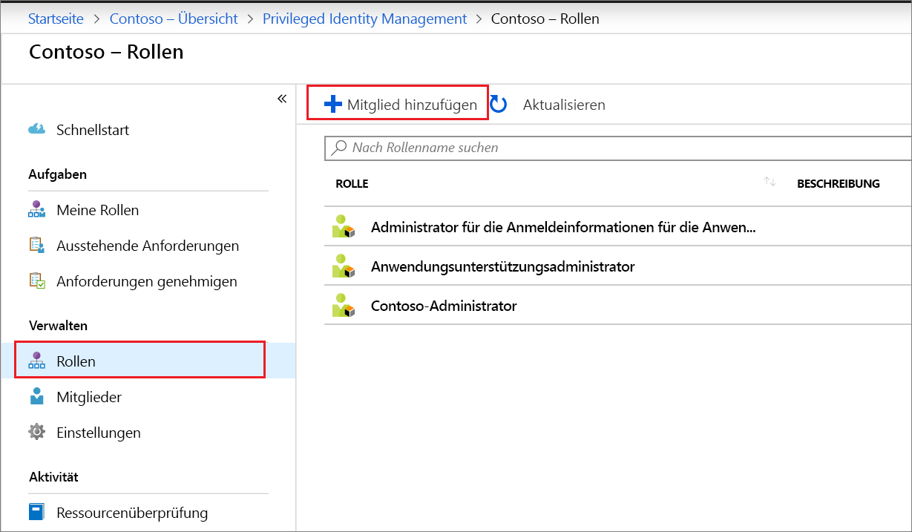
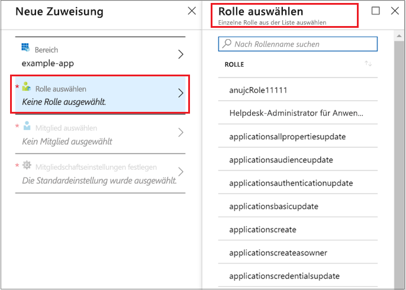
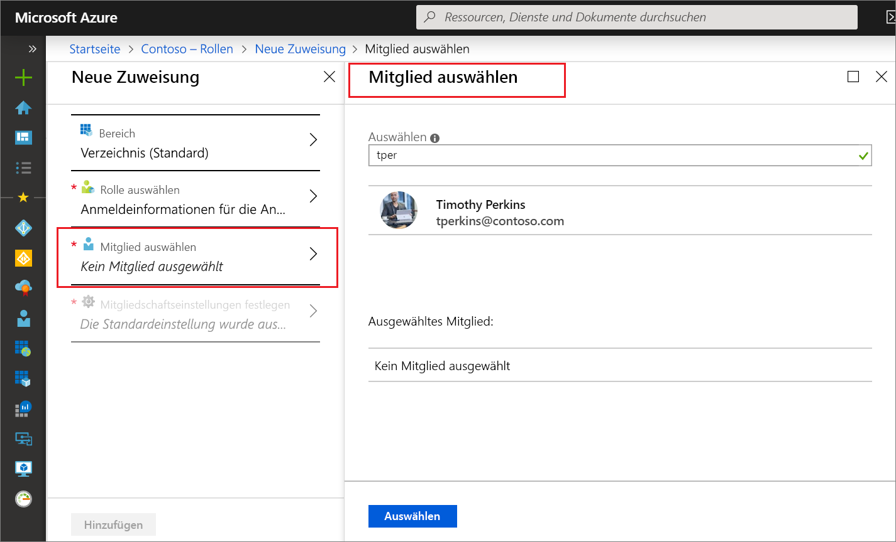
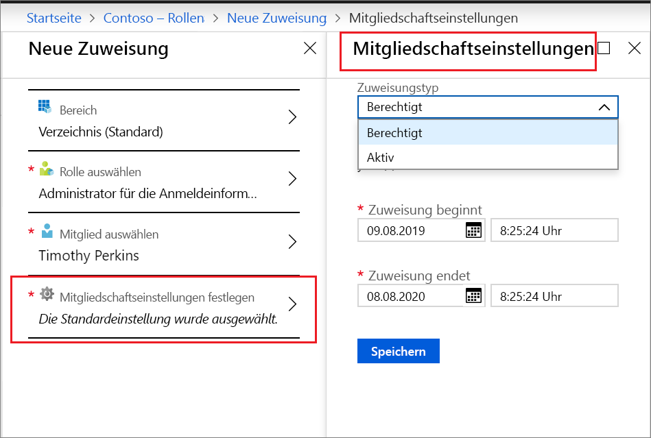
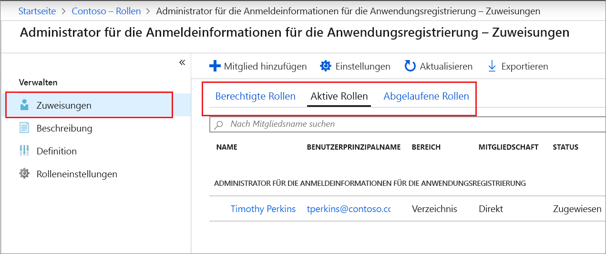

# Zuweisen einer benutzerdefinierten Azure AD-Rolle in Privileged Identity Management

In diesem Artikel erfahren Sie, wie Sie Privileged Identity Management verwenden, um Just-In-Time- und zeitgebundene Zuweisungen zu benutzerdefinierten Rollen zu erstellen, die für die Verwaltung von Anwendungen auf der Administratoroberfläche von Azure Active Directory (Azure AD) erstellt wurden.

- Weitere Informationen zum Erstellen benutzerdefinierter Rollen, um die Anwendungsverwaltung in Azure AD zu delegieren, finden Sie unter [Benutzerdefinierte Administratorrollen in Azure Active Directory (Vorschau)](../users-groups-roles/roles-custom-overview.md).
- Wenn Sie Privileged Identity Management noch nie verwendet haben, informieren Sie sich zunächst auf der Seite [Einstieg in die Verwendung von PIM](pim-getting-started.md).
- Informationen dazu, wie Sie anderen Administratoren Zugriff zum Verwalten von Privileged Identity Management gewähren, finden Sie unter [Gewähren von Zugriff für andere Administratoren zum Verwalten von PIM](pim-how-to-give-access-to-pim.md).

> [!NOTE]
> Benutzerdefinierte Azure AD-Rollen sind in der Vorschauversion nicht in die integrierten Verzeichnisrollen integriert. Sobald die Funktion allgemein verfügbar ist, erfolgt die Rollenverwaltung auf der Benutzeroberfläche für integrierte Rollen.

## Zuweisen einer Rolle

In Privileged Identity Management können Sie benutzerdefinierte Rollen verwalten, die Sie in der Anwendungsverwaltung von Azure Active Directory (Azure AD) erstellen.  Mit den folgenden Schritten erstellen Sie eine berechtigte Zuweisung zu einer benutzerdefinierten Verzeichnisrolle.

1. Melden Sie sich im Azure-Portal mit dem Benutzerkonto bei [Privileged Identity Management](https://portal.azure.com/?Microsoft_AAD_IAM_enableCustomRoleManagement=true&Microsoft_AAD_IAM_enableCustomRoleAssignment=true&feature.rbacv2roles=true&feature.rbacv2=true&Microsoft_AAD_RegisteredApps=demo#blade/Microsoft_Azure_PIMCommon/CommonMenuBlade/quickStart) an, das der Rolle „Administrator für privilegierte Rollen“ zugewiesen ist.
1. Wählen Sie **Benutzerdefinierte Azure AD-Rollen (Vorschau)** aus.

    

1. Wählen Sie **Rollen** aus, um eine Liste der benutzerdefinierten Rollen für Azure AD-Anwendungen anzuzeigen.

    

1. Wählen Sie **Mitglied hinzufügen** aus, um die Seite „Zuweisung“ zu öffnen.
1. Wenn Sie den Bereich der Rollenzuweisung auf eine einzelne Anwendung beschränken möchten, wählen Sie **Bereich** aus, um einen Anwendungsbereich anzugeben.

    

1. Wählen Sie **Rolle auswählen** aus, um die Liste **Rolle auswählen** zu öffnen.

    

1. Wählen Sie die Rolle aus, die Sie zuweisen möchten, und klicken Sie dann auf **Auswählen**. Die Liste **Mitglied auswählen** wird geöffnet.

    

1. Wählen Sie einen Benutzer aus, dem Sie die Rolle zuweisen möchten, und klicken Sie dann auf **Auswählen**. Die Liste **Mitgliedschaftseinstellungen** wird geöffnet.

    

1. Wählen Sie auf der Seite **Mitgliedschaftseinstellungen** die Option **Berechtigt** oder **Aktiv** aus:

    - Bei **berechtigten** Zuweisungen muss der Benutzer, der der Rolle zugewiesen ist, eine Aktion durchführen, bevor er die Rolle verwenden kann. Beispiele für Aktionen sind eine erfolgreiche Multi-Factor Authentication-Überprüfung, die Angabe einer geschäftlichen Begründung oder das Anfordern einer Genehmigung von designierten genehmigenden Personen.
    - Bei **aktiven** Zuweisungen muss der zugewiesene Benutzer keine Aktion durchführen, um die Rolle verwenden zu können. Bei aktiven Benutzern sind die Berechtigungen der Rolle ständig zugewiesen.

1. Wenn das Kontrollkästchen **Permanent** vorhanden und verfügbar ist (dies hängt von den Rolleneinstellungen ab), können Sie angeben, ob die Zuweisung dauerhaft ist. Aktivieren Sie das Kontrollkästchen, um die Zuweisung als „dauerhaft berechtigt“ oder „dauerhaft zugewiesen“ festzulegen. Deaktivieren Sie das Kontrollkästchen, um die Dauer einer Zuweisung anzugeben.
1. Klicken Sie auf **Speichern** und dann auf **Hinzufügen**, um die neue Rollenzuweisung zu erstellen. Eine Benachrichtigung zum Status des Zuweisungsprozesses wird angezeigt.

Um die Rollenzuweisung zu überprüfen, wählen Sie in einer offenen Rolle **Zuweisungen** > **Zuweisen** aus, und überprüfen Sie, ob die Rollenzuweisung ordnungsgemäß als „berechtigt“ oder „aktiv“ identifiziert wird.

 

## Nächste Schritte

- [Aktivieren einer benutzerdefinierten Azure AD-Rolle](azure-ad-custom-roles-assign.md)
- [Entfernen oder Aktualisieren der Zuweisung einer benutzerdefinierten Azure AD-Rolle](azure-ad-custom-roles-update-remove.md)
- [Konfigurieren der Zuweisung einer benutzerdefinierten Azure AD-Rolle](azure-ad-custom-roles-configure.md)
- [Rollendefinitionen in Azure AD](../users-groups-roles/directory-assign-admin-roles.md)
