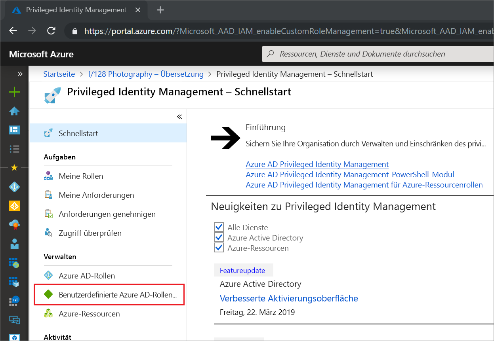
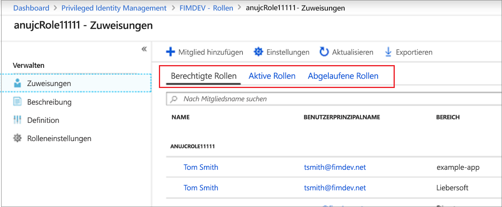
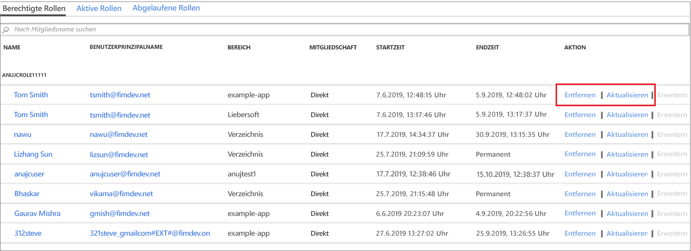

# Aktualisieren oder Entfernen einer zugewiesenen benutzerdefinierten Azure AD-Rolle in Privileged Identity Management

In diesem Artikel erfahren Sie, wie Sie Privileged Identity Management verwenden, um Just-In-Time- und zeitgebundene Zuweisungen zu benutzerdefinierten Rollen zu aktualisieren oder zu entfernen, die für die Anwendungsverwaltung auf der Administratoroberfläche von Azure Active Directory (Azure AD) erstellt wurden. 

- Weitere Informationen zum Erstellen benutzerdefinierter Rollen, um die Anwendungsverwaltung in Azure AD zu delegieren, finden Sie unter [Benutzerdefinierte Administratorrollen in Azure Active Directory (Vorschau)](../users-groups-roles/roles-custom-overview.md). 
- Wenn Sie Privileged Identity Management noch nie verwendet haben, informieren Sie sich zunächst auf der Seite [Einstieg in die Verwendung von PIM](pim-getting-started.md).

> [!NOTE]
> Benutzerdefinierte Azure AD-Rollen sind in der Vorschauversion nicht in die integrierten Verzeichnisrollen integriert. Sobald die Funktion allgemein verfügbar ist, erfolgt die Rollenverwaltung auf der Benutzeroberfläche für integrierte Rollen.

## Aktualisieren oder Entfernen einer Zuweisung

Führen Sie die folgenden Schritte aus, um eine vorhandene benutzerdefinierte Rollenzuweisung zu aktualisieren oder zu entfernen.

1. Melden Sie sich im Azure-Portal mit dem Benutzerkonto bei [Privileged Identity Management](https://portal.azure.com/?Microsoft_AAD_IAM_enableCustomRoleManagement=true&Microsoft_AAD_IAM_enableCustomRoleAssignment=true&feature.rbacv2roles=true&feature.rbacv2=true&Microsoft_AAD_RegisteredApps=demo#blade/Microsoft_Azure_PIMCommon/CommonMenuBlade/quickStart) an, das der Rolle „Administrator für privilegierte Rollen“ zugewiesen ist.
1. Wählen Sie **Benutzerdefinierte Azure AD-Rollen (Vorschau)** aus.

    

1. Wählen Sie **Rollen** aus, um eine Liste der **Zuweisungen** von benutzerdefinierten Rollen für Azure AD-Anwendungen anzuzeigen.

    

1. Wählen Sie die Rolle aus, die Sie aktualisieren oder entfernen möchten.
1. Suchen Sie die Rollenzuweisung auf den Registerkarten **Berechtigte Rollen** oder **Aktive Rollen**.
1. Wählen Sie **Aktualisieren** oder **Entfernen** aus, um die Rollenzuweisung zu aktualisieren oder zu entfernen.

    

## Nächste Schritte

- [Aktivieren einer benutzerdefinierten Azure AD-Rolle](azure-ad-custom-roles-assign.md)
- [Zuweisen einer benutzerdefinierten Azure AD-Rolle](azure-ad-custom-roles-assign.md)
- [Konfigurieren der Zuweisung einer benutzerdefinierten Azure AD-Rolle](azure-ad-custom-roles-configure.md)
