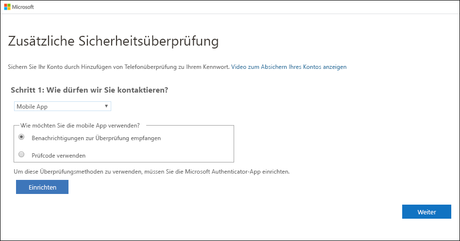
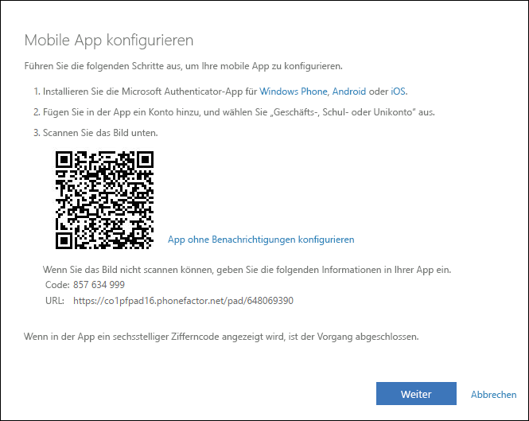
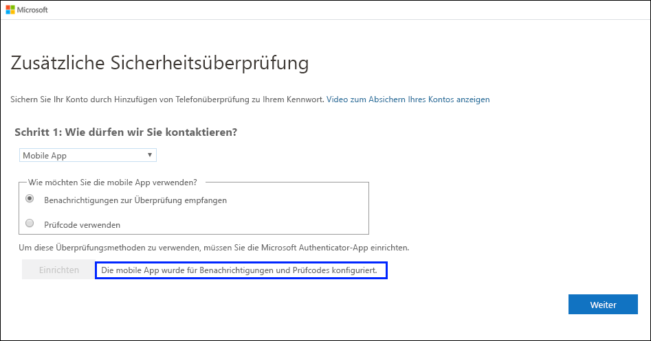
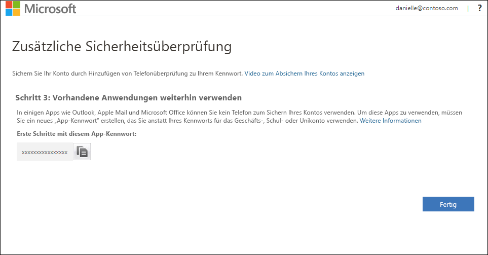
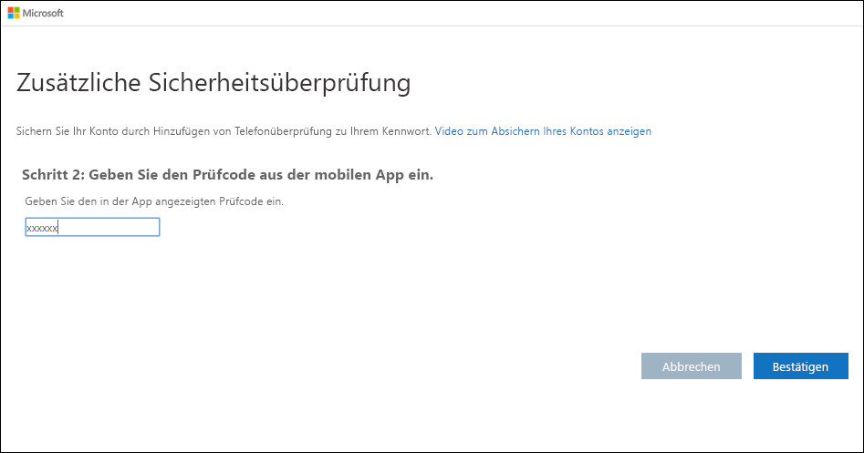

# Einrichten einer Authentifikator-App als Methode für die zweistufige Überprüfung

Sie können eine Authentifikator-App einrichten, um eine Benachrichtigung an Ihr mobiles Gerät zu senden oder um Ihnen einen Prüfcode als Ihre Sicherheitsüberprüfungsmethode zu senden. Die Verwendung der Microsoft Authenticator-App ist nicht verpflichtend, und Sie können während der Einrichtung eine andere App auswählen. In diesem Artikel wird jedoch die Microsoft Authenticator-App verwendet.

>[!Important]
>Bevor Sie Ihr Konto hinzufügen können, müssen Sie die Microsoft Authenticator-App herunterladen und installieren. Wenn Sie dies noch nicht getan haben, führen Sie die im Artikel [Herunterladen und Installieren der App](user-help-auth-app-download-install.md) aufgeführten Schritte aus.

>[!Note]
> Ist die Option für die mobile App abgeblendet, lässt Ihre Organisation unter Umständen die Nutzung einer Authentifizierungs-App für die Überprüfung nicht zu. In diesem Fall müssen Sie eine andere Methode auswählen oder sich an Ihren Administrator wenden, um weitere Unterstützung zu erhalten.

## Einrichten der Microsoft Authenticator-App zum Senden von Benachrichtigungen

1. Wählen Sie auf der Seite **Zusätzliche Sicherheitsüberprüfung** die Option **Mobile App** im Bereich **Schritt 1: Auf welchem Weg sollen wir Sie kontaktieren?** aus.

2. Wählen Sie im Bereich **Wie möchten Sie die mobile App verwenden?** die Option **Benachrichtigungen zur Überprüfung empfangen** und anschließend **Einrichten** aus.

    

    Die Seite **Mobile App konfigurieren** wird angezeigt.

    

3. Öffnen Sie die Microsoft Authenticator-App, wählen Sie oben rechts das Symbol zum **Anpassen und Steuern** aus, und wählen Sie dann nacheinander **Konto hinzufügen** und **Geschäfts-, Schul- oder Unikonto** aus.

    >[!Note]
    >Wenn Sie die Microsoft Authenticator-App zum ersten Mal einrichten, werden Sie möglicherweise in einer Meldung gefragt, ob Sie der App den Zugriff auf Ihre Kamera (iOS) oder die Aufnahme von Foto- und Videodateien (Android) erlauben möchten. Sie müssen **Zulassen** auswählen, damit die Authenticator-App im nächsten Schritt auf Ihre Kamera zugreifen und den QR-Code aufnehmen kann. Wenn Sie den Zugriff auf die Kamera nicht zulassen, können Sie die App auch einrichten, müssen die Codeinformationen aber manuell hinzufügen. Informationen zum manuellen Hinzufügen des Codes finden Sie unter [Manuelles Hinzufügen eines Kontos zur App](user-help-auth-app-add-account-manual.md).

4. Verwenden Sie zum Scannen des QR-Codes auf dem Bildschirm **Mobile App konfigurieren** auf Ihrem Computer die Kamera Ihres Geräts, und wählen Sie dann **Weiter** aus.

5. Vergewissern Sie sich auf dem Computer auf der Seite **Zusätzliche Sicherheitsüberprüfung**, dass Sie die Nachricht mit der Bestätigung der erfolgreichen Konfiguration erhalten, und wählen Sie dann **Weiter** aus.

    

    Die Authentifikator-App sendet als Test eine Benachrichtigung an Ihr mobiles Gerät.

6. Wählen Sie auf Ihrem mobilen Gerät **Genehmigen** aus.

7. Fügen Sie auf Ihrem Computer die Telefonnummer Ihres mobilen Geräts im Bereich **Schritt 3: Für den Fall, dass Sie den Zugriff auf Ihre mobile App verlieren** hinzu, und wählen Sie dann **Weiter** aus.

    Wir empfehlen dringend, die Telefonnummer Ihres Mobilgeräts als Alternative hinzuzufügen, falls Sie aus irgendeinem Grund nicht auf die mobile App zugreifen oder diese nicht nutzen können.

8. Kopieren Sie im Bereich **Schritt 4: Verwenden Sie vorhandene Anwendungen weiterhin** das angegebene App-Kennwort, und speichern Sie es an einem sicheren Ort.

    

    >[!Note]
    >Informationen zur Verwendung des App-Kennworts mit älteren Apps finden Sie unter [Verwalten von App-Kennwörtern für die zweistufige Überprüfung](multi-factor-authentication-end-user-app-passwords.md). App-Kennwörter sind nur erforderlich, wenn Sie weiterhin ältere Apps verwenden, die die zweistufige Überprüfung nicht unterstützen.

9. Wählen Sie **Fertig**aus.

## Einrichten der Microsoft Authenticator-App zur Verwendung von Prüfcodes

1. Wählen Sie auf der Seite **Zusätzliche Sicherheitsüberprüfung** die Option **Mobile App** im Bereich **Schritt 1: Auf welchem Weg sollen wir Sie kontaktieren?** aus.

2. Wählen Sie im Bereich **Wie möchten Sie die mobile App verwenden?** die Option **Prüfcode verwenden** und anschließend **Einrichten** aus.

    

    Die Seite **Mobile App konfigurieren** wird angezeigt.

    

3. Öffnen Sie die Microsoft Authenticator-App, wählen Sie oben rechts das Symbol zum **Anpassen und Steuern** aus, und wählen Sie dann nacheinander **Konto hinzufügen** und **Geschäfts-, Schul- oder Unikonto** aus.

    >[!Note]
    >Wenn Sie die Microsoft Authenticator-App zum ersten Mal einrichten, werden Sie möglicherweise in einer Meldung gefragt, ob Sie der App den Zugriff auf Ihre Kamera (iOS) oder die Aufnahme von Foto- und Videodateien (Android) erlauben möchten. Sie müssen **Zulassen** auswählen, damit die Authenticator-App im nächsten Schritt auf Ihre Kamera zugreifen und den QR-Code aufnehmen kann. Wenn Sie den Zugriff auf die Kamera nicht zulassen, können Sie die App auch einrichten, müssen die Codeinformationen aber manuell hinzufügen. Informationen zum manuellen Hinzufügen des Codes finden Sie unter [Manuelles Hinzufügen eines Kontos zur App](user-help-auth-app-add-account-manual.md).

4. Verwenden Sie zum Scannen des QR-Codes auf dem Bildschirm **Mobile App konfigurieren** auf Ihrem Computer die Kamera Ihres Geräts, und wählen Sie dann **Weiter** aus.

5. Vergewissern Sie sich auf dem Computer auf der Seite **Zusätzliche Sicherheitsüberprüfung**, dass Sie die Nachricht mit der Bestätigung der erfolgreichen Konfiguration erhalten, und wählen Sie dann **Weiter** aus.

    

    Die Authentifikator-App fragt als Test einen Prüfcode ab.

6. Scrollen Sie in der Microsoft Authenticator-App nach unten zu Ihrem Geschäfts-, Schul- oder Unikonto, kopieren Sie den sechsstelligen Code aus der App, und fügen Sie ihn auf Ihrem Computer im Feld **Schritt 2: Geben Sie den Prüfcode aus der mobilen App ein.** ein. Wählen Sie anschließend **Überprüfen** aus.

    

7. Fügen Sie auf Ihrem Computer die Telefonnummer Ihres mobilen Geräts im Bereich **Schritt 3: Für den Fall, dass Sie den Zugriff auf Ihre mobile App verlieren** hinzu, und wählen Sie dann **Weiter** aus.

    Wir empfehlen dringend, die Telefonnummer Ihres Mobilgeräts als Alternative hinzuzufügen, falls Sie aus irgendeinem Grund nicht auf die mobile App zugreifen oder diese nicht nutzen können.

8. Kopieren Sie im Bereich **Schritt 4: Verwenden Sie vorhandene Anwendungen weiterhin** das angegebene App-Kennwort, und speichern Sie es an einem sicheren Ort.

    

    >[!Note]
    >Informationen zur Verwendung des App-Kennworts mit älteren Apps finden Sie unter [Verwalten von App-Kennwörtern für die zweistufige Überprüfung](multi-factor-authentication-end-user-app-passwords.md). App-Kennwörter sind nur erforderlich, wenn Sie weiterhin ältere Apps verwenden, die die zweistufige Überprüfung nicht unterstützen.

9. Wählen Sie **Fertig**aus.

## Nächste Schritte

Nach der Einrichtung der Methode für die zweistufige Überprüfung können Sie weitere Methoden hinzufügen, Ihre Einstellungen und App-Kennwörter verwalten, sich anmelden oder Hilfe bei allgemeinen Problemen im Zusammenhang mit der zweistufigen Überprüfung anfordern.

- [Verwalten der Einstellungen für die zweistufige Überprüfung](multi-factor-authentication-end-user-manage-settings.md)

- [Verwalten von App-Kennwörtern](multi-factor-authentication-end-user-app-passwords.md)

- [Der Anmeldevorgang mit Azure Multi-Factor Authentication](multi-factor-authentication-end-user-signin.md)

- [Hilfe bei der zweistufigen Überprüfung](multi-factor-authentication-end-user-troubleshoot.md)
