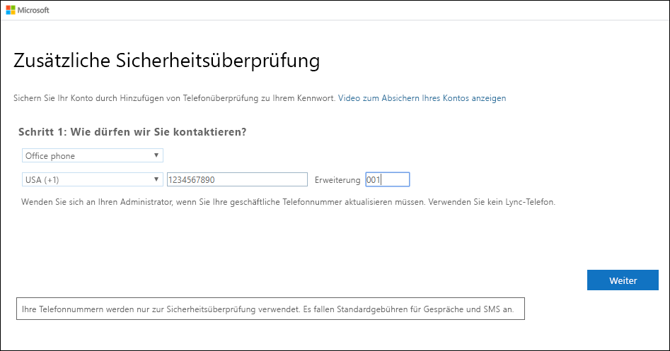
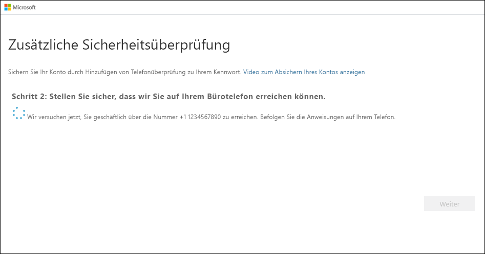

# Einrichten einer Bürotelefonnummer als Methode für die zweistufige Überprüfung

Sie können Ihre Bürotelefonnummer als Methode für die zweistufige Überprüfung einrichten.

>[!Note]
> Wird die Bürotelefonoption nicht angezeigt, lässt Ihre Organisation unter Umständen die Nutzung einer Bürotelefonnummer für die Überprüfung nicht zu. In diesem Fall müssen Sie eine andere Methode auswählen oder sich an Ihren Administrator wenden, um weitere Unterstützung zu erhalten.

## Einrichten Ihrer Bürotelefonnummer als Überprüfungsmethode

1. Wählen Sie auf der Seite **Zusätzliche Sicherheitsüberprüfung** die Option **Bürotelefonnummer** im Bereich **Schritt 1: Auf welchem Weg sollen wir Sie kontaktieren?** aus. Wählen Sie anschließend in der Dropdownliste Ihr Land oder Ihre Region aus, und geben Sie Ihre Bürotelefonnummer und ggf. Ihre Durchwahl ein.

    

2. Sie erhalten einen Telefonanruf von Microsoft, in dem Sie aufgefordert werden, die Rautetaste auf Ihrem Bürotelefon zu drücken, um Ihre Identität zu bestätigen.

    

3. Kopieren Sie im Bereich **Schritt 3: Verwenden Sie vorhandene Anwendungen weiterhin** das angegebene App-Kennwort, und speichern Sie es an einem sicheren Ort.

    

    >[!Note]
    >Informationen zur Verwendung des App-Kennworts mit älteren Apps finden Sie unter [Verwalten von App-Kennwörtern für die zweistufige Überprüfung](multi-factor-authentication-end-user-app-passwords.md). App-Kennwörter sind nur erforderlich, wenn Sie weiterhin ältere Apps verwenden, die die zweistufige Überprüfung nicht unterstützen.

4. Wählen Sie **Fertig**aus.

## Nächste Schritte

Nach der Einrichtung der Methode für die zweistufige Überprüfung können Sie weitere Methoden hinzufügen, Ihre Einstellungen und App-Kennwörter verwalten, sich anmelden oder Hilfe bei allgemeinen Problemen im Zusammenhang mit der zweistufigen Überprüfung anfordern.

- [Verwalten der Einstellungen für die zweistufige Überprüfung](multi-factor-authentication-end-user-manage-settings.md)

- [Verwalten von App-Kennwörtern](multi-factor-authentication-end-user-app-passwords.md)

- [Der Anmeldevorgang mit Azure Multi-Factor Authentication](multi-factor-authentication-end-user-signin.md)

- [Hilfe bei der zweistufigen Überprüfung](multi-factor-authentication-end-user-troubleshoot.md)
