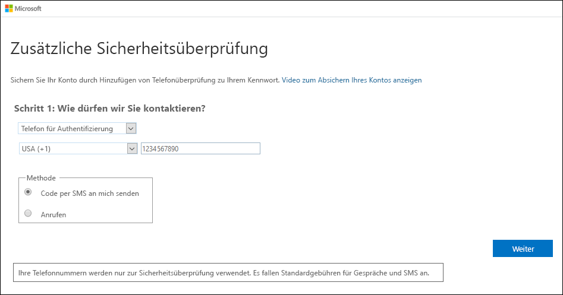
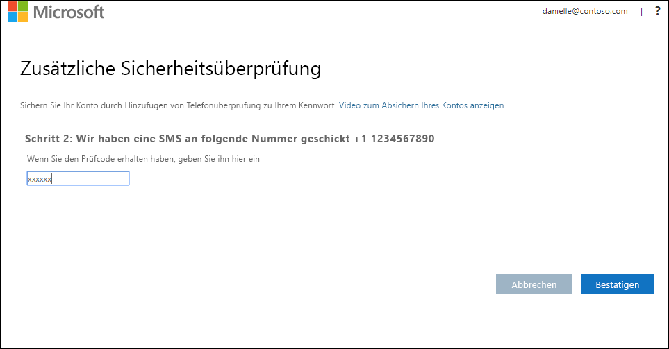
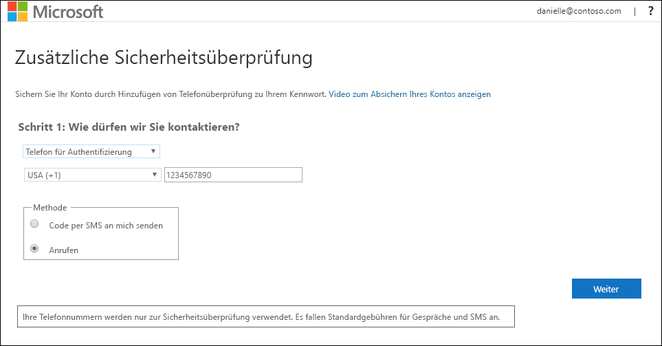
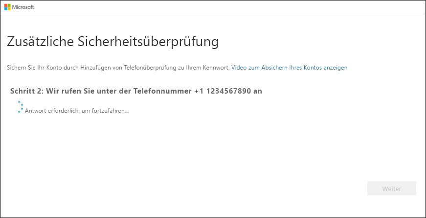

# Einrichten eines mobilen Geräts als Methode für die zweistufige Überprüfung

Sie können Ihr mobiles Gerät als Methode für die zweistufige Überprüfung einrichten. Ihr Mobiltelefon kann entweder eine SMS mit einem Prüfcode oder einen Telefonanruf empfangen.

>[!Note]
> Ist die Option für das Authentifizierungstelefon abgeblendet, lässt Ihre Organisation unter Umständen die Nutzung einer Telefonnummer oder SMS für die Überprüfung nicht zu. In diesem Fall müssen Sie eine andere Methode auswählen oder sich an Ihren Administrator wenden, um weitere Unterstützung zu erhalten.

## Einrichten Ihres mobilen Geräts zur Verwendung einer SMS als Überprüfungsmethode

1. Wählen Sie auf der Seite **Zusätzliche Sicherheitsüberprüfung** die Option **Telefon für Authentifizierung** im Bereich **Schritt 1: Auf welchem Weg sollen wir Sie kontaktieren?** aus. Wählen Sie anschließend in der Dropdownliste Ihr Land oder Ihre Region aus, und geben Sie die Telefonnummer Ihres mobilen Geräts ein.

2. Wählen Sie im Bereich **Methode** die Option **Code per SMS an mich senden** und anschließend **Weiter** aus.

    

3. Geben Sie den Prüfcode aus der SMS von Microsoft im Bereich **Step 2: We've sent a text message to your phone** (Schritt 2: Wir haben eine SMS an Ihr Telefon gesendet.) ein, und wählen Sie dann **Überprüfen** aus.

    

4. Kopieren Sie im Bereich **Schritt 3: Verwenden Sie vorhandene Anwendungen weiterhin** das angegebene App-Kennwort, und speichern Sie es an einem sicheren Ort.

    

    >[!Note]
    >Informationen zur Verwendung des App-Kennworts mit älteren Apps finden Sie unter [Verwalten von App-Kennwörtern für die zweistufige Überprüfung](multi-factor-authentication-end-user-app-passwords.md). App-Kennwörter sind nur erforderlich, wenn Sie weiterhin ältere Apps verwenden, die die zweistufige Überprüfung nicht unterstützen.

5. Wählen Sie **Fertig**aus.

## Einrichten Ihres mobilen Geräts zum Empfangen eines Telefonanrufs

1. Wählen Sie auf der Seite **Zusätzliche Sicherheitsüberprüfung** die Option **Telefon für Authentifizierung** im Bereich **Schritt 1: Auf welchem Weg sollen wir Sie kontaktieren?** aus. Wählen Sie anschließend in der Dropdownliste Ihr Land oder Ihre Region aus, und geben Sie die Telefonnummer Ihres mobilen Geräts ein.

2. Wählen Sie im Bereich **Methode** die Option **Anruf an mich** und anschließend **Weiter** aus.

    

3. Sie erhalten einen Telefonanruf von Microsoft, in dem Sie aufgefordert werden, die Rautetaste auf Ihrem mobilen Gerät zu drücken, um Ihre Identität zu bestätigen.

    

4. Kopieren Sie im Bereich **Schritt 3: Verwenden Sie vorhandene Anwendungen weiterhin** das angegebene App-Kennwort, und speichern Sie es an einem sicheren Ort.

    

    >[!Note]
    >Informationen zur Verwendung des App-Kennworts mit älteren Apps finden Sie unter [Verwalten von App-Kennwörtern für die zweistufige Überprüfung](multi-factor-authentication-end-user-app-passwords.md). App-Kennwörter sind nur erforderlich, wenn Sie weiterhin ältere Apps verwenden, die die zweistufige Überprüfung nicht unterstützen.

5. Wählen Sie **Fertig**aus.

## Nächste Schritte

Nach der Einrichtung der Methode für die zweistufige Überprüfung können Sie weitere Methoden hinzufügen, Ihre Einstellungen und App-Kennwörter verwalten, sich anmelden oder Hilfe bei allgemeinen Problemen im Zusammenhang mit der zweistufigen Überprüfung anfordern.

- [Verwalten der Einstellungen für die zweistufige Überprüfung](multi-factor-authentication-end-user-manage-settings.md)

- [Verwalten von App-Kennwörtern](multi-factor-authentication-end-user-app-passwords.md)

- [Der Anmeldevorgang mit Azure Multi-Factor Authentication](multi-factor-authentication-end-user-signin.md)

- [Hilfe bei der zweistufigen Überprüfung](multi-factor-authentication-end-user-troubleshoot.md)
