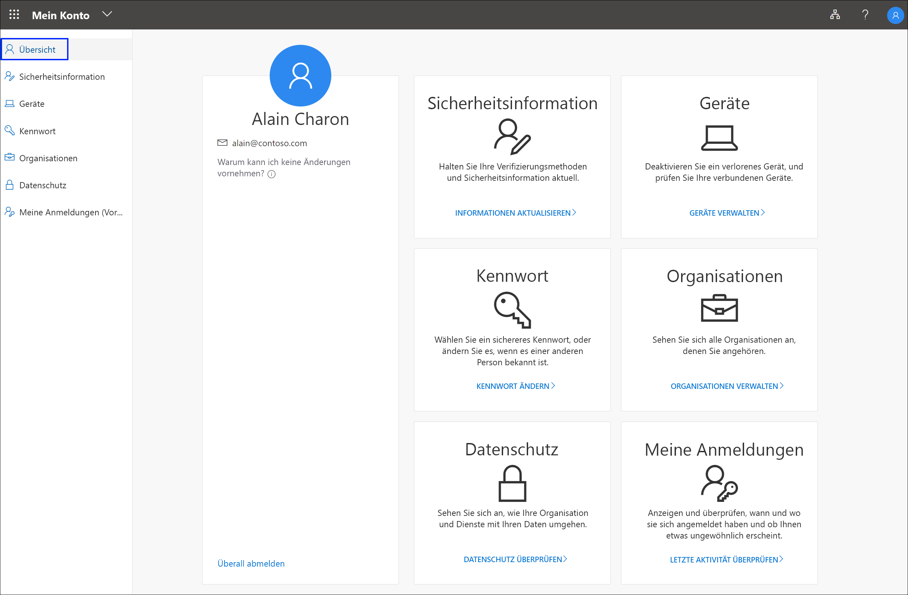

# Übersicht zum Portal „Mein Konto“

Im Portal **Mein Konto** (Vorschauversion) können Sie Ihre Geschäfts-, Schul- oder Unikonten verwalten, indem Sie Ihre Sicherheitsinformation einrichten und verwalten, verbundene Organisationen und Geräte verwalten und Informationen zur Nutzung Ihrer Daten innerhalb der Organisation anzeigen.

>[!Important]
>Dieser Inhalt richtet sich an Benutzer. Administratoren finden in der [Azure Active Directory-Dokumentation](https://docs.microsoft.com/azure/active-directory) weitere Informationen zum Einrichten und Verwalten der Azure Active Directory-Umgebung (Azure AD).

## Navigieren zum Portal „Mein Konto“

Sie können auf das Portal **Mein Konto** (https://myprofile.microsoft.com) in der aktuellen Version eines der folgenden Browser zugreifen:

- Chrome
- Microsoft Edge
- Safari
- Firefox
- Internet Explorer 11

## Artikel zum Portal „Mein Konto“

Ausführliche Informationen und Anweisungen zu den verfügbaren Funktionen im Portal **Mein Konto** finden Sie in den folgenden Artikeln:

|Artikel |BESCHREIBUNG |
|------|------------|
| [Übersicht über die Sicherheitsinformation (Vorschau)](user-help-security-info-overview.md) | Mehrere Artikel mit Anweisungen zum Einrichten der Microsoft Authenticator-App, von Textnachrichten oder Telefonanrufen als Überprüfungsmethode. Hier finden Sie darüber hinaus Artikel zum Hinzufügen einer E-Mail-Adresse oder von vordefinierten Sicherheitsfragen, damit Sie Ihr eigenes Kennwort ggf. zurücksetzen können, sollten Sie es vergessen.|
| [Verwalten Ihrer verbundenen Geräte im Portal „Mein Profil“ (Vorschauversion)](my-account-portal-devices-page.md) | Anleitungen zum Anzeigen oder Deaktivieren von Geräten, die Sie mit Ihrem Geschäfts-, Schul- oder Unikonto verbunden haben|
| [Ändern des Kennworts Ihres Geschäfts-, Schul- oder Unikontos](my-account-change-password-page.md) | Anweisungen zum Ändern des Kennworts für Ihr Geschäfts-, Schul- oder Unikonto. |
| [Verwalten von Organisationen im Portal „Mein Profil“ (Vorschauversion)](my-account-portal-organizations-page.md) | Anleitungen zum Anzeigen und Verlassen von Organisationen, die mit Ihrem Geschäfts-, Schul- oder Unikonto verbunden sind|
| [View your privacy-related info](my-account-portal-privacy-page.md) (Anzeigen Ihrer Informationen zum Datenschutz) | Anleitungen zum Anzeigen der Onlinedienste, die mit Ihrem Geschäfts-, Schul- oder Unikonto verbunden sind, sowie der Nutzungsbedingungen Ihrer Organisation|
| [View your recent sign-in activity](my-account-portal-sign-ins-page.md) (Anzeigen Ihrer letzten Anmeldeaktivität) | Anweisungen zum Anzeigen der Anmeldeaktivität für Ihr Geschäfts-, Schul- oder Unikonto. |

## Zugehöriger Inhalt in Office

- [Anmelden zum Verwalten Ihres Office-Produkts](https://support.office.com/article/sign-in-to-manage-your-office-product-959ac957-8d37-4ae4-b1b6-d6e4874e013f)

- [Wechseln zur Office-Seite **Mein Konto**](https://portal.office.com/account/#home)

- [Wechseln zur Office-Seite **Meine Installationen**](https://portal.office.com/account/#installs)

- [Wechseln zur Office-Seite **Abonnements**](https://portal.office.com/account/#subscriptions)
