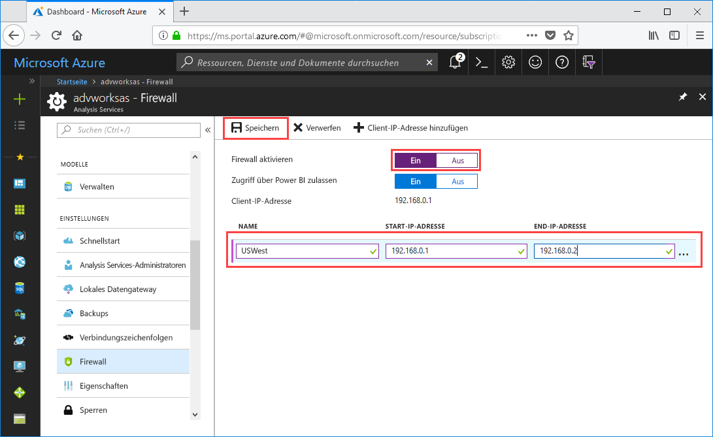

# Schnellstart: Konfigurieren der Serverfirewall – Portal

In diesem Schnellstart wird beschrieben, wie Sie eine Firewall für Ihren Azure Analysis Services-Server konfigurieren. Das Aktivieren einer Firewall und das Konfigurieren von IP-Adressbereichen nur für jene Computer, die auf Ihren Server zugreifen, sind ein wichtiger Bestandteil der Sicherung Ihres Servers und Ihrer Daten.

## Voraussetzungen

- Ein Analysis Services-Server in Ihrem Abonnement. Weitere Informationen finden Sie unter [Schnellstart: Erstellen eines Analysis Services-Servers im Azure-Portal](analysis-services-create-server.md) oder unter [Schnellstart: Erstellen eines Servers mit PowerShell](analysis-services-create-powershell.md).
- Mindestens ein IP-Adressbereich für Clientcomputer (falls erforderlich).
- Beachten Sie, dass das Importszenario von Power BI Premium derzeit nicht unterstützt wird.

## Melden Sie sich auf dem Azure-Portal an. 

[Anmelden beim Portal](https://portal.azure.com)

## Konfigurieren einer Firewall

1. Klicken Sie auf Ihren Server, um die Seite „Übersicht“ zu öffnen. 
2. Klicken Sie unter **EINSTELLUNGEN** > **Firewall** > **Firewall aktivieren** auf **Ein**.
3. Klicken Sie in **Zugriff über Power BI zulassen** auf **Ein**, um DirectQuery-Zugriff über Power BI zuzulassen.  
4. (Optional) Geben Sie einen oder mehrere IP-Adressbereiche an. Geben Sie einen Namen sowie eine Start- und End-IP-Adresse für jeden Bereich ein. Der Name einer Firewallregel ist auf 128 Zeichen begrenzt und darf nur aus Großbuchstaben, Kleinbuchstaben, Zahlen, Unterstriche und Bindestriche bestehen. Leer- und andere Sonderzeichen sind nicht zulässig.
5. Klicken Sie auf **Speichern**.

     

## Bereinigen von Ressourcen

Löschen Sie IP-Adressbereiche, oder deaktivieren Sie die Firewall, wenn diese nicht mehr benötigt werden.

## Nächste Schritte
In diesem Schnellstart haben Sie erfahren, wie eine Firewall für Ihren Server konfiguriert wird. Nachdem Sie nun über einen Server verfügen und ihn mit einer Firewall gesichert haben, können Sie ihm ein einfaches Beispieldatenmodell aus dem Portal hinzufügen. Ein Beispielmodell ist hilfreich, um sich mit dem Konfigurieren von Modelldatenbankrollen und dem Testen von Clientverbindungen vertraut zu machen. Fahren Sie mit dem Tutorial zum Hinzufügen eines Beispielmodells fort, um mehr zu erfahren.

> [!div class="nextstepaction"]
> [Tutorial: Hinzufügen eines Beispielmodells zu Ihrem Server](analysis-services-create-sample-model.md)
