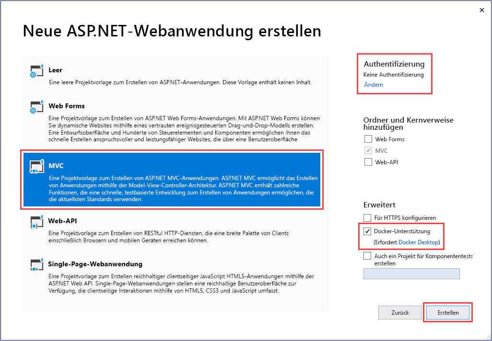
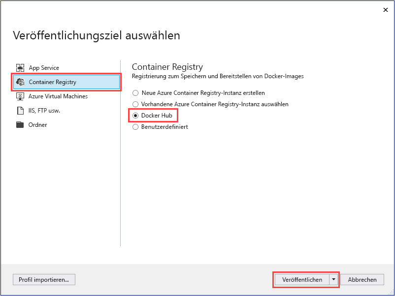
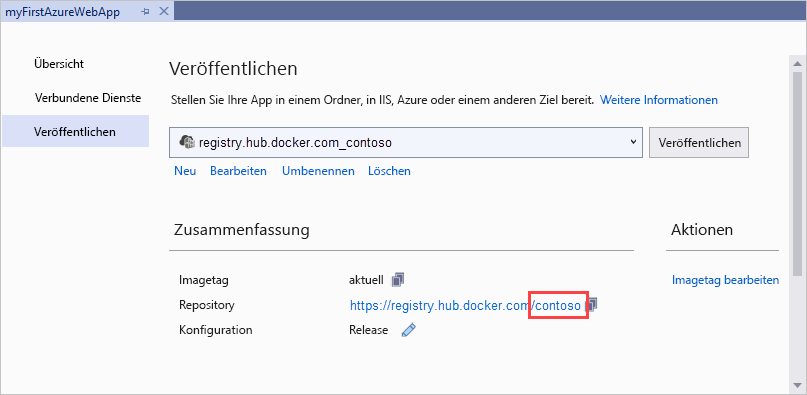
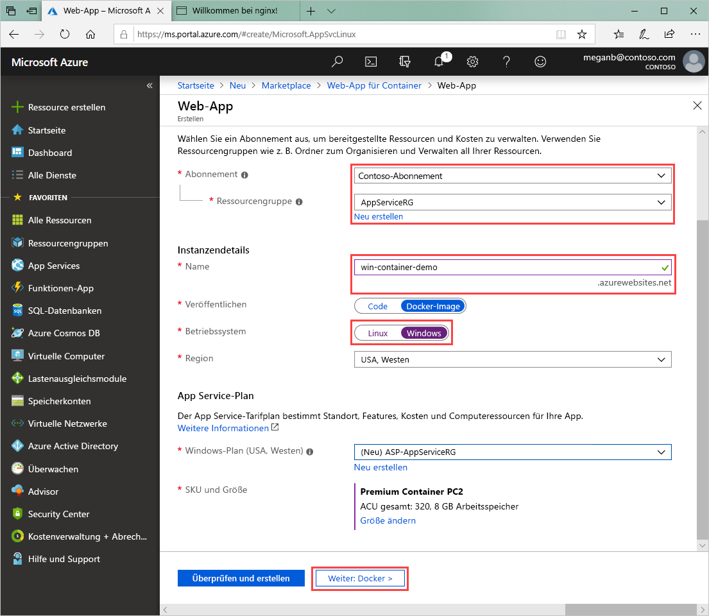
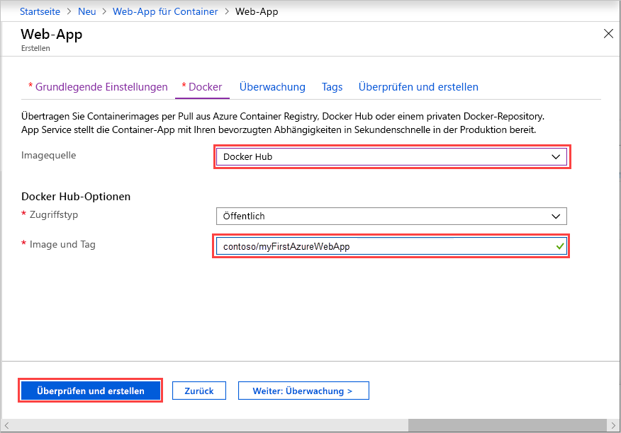

# <a name="run-a-custom-windows-container-in-azure-preview"></a>Ausführen eines benutzerdefinierten Windows-Containers in Azure (Vorschau)

[Azure App Service](overview.md) stellt vordefinierte Anwendungsstapel unter Windows wie ASP.NET oder Node.js bereit (ausgeführt unter IIS). Die vorkonfigurierte Windows-Umgebung sperrt das Betriebssystem für Administratorzugriff, Softwareinstallationen, Änderungen am globalen Assemblycache usw. Weitere Informationen finden Sie unter [Betriebssystemfunktionen für Azure App Service](operating-system-functionality.md). Wenn für Ihre Anwendung umfangreichere Zugriffsrechte erforderlich sind, als die vorkonfigurierte Umgebung zulässt, können Sie stattdessen einen benutzerdefinierten Windows-Container bereitstellen.

In dieser Schnellstartanleitung erfahren Sie, wie Sie über Visual Studio in [Docker Hub](https://hub.docker.com/) eine ASP.NET-App (in einem Windows-Image) bereitstellen. Die App wird in einem benutzerdefinierten Container in Azure App Service ausgeführt.

## <a name="prerequisites"></a>Voraussetzungen

Für dieses Tutorial benötigen Sie Folgendes:

- <a href="https://hub.docker.com/" target="_blank">Registrierung für ein Docker-Hub-Konto</a>
- <a href="https://docs.docker.com/docker-for-windows/install/" target="_blank">Installieren Sie Docker für Windows</a>.
- <a href="https://docs.microsoft.com/virtualization/windowscontainers/quick-start/quick-start-windows-10" target="_blank">Wechseln Sie Docker, um Windows-Container auszuführen</a>.
- <a href="https://www.visualstudio.com/downloads/" target="_blank">Installieren Sie Visual Studio 2019</a> mit den Workloads **ASP.NET und Webentwicklung** und **Azure-Entwicklung**. Sie haben Visual Studio 2019 bereits installiert:

    - Installieren Sie in Visual Studio die neuesten Updates, indem Sie **Hilfe** > **Nach Updates suchen** auswählen.
    - Fügen Sie in Visual Studio die Workloads hinzu, indem Sie **Tools** > **Tools und Features abrufen** auswählen.

## <a name="create-an-aspnet-web-app"></a>Erstellen einer ASP.NET-Web-App

Führen Sie zum Erstellen einer ASP.NET-Web-App die folgenden Schritte aus:

1. Öffnen Sie Visual Studio, und wählen Sie **Neues Projekt erstellen** aus.

1. Suchen Sie unter **Neues Projekt erstellen** die Option **ASP.NET-Webanwendung (.NET Framework)** für C#, und wählen Sie sie aus. Wählen Sie anschließend **Weiter** aus.

1. Geben Sie der Anwendung unter **Neues Projekt konfigurieren** den Namen _myFirstAzureWebApp_, und wählen Sie dann **Erstellen** aus.

   

1. Sie können jede Art von ASP.NET Web-App für Azure bereitstellen. Wählen Sie für diese Schnellstartanleitung die Vorlage **MVC** aus.

1. Wählen Sie **Docker-Unterstützung** aus, und vergewissern Sie sich, dass die Authentifizierung auf **Keine Authentifizierung** festgelegt ist. Klicken Sie auf **Erstellen**.

   

1. Wenn die _Dockerfile_-Datei nicht automatisch geöffnet wird, öffnen Sie sie im **Projektmappen-Explorer**.

1. Sie benötigen ein [unterstütztes übergeordnetes Image](#use-a-different-parent-image). Ändern Sie das übergeordnete Image, indem Sie die Zeile `FROM` durch den folgenden Code ersetzen und die Datei dann speichern:

   ```Dockerfile
   FROM mcr.microsoft.com/dotnet/framework/aspnet:4.7.2-windowsservercore-ltsc2019
   ```

1. Wählen Sie im Visual Studio-Menü **Debuggen** > **Starten ohne Debugging** aus, um die Web-App lokal auszuführen.

   

## <a name="publish-to-docker-hub"></a>Veröffentlichen in Docker Hub

1. Klicken Sie im Projektmappen-Explorer mit der rechten Maustaste auf das Projekt **myFirstAzureWebApp**, und wählen Sie **Veröffentlichen** aus. ****

1. Wählen Sie **App Service** und dann **Veröffentlichen** aus.

1. Wählen Sie unter **Veröffentlichungsziel auswählen** die Optionen **Container Registry** und **Docker Hub** aus, und klicken Sie anschließend auf **Veröffentlichen**.

   

1. Geben Sie die Anmeldeinformationen für Ihr Docker Hub-Konto ein, und wählen Sie **Speichern** aus.

   Warten Sie, bis die Bereitstellung abgeschlossen ist. Auf der Seite **Veröffentlichen** wird jetzt der Name des Repositorys zur späteren Verwendung angezeigt.

   

1. Kopieren Sie diesen Repositorynamen für die spätere Verwendung.

## <a name="create-a-windows-container-app"></a>Erstellen einer Windows-Container-App

1. Melden Sie sich beim [Azure-Portal]( https://portal.azure.com) an.

1. Klicken Sie im Azure-Portal links oben auf **Ressource erstellen**.

1. Suchen Sie mithilfe des Suchfelds oberhalb der Azure Marketplace-Ressourcenliste nach **Web-App für Container**, und wählen Sie **Erstellen** aus.

1. Wählen Sie auf der Seite für die Web-App-Erstellung Ihr **Abonnement** und eine **Ressourcengruppe** aus. Bei Bedarf kann eine neue Ressourcengruppe erstellt werden.

1. Geben Sie einen App-Namen (beispielsweise *win-container-demo*) an, und wählen Sie unter **Betriebssystem** die Option **Windows** aus. Wählen Sie **Weiter: Docker** aus, um den Vorgang fortzusetzen.

   

1. Wählen Sie unter **Imagequelle** die Option **Docker Hub** aus, und geben Sie unter **Image und Tag** den Repositorynamen ein, den Sie im Schritt [Veröffentlichen in Docker Hub](#publish-to-docker-hub) kopiert haben.

   

    Wenn Sie an anderer Stelle, etwa in [Azure Container Registry](/azure/container-registry/) oder einem anderen privaten Repository, ein benutzerdefiniertes Image für Ihre Webanwendung besitzen, können Sie es hier konfigurieren.

1. Wählen Sie **Überprüfen und erstellen** > **Erstellen** aus, und warten Sie, bis Azure die erforderlichen Ressourcen erstellt hat.

## <a name="browse-to-the-container-app"></a>Navigieren zur Container-App

Wenn der Azure-Vorgang abgeschlossen ist, wird ein Benachrichtigungsfeld angezeigt.


1. Klicken Sie auf **Zu Ressource wechseln**.

1. Folgen Sie in der Übersicht dieser Ressource dem Link neben **URL**.

Daraufhin wird eine neue Browserseite geöffnet:


Warten Sie einige Minuten, und wiederholen Sie den Vorgang, bis die ASP.NET-Standardhomepage angezeigt wird:


**Glückwunsch!** Sie führen Ihren ersten benutzerdefinierten Windows-Container in Azure App Service aus.

## <a name="see-container-start-up-logs"></a>Anzeigen der Startprotokolle des Containers

Das Laden des Windows-Containers kann eine Weile dauern. Wenn Sie den Status anzeigen möchten, navigieren Sie zur folgenden URL. Ersetzen Sie dabei *\<app_name>* durch den Namen Ihrer App.
```
https://<app_name>.scm.azurewebsites.net/api/logstream
```

Die gestreamten Protokolle sehen wie folgt aus:

```
2018-07-27T12:03:11  Welcome, you are now connected to log-streaming service.
27/07/2018 12:04:10.978 INFO - Site: win-container-demo - Start container succeeded. Container: facbf6cb214de86e58557a6d073396f640bbe2fdec88f8368695c8d1331fc94b
27/07/2018 12:04:16.767 INFO - Site: win-container-demo - Container start complete
27/07/2018 12:05:05.017 INFO - Site: win-container-demo - Container start complete
27/07/2018 12:05:05.020 INFO - Site: win-container-demo - Container started successfully
```

## <a name="update-locally-and-redeploy"></a>Lokales Aktualisieren und erneutes Bereitstellen

1. Öffnen Sie in Visual Studio im Projektmappen-Explorer unter Ihrem Projekt **Ansichten** > **Start** > **Index.cshtml**. ****

1. Suchen Sie im oberen Bereich nach dem HTML-Tag `<div class="jumbotron">`, und ersetzen Sie das gesamte Element durch folgenden Code:

   ```HTML
   <div class="jumbotron">
       <h1>ASP.NET in Azure!</h1>
       <p class="lead">This is a simple app that we’ve built that demonstrates how to deploy a .NET app to Azure App Service.</p>
   </div>
   ```

1. Klicken Sie zum erneuten Bereitstellen in Azure im Projektmappen-Explorer mit der rechten Maustaste auf das Projekt **myFirstAzureWebApp**, und wählen Sie **Veröffentlichen** aus. ****

1. Wählen Sie auf der Seite „Veröffentlichen“ die Option **Veröffentlichen** aus, und warten Sie, bis die Veröffentlichung abgeschlossen ist.

1. Damit App Service das neue Image von Docker Hub abruft, starten Sie die App neu. Klicken Sie auf der App-Seite im Portal auf **Neu starten** > **Ja**.

   

[Navigieren Sie erneut zur Container-App](#browse-to-the-container-app). Wenn Sie die Webseite aktualisieren, sollte die App zunächst zurück zur Seite „Starting up“ (Starten) wechseln und dann nach einigen Minuten wieder die aktualisierte Webseite anzeigen.


## <a name="use-a-different-parent-image"></a>Verwenden eines anderen übergeordneten Images

Sie können für die Ausführung Ihrer App auch ein anderes benutzerdefiniertes Docker-Image verwenden. Sie müssen jedoch das richtige [übergeordnete Image](https://docs.docker.com/develop/develop-images/baseimages/) für das gewünschte Framework auswählen:

- Verwenden Sie zum Bereitstellen von .NET Framework-Apps ein übergeordnetes Image, das auf dem [LTSC](https://docs.microsoft.com/windows-server/get-started-19/servicing-channels-19#long-term-servicing-channel-ltsc)-Release (Long-Term Servicing Channel, langfristiger Wartungskanal) von Windows Server Core 2019 basiert. 
- Verwenden Sie zum Bereitstellen von .NET Core-Apps ein übergeordnetes Image, das auf dem Release [Semi-Annual Servicing Channel (SAC)](https://docs.microsoft.com/windows-server/get-started-19/servicing-channels-19#semi-annual-channel) von Windows Server Nano 1809 basiert. 

Während des App-Starts dauert das Herunterladen eines übergeordneten Images eine Weile. Sie können die Startzeit jedoch reduzieren, indem Sie eins der folgenden übergeordneten Images verwenden, die bereits in Azure App Service zwischengespeichert sind:

- [mcr.microsoft.com/dotnet/framework/aspnet](https://hub.docker.com/_/microsoft-dotnet-framework-aspnet/):4.7.2-windowsservercore-ltsc2019
- [mcr.microsoft.com/windows/nanoserver](https://hub.docker.com/_/microsoft-windows-nanoserver/):1809: Dieses Image ist der Basiscontainer, der in allen [ASP.NET Core](https://hub.docker.com/_microsoft-dotnet-cores-aspnet)- und Windows Nano Server-Images von Microsoft verwendet wird.

## <a name="next-steps"></a>Nächste Schritte

> [!div class="nextstepaction"]
> [Migrieren zum Windows-Container in Azure](app-service-web-tutorial-windows-containers-custom-fonts.md)
