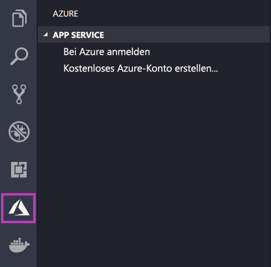
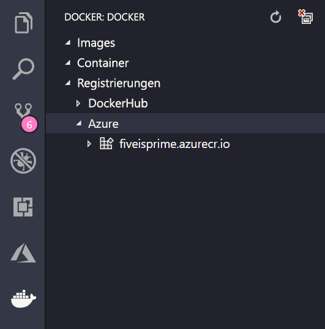

# <a name="deploy-to-azure-using-docker"></a>Bereitstellen in Azure mithilfe von Docker

Bei App Service für Linux werden vordefinierte Anwendungsstapel unter Linux mit Unterstützung für verschiedene Sprachen bereitgestellt, z. B. .NET, PHP, Node.js und andere. Sie können auch ein benutzerdefiniertes Docker-Image verwenden, um Ihre Web-App in einem Anwendungsstapel auszuführen, der nicht bereits in Azure definiert ist. In dieser Schnellstartanleitung erfahren Sie, wie Sie ein Image aus einer [Azure Container Registry](/azure/container-registry)-Instanz (ACR) in App Service bereitstellen.

## <a name="prerequisites"></a>Voraussetzungen

* Ein [Azure-Konto](https://azure.microsoft.com/free/?utm_source=campaign&utm_campaign=vscode-tutorial-docker-extension&mktingSource=vscode-tutorial-docker-extension)
* [Docker](https://www.docker.com/community-edition)
* [Visual Studio Code](https://code.visualstudio.com/)
* Die [Azure App Service-Erweiterung für VS Code](vscode:extension/ms-azuretools.vscode-azureappservice). Sie können diese Erweiterung zum Erstellen, Verwalten und Bereitstellen von Linux-Web-Apps in Azure Platform-as-a-Service (PAS) verwenden.
* Die [Docker-Erweiterung für VS Code](vscode:extension/ms-azuretools.vscode-docker). Mit dieser Erweiterung können Sie die Verwaltung lokaler Docker-Images und -Befehle vereinfachen und erstellte App-Images in Azure bereitstellen.

## <a name="create-an-image"></a>Erstellen eines Images

Für diesen Schnellstart benötigen Sie ein geeignetes Web-App-Image, das in einer [Azure Container Registry](/azure/container-registry)-Instanz gespeichert ist. Führen Sie die Schritte in [Schnellstart: Erstellen einer privaten Containerregistrierung im Azure-Portal](/azure/container-registry/container-registry-get-started-portal) aus, verwenden Sie aber das `mcr.microsoft.com/azuredocs/go`-Image anstelle des `hello-world`-Images.

> [!IMPORTANT]
> Stellen Sie sicher, dass Sie beim Erstellen der Containerregistrierung die Option **Administratorbenutzer** auf **Aktivieren** festlegen. Sie können die Option auch im Azure-Portal im Abschnitt **Zugriffsschlüssel** Ihrer Registrierungsseite festlegen. Diese Einstellung ist für den App Service-Zugriff erforderlich.

## <a name="sign-in"></a>Anmelden

Starten Sie als nächstes VS Code, und melden Sie sich mit der App Service-Erweiterung bei Ihrem Azure-Konto an. Wählen Sie hierzu das Azure-Logo in der Aktivitätsleiste aus, navigieren Sie zum **APP SERVICE**-Explorer, wählen Sie dann **Anmelden bei Azure** aus, und folgen Sie den Anweisungen.



## <a name="check-prerequisites"></a>Überprüfen der Voraussetzungen

Jetzt können Sie prüfen, ob alle erforderlichen Komponenten ordnungsgemäß installiert und konfiguriert sind.

In VS Code sehen Sie Ihre Azure-E-Mail-Adresse in der Statusleiste und Ihr Abonnement im **APP SERVICE**-Explorer.

Überprüfen Sie als nächstes, ob Docker installiert ist und ausgeführt wird. Wenn Docker ausgeführt wird, zeigt der folgende Befehl die Version an.

```bash
docker --version
```

Stellen Sie abschließend sicher, dass Ihre Azure Container Registry-Instanz verbunden ist. Wählen Sie dazu das Docker-Logo in der Aktivitätsleiste aus, und navigieren Sie zu **REGISTRIERUNGEN**.



## <a name="deploy-the-image-to-azure-app-service"></a>Bereitstellen des Images in Azure App Service

Nachdem alles konfiguriert wurde, können Sie das Image direkt aus dem Docker-Erweiterungsexplorer in [Azure App Service](https://azure.microsoft.com/services/app-service/) bereitstellen.

Suchen Sie das Image unter dem Knoten **Registrierungen** im **DOCKER**-Explorer, und erweitern Sie es, um seine Tags anzuzeigen. Klicken Sie mit der rechten Maustaste auf ein Tag, und wählen Sie dann die Option zum **Bereitstellen des Images in Azure App Service**.

Befolgen Sie dann die Aufforderungen, um ein Abonnement, einen global eindeutigen App-Namen, eine Ressourcengruppe und einen App Service-Plan auszuwählen. Wählen Sie **B1 Basic** als Tarif aus, sowie eine Region.

Nach der Bereitstellung ist Ihre App unter `http://<app name>.azurewebsites.net` verfügbar.

Eine **Ressourcengruppe** ist eine benannte Sammlung aller Ressourcen Ihrer Anwendung in Azure. Eine Ressourcengruppe kann z. B. einen Verweis auf eine Website, eine Datenbank und eine Azure-Funktion enthalten.

Ein **App Service-Plan** definiert die physischen Ressourcen, die zum Hosten Ihrer Website verwendet werden. In diesem Schnellstart wird ein Hostingplan vom Typ **Basic** für die **Linux**-Infrastruktur verwendet. Dies bedeutet, dass die Website neben anderen Websites auf einem Linux-Computer gehostet wird. Wenn Sie mit dem **Basic**-Plan beginnen, können Sie das Azure-Portal zum zentralen Hochskalieren verwenden, sodass Ihre die einzige Website ist, die auf einem Computer ausgeführt wird.

## <a name="browse-the-website"></a>Website durchsuchen

Der **Ausgabebereich** wird während der Bereitstellung geöffnet, um den Status des Vorgangs anzuzeigen. Wenn der Vorgang abgeschlossen ist, suchen Sie die App, die Sie im **APP SERVICE**-Explorer erstellt haben, klicken Sie mit der rechten Maustaste darauf, und wählen Sie dann **Website durchsuchen** aus, um die Website in Ihrem Browser zu öffnen.

> [!div class="nextstepaction"]
> [Ich bin auf ein Problem gestoßen](https://www.research.net/r/PWZWZ52?tutorial=quickstart-docker&step=deploy-app)

## <a name="next-steps"></a>Nächste Schritte

Herzlichen Glückwunsch! Sie haben diese Schnellstartanleitung erfolgreich abgeschlossen!

Sehen Sie sich als Nächstes die anderen Azure-Erweiterungen an.

* [Cosmos DB](https://marketplace.visualstudio.com/items?itemName=ms-azuretools.vscode-cosmosdb)
* [Azure-Funktionen](https://marketplace.visualstudio.com/items?itemName=ms-azuretools.vscode-azurefunctions)
* [Azure CLI-Tools](https://marketplace.visualstudio.com/items?itemName=ms-vscode.azurecli)
* [Azure Resource Manager Tools](https://marketplace.visualstudio.com/items?itemName=msazurermtools.azurerm-vscode-tools)

Oder installieren Sie das [Azure-Tools](https://marketplace.visualstudio.com/items?itemName=ms-vscode.vscode-node-azure-pack)-Erweiterungspaket, um alle Erweiterungen auf einmal erhalten.
