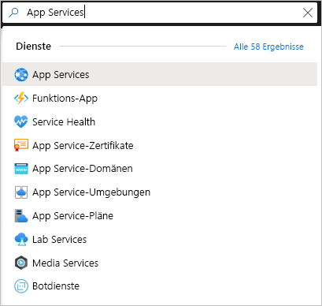
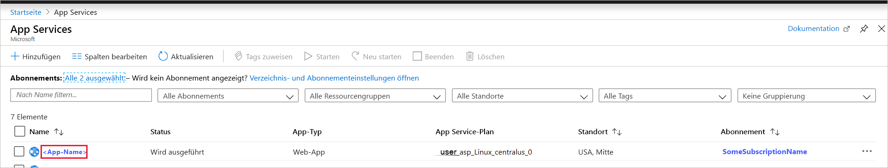
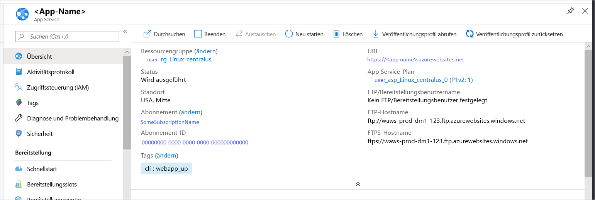

# <a name="quickstart-create-a-python-app-in-azure-app-service-on-linux"></a>Schnellstart: Erstellen einer Python-App in Azure App Service für Linux

In diesem Schnellstart stellen Sie eine Python-Web-App für [App Service für Linux](app-service-linux-intro.md) bereit. Dies ist der überaus skalierbare Webhostingdienst von Azure mit automatisiertem Patchen. Sie verwenden auf einem Mac-, Linux- oder Windows-Computer die lokale [Azure-Befehlszeilenschnittstelle (CLI)](/cli/azure/install-azure-cli). Die Web-App, die Sie konfigurieren, nutzt einen kostenlosen App-Service-Tarif, sodass Ihnen im Laufe dieses Artikels keine Kosten entstehen.

Wenn Sie Apps lieber über eine IDE bereitstellen möchten, lesen Sie [Bereitstellen von Python-Apps in App Service aus Visual Studio Code](/azure/python/tutorial-deploy-app-service-on-linux-01).

## <a name="prerequisites"></a>Voraussetzungen

- Azure-Abonnement – [Erstellen eines kostenlosen Kontos](https://azure.microsoft.com/free/?ref=microsoft.com&utm_source=microsoft.com&utm_medium=docs&utm_campaign=visualstudio)
- <a href="https://www.python.org/downloads/" target="_blank">Python 3.7</a> (Python 3.6 wird ebenfalls unterstützt)
- <a href="https://git-scm.com/downloads" target="_blank">Git-Client</a>
- <a href="https://docs.microsoft.com/cli/azure/install-azure-cli" target="_blank">Azure-Befehlszeilenschnittstelle</a>

## <a name="download-the-sample"></a>Herunterladen des Beispiels

Führen Sie in einem Terminalfenster den folgenden Befehl aus, um die Beispielanwendung auf Ihren lokalen Computer zu klonen. 

```terminal
git clone https://github.com/Azure-Samples/python-docs-hello-world
```

Wechseln Sie dann zu diesem Ordner:

```terminal
cd python-docs-hello-world
```

Das Repository enthält die Datei *application.py*, die App Service informiert, dass der Code eine Flask-App enthält. Weitere Informationen finden Sie unter [Startprozess und Anpassungen für Container](how-to-configure-python.md).

## <a name="run-the-sample"></a>Ausführen des Beispiels

Öffnen Sie ein Terminalfenster, und verwenden Sie die folgenden Befehle (entsprechend Ihrem Betriebssystem), um die erforderlichen Abhängigkeiten zu installieren und den integrierten Entwicklungsserver zu starten. 

# <a name="bashtabbash"></a>[Bash](#tab/bash)

```bash
python3 -m venv venv
source venv/bin/activate
pip install -r requirements.txt
FLASK_APP=application.py
flask run
```

# <a name="powershelltabpowershell"></a>[PowerShell](#tab/powershell)

```powershell
py -3 -m venv env
env\scripts\activate
pip install -r requirements.txt
Set-Item Env:FLASK_APP ".\application.py"
flask run
```

# <a name="cmdtabcmd"></a>[Cmd](#tab/cmd)

```cmd
py -3 -m venv env
env\scripts\activate
pip install -r requirements.txt
SET FLASK_APP=application.py
flask run
```

---

Öffnen Sie einen Webbrowser, und navigieren Sie zu der Beispiel-App unter `http://localhost:5000/`. Die App zeigt die Meldung **Hello World!** .


Drücken Sie in Ihrem Terminalfenster **STRG**+**C**, um den Webserver zu beenden.

## <a name="sign-in-to-azure"></a>Anmelden bei Azure

Die Azure CLI bietet viele praktische Befehle, die Sie über ein lokales Terminal ausführen, um Azure-Ressourcen über die Befehlszeile bereitzustellen und zu verwalten. Sie können mithilfe von Befehlen die gleichen Aufgaben wie über das Azure-Portal in einem Browser ausführen. Sie können auch CLI-Befehle in Skripts verwenden, um Verwaltungsprozesse zu automatisieren.

Um Azure-Befehle in der Azure CLI auszuführen, müssen Sie sich zunächst mit dem Befehl `az login` anmelden. Dieser Befehl öffnet einen Browser zum Erfassen Ihrer Anmeldeinformationen.

```terminal
az login
```

## <a name="deploy-the-sample"></a>Bereitstellen des Beispiels

Mit dem Befehl [`az webapp up`](/cli/azure/webapp#az-webapp-up) wird die Web-App in App Service erstellt und Ihr Code bereitgestellt.

Führen Sie im Ordner *python-docs-hello-world*, der den Beispielcode enthält, den folgenden Befehl `az webapp up` aus. Ersetzen Sie `<app-name>` durch einen global eindeutigen App-Namen (*gültige Zeichen sind `a-z`, `0-9` und `-`* ). Ersetzen Sie außerdem `<location-name>` durch eine Azure-Region wie **centralus**, **eastasia**, **westeurope**, **koreasouth**, **brazilsouth**, **centralindia** oder dergleichen. (Sie können eine Liste der zulässigen Regionen für Ihr Azure-Konto abrufen, indem Sie den Befehl [`az account locations-list`](/cli/azure/appservice?view=azure-cli-latest.md#az-appservice-list-locations) ausführen.)


```terminal
az webapp up --sku F1 -n <app-name> -l <location-name>
```

Die Ausführung dieses Befehls kann einige Minuten in Anspruch nehmen. Während der Ausführung werden Informationen angezeigt, die den Informationen im folgenden Beispiel ähneln:

```output
The behavior of this command has been altered by the following extension: webapp
Creating Resource group 'appsvc_rg_Linux_centralus' ...
Resource group creation complete
Creating App service plan 'appsvc_asp_Linux_centralus' ...
App service plan creation complete
Creating app '<app-name>' ....
Webapp creation complete
Creating zip with contents of dir /home/username/quickstart/python-docs-hello-world ...
Preparing to deploy contents to app.
All done.
{
  "app_url": "https:/<app-name>.azurewebsites.net",
  "location": "Central US",
  "name": "<app-name>",
  "os": "Linux",
  "resourcegroup": "appsvc_rg_Linux_centralus ",
  "serverfarm": "appsvc_asp_Linux_centralus",
  "sku": "BASIC",
  "src_path": "/home/username/quickstart/python-docs-hello-world ",
  "version_detected": "-",
  "version_to_create": "python|3.7"
}
```

[!INCLUDE [AZ Webapp Up Note](../../../includes/app-service-web-az-webapp-up-note.md)]

## <a name="browse-to-the-app"></a>Navigieren zur App

Navigieren Sie in Ihrem Webbrowser zur an der URL `http://<app-name>.azurewebsites.net` bereitgestellten Anwendung.

Der Python-Beispielcode führt einen Linux-Container in App Service mit einem integrierten Image aus.


**Glückwunsch!** Sie haben Ihre Python-App in App Service unter Linux bereitgestellt.

## <a name="redeploy-updates"></a>Erneutes Bereitstellen von Updates

Öffnen Sie in Ihrem bevorzugten Code-Editor *application.py*, und ändern Sie die Anweisung `return` in der letzten Zeile so, dass Sie mit dem folgenden Code übereinstimmt. Die Anweisung `print` ist hier enthalten, um die Protokollierungsausgabe zu erzeugen, mit der Sie im nächsten Abschnitt arbeiten. 

```python
print("Handling request to home page.")
return "Hello Azure!"
```

Speichern Sie Ihre Änderungen, und beenden Sie den Editor. 

Stellen Sie die Anwendung mit dem folgenden Befehl `az webapp up` erneut bereit. Verwenden Sie dabei den gleichen Befehl, den Sie beim ersten Bereitstellen der Anwendung verwendet haben, und ersetzen Sie `<app-name>` und `<location-name>` durch die gleichen Namen, die Sie zuvor verwendet haben. 

```terminal
az webapp up --sku F1 -n <app-name> -l <location-name>
```

Wechseln Sie nach Abschluss der Bereitstellung zurück zum Browserfenster, in dem `http://<app-name>.azurewebsites.net` geöffnet ist, und aktualisieren Sie die Seite, auf der die geänderte Meldung angezeigt werden sollte:


> [!TIP]
> Visual Studio Code bietet leistungsstarke Erweiterungen für Python und Azure App Service, die die Bereitstellung von Python-Web-Apps in App Service vereinfachen. Weitere Informationen finden Sie unter [Bereitstellen von Python-Apps in App Service aus Visual Studio Code](/azure/python/tutorial-deploy-app-service-on-linux-01).

## <a name="stream-logs"></a>Streaming von Protokollen

Sie können auf die Konsolenprotokolle zugreifen, die innerhalb der App und des Containers, in dem sie ausgeführt wird, generiert wurden. Protokolle enthalten alle Ausgaben, die mit `print`-Anweisungen generiert werden.

Aktivieren Sie als Erstes die Containerprotokollierung, indem Sie den folgenden Befehl in einem Terminal ausführen. Ersetzen Sie `<app-name>` durch den Namen Ihrer App und `<resource-group-name>` durch den Namen der Ressourcengruppe, die in der Ausgabe des von Ihnen verwendeten Befehls `az webapp up` angezeigt wird (Beispiel: appsvc_rg_Linux_centralus):

```terminal
az webapp log config --name <app-name> --resource-group <resource-group-name> --docker-container-logging filesystem
```

Führen Sie den folgenden Befehl aus, um den Protokolldatenstrom anzuzeigen, nachdem die Containerprotokollierung aktiviert wurde:

```terminal
az webapp log tail --name <app-name> --resource-group <resource-group-name>
```

Aktualisieren Sie die App im Browser, um Konsolenprotokolle zu erstellen, die Zeilen ähnlich dem folgenden Text enthalten sollten. Wenn Sie die Ausgabe nicht sofort sehen, versuchen Sie es nach 30 Sekunden erneut.

```output
2019-10-23T12:40:03.815574424Z Handling request to home page.
2019-10-23T12:40:03.815602424Z 172.16.0.1 - - [23/Oct/2019:12:40:03 +0000] "GET / HTTP/1.1" 200 12 "-" "Mozilla/5.0 (Windows NT 10.0; Win64; x64) AppleWebKit/537.36 (KHTML, like Gecko) Chrome/78.0.3904.63 Safari/537.36 Edg/78.0.276.19"
```

Sie können die Protokolldateien auch im Browsen unter `https://<app-name>.scm.azurewebsites.net/api/logs/docker` untersuchen.

Um das Protokollstreaming jederzeit zu beenden, geben Sie `Ctrl`+`C` ein.

## <a name="manage-the-azure-app"></a>Verwalten der Azure-App

Wechseln Sie zum <a href="https://portal.azure.com" target="_blank">Azure-Portal</a>, um die erstellte App zu verwalten. Suchen Sie nach **App Services**, und wählen Sie diese Option aus.



Wählen Sie den Namen Ihrer Azure-App aus.



Die Übersichtsseite Ihrer App wird angezeigt. Hier können Sie einfache Verwaltungsaufgaben wie Durchsuchen, Beenden, Neustarten und Löschen durchführen.



Im Menü „App Service“ werden verschiedene Seiten für die Konfiguration Ihrer App angezeigt.

## <a name="clean-up-resources"></a>Bereinigen von Ressourcen

In den vorherigen Schritten haben Sie Azure-Ressourcen in einer Ressourcengruppe erstellt. Die Ressourcengruppe hat abhängig von Ihrem Standort einen Namen wie appsvc_rg_Linux_CentralUS. Wenn Sie eine andere App Service-SKU als den kostenlosen Tarif F1 verwenden, fallen für diese Ressourcen laufende Kosten an.

Wenn Sie diese Ressourcen in Zukunft nicht mehr benötigen, löschen Sie die Ressourcengruppe, indem Sie den folgenden Befehl ausführen. Ersetzen Sie `<resource-group-name>` durch die in der Ausgabe des Befehls `az webapp up` gezeigte Ressourcengruppe, wie z. B. appsvc_rg_Linux_centralus. Die Ausführung des Befehls kann eine Minute in Anspruch nehmen.

```terminal
az group delete -n <resource-group-name>
```

## <a name="next-steps"></a>Nächste Schritte

> [!div class="nextstepaction"]
> [Tutorial: Python-Web-App (Django) mit PostgreSQL](tutorial-python-postgresql-app.md)

> [!div class="nextstepaction"]
> [Konfigurieren einer Python-App](how-to-configure-python.md)

> [!div class="nextstepaction"]
> [Tutorial: Ausführen einer Python-App in einem benutzerdefinierten Container](tutorial-custom-docker-image.md)
