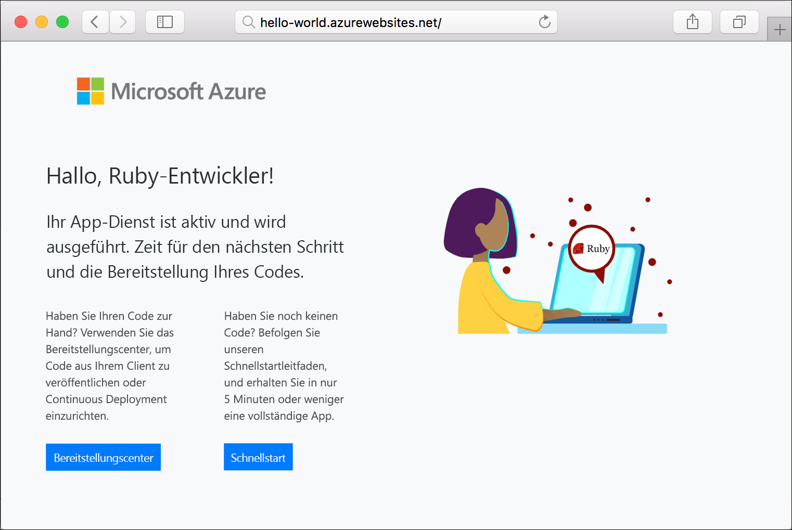

# <a name="create-a-ruby-on-rails-app-in-app-service-on-linux"></a>Erstellen einer Ruby on Rails-App in App Service unter Linux

[App Service unter Linux](app-service-linux-intro.md) bietet einen hochgradig skalierbaren Webhostingdienst mit Self-Patching unter Linux-Betriebssystemen. In diesem Schnellstart-Tutorial wird erläutert, wie Sie mit [Cloud Shell](https://docs.microsoft.com/azure/cloud-shell/overview) eine Ruby on Rails-App in Azure App Service für Linux bereitstellen.

> [!NOTE]
> Der Ruby-Entwicklungsstapel unterstützt derzeit nur Ruby on Rails. Wenn Sie eine andere Plattform, z. B. Sinatra, oder eine [nicht unterstützte Ruby-Version](app-service-linux-intro.md) verwenden möchten, müssen Sie diese [in einem benutzerdefinierten Container ausführen](quickstart-docker-go.md).


[!INCLUDE [quickstarts-free-trial-note](../../../includes/quickstarts-free-trial-note.md)]

## <a name="prerequisites"></a>Voraussetzungen

* <a href="https://www.ruby-lang.org/en/documentation/installation/#rubyinstaller" target="_blank">Installation von Ruby 2.6 oder höher</a>
* <a href="https://git-scm.com/" target="_blank">Installation von Git</a>

## <a name="download-the-sample"></a>Herunterladen des Beispiels

Führen Sie in einem Terminalfenster den folgenden Befehl aus, um das Beispiel-App-Repository auf Ihren lokalen Computer zu klonen:

```bash
git clone https://github.com/Azure-Samples/ruby-docs-hello-world
```

## <a name="run-the-application-locally"></a>Lokales Ausführen der Anwendung

Führen Sie die Anwendung lokal aus, damit Sie sehen, wie sie beim Bereitstellen in Azure aussehen sollte. Öffnen Sie ein Terminalfenster, wechseln Sie zum Verzeichnis `hello-world`, und verwenden Sie den Befehl `rails server` zum Starten des Servers.

Der erste Schritt besteht in der Installation aller erforderlichen Gems. Im Beispiel ist eine `Gemfile` enthalten, führen Sie daher einfach den folgenden Befehl aus:

```bash
bundle install
```

Nachdem die Gems installiert sind, wird die App über den Bundler gestartet:

```bash
bundle exec rails server
```

Navigieren Sie in Ihrem Webbrowser zu `http://localhost:3000`, um die App lokal zu testen.


[!INCLUDE [Try Cloud Shell](../../../includes/cloud-shell-try-it.md)]

[!INCLUDE [Configure deployment user](../../../includes/configure-deployment-user.md)]

[!INCLUDE [Create resource group](../../../includes/app-service-web-create-resource-group-linux.md)]

[!INCLUDE [Create app service plan](../../../includes/app-service-web-create-app-service-plan-linux.md)]

## <a name="create-a-web-app"></a>Erstellen einer Web-App

[!INCLUDE [Create web app](../../../includes/app-service-web-create-web-app-ruby-linux-no-h.md)] 

Navigieren Sie zu der App, um Ihre neu erstellte Web-App mit integriertem Image anzuzeigen. Ersetzen Sie _&lt;App-Name>_ durch Ihren Web-App-Namen.

```bash
http://<app_name>.azurewebsites.net
```

Ihre neue Web-App sollte nun wie folgt aussehen:



## <a name="deploy-your-application"></a>Bereitstellen der Anwendung

Führen Sie die folgenden Befehle aus, um die lokale Anwendung für Ihre Azure-Web-App bereitzustellen:

```bash
git remote add azure <Git deployment URL from above>
git push azure master
```

Vergewissern Sie sich, dass die Remotebereitstellungsvorgänge erfolgreich waren. Der Befehl erzeugt eine Ausgabe ähnlich dem folgenden Text:

```bash
remote: Using turbolinks 5.2.0
remote: Using uglifier 4.1.20
remote: Using web-console 3.7.0
remote: Bundle complete! 18 Gemfile dependencies, 78 gems now installed.
remote: Bundled gems are installed into `/tmp/bundle`
remote: Zipping up bundle contents
remote: .......
remote: ~/site/repository
remote: Finished successfully.
remote: Running post deployment command(s)...
remote: Deployment successful.
remote: App container will begin restart within 10 seconds.
To https://<app-name>.scm.azurewebsites.net/<app-name>.git
   a6e73a2..ae34be9  master -> master
```

Nachdem die Bereitstellung abgeschlossen ist, warten Sie etwa 10 Sekunden, bis die Web-App neu gestartet wird. Navigieren Sie dann zur Web-App, und überprüfen Sie die Ergebnisse.

```bash
http://<app-name>.azurewebsites.net
```


> [!NOTE]
> Während die App neu gestartet wird, können Sie den HTTP-Statuscode `Error 503 Server unavailable` im Browser oder die Standardseite `Hey, Ruby developers!`beobachten. Der vollständige Neustart der App kann einige Minuten in Anspruch nehmen.
>

[!INCLUDE [Clean-up section](../../../includes/cli-script-clean-up.md)]

## <a name="next-steps"></a>Nächste Schritte

> [!div class="nextstepaction"]
> [Tutorial: Ruby on Rails mit Postgres](tutorial-ruby-postgres-app.md)

> [!div class="nextstepaction"]
> [Konfigurieren der Ruby-App](configure-language-ruby.md)
