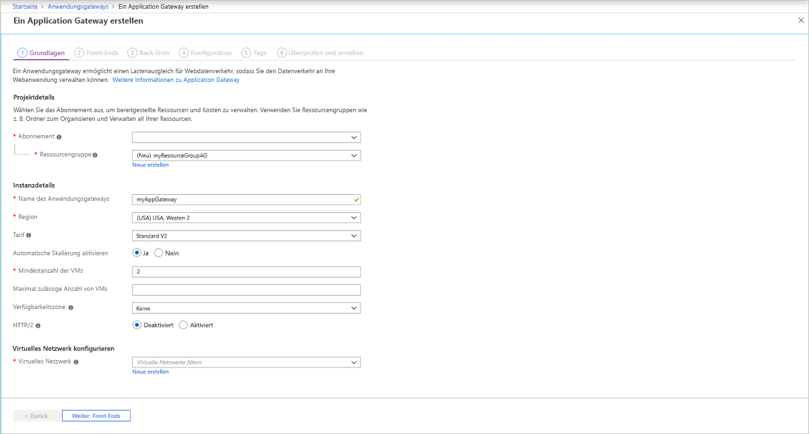
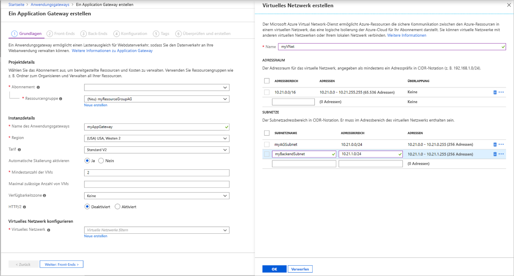
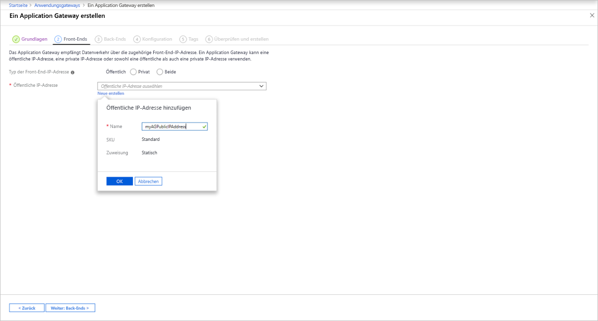

# <a name="tutorial-create-and-configure-an-application-gateway-to-host-multiple-web-sites-using-the-azure-portal"></a>Tutorial: Erstellen und Konfigurieren eines Anwendungsgateways als Host mehrerer Websites über das Azure-Portal

Sie können mit dem Azure-Portal das [Hosting mehrerer Websites](multiple-site-overview.md) konfigurieren, wenn Sie ein [Anwendungsgateway](overview.md) erstellen. In diesem Tutorial definieren Sie Back-End-Adresspools mithilfe von virtuellen Computern. Anschließend konfigurieren Sie Listener und Regeln basierend auf Domänen in Ihrem Besitz, um sicherzustellen, dass Webdatenverkehr von geeigneten Servern in den Pools empfangen wird. In diesem Tutorial wird vorausgesetzt, dass Sie mehrere Domänen besitzen und die Beispiele zu *www.contoso.com* und *www.fabrikam.com* verwenden.

In diesem Tutorial lernen Sie Folgendes:

> [!div class="checklist"]
> * Erstellen eines Anwendungsgateways
> * Erstellen von virtuellen Computern für Back-End-Server
> * Erstellen von Back-End-Pools mit den Back-End-Servern
> * Erstellen von Back-End-Listenern
> * Erstellen von Routingregeln
> * Erstellen eines CNAME-Eintrags in Ihrer Domäne


Wenn Sie kein Azure-Abonnement besitzen, können Sie ein [kostenloses Konto](https://azure.microsoft.com/free/?WT.mc_id=A261C142F) erstellen, bevor Sie beginnen.

## <a name="sign-in-to-azure"></a>Anmelden bei Azure

Melden Sie sich unter [https://portal.azure.com](https://portal.azure.com) beim Azure-Portal an.

## <a name="create-an-application-gateway"></a>Erstellen eines Anwendungsgateways

1. Klicken Sie im Azure-Portal im Menü auf der linken Seite auf **Ressource erstellen**. Das Fenster **Neu** wird angezeigt.

2. Klicken Sie auf **Netzwerk**, und wählen Sie dann in der Liste **Ausgewählte** die Option **Application Gateway** aus.

### <a name="basics-tab"></a>Registerkarte „Grundlagen“

1. Geben Sie auf der Registerkarte **Grundlagen** die folgenden Werte für die Einstellungen des Anwendungsgateways ein:

   - **Ressourcengruppe**: Wählen Sie **myResourceGroupAG** als Ressourcengruppe aus. Falls diese Gruppe nicht vorhanden ist, wählen Sie **Neue erstellen** aus, um sie zu erstellen.
   - **Name des Anwendungsgateways**: Geben Sie *myAppGateway* als Namen des Anwendungsgateways ein.

     

2.  Für die Kommunikation in Azure zwischen den von Ihnen erstellten Ressourcen ist ein virtuelles Netzwerk erforderlich. Sie können ein neues virtuelles Netzwerk erstellen oder ein bereits vorhandenes virtuelles Netzwerk auswählen. In diesem Beispiel erstellen Sie gleichzeitig mit dem Anwendungsgateway ein virtuelles Netzwerk. Application Gateway-Instanzen werden in separaten Subnetzen erstellt. In diesem Beispiel erstellen Sie zwei Subnetze: eins für das Anwendungsgateway und eins für die Back-End-Server.

    Wählen Sie unter **Virtuelles Netzwerk konfigurieren** die Option **Neu erstellen** aus, um ein neues virtuelles Netzwerk zu erstellen. Geben Sie im Fenster **Virtuelles Netzwerk erstellen**, das geöffnet wird, die folgenden Werte ein,um das virtuelle Netzwerk und zwei Subnetze zu erstellen:

    - **Name**: Geben Sie *myVNet* als Namen des virtuellen Netzwerks ein.

    - **Subnetzname** (Application Gateway-Subnetz): Im Raster **Subnetze** wird ein Subnetz namens *Default* angezeigt. Ändern Sie den Namen dieses Subnetzes in *myAGSubnet*.<br>Das Subnetz für das Anwendungsgateway kann nur Anwendungsgateways enthalten. Andere Ressourcen sind nicht zulässig.

    - **Subnetzname** (Subnetz für Back-End-Server): Geben Sie in der zweiten Zeile des Rasters **Subnetze** in der Spalte *Subnetzname* den Namen **myBackendSubnet** ein.

    - **Adressbereich** (Subnetz für Back-End-Server): Geben Sie in der zweiten Zeile des Rasters **Subnetze** einen Adressbereich ein, der sich nicht mit dem Adressbereich des Subnetzes *myAGSubnet* überschneidet. Wenn der Adressbereich von *myAGSubnet* beispielsweise 10.0.0.0/24 lautet, geben Sie *10.0.1.0/24* als Adressbereich für *myBackendSubnet* ein.

    Wählen Sie **OK** aus, um das Fenster **Virtuelles Netzwerk erstellen** zu schließen und die Einstellungen für das virtuelle Netzwerk zu speichern.

     
    
3. Übernehmen Sie auf der Registerkarte **Grundlagen** die Standardwerte für die übrigen Einstellungen, und wählen Sie dann **Weiter: Front-Ends** aus.

### <a name="frontends-tab"></a>Registerkarte „Front-Ends“

1. Vergewissern Sie sich auf der Registerkarte **Front-Ends**, dass der **Typ der Front-End-IP-Adresse** auf **Öffentlich** festgelegt ist. <br>Je nach Anwendungsfall können Sie konfigurieren, dass die Front-End-IP-Adresse öffentlich oder privat ist. In diesem Beispiel verwenden Sie eine öffentliche Front-End-IP-Adresse.
   > [!NOTE]
   > Für die Application Gateway v2-SKU können Sie nur die **öffentliche** Front-End-IP-Konfiguration wählen. Die private Front-End-IP-Konfiguration ist derzeit für diese v2-SKU nicht aktiviert.

2. Wählen Sie **Neu erstellen** für die **Öffentliche IP-Adresse** aus, und geben Sie *myAGPublicIPAddress* als Namen der öffentlichen IP-Adresse ein. Wählen Sie dann **OK** aus. 

     

3. Klicken Sie auf **Weiter: Back-Ends**.

### <a name="backends-tab"></a>Registerkarte „Back-Ends“

Der Back-End-Pool wird zum Weiterleiten von Anforderungen an die Back-End-Server verwendet, die die Anforderung verarbeiten. Back-End-Pools können Netzwerkadapter, VM-Skalierungsgruppen, öffentliche IP-Adressen, interne IP-Adressen, vollqualifizierte Domänennamen (Fully Qualified Domain Names, FQDN) und Back-Ends mit mehreren Mandanten wie Azure App Service sein. In diesem Beispiel erstellen Sie mit Ihrem Anwendungsgateway einen leeren Back-End-Pool und fügen dann Back-End-Ziele zum Back-End-Pool hinzu.

1. Wählen Sie auf der Registerkarte **Back-Ends** die Option **+Back-End-Pool hinzufügen** aus.

2. Geben Sie im Fenster **Back-End-Pool hinzufügen**, das geöffnet wird, die folgenden Werte ein, um einen leeren Back-End-Pool zu erstellen:

    - **Name**: Geben Sie *contosoPool* für den Namen des Back-End-Pools ein.
    - **Back-End-Pool ohne Ziele hinzufügen**: Wählen Sie **Ja** aus, um einen Back-End-Pool ohne Ziele zu erstellen. Back-End-Ziele werden Sie nach dem Erstellen des Anwendungsgateways hinzufügen.

3. Wählen Sie im Fenster **Back-End-Pool hinzufügen** die Option **Hinzufügen** aus, um die Konfiguration des Back-End-Pools zu speichern und zur Registerkarte **Back-Ends** zurückzukehren.
4. Fügen Sie jetzt einen weiteren Back-End-Pool namens *fabrikamPool* hinzu.

     

4. Wählen Sie auf der Registerkarte **Back-Ends** die Option **Weiter: Konfiguration** aus.

### <a name="configuration-tab"></a>Registerkarte „Konfiguration“

Auf der Registerkarte **Konfiguration** verbinden Sie das Front-End und die von Ihnen erstellten Back-End-Pools mithilfe einer Routingregel.

1. Wählen Sie **Regel hinzufügen** in der Spalte **Routingregeln** aus.

2. Geben Sie im Fenster **Routingregel hinzufügen**, das geöffnet wird, *contosoRule* als **Regelname** ein.

3. Eine Routingregel erfordert einen Listener. Geben Sie im Fenster **Routingregel hinzufügen** auf der Registerkarte **Listener** die folgenden Werte für den Listener ein:

    - **Name des Listeners**: Geben Sie *contosoListener* für den Namen des Listeners ein.
    - **Front-End-IP**: Wählen Sie **Öffentlich** aus, um die für das Front-End erstellte öffentliche IP-Adresse auszuwählen.

   Unter **Zusätzliche Einstellungen**:
   - **Listenertyp**: Mehrere Sites
   - **Hostname**: **www.contoso.com**

   Übernehmen Sie auf der Registerkarte **Listener** die Standardwerte für die übrigen Einstellungen. Wählen Sie dann die Registerkarte **Back-End-Ziele** aus, um den Rest der Routingregel zu konfigurieren.

   

4. Wählen Sie auf der Registerkarte **Back-End-Ziele** den Pool **contosoPool** als **Back-End-Ziel** aus.

5. Wählen Sie für die **HTTP-Einstellung** die Option **Neu erstellen** aus, um eine neue HTTP-Einstellung zu erstellen. Die HTTP-Einstellung bestimmt das Verhalten der Routingregel. Geben Sie im Fenster **HTTP-Einstellung hinzufügen**, das geöffnet wird, *contosoHTTPSetting* als **Name der HTTP-Einstellung** ein. Übernehmen Sie im Fenster **HTTP-Einstellung hinzufügen** die Standardwerte für die übrigen Einstellungen, und wählen Sie dann **Hinzufügen** aus, um zum Fenster **Routingregel hinzufügen** zurückzukehren. 

6. Wählen Sie im Fenster **Routingregel hinzufügen** die Option **Hinzufügen** aus, um die Routingregel zu speichern und zur Registerkarte **Konfiguration** zurückzukehren.
7. Wählen Sie **Regel hinzufügen** aus, und fügen Sie eine ähnliche Regel, einen Listener, ein Back-End-Ziel und eine HTTP-Einstellung für Fabrikam hinzu.

     

7. Klicken Sie auf **Weiter: Tags** und dann auf **Weiter: Überprüfen + erstellen**.

### <a name="review--create-tab"></a>Registerkarte „Überprüfen und erstellen“

Überprüfen Sie die Einstellungen auf der Registerkarte **Überprüfen und erstellen**, und wählen Sie dann **Erstellen** aus, um das virtuelle Netzwerk, die öffentliche IP-Adresse und das Anwendungsgateway zu erstellen. Die Erstellung des Anwendungsgateways in Azure kann einige Minuten in Anspruch nehmen.

Warten Sie, bis die Bereitstellung erfolgreich abgeschlossen ist, bevor Sie mit dem nächsten Abschnitt fortfahren.

## <a name="add-backend-targets"></a>Hinzufügen von Back-End-Zielen

In diesem Beispiel verwenden Sie virtuelle Computer als Ziel-Back-End. Sie können entweder vorhandene virtuelle Computer verwenden oder neue erstellen. Sie erstellen zwei virtuelle Computer, die von Azure als Back-End-Server für das Anwendungsgateway verwendet werden.

Gehen Sie zum Hinzufügen von Back-End-Zielen wie folgt vor:

1. Erstellen Sie zwei neue virtuelle Computer (*contosoVM* und *fabrikamVM*), die als Back-End-Server verwendet werden.
2. Installieren von IIS auf den virtuellen Computern, um zu überprüfen, ob die Application Gateway-Instanz erfolgreich erstellt wurde
3. Fügen Sie die Back-End-Server zum Back-End-Pool hinzu.

### <a name="create-a-virtual-machine"></a>Erstellen eines virtuellen Computers

1. Klicken Sie im Azure-Portal auf **Ressource erstellen**. Das Fenster **Neu** wird angezeigt.
2. Klicken Sie auf **Compute**, und wählen Sie dann in der Liste **Beliebt** die Option **Windows Server 2016 Datacenter** aus. Die Seite **Virtuellen Computer erstellen** wird angezeigt.<br>Application Gateway kann Datenverkehr an jeden beliebigen virtuellen Computer weiterleiten, der im Back-End-Pool verwendet wird. In diesem Beispiel verwenden Sie Windows Server 2016 Datacenter.
3. Geben Sie auf der Registerkarte **Grundlagen** die folgenden Werte für die VM-Einstellungen ein:

    - **Ressourcengruppe**: Wählen Sie **myResourceGroupAG** als Namen der Ressourcengruppe aus.
    - **Name des virtuellen Computers**: Geben Sie *contosoVM* für den Namen des virtuellen Computers ein.
    - **Benutzername**: Geben *azureuser* als Namen des Administratorbenutzers ein.
    - **Kennwort**: Geben Sie *Azure123456!* als Administratorkennwort ein.
4. Übernehmen Sie für die anderen Einstellungen die Standardwerte, und klicken Sie auf **Weiter: Datenträger**.  
5. Übernehmen Sie auf der Registerkarte **Datenträger** die Standardwerte, und klicken Sie auf **Weiter: Netzwerk**.
6. Vergewissern Sie sich auf der Registerkarte **Netzwerk**, dass **myVNet** für **Virtuelles Netzwerk** ausgewählt und **Subnetz** auf **myBackendSubnet** festgelegt ist. Übernehmen Sie für die anderen Einstellungen die Standardwerte, und klicken Sie auf **Weiter: Verwaltung** aus.<br>Application Gateway kann mit Instanzen außerhalb des eigenen virtuellen Netzwerks kommunizieren, es muss jedoch sichergestellt werden, dass eine IP-Verbindung besteht.
7. Legen Sie auf der Registerkarte **Verwaltung** die Option **Startdiagnose** auf **Aus** fest. Übernehmen Sie für die anderen Einstellungen die Standardwerte, und klicken Sie auf **Bewerten + erstellen**.
8. Überprüfen Sie auf der Registerkarte **Bewerten + erstellen** die Einstellungen, beheben Sie alle Validierungsfehler, und wählen Sie dann **Erstellen** aus.
9. Warten Sie, bis die Erstellung des virtuellen Computers abgeschlossen ist, bevor Sie fortfahren.

### <a name="install-iis-for-testing"></a>Installieren von IIS für Testzwecke

In diesem Beispiel installieren Sie IIS auf den virtuellen Computern nur, um zu überprüfen, ob Azure das Anwendungsgateway erfolgreich erstellt hat.

1. Öffnen Sie [Azure PowerShell](https://docs.microsoft.com/azure/cloud-shell/quickstart-powershell). Wählen Sie dazu in der oberen Navigationsleiste des Azure-Portals **Cloud Shell** und dann in der Dropdownliste **PowerShell** aus. 

    

2. Führen Sie den folgenden Befehl aus, um IIS auf dem virtuellen Computer zu installieren: 

    ```azurepowershell-interactive
    Set-AzVMExtension `
      -ResourceGroupName myResourceGroupAG `
      -ExtensionName IIS `
      -VMName contosoVM `
      -Publisher Microsoft.Compute `
      -ExtensionType CustomScriptExtension `
      -TypeHandlerVersion 1.4 `
      -SettingString '{"commandToExecute":"powershell Add-WindowsFeature Web-Server; powershell Add-Content -Path \"C:\\inetpub\\wwwroot\\Default.htm\" -Value $($env:computername)"}' `
      -Location EastUS
    ```

3. Erstellen Sie eine zweite VM, und installieren Sie IIS mithilfe der zuvor ausgeführten Schritte. Verwenden Sie *fabrikamVM* für den VM-Namen und für die Einstellung **VMName** des Cmdlets **Set-AzVMExtension**.

### <a name="add-backend-servers-to-backend-pools"></a>Hinzufügen von Back-End-Servern zu Back-End-Pools

1. Wählen Sie **Alle Ressourcen** und dann **myAppGateway** aus.

2. Klicken Sie im Menü auf der linken Seite auf **Back-End-Pools**.

3. Wählen Sie **contosoPool** aus.

4. Wählen Sie unter **Ziele** in der Dropdownliste die Option **Virtueller Computer** aus.

5. Wählen Sie unter **VIRTUELLER COMPUTER** und **NETZWERKSCHNITTSTELLEN** in den Dropdownlisten die VM **contosoVM** sowie die zugehörige Netzwerkschnittstelle aus.

    

6. Wählen Sie **Speichern** aus.
7. Wiederholen Sie diesen Vorgang, um *fabrikamVM* und die Schnittstelle zu *fabrikamPool* hinzuzufügen.

Warten Sie, bis die Bereitstellung abgeschlossen ist, bevor Sie mit dem nächsten Schritt fortfahren.

## <a name="create-a-www-a-record-in-your-domains"></a>Erstellen eines „www A“-Eintrags in Ihren Domänen

Nachdem das Anwendungsgateway mit der zugehörigen öffentlichen IP-Adresse erstellt wurde, können Sie die IP-Adresse abrufen und zum Erstellen eines A-Eintrags in Ihren Domänen verwenden. 

1. Klicken Sie auf **Alle Ressourcen** und dann auf **myAGPublicIPAddress**.

    

2. Kopieren Sie die IP-Adresse, und verwenden Sie sie als Wert für einen neuen „*www* A“-Eintrag in Ihren Domänen.

## <a name="test-the-application-gateway"></a>Testen des Anwendungsgateways

1. Geben Sie Ihren Domänennamen in die Adressleiste Ihres Browsers ein. Z.B. `http://www.contoso.com`.

    

2. Ändern Sie die Adresse in Ihre andere Domäne. Die Ausgabe sollte in etwa wie folgt aussehen:

    

## <a name="clean-up-resources"></a>Bereinigen von Ressourcen

Wenn Sie die mit dem Anwendungsgateway erstellten Ressourcen nicht mehr benötigen, entfernen Sie die Ressourcengruppe. Wenn Sie die Ressourcengruppe entfernen, werden auch das Anwendungsgateway und alle zugehörigen Ressourcen entfernt.

So entfernen Sie die Ressourcengruppe:

1. Wählen Sie im Azure-Portal im Menü auf der linken Seite die Option **Ressourcengruppen** aus.
2. Suchen Sie auf der Seite **Ressourcengruppen** in der Liste nach **myResourceGroupAG**, und wählen Sie den Eintrag aus.
3. Wählen Sie auf der Seite für die **Ressourcengruppe** die Option **Ressourcengruppe löschen** aus.
4. Geben Sie *myResourceGroupAG* für **RESSOURCENGRUPPENNAMEN EINGEBEN** ein, und wählen Sie **Löschen** aus.

## <a name="next-steps"></a>Nächste Schritte

> [!div class="nextstepaction"]
> [Erfahren Sie mehr darüber, welche Möglichkeiten Azure Application Gateway bietet.](application-gateway-introduction.md)