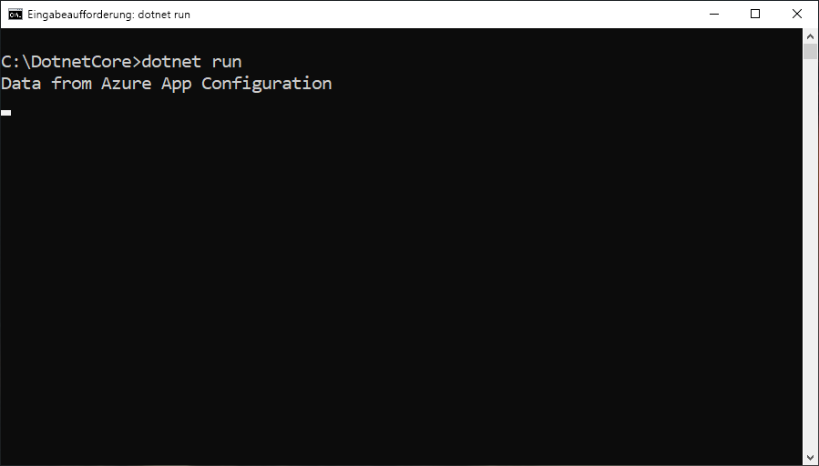

# <a name="tutorial-use-dynamic-configuration-in-a-net-core-app"></a>Tutorial: Verwenden der dynamischen Konfiguration in einer .NET Core-App

Die App Configuration-.NET Core-Clientbibliothek unterstützt die Aktualisierung einer Reihe von Konfigurationseinstellungen bei Bedarf, ohne dass eine Anwendung neu gestartet werden muss. Dies kann implementiert werden, indem zuerst eine Instanz von `IConfigurationRefresher` aus den Optionen für den Konfigurationsanbieter abgerufen und anschließend `Refresh` für diese Instanz an einer beliebigen Stelle Ihres Codes aufgerufen wird.

Um die Einstellungen auf dem aktuellen Stand zu halten und zu viele Aufrufe des Konfigurationsspeichers zu vermeiden, wird ein Cache für jede Einstellung verwendet. Bis der zwischengespeicherte Wert einer Einstellung abgelaufen ist, wird der Wert vom Aktualisierungsvorgang nicht aktualisiert. Dies gilt auch, wenn sich der Wert im Konfigurationsspeicher geändert hat. Die Standardablaufzeit jeder Anforderung beträgt 30 Sekunden, aber dies kann bei Bedarf außer Kraft gesetzt werden.

In diesem Tutorial wird veranschaulicht, wie Sie dynamische Konfigurationsupdates in Ihrem Code implementieren können. Dies baut auf der App auf, die in den Schnellstartanleitungen vorgestellt wurde. Durchlaufen Sie zuerst die Schnellstartanleitung zum [Erstellen einer .NET Core-App mit Azure App Configuration](./quickstart-dotnet-core-app.md), bevor Sie fortfahren.

Für die Ausführung der Schritte dieses Tutorials können Sie einen beliebigen Code-Editor verwenden. [Visual Studio Code](https://code.visualstudio.com/) ist eine hervorragende Option, die auf Windows-, macOS- und Linux-Plattformen verfügbar ist.

In diesem Tutorial lernen Sie Folgendes:

> [!div class="checklist"]
> * Einrichten Ihrer Anwendung für die bedarfsgesteuerte Aktualisierung der Konfiguration mit einem App-Konfigurationsspeicher
> * Einfügen der aktuellen Konfiguration in die Controller Ihrer Anwendung

## <a name="prerequisites"></a>Voraussetzungen

Installieren Sie für dieses Tutorial das [.NET Core SDK](https://dotnet.microsoft.com/download).

[!INCLUDE [quickstarts-free-trial-note](../../includes/quickstarts-free-trial-note.md)]

## <a name="reload-data-from-app-configuration"></a>Erneutes Laden von Daten aus App Configuration

Öffnen Sie *Program.cs*, und aktualisieren Sie die Datei, um einen Verweis auf den `System.Threading.Tasks`-Namespace hinzuzufügen, um die Aktualisierung der Konfiguration in der `AddAzureAppConfiguration`-Methode anzugeben und die manuelle Aktualisierung mit der `Refresh`-Methode auszulösen.

```csharp
using System;
using System.Threading.Tasks;

namespace TestConsole
{
class Program
{
    private static IConfiguration _configuration = null;
    private static IConfigurationRefresher _refresher = null;

    static void Main(string[] args)
    {
        IConfigurationRefresher refresher = null;

        var builder = new ConfigurationBuilder();
        builder.AddAzureAppConfiguration(options =>
        {
            options.Connect(Environment.GetEnvironmentVariable("ConnectionString"))
                    .ConfigureRefresh(refresh =>
                    {
                        refresh.Register("TestApp:Settings:Message")
                               .SetCacheExpiration(TimeSpan.FromSeconds(10));
                    });
                    
                    _refresher = options.GetRefresher();
        });

        _configuration = builder.Build();
        PrintMessage().Wait();
    }

    private static async Task PrintMessage()
    {
        Console.WriteLine(_configuration["TestApp:Settings:Message"] ?? "Hello world!");

        // Wait for the user to press Enter
        Console.ReadLine();

        await _refresher.Refresh();
        Console.WriteLine(_configuration["TestApp:Settings:Message"] ?? "Hello world!");
    }
}
}
```

Die `ConfigureRefresh`-Methode wird genutzt, um die Einstellungen anzugeben, die zum Aktualisieren der Konfigurationsdaten mit dem App-Konfigurationsspeicher verwendet werden, wenn ein Aktualisierungsvorgang ausgelöst wird. Eine Instanz von `IConfigurationRefresher` kann durch das Aufrufen der `GetRefresher`-Methode in den Optionen der `AddAzureAppConfiguration`-Methode abgerufen werden. Die `Refresh`-Methode dieser Instanz kann verwendet werden, um einen Aktualisierungsvorgang an einer beliebigen Stelle Ihres Codes auszulösen.
    
> [!NOTE]
> Die Standardablaufzeit für eine Konfigurationseinstellung beträgt 30 Sekunden, aber dieser Wert kann außer Kraft gesetzt werden. Rufen Sie hierzu die `SetCacheExpiration`-Methode im Initialisierer für die Optionen auf, die als Argument an die `ConfigureRefresh`-Methode übergeben wird.

## <a name="build-and-run-the-app-locally"></a>Lokales Erstellen und Ausführen der App

1. Legen Sie eine Umgebungsvariable mit dem Namen **ConnectionString** fest, und geben Sie dafür den Zugriffsschlüssel für Ihren App-Konfigurationsspeicher an. Führen Sie bei Verwendung einer Windows-Eingabeaufforderung den folgenden Befehl aus, und starten Sie die Eingabeaufforderung neu, damit die Änderung wirksam wird:

        setx ConnectionString "connection-string-of-your-app-configuration-store"

    Führen Sie bei Verwendung von Windows PowerShell den folgenden Befehl aus:

        $Env:ConnectionString = "connection-string-of-your-app-configuration-store"

    Führen Sie bei Verwendung von macOS oder Linux den folgenden Befehl aus:

        export ConnectionString='connection-string-of-your-app-configuration-store'

1. Führen Sie den folgenden Befehl aus, um die Konsolen-App zu erstellen:

        dotnet build

1. Führen Sie nach der erfolgreichen Erstellung den folgenden Befehl aus, um die App lokal auszuführen:

        dotnet run

    

1. Melden Sie sich beim [Azure-Portal](https://portal.azure.com) an. Wählen Sie **Alle Ressourcen** aus, und wählen Sie dann die Instanz des App-Konfigurationsspeichers aus, die Sie in der Schnellstartanleitung erstellt haben.

1. Wählen Sie den **Konfigurations-Explorer** aus, und aktualisieren Sie die Werte der folgenden Schlüssel:

    | Schlüssel | Wert |
    |---|---|
    | TestApp:Settings:Message | Daten aus Azure App Configuration: Aktualisiert |

1. Drücken Sie die EINGABETASTE, um eine Aktualisierung auszulösen, und geben Sie den aktualisierten Wert in der Eingabeaufforderung oder im PowerShell-Fenster aus.

    
    
    > [!NOTE]
    > Da die Cacheablaufzeit beim Angeben der Konfiguration für den Aktualisierungsvorgang mit der `SetCacheExpiration`-Methode auf zehn Sekunden festgelegt wurde, wird der Wert für die Konfigurationseinstellung erst aktualisiert, wenn seit der letzten Aktualisierung für diese Einstellung mindestens zehn Sekunden verstrichen sind.

## <a name="clean-up-resources"></a>Bereinigen von Ressourcen

[!INCLUDE [azure-app-configuration-cleanup](../../includes/azure-app-configuration-cleanup.md)]

## <a name="next-steps"></a>Nächste Schritte

In diesem Tutorial haben Sie eine verwaltete Azure-Dienstidentität hinzugefügt, um den Zugriff auf App Configuration zu optimieren und die Verwaltung der Anmeldeinformationen für Ihre App zu verbessern. Fahren Sie mit den Azure CLI-Beispielen fort, um mehr über die Verwendung von App Configuration zu erfahren.

> [!div class="nextstepaction"]
> [CLI-Beispiele](./cli-samples.md)
