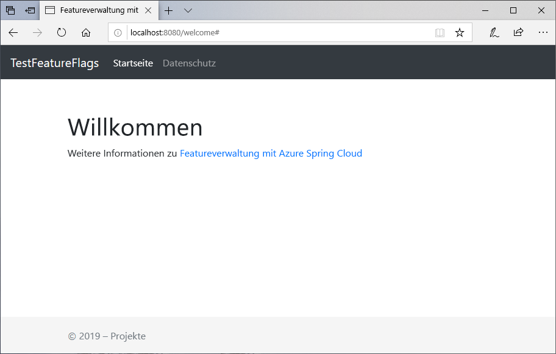
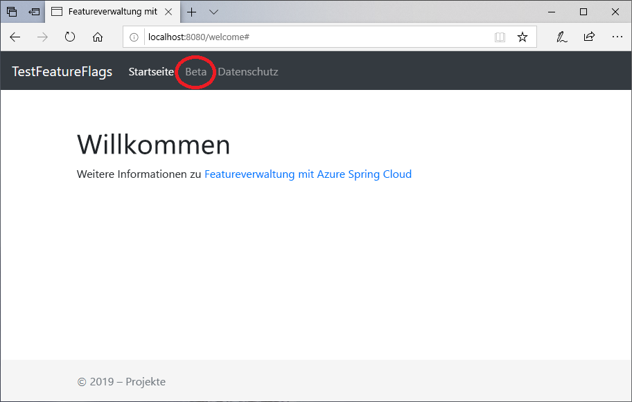

# <a name="quickstart-add-feature-flags-to-a-spring-boot-app"></a>Schnellstart: Hinzufügen von Featureflags zu einer Spring Boot-App

In dieser Schnellstartanleitung integrieren Sie Azure App Configuration in eine Spring Boot-Web-App, um eine End-to-End-Implementierung der Featureverwaltung zu erzielen. Mit diesem App Configuration-Dienst können Sie alle Featureflags zentral speichern und ihren jeweiligen Zustand steuern.

Die Spring Boot-Bibliotheken für die Featureverwaltung erweitern das Framework um umfassende Unterstützung für Featureflags. Diese Bibliotheken sind **nicht** von Azure-Bibliotheken abhängig. Über ihren Spring Boot-Konfigurationsanbieter lassen sie sich nahtlos in App Configuration integrieren.

## <a name="prerequisites"></a>Voraussetzungen

- Azure-Abonnement – [Erstellen eines kostenlosen Kontos](https://azure.microsoft.com/free/)
- Ein unterstütztes [Java Development Kit-SDK](https://docs.microsoft.com/java/azure/jdk) mit Version 8.
- [Apache Maven](https://maven.apache.org/download.cgi) Version 3.0 oder höher

## <a name="create-an-app-configuration-store"></a>Erstellen eines App Configuration-Speichers

[!INCLUDE [azure-app-configuration-create](../../includes/azure-app-configuration-create.md)]

6. Wählen Sie **Feature-Manager** >  **+Erstellen** aus, um die folgenden Featureflags hinzuzufügen:

    | Schlüssel | State |
    |---|---|
    | Beta | Aus |

## <a name="create-a-spring-boot-app"></a>Erstellen einer Spring Boot-App

Sie verwenden [Spring Initializr](https://start.spring.io/), um ein neues Spring Boot-Projekt zu erstellen.

1. Navigieren Sie zu <https://start.spring.io/>.

2. Verwenden Sie die folgenden Optionen:

   - Generieren Sie ein **Maven**-Projekt mit **Java**.
   - Geben Sie eine **Spring Boot**-Version ab 2.0 an.
   - Geben Sie Namen für die **Gruppe** und das **Artefakt** für Ihre Anwendung an.
   - Fügen Sie die **Web**-Abhängigkeit hinzu.

3. Wählen Sie nach Angabe der vorherigen Optionen die Option **Projekt generieren** aus. Laden Sie das Projekt nach entsprechender Aufforderung unter einem Pfad auf dem lokalen Computer herunter.

## <a name="add-feature-management"></a>Hinzufügen der Featureverwaltung

1. Nachdem Sie die Dateien auf Ihrem lokalen System extrahiert haben, kann Ihre einfache Spring Boot-Anwendung bearbeitet werden. Suchen Sie im Stammverzeichnis Ihrer App nach der Datei *pom.xml*.

2. Öffnen Sie die Datei *pom.xml* in einem Text-Editor, und fügen Sie Spring Cloud Azure Config Starter und Featureverwaltung der Liste von `<dependencies>` hinzu:

    ```xml
    <dependency>
        <groupId>com.microsoft.azure</groupId>
        <artifactId>spring-cloud-starter-azure-appconfiguration-config</artifactId>
        <version>1.1.0.M4</version>
    </dependency>
    <dependency>
        <groupId>com.microsoft.azure</groupId>
        <artifactId>spring-cloud-azure-feature-management-web</artifactId>
        <version>1.1.0.M4</version>
    </dependency>
    <dependency>
            <groupId>org.springframework.boot</groupId>
            <artifactId>spring-boot-starter-thymeleaf</artifactId>
    </dependency>
    ```

> [!Note]
> Es gibt eine nicht webgestützte Bibliothek für die Featureverwaltung, die nicht von Spring-Web abhängig ist. Unterschiede finden Sie in der zusätzlichen [Dokumentation](https://github.com/microsoft/spring-cloud-azure/tree/master/spring-cloud-azure-feature-management). Wenn Sie nicht App Configuration verwenden, sehen Sie die [Featureflagdeklaration](https://github.com/microsoft/spring-cloud-azure/tree/master/spring-cloud-azure-feature-management#feature-flag-declaration) ein.

## <a name="connect-to-an-app-configuration-store"></a>Herstellen einer Verbindung mit einem App Configuration-Speicher

1. Öffnen Sie `bootstrap.properties` unter dem Verzeichnis „resources“ Ihrer App, und fügen Sie der Datei die folgenden Zeilen hinzu. Fügen Sie die App Configuration-Informationen hinzu.

    ```properties
    spring.cloud.azure.appconfiguration.stores[0].name= ${APP_CONFIGURATION_CONNECTION_STRING}
    ```

2. Wechseln Sie im App Configuration-Portal für Ihren Konfigurationsspeicher zu „Zugriffsschlüssel“. Wählen Sie die Registerkarte „Schreibgeschützte Schlüssel“ aus. Kopieren Sie auf dieser Registerkarte den Wert einer der Verbindungszeichenfolgen, und fügen Sie ihn als neue Umgebungsvariable mit dem Variablennamen `APP_CONFIGURATION_CONNECTION_STRING` hinzu.

3. Öffnen Sie die Java-Hauptanwendungsdatei, und fügen Sie `@EnableConfigurationProperties` hinzu, um diese Funktion zu aktivieren.

    ```java
    @SpringBootApplication
    @EnableConfigurationProperties(MessageProperties.class)
    public class AzureConfigApplication {
        public static void main(String[] args) {
            SpringApplication.run(AzureConfigApplication.class, args);
        }
    }
    ```

4. Erstellen Sie im Paketverzeichnis Ihrer App eine neue Java-Datei mit dem Namen *HelloController.java*. Fügen Sie die folgenden Zeilen hinzu:

    ```java
    @Controller
    @ConfigurationProperties("controller")
    public class HelloController {

        private FeatureManager featureManager;

        public HelloController(FeatureManager featureManager) {
            this.featureManager = featureManager;
        }

        @GetMapping("/welcome")
        public String mainWithParam(Model model) {
            model.addAttribute("Beta", featureManager.isEnabled("Beta"));
            return "welcome";
        }
    }
    ```

5. Erstellen Sie im Verzeichnis „templates“ der App eine neue HTML-Datei mit dem Namen *welcome.html*. Fügen Sie die folgenden Zeilen hinzu:

    ```html
    <!DOCTYPE html>
    <html lang="en" xmlns:th="http://www.thymeleaf.org">
    <head>
        <meta charset="utf-8">
        <meta name="viewport" content="width=device-width, initial-scale=1, shrink-to-fit=no">
        <title>Feature Management with Spring Cloud Azure</title>

        <link rel="stylesheet" href="/css/main.css">
        <link rel="stylesheet" href="https://stackpath.bootstrapcdn.com/bootstrap/4.3.1/css/bootstrap.min.css" integrity="sha384-ggOyR0iXCbMQv3Xipma34MD+dH/1fQ784/j6cY/iJTQUOhcWr7x9JvoRxT2MZw1T" crossorigin="anonymous">

        <script src="https://code.jquery.com/jquery-3.3.1.slim.min.js" integrity="sha384-q8i/X+965DzO0rT7abK41JStQIAqVgRVzpbzo5smXKp4YfRvH+8abtTE1Pi6jizo" crossorigin="anonymous"></script>
        <script src="https://cdnjs.cloudflare.com/ajax/libs/popper.js/1.14.7/umd/popper.min.js" integrity="sha384-UO2eT0CpHqdSJQ6hJty5KVphtPhzWj9WO1clHTMGa3JDZwrnQq4sF86dIHNDz0W1" crossorigin="anonymous"></script>
        <script src="https://stackpath.bootstrapcdn.com/bootstrap/4.3.1/js/bootstrap.min.js" integrity="sha384-JjSmVgyd0p3pXB1rRibZUAYoIIy6OrQ6VrjIEaFf/nJGzIxFDsf4x0xIM+B07jRM" crossorigin="anonymous"></script>

    </head>
    <body>
        <header>
        <!-- Fixed navbar -->
        <nav class="navbar navbar-expand-md navbar-dark fixed-top bg-dark">
            <a class="navbar-brand" href="#">TestFeatureFlags</a>
            <button class="navbar-toggler" aria-expanded="false" aria-controls="navbarCollapse" aria-label="Toggle navigation" type="button" data-target="#navbarCollapse" data-toggle="collapse">
            <span class="navbar-toggler-icon"></span>
            </button>
            <div class="collapse navbar-collapse" id="navbarCollapse">
            <ul class="navbar-nav mr-auto">
                <li class="nav-item active">
                <a class="nav-link" href="#">Home <span class="sr-only">(current)</span></a>
                </li>
                <li class="nav-item" th:if="${Beta}">
                <a class="nav-link" href="#">Beta</a>
                </li>
                <li class="nav-item">
                <a class="nav-link" href="#">Privacy</a>
                </li>
            </ul>
            </div>
        </nav>
        </header>
        <div class="container body-content">
            <h1 class="mt-5">Welcome</h1>
            <p>Learn more about <a href="https://github.com/microsoft/spring-cloud-azure/blob/master/spring-cloud-azure-feature-management/README.md">Feature Management with Spring Cloud Azure</a></p>

        </div>
        <footer class="footer">
            <div class="container">
            <span class="text-muted">&copy; 2019 - Projects</span>
        </div>

        </footer>
    </body>
    </html>

    ```

6. Erstellen Sie unter „static“ einen neuen Ordner namens „CSS“ und in diesem Ordner eine neue CSS-Datei namens *main.css*. Fügen Sie die folgenden Zeilen hinzu:

    ```css
    html {
    position: relative;
    min-height: 100%;
    }
    body {
    margin-bottom: 60px;
    }
    .footer {
    position: absolute;
    bottom: 0;
    width: 100%;
    height: 60px;
    line-height: 60px;
    background-color: #f5f5f5;
    }

    body > .container {
    padding: 60px 15px 0;
    }

    .footer > .container {
    padding-right: 15px;
    padding-left: 15px;
    }

    code {
    font-size: 80%;
    }
    ```

## <a name="build-and-run-the-app-locally"></a>Lokales Erstellen und Ausführen der App

1. Erstellen Sie Ihre Spring Boot-Anwendung mit Maven, und führen Sie sie aus. Beispiel:

    ```shell
    mvn clean package
    mvn spring-boot:run
    ```

2. Öffnen Sie ein Browserfenster, und navigieren Sie zu `https://localhost:8080`. Dies ist die Standard-URL für die lokal gehostete Web-App.

    

3. Wählen Sie im App Configuration-Portal **Feature-Manager** aus, und ändern Sie den Status des **Beta**-Schlüssels in **Ein**:

    | Schlüssel | State |
    |---|---|
    | Beta | Andererseits |

4. Aktualisieren Sie die Browserseite, um die neuen Konfigurationseinstellungen anzuzeigen.

    

## <a name="clean-up-resources"></a>Bereinigen von Ressourcen

[!INCLUDE [azure-app-configuration-cleanup](../../includes/azure-app-configuration-cleanup.md)]

## <a name="next-steps"></a>Nächste Schritte

In dieser Schnellstartanleitung haben Sie einen neuen App Configuration-Speicher erstellt und diesen zur Verwaltung von Features in einer Spring Boot-Web-App über die [Feature-Manager-Bibliotheken](https://go.microsoft.com/fwlink/?linkid=2074664) verwendet.

- Weitere Informationen über die [Featureverwaltung](./concept-feature-management.md)
- [Verwalten von Featureflags](./manage-feature-flags.md)
- [Verwenden von Featureflags in einer Spring Boot Core-App](./use-feature-flags-spring-boot.md).
