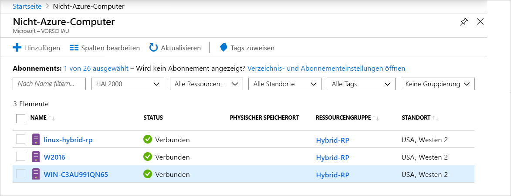

# <a name="what-is-azure-arc-for-servers"></a>Was ist Azure Arc für Server?

Azure Arc für Server ermöglicht Ihnen die Verwaltung von Computern, die sich außerhalb von Azure befinden.
Wenn für einen nicht zu Azure gehörenden Computer eine Verbindung mit Azure besteht, wird er zu einem **verbundenen Computer** und in Azure wie eine Ressource behandelt. Jeder **verbundene Computer** verfügt über eine Ressourcen-ID, wird als Teil einer Ressourcengruppe unter einem Abonnement verwaltet und profitiert von Azure-Standardkonstrukten, z. B. Azure Policy und Tagging.

Auf jedem Computer muss für die Verbindung mit Azure ein Agent-Paket installiert werden. In diesem Dokument wird dieser Prozess ausführlicher beschrieben.

Je nachdem, wie lange das Einchecken des Agents zurückliegt, befinden sich die Computer im Status **Verbunden** oder **Getrennt**. Jedes Einchecken wird als Heartbeat bezeichnet. Wenn für einen Computer nicht innerhalb der letzten fünf Minuten der Eincheckvorgang durchgeführt wurde, wird er als „Offline“ angezeigt, bis die Konnektivität wiederhergestellt ist.  <!-- For more information on troubleshooting agent connectivity, see [Troubleshooting Azure Arc for servers](troubleshoot/arc-for-servers.md). -->



## <a name="clients"></a>Clients

### <a name="supported-operating-systems"></a>Unterstützte Betriebssysteme

In der öffentlichen Vorschauphase (Public Preview) wird Folgendes unterstützt:

- Windows Server 2012 R2 und höher
- Ubuntu 16.04 und 18.04

Das Public Preview-Release ist für Evaluierungszwecke bestimmt und sollte nicht verwendet werden, um kritische Produktionsressourcen zu verwalten.

## <a name="azure-subscription-and-service-limits"></a>Einschränkungen von Azure-Abonnements und -Diensten

Sie sollten sich über die Azure Resource Manager-Einschränkungen informieren und die Anzahl von zu verbindenden Computern planen, indem Sie sich an die Hinweise zum [Abonnement](../../azure-subscription-service-limits.md#subscription-limits---azure-resource-manager) und zu den [Ressourcengruppen](../../azure-subscription-service-limits.md#resource-group-limits) halten. Standardmäßig gilt ein Grenzwert von 800 Servern pro Ressourcengruppe.

## <a name="networking-configuration"></a>Netzwerkkonfiguration

Während der Installation und zur Laufzeit ist für den Agent die Konnektivität mit **Azure Arc-Dienstendpunkten** erforderlich. Falls ausgehende Verbindungen durch Firewalls blockiert werden, müssen Sie sicherstellen, dass die folgenden URLs nicht standardmäßig gesperrt sind. Alle Verbindungen bestehen in ausgehender Richtung vom Agent zu Azure und sind per **SSL** geschützt. Der gesamte Datenverkehr kann über einen **HTTPS**-Proxy geleitet werden. Wenn Sie die IP-Adressbereiche oder Domänennamen zulassen, für die für Server die Verbindungsherstellung zulässig ist, müssen Sie für Port 443 den Zugriff auf die folgenden Diensttags und DNS-Namen erlauben.

Diensttags:

* AzureActiveDirectory
* AzureTrafficManager

Eine Liste der IP-Adressen für die einzelnen Diensttags/Regionen finden Sie in der JSON-Datei unter [Azure-IP-Bereiche und -Diensttags – öffentliche Cloud](https://www.microsoft.com/download/details.aspx?id=56519). Microsoft veröffentlicht wöchentliche Updates zu den einzelnen Azure-Diensten und den dafür genutzten IP-Adressbereichen. Ausführlichere Informationen finden Sie unter [Diensttags](https://docs.microsoft.com/azure/virtual-network/security-overview#service-tags).

Diese DNS-Namen werden zusätzlich zu den Informationen zum Diensttag-IP-Adressbereich bereitgestellt, weil die meisten Dienste derzeit nicht über eine Diensttag-Registrierung verfügen und die IP-Adressen somit Änderungen unterliegen. Falls IP-Adressbereiche für Ihre Firewallkonfiguration erforderlich sind, sollte das **AzureCloud**-Diensttag verwendet werden, um den Zugriff auf alle Azure-Dienste zuzulassen. Deaktivieren Sie nicht die Sicherheitsüberwachung oder Überprüfung für diese URLs, aber erlauben Sie den Internetverkehr wie üblich.

| Domänenumgebung | Erforderliche Azure-Dienstendpunkte |
|---------|---------|
|management.azure.com|Azure Resource Manager|
|login.windows.net|Azure Active Directory|
|dc.services.visualstudio.com|Application Insights|
|agentserviceapi.azure-automation.net|Gastkonfiguration|
|*-agentservice-prod-1.azure-automation.net|Gastkonfiguration|
|*.his.hybridcompute.azure-automation.net|Hybrididentitätsdienst|

### <a name="installation-network-requirements"></a>Netzwerkanforderungen für die Installation

Laden Sie das [Paket mit dem Azure Connected Machine-Agent](https://aka.ms/AzureConnectedMachineAgent) von unseren offiziellen Servern herunter. Hierfür müssen die unten angegebenen Sites von Ihrer Umgebung aus zugänglich sein. Sie können angeben, dass das Paket auf eine Dateifreigabe heruntergeladen werden soll, und den Agent von dort aus installieren. In diesem Fall muss das über das Azure-Portal generierte Onboardingskript ggf. geändert werden.

Windows:

* `aka.ms`
* `download.microsoft.com`

Linux:

* `aka.ms`
* `packages.microsoft.com`

Informationen zum Konfigurieren des Agents für die Verwendung Ihres Proxys finden Sie im Abschnitt [Proxyserverkonfiguration](quickstart-onboard-powershell.md#proxy-server-configuration).

## <a name="register-the-required-resource-providers"></a>Registrieren der erforderlichen Ressourcenanbieter

Nachdem die „Featureflag“-Registrierung genehmigt wurde, müssen Sie die erforderlichen Ressourcenanbieter registrieren.

* **Microsoft.HybridCompute**
* **Microsoft.GuestConfiguration**

Sie können die Ressourcenanbieter mit den folgenden Befehlen registrieren:

Azure PowerShell:

```azurepowershell-interactive
Login-AzAccount
Set-AzContext -SubscriptionId [subscription you want to onboard]
Register-AzResourceProvider -ProviderNamespace Microsoft.HybridCompute
Register-AzResourceProvider -ProviderNamespace Microsoft.GuestConfiguration
```

Azure-Befehlszeilenschnittstelle:

```azurecli-interactive
az account set --subscription "{Your Subscription Name}"
az provider register --namespace 'Microsoft.HybridCompute'
az provider register --namespace 'Microsoft.GuestConfiguration'
```

Sie können die Ressourcenanbieter auch über das Portal registrieren, indem Sie die Schritte unter [Azure-Portal](../../azure-resource-manager/resource-manager-supported-services.md#azure-portal) ausführen.

## <a name="supported-scenarios"></a>Unterstützte Szenarien

Nach dem Registrieren eines Knotens können Sie damit beginnen, Ihre Knoten mit anderen Azure-Diensten zu verwalten.

In der öffentlichen Vorschauversion (Public Preview) werden die folgenden Szenarien für **verbundene Computer** unterstützt.

## <a name="guest-configuration"></a>Gastkonfiguration

Nachdem Sie Computer mit Azure verbunden haben, können Sie **verbundenen Computern** Azure-Richtlinien zuweisen, indem Sie genauso wie bei der Richtlinienzuweisung zu virtuellen Azure-Computern vorgehen.

Weitere Informationen finden Sie unter [Informationen zu Guest Configuration von Azure Policy](../../governance/policy/concepts/guest-configuration.md).

Die Protokolle des Gastkonfigurations-Agents für einen **verbundenen Computer** befinden sich an den folgenden Speicherorten:

* Windows – `%ProgramFiles%\AzureConnectedMachineAgent\logs\dsc.log`
* Linux: `/opt/logs/dsc.log`

## <a name="log-analytics"></a>Log Analytics

Mit dem [Microsoft Monitoring Agent (MMA)](https://docs.microsoft.com/azure/azure-monitor/log-query/log-query-overview) erfasste Protokolldaten, die im Log Analytics-Arbeitsbereich gespeichert sind, enthalten jetzt spezifische Eigenschaften des Computers, z. B. **ResourceId** für den Zugriff auf ressourcenbezogene Protokolle.

- Für Computer, auf denen der MMA-Agent bereits installiert ist, wird die **Azure Arc**-Funktionalität über aktualisierte Management Packs aktiviert.
- [MMA-Agent-Version 10.20.18011 oder höher](https://docs.microsoft.com/azure/virtual-machines/extensions/oms-windows#agent-and-vm-extension-version) ist für die Integration von Azure Arc für Server erforderlich.
- Beim Abfragen von Protokolldaten in [Azure Monitor](https://docs.microsoft.com/azure/azure-monitor/log-query/log-query-overview#log-queries) enthält das zurückgegebene Datenschema die Hybrid-**ResourceId** im Format `/subscriptions/<SubscriptionId/resourceGroups/<ResourceGroup>/providers/Microsoft.HybridCompute/machines/<MachineName>`.

Weitere Informationen finden Sie unter [Erste Schritte mit Log Analytics in Azure Monitor](https://docs.microsoft.com/azure/azure-monitor/log-query/get-started-portal).

<!-- MMA agent version 10.20.18011 and later -->

## <a name="next-steps"></a>Nächste Schritte

Es gibt zwei Methoden, um Computer mit Azure Arc für Server zu verbinden.

* **Interaktiv**: Befolgen Sie die [Schnellstartanleitung im Portal](quickstart-onboard-portal.md), um über das Portal ein Skript zu generieren und auf dem Computer auszuführen. Dies ist die beste Option, wenn Sie die Computer einzeln nacheinander verbinden möchten.
* **Bedarfsgesteuert**: Befolgen Sie die [PowerShell-Schnellstartanleitung](quickstart-onboard-powershell.md), um einen Dienstprinzipal zum nicht interaktiven Verbinden von Computern zu erstellen.
