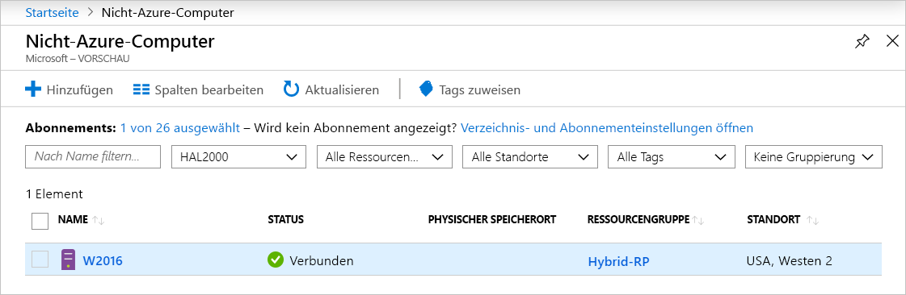
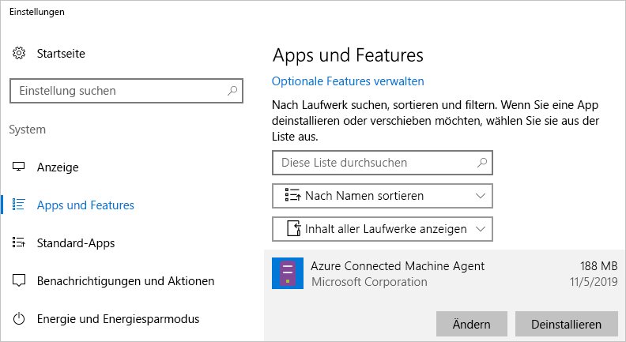

# <a name="quickstart-connect-machines-to-azure-using-azure-arc-for-servers---powershell"></a>Schnellstart: Verbinden von Computern mit Azure mithilfe von Azure Arc für Server – PowerShell

Wenn Sie kein Azure-Abonnement besitzen, können Sie ein [kostenloses Konto](https://azure.microsoft.com/free/?WT.mc_id=A261C142F) erstellen, bevor Sie beginnen.

## <a name="prerequisites"></a>Voraussetzungen

Machen Sie sich in der [Übersicht über Azure Arc für Server](overview.md) mit den unterstützten Clients und der erforderlichen Netzwerkkonfiguration vertraut.

## <a name="create-a-service-principal-for-onboarding-at-scale"></a>Erstellen eines Dienstprinzipals für flexibles Onboarding

Bei einem Dienstprinzipal handelt es sich um eine spezielle eingeschränkte Verwaltungsidentität, der nur die Mindestberechtigung erteilt wird, die erforderlich ist, um Computer mit Azure zu verbinden. Dies ist sicherer als die Verwendung eines Kontos mit mehr Berechtigungen (beispielsweise ein Mandantenadministratorkonto). Der Dienstprinzipal wird nur während des Onboardings verwendet. Nach der Verbindungsherstellung mit den gewünschten Servern kann der Dienstprinzipal problemlos wieder gelöscht werden.

> [!NOTE]
> Dieser Schritt wird zwar empfohlen, ist aber nicht zwingend erforderlich.

### <a name="steps-to-create-the-service-principal"></a>Schritte zum Erstellen des Dienstprinzipals

In diesem Beispiel wird [Azure PowerShell](/powershell/azure/install-az-ps) verwendet, um einen Dienstprinzipalnamen (Service Principal Name, SPN) zu erstellen. Alternativ können für diese Aufgabe auch die unter [Erstellen eines Dienstprinzipals mit dem Azure-Portal](../../active-directory/develop/howto-create-service-principal-portal.md) aufgeführten Schritte ausgeführt werden.

Die Rolle `Azure Connected Machine Onboarding` verfügt nur über die für das Onboarding erforderlichen Berechtigungen. Sie können die Berechtigung eines SPN so definieren, dass sie eine Ressourcengruppe oder ein Abonnement abdeckt.

Die Ausgabe des Cmdlets [`New-AzADServicePrincipal`](/powershell/module/az.resources/new-azadserviceprincipal) muss gespeichert werden, da Sie sonst das in einem späteren Schritt benötigte Kennwort nicht abrufen können.

```azurepowershell-interactive
$sp = New-AzADServicePrincipal -DisplayName "Arc-for-servers" -Role "Azure Connected Machine Onboarding"
$sp
```

```output
Secret                : System.Security.SecureString
ServicePrincipalNames : {ad9bcd79-be9c-45ab-abd8-80ca1654a7d1, https://Arc-for-servers}
ApplicationId         : ad9bcd79-be9c-45ab-abd8-80ca1654a7d1
ObjectType            : ServicePrincipal
DisplayName           : Hybrid-RP
Id                    : 5be92c87-01c4-42f5-bade-c1c10af87758
Type                  :
```

Rufen Sie nun das Kennwort mithilfe von PowerShell ab.

```azurepowershell-interactive
$credential = New-Object pscredential -ArgumentList "temp", $sp.Secret
$credential.GetNetworkCredential().password
```

Kopieren Sie in der Ausgabe das Kennwort (**password**) und die Anwendungs-ID (**ApplicationId**) aus dem vorherigen Schritt, und speichern Sie sie an einem sicheren Ort – beispielsweise im Geheimnisspeicher für Ihr Serverkonfigurationstool. Sollten Sie Ihr SPN-Kennwort vergessen oder verlieren, können Sie es mithilfe des Cmdlets [`New-AzADSpCredential`](/powershell/module/azurerm.resources/new-azurermadspcredential) zurücksetzen.

Für das Onboarding-Skript des Installations-Agents gilt Folgendes:

* Die Eigenschaft **ApplicationId** wird für den Parameter `--service-principal-id` im Installations-Agent verwendet.
* Die Eigenschaft **password** wird für den Parameter `--service-principal-secret` im Installations-Agent verwendet.

## <a name="manually-install-the-agent-and-connect-to-azure"></a>Manuelles Installieren des Agents und Herstellen einer Verbindung mit Azure

In der folgenden Anleitung können Sie einen Computer mit Azure verbinden, indem Sie sich bei dem Computer anmelden und die angegebenen Schritte ausführen. Sie können Computer aber auch [über das Portal](quickstart-onboard-portal.md) mit Azure verbinden.

### <a name="download-and-install-the-agent"></a>Herunterladen und Installieren des Agents

Für die Installation des Agent-Pakets ist Root-Zugriff oder lokaler Administratorzugriff auf den Zielserver, aber kein Azure-Zugriff erforderlich.

#### <a name="linux"></a>Linux

Bei Servern unter **Linux** wird der Agent über das [Paketrepository von Microsoft](https://packages.microsoft.com) unter Verwendung des bevorzugten Paketformats (RPM oder DEB) verteilt.

> [!NOTE]
> Im Rahmen der Public Preview-Phase wurde nur ein einzelnes Paket veröffentlicht. Dieses ist für Ubuntu 16.04 oder 18.04 geeignet.

<!-- What about this aks? -->
Die einfachste Methode besteht darin, das Paketrepository zu registrieren und dann das Paket mithilfe des Paket-Managers der Distribution zu installieren.
Das unter [https://aka.ms/azcmagent](https://aka.ms/azcmagent) verfügbare Bash-Skript führt folgende Aktionen aus:

1. Konfigurieren des Hostcomputers für Downloads von `packages.microsoft.com`
2. Installieren des Hybridressourcenanbieter-Pakets
3. Optional: Konfigurieren des Agents für Proxybetrieb (bei Angabe von `--proxy`)

Das Skript enthält auch Überprüfungen für unterstützte und nicht unterstützte Distributionen sowie für die erforderlichen Installationsberechtigungen.

Im folgenden Beispiel wird der Agent ohne Bedingungsüberprüfungen heruntergeladen und installiert.

```bash
# Download the installation package
wget https://aka.ms/azcmagent -O ~/Install_linux_azcmagent.sh

# Install the connected machine agent. Omit the '--proxy "{proxy-url}"' parameters if proxy is not needed
bash ~/Install_linux_azcmagent.sh--proxy "{proxy-url}"
```

> [!NOTE]
> Wenn Sie keinen Verweis auf das Paketrepository von Microsoft verwenden möchten, können Sie die Paketdatei auch von dort aus in Ihr internes Repository kopieren.

#### <a name="windows"></a>Windows

Für **Windows** ist der Agent in einer Windows Installer-Datei (`.MSI`) verpackt und kann von [https://aka.ms/AzureConnectedMachineAgent](https://aka.ms/AzureConnectedMachineAgent) (gehostet unter [https://download.microsoft.com](https://download.microsoft.com)) heruntergeladen werden.

```powershell
# Download the package
Invoke-WebRequest -Uri https://aka.ms/AzureConnectedMachineAgent -OutFile AzureConnectedMachineAgent.msi

# Install the package
msiexec /i AzureConnectedMachineAgent.msi /l*v installationlog.txt /qn | Out-String
```

> [!NOTE]
> Unter Linux wird bei erneuter Ausführung des Installationsskripts automatisch ein Upgrade auf die neueste Version durchgeführt. Unter Windows müssen Sie den Agent für verbundene Azure-Computer deinstallieren, bevor Sie den Installer erneut ausführen, um ein Upgrade vorzunehmen.

### <a name="connecting-to-azure"></a>Verbindungsherstellung mit Azure

Nach der Installation können Sie den Agent mithilfe des Befehlszeilentools `azcmagent.exe` verwalten und konfigurieren. Der Agent befindet sich unter `/opt/azcmagent/bin` (Linux) bzw. unter `$env:programfiles\AzureConnectedMachineAgent` (Windows).

Unter Windows müssen Sie PowerShell auf einem Zielknoten als Administrator öffnen und Folgendes ausführen:

```powershell
& "$env:ProgramFiles\AzureConnectedMachineAgent\azcmagent.exe" connect `
  --service-principal-id "{your-spn-appid}" `
  --service-principal-secret "{your-spn-password}" `
  --resource-group "{your-resource-group-name}" `
  --tenant-id "{your-tenant-id}" `
  --location "{location-of-your-resource-group}" `
  --subscription-id "{your-subscription-id}"
```

Öffnen Sie unter Linux eine Shell, und führen Sie Folgendes aus:

<!-- Same command for linux?-->
```bash
azcmagent connect \
  --service-principal-id "{your-spn-appid}" \
  --service-principal-secret "{your-spn-password}" \
  --resource-group "{your-resource-group-name}" \
  --tenant-id "{your-tenant-id}" \
  --location "{location-of-your-resource-group}" \
  --subscription-id "{your-subscription-id}"
```

Parameter:

* `tenant-id` : Die Mandanten-GUID. Diese finden Sie im Azure-Portal unter **Azure Active Directory** -> **Eigenschaften** -> **Verzeichnis-ID**.
* `subscription-id` : Die GUID des Abonnements in Azure, unter dem Sie Ihren Computer verbinden möchten.
* `resource-group` : Die Ressourcengruppe, unter der Sie Ihren Computer verbinden möchten.
* `location` : Siehe [Azure-Regionen](https://azure.microsoft.com/global-infrastructure/regions/). Bei diesem Standort kann es sich um den gleichen Standort wie bei der Ressourcengruppe oder um einen anderen Standort handeln. Während der Public Preview-Phase wird der Dienst in **USA, Westen 2** und **Europa, Westen** unterstützt.
* `resource-name` :  (*Optional*) Wird für die Azure-Ressourcendarstellung Ihres lokalen Computers verwendet. Ohne Angabe dieses Werts wird der Hostname des Computers verwendet.

Weitere Informationen zum Tool „azcmagent“ finden Sie in der [Referenz zu „azcmagent“](azcmagent-reference.md).
<!-- Isn't this still needed to view machines? -->

Nach erfolgreichem Abschluss des Vorgangs ist Ihr Computer mit Azure verbunden. Sie können Ihren Computer im Azure-Portal unter [https://aka.ms/hybridmachineportal](https://aka.ms/hybridmachineportal) anzeigen.



### <a name="proxy-server-configuration"></a>Proxyserverkonfiguration

#### <a name="linux"></a>Linux

<!-- New proxy name? -->

Sollte der Server unter **Linux** einen Proxyserver benötigen, haben Sie folgende Möglichkeiten:

* Führen Sie das Skript `install_linux_hybrid_agent.sh` aus dem Abschnitt [Installieren des Agents](#download-and-install-the-agent) mit `--proxy` aus.
* Falls Sie den Agent bereits installiert haben, führen Sie den Befehl `/opt/azcmagent/bin/hybridrp_proxy add https://{proxy-url}:{proxy-port}` aus, um den Proxy zu konfigurieren und den Agent neu zu starten.

#### <a name="windows"></a>Windows

Sollte der Server unter **Windows** einen Proxyserver für den Zugriff auf Internetressourcen benötigen, führen Sie den folgenden Befehl aus, um die Proxyserver-Umgebungsvariable festzulegen. Dadurch kann der Agent den Proxyserver für den Internetzugriff verwenden.

```powershell
# If a proxy server is needed, execute these commands with actual proxy URL
[Environment]::SetEnvironmentVariable("https_proxy", "{https:\\proxy-url:proxyport}", "Machine")
$env:https_proxy = [System.Environment]::GetEnvironmentVariable("https_proxy","Machine")
# The agent service needs to be restarted after the proxy environment variable is set in order for the changes to take effect.
Restart-Service -Name himds
```

> [!NOTE]
> Authentifizierte Proxys werden in der Public Preview-Phase nicht unterstützt.

## <a name="clean-up"></a>Bereinigen

Wenn Sie die Verbindung zwischen einem Computer und Azure Arc für Server trennen möchten, müssen Sie zwei Schritte ausführen:

1. Wählen Sie im [Portal](https://aka.ms/hybridmachineportal) den Computer aus, klicken Sie auf die Auslassungspunkte (`...`), und wählen Sie **Löschen** aus.
1. Deinstallieren Sie den Agent auf dem Computer.

   Unter Windows können Sie den Agent in der Systemsteuerung unter „Apps & Features“ deinstallieren.
  
  

   Wenn Sie ein Skript für die Deinstallation erstellen möchten, können Sie das folgende Beispiel verwenden, das **PackageId** abruft und den Agent mithilfe von `msiexec /X`deinstalliert.

   Suchen Sie unter dem Registrierungsschlüssel `HKEY_LOCAL_MACHINE\Software\Microsoft\Windows\CurrentVersion\Uninstall` nach **PackageId**. Anschließend können Sie den Agent mithilfe von `msiexec` deinstallieren.

   Im folgenden Beispiel wird die Deinstallation des Agents veranschaulicht.

   ```powershell
   Get-ChildItem -Path HKLM:\Software\Microsoft\Windows\CurrentVersion\Uninstall | `
   Get-ItemProperty | `
   Where-Object {$_.DisplayName -eq "Azure Connected Machine Agent"} | `
   ForEach-Object {MsiExec.exe /Quiet /X "$($_.PsChildName)"}
   ```

   Führen Sie unter Linux den folgenden Befehl aus, um den Agent zu deinstallieren.

   ```bash
   sudo apt purge hybridagent
   ```

## <a name="next-steps"></a>Nächste Schritte

> [!div class="nextstepaction"]
> [Schnellstart: Erstellen einer Richtlinienzuweisung zum Identifizieren nicht konformer Ressourcen](../../governance/policy/assign-policy-portal.md)
