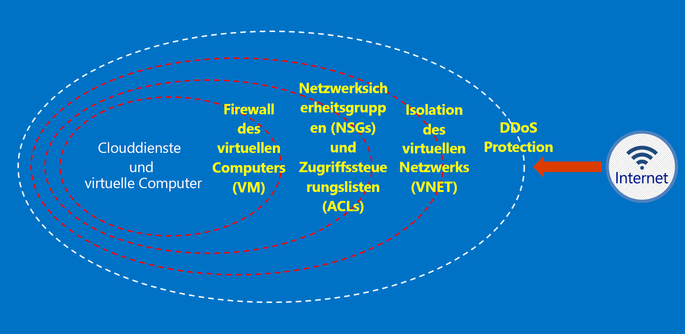

# Was ist Azure Australien?

2014 wurde Azure mit zwei Regionen in Australien eingeführt: „Australien, Osten“ (Sydney) und „Australien, Südosten“ (Melbourne). Im April 2018 kamen mit „Australien, Mitte“ und „Australien, Mitte 2“ zwei neue Regionen hinzu (beide in Canberra). Die Regionen „Australien, Mitte“ und „Australien, Mitte 2“ sind bewusst so konzipiert, dass Sie die Anforderungen von Behörden und kritischer nationaler Infrastruktur erfüllen, und bieten spezielle Konnektivität und Flexibilität, sodass Sie Ihre Systeme abseits der Cloud positionieren und dabei von einem Maß an Sicherheit und Resilienz profitieren können, wie es sonst nur von als geheim eingestuften Netzwerken erwartet wird. Azure Australien ist eine Plattform für die digitale Transformation von Behörden und kritischer nationaler Infrastruktur – und die einzige, in Australien verfügbare unternehmenskritische Cloud, die speziell für diese Anforderungen konzipiert ist.

Die australische Regierung hat spezifische Anforderungen im Hinblick auf die Verbindungsherstellung mit bzw. die Nutzung und Verwendung von [Microsoft Azure Australien](https://azure.microsoft.com/global-infrastructure/australia/) für Daten und Systeme australischer Behörden. Die Ressourcen auf dieser Seite enthalten auch allgemeine Informationen, die für alle Kunden mit spezifischem Fokus auf eine sichere Konfiguration und einen sicheren Betrieb gelten.

Auf der Seite „Australien“ des [Microsoft Service Trust-Portals](https://aka.ms/au-irap) finden Sie aktuelle Informationen zu den IRAP-Bewertungen (Information Security Registered Assessor) für Azure Australien sowie zur Zertifizierung und Aufnahme in die Liste zertifizierter Clouddienste (Certified Cloud Services List, CCSL). Darüber hinaus finden Sie auf der Seite „Australien“ auch andere Microsoft-Ratschläge für Behörden und Anbieter von kritischer Infrastruktur.

## Prinzipien für den Schutz von Kundendaten in Azure Australien

Azure Australien bietet eine Reihe von Features und Diensten zur Erstellung von Cloudlösungen, die Ihre Anforderungen in puncto regulierte/kontrollierte Daten erfüllen. Eine konforme Kundenlösung ist nichts anderes als die effektive Implementierung der standardmäßig verfügbaren Azure Australien-Funktionen, kombiniert mit fundierter Datensicherheit.

Wenn Sie eine Lösung in Azure Australien hosten, nimmt Ihnen Microsoft die Erfüllung zahlreicher Anforderungen auf der Cloudinfrastrukturebene ab.

Das folgende Diagramm zeigt das Defense-in-Depth-Modell von Azure. So bietet Microsoft etwa grundlegenden DDoS-Schutz für die Cloudinfrastruktur sowie Kundenfunktionen wie Sicherheitsappliances oder Premium-DDoS-Dienste für kundenspezifische Anwendungsanforderungen.

In diesen Artikeln werden die grundlegenden Prinzipien für den Schutz Ihrer Dienste und Anwendungen erläutert, und Sie erfahren, wie Sie diese Prinzipien am besten anwenden. Kunden erfahren hier also, wie sie Azure Australien sinnvoll einsetzen, um ihren Verpflichtungen und ihrer Verantwortung im Zusammenhang mit einer Lösung gerecht zu werden, die vertrauliche und geheime Behördeninformationen verarbeitet.

Für australische Behörden, die zu Azure migrieren möchten, stehen zwei Dokumentationskategorien zur Verfügung.

## Sicherheit in Azure Australien

Identität, rollenbasierte Zugriffssteuerung, Datenschutz durch Verschlüsselung und Rechteverwaltung sowie effektive Überwachung und Konfigurationssteuerung sind wichtige Elemente, die Sie implementieren müssen. In diesem Abschnitt finden Sie eine Reihe von Artikeln, in denen die integrierten Funktionen von Azure sowie deren Beziehung zu ISM und ASD Essential 8 erläutert werden.

Auf diese Artikel kann über das Menü unter *Konzepte > Sicherheit in Azure Australien* zugegriffen werden.

## Gateways in Azure Australien

Ein weiterer wichtiger Schritt für Behörden ist die Einrichtung von Funktionen für die Umgebungssicherheit. Diese Funktionen werden als sichere Internetgateways (SIGs) bezeichnet, und bei Verwendung von Azure müssen Sie dafür sorgen, dass diese Schutzmaßnahmen vorhanden sind. Microsoft betreibt zwar kein SIG, durch die Kombination unserer Edgenetzwerkdienste, durch die alle Kunden geschützt werden, und spezifischer Dienste, die innerhalb Ihrer Azure-Umgebung bereitgestellt werden, können Sie jedoch eine gleichwertige Funktion einrichten.

Auf diese Artikel kann über das Menü unter *Konzepte > Gateways in Azure Australien* zugegriffen werden.

## Nächste Schritte

* Wenn Ihr Hauptaugenmerk der Datenschutz in Azure ist, beginnen Sie mit [Data security in Azure Australia](secure-your-data.md) (Datensicherheit in Azure Australien).
* Wenn Ihr Hauptaugenmerk die Erstellung eines Gateways in Azure ist, beginnen Sie mit [Gateway logging, auditing, and visibility in Azure Australia](gateway-log-audit-visibility.md) (Gatewayprotokollierung, -überwachung und -sichtbarkeit in Azure Australien).
