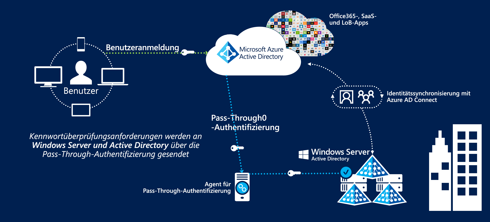
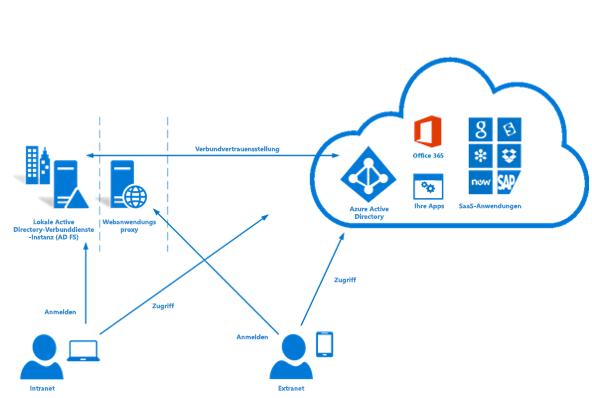

# Identitätsverbund in Azure Australien

Die Implementierung der Identitätsverwaltung und des Identitätsverbunds mit Public Cloud-Angeboten ist einer der wichtigsten ersten Schritte für die Cloudnutzung. Der Azure Active Directory-Dienst von Microsoft speichert Benutzerinformationen, um den Zugriff auf Clouddienste zu ermöglichen, und ist eine Voraussetzung für die Nutzung anderer Azure-Dienste.

In diesem Artikel werden die wichtigsten Entwurfsaspekte für die Implementierung von Azure Active Directory, die Synchronisierung von Benutzern aus einer Active Directory Domain Services-Domäne und die Implementierung einer sicheren Authentifizierung behandelt. Dabei stehen insbesondere die Empfehlungen im Information Security Manual (ISM) sowie in Azure-Zertifizierungsberichten des Australian Cyber Security Centre im Mittelpunkt.

Bei Entwurfsentscheidungen muss die Klassifizierung von in Azure Active Directory gespeicherten Informationen berücksichtigt werden. Der folgende Auszug stammt aus dem [ACSC-Zertifizierungsbericht für Microsoft Azure:](https://aka.ms/au-irap)

>**ACSC-Zertifizierungsbericht für Microsoft Azure** Azure Active Directory (Azure AD) muss mit Active Directory-Verbunddiensten (AD FS) konfiguriert werden, wenn Commonwealth-Entitäten die Verwendung und den Dateninhalt ihrer Active Directory-Instanz als „PROTECTED“ (GESCHÜTZT) klassifizieren. Für Active Directory-Daten mit UDLM-Klassifizierung (UNCLASSIFIED Dissemination Limiting Markings) ist zwar kein Verbund erforderlich, Commonwealth-Entitäten können jedoch trotzdem einen Verbund implementieren, um Risiken im Zusammenhang mit der Dienstbereitstellung von außerhalb Australiens zu mindern.

Daher werden hier in erster Linie zwei Aspekte behandelt: die synchronisierten Informationen und der Mechanismus, mit dem die Benutzer authentifiziert werden.

## Wichtige Entwurfsaspekte

### Benutzersynchronisierung

Bei der Bereitstellung von Azure AD Connect müssen mehrere Entscheidungen hinsichtlich der zu synchronisierten Daten getroffen werden. Azure AD Connect basiert auf Microsoft Identity Manager und verfügt über verschiedene zuverlässige Features zum [Transformieren](https://docs.microsoft.com/azure/active-directory/hybrid/how-to-connect-sync-best-practices-changing-default-configuration) von Daten zwischen Verzeichnissen.

Sie können Microsoft Consulting Services für eine ADRAP-Evaluierung Ihrer vorhandenen Windows Server Active Directory-Instanz in Anspruch nehmen. ADRAP hilft bei der Ermittlung von Problemen, die vor der Synchronisierung mit Azure Active Directory ggf. behoben werden müssen. Dieser Service ist im Allgemeinen in Microsoft Azure Premier Support-Vereinbarungen enthalten.

Das [IdFix-Tool](https://docs.microsoft.com/office365/enterprise/install-and-run-idfix) überprüft Ihre lokale Active Directory-Domäne vor der Synchronisierung mit Azure AD auf Probleme. Die Verwendung von IdFix ist ein wichtiger erster Schritt vor der Implementierung von Azure AD Connect. Bei einer Überprüfung mit IdFix werden zwar unter Umständen zahlreiche Probleme erkannt, viele davon lassen sich jedoch schnell mithilfe von Skripts beheben oder mithilfe von Datentransformationen in Azure AD Connect umgehen.

Azure AD setzt voraus, dass Benutzer über eine Domäne der obersten Ebene verfügen, die extern geroutet werden kann, um die Authentifizierung zu ermöglichen. Falls Ihre Domäne über ein UPN-Suffix verfügt, das nicht extern geroutet werden kann, müssen Sie in AD Connect die [alternative Anmelde-ID](https://docs.microsoft.com/azure/active-directory/hybrid/plan-connect-userprincipalname) für das E-Mail-Attribut des Benutzers festlegen. Benutzer melden sich dann nicht mit ihrer Domänenanmeldung bei Azure-Diensten an, sondern mit ihrer E-Mail-Adresse.

Das UPN-Suffix für Benutzerkonten kann auch mithilfe von Tools wie PowerShell geändert werden. Dies kann jedoch unvorhergesehene Auswirkungen auf andere verbundene Systeme haben und wird nicht mehr als bewährte Methode betrachtet.

Bei der Entscheidung, welche Attribute mit Azure Active Directory synchronisiert werden sollen, ist es am sichersten, davon auszugehen, dass alle Attribute erforderlich sind. Es ist selten, dass ein Verzeichnis tatsächlich geschützte Daten enthält. Dennoch empfiehlt es sich, eine Überprüfung durchzuführen. Sollten in dem Verzeichnis geschützte Daten gefunden werden, bewerten Sie die Auswirkungen, die sich durch Weglassen oder Transformieren des Attributs ergeben. Als Orientierungshilfe steht eine Liste mit Attributen zur Verfügung, die für Microsoft Cloud Services [erforderlich](https://docs.microsoft.com/azure/active-directory/hybrid/reference-connect-sync-attributes-synchronized) sind.

### Authentifizierung

Es ist wichtig zu verstehen, welche Optionen verfügbar sind und wie sie verwendet werden können, um Endbenutzer zu schützen.
Microsoft bietet [drei native Lösungen](https://docs.microsoft.com/azure/active-directory/hybrid/plan-connect-user-signin) für die Benutzerauthentifizierung mit Azure Active Directory:

* Kennworthashsynchronisierung: Die gehashten Kennwörter aus Active Directory Domain Services werden durch Azure AD Connect in Azure Active Directory synchronisiert.
* [Passthrough-Authentifizierung:](https://docs.microsoft.com/azure/active-directory/hybrid/how-to-connect-pta) Die Kennwörter bleiben in Active Directory Domain Services. Benutzer werden über einen Agent bei Active Directory Domain Services authentifiziert. In Azure AD werden keine Kennwörter gespeichert.
* [Verbund-SSO:](https://docs.microsoft.com/azure/active-directory/hybrid/how-to-connect-fed-whatis) Zwischen Azure Active Directory und den Active Directory-Verbunddiensten (AD FS) wird ein Verbund eingerichtet, und bei der Anmeldung werden Benutzer zur Authentifizierung an die Active Directory-Verbunddienste (AD FS) weitergeleitet. In Azure AD werden keine Kennwörter gespeichert.

Die Kennworthashsynchronisierung kann in Szenarien verwendet werden, in denen Daten bis zum Typ „OFFICIAL:Sensitive" im Verzeichnis gespeichert werden. In Szenarien, in denen geschützte Daten gespeichert werden, muss eine der beiden anderen Optionen verwendet werden.

Alle drei Optionen unterstützen das Feature [Kennwortrückschreiben](https://docs.microsoft.com/azure/active-directory/authentication/concept-sspr-writeback), das gemäß den Empfehlungen im [ACSC Consumer Guide](https://aka.ms/au-irap) deaktiviert werden sollte. Organisationen müssen allerdings das Risiko der Deaktivierung des Kennwortrückschreibens gegen Produktivitätssteigerungen und den geringeren Supportaufwand durch die Verwendung von Self-Service-Kennwortzurücksetzung abwägen.

#### Passthrough-Authentifizierung (PTA)

Die Passthrough-Authentifizierung wurde nach Abschluss der IRAP-Bewertung veröffentlicht und muss daher individuell evaluiert werden, um zu bestimmen, wie die Lösung in das Risikoprofil Ihrer Organisation passt. Die Passthrough-Authentifizierung wird aus Sicherheitsgründen dem Microsoft-Verbund vorgezogen.

Im Zusammenhang mit der Passthrough-Authentifizierung müssen verschiedene Entwurfsaspekte berücksichtigt werden:

* Der Passthrough-Authentifizierungs-Agent muss ausgehende Verbindungen mit Microsoft Cloud Services herstellen können.
* Installieren Sie mehrere Agents, um sicherzustellen, dass der Dienst hochverfügbar ist. Es empfiehlt sich, zwischen drei und 12 Agents bereitzustellen.
* Der Agent sollte nicht direkt auf einem Active Directory-Domänencontroller installiert werden. Wenn Sie Azure AD Connect mit Passthrough-Authentifizierung bereitstellen, wird der Agent standardmäßig auf dem AD Connect-Server installiert.
* Die Passthrough-Authentifizierung ist wartungsfreundlicher als Active Directory-Verbunddienste (AD FS), da sie keine dedizierte Serverinfrastruktur, keine Zertifikatverwaltung und keine eingehenden Firewallregeln erfordert.

#### Active Directory-Verbunddienste (AD FS)

Active Directory-Verbunddienste (AD FS) wurden in die IRAP-Bewertung einbezogen und sind für die Verwendung in geschützten Umgebungen zugelassen.

Im Zusammenhang mit Active Directory-Verbunddiensten (AD FS) müssen verschiedene Entwurfsaspekte berücksichtigt werden:

* Für Verbunddienste ist eingehender HTTPS-Netzwerkdatenverkehr aus dem Internet (oder wenigstens von Dienstendpunkten von Microsoft) erforderlich.
* Verbunddienste nutzen PKI und Zertifikate, was mit kontinuierlichem Verwaltungs- und Verlängerungsaufwand verbunden ist.
* Verbunddienste müssen auf dedizierten Servern bereitgestellt werden und benötigt eine entsprechende Netzwerkinfrastruktur, um sichere externe Zugriffe zu ermöglichen.

### Multi-Factor Authentication (MFA)

Im ISM-Abschnitt zur mehrstufigen Authentifizierung wird eine Implementierung des Features in folgenden Szenarien empfohlen (abhängig von Ihrem Risikoprofil):

* Authentifizierung von Standardbenutzern
* Authentifizierung privilegierter Konten
* Authentifizierung des Remotezugriffs von Benutzern
* Benutzer, die privilegierte Aktionen ausführen

Die mehrstufige Authentifizierung von Azure Active Directory kann für alle Benutzer oder für eine Teilmenge von Benutzern (beispielsweise nur für privilegierte Konten) aktiviert werden. Microsoft bietet auch eine Lösung namens „Bedingter Zugriff“, die eine präzisere Steuerung der mehrstufigen Authentifizierung ermöglicht, sodass sie beispielsweise nur angewendet wird, wenn Benutzer sich von Remote-IP-Adressbereichen anmelden.

Azure Multi-Factor Authentication unterstützt die folgenden ISM-konformen Validierungsmethoden:

* Telefonanruf
* SMS
* Microsoft Authenticator-Anwendung
* Unterstützte Hardwaretoken

Privileged Identity Management, eine Komponente von Azure Active Directory, kann verwendet werden, um die Verwendung der mehrstufigen Authentifizierung zu erzwingen, wenn Benutzer ihre Berechtigungen erhöhen, um die vierte Empfehlung zu erfüllen.

## Nächste Schritte

Lesen Sie den Artikel zu [rollenbasierter Zugriffssteuerung und Privileged Identity Management](role-privileged.md).
