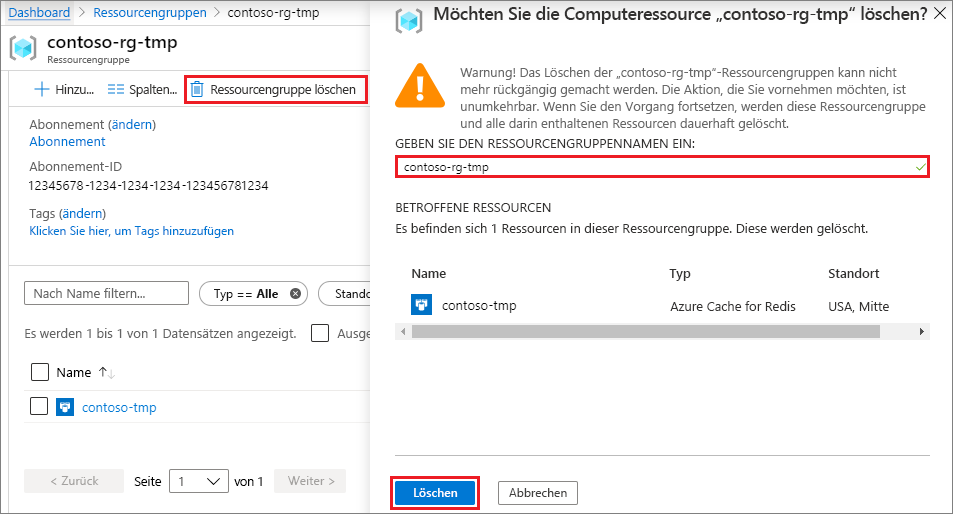

# <a name="quickstart-create-a-python-app-that-uses-azure-cache-for-redis"></a>Schnellstart: Erstellen einer Python-App, die Azure Cache for Redis verwendet

In diesem Artikel integrieren Sie Azure Cache for Redis in eine Python-App, um Zugriff auf einen sicheren, dedizierten Cache zu erhalten, der von jeder Anwendung in Azure aus zugänglich ist.

## <a name="prerequisites"></a>Voraussetzungen

- Azure-Abonnement – [Erstellen eines kostenlosen Kontos](https://azure.microsoft.com/free/)
- [Python 2 oder 3](https://www.python.org/downloads/)

## <a name="create-an-azure-cache-for-redis-instance"></a>Erstellen einer Azure Cache for Redis-Instanz
[!INCLUDE [redis-cache-create](../../includes/redis-cache-create.md)]

[!INCLUDE [redis-cache-create](../../includes/redis-cache-access-keys.md)]

## <a name="install-redis-py"></a>Installieren von redis-py

[Redis-py](https://github.com/andymccurdy/redis-py) ist eine Python-Schnittstelle für Azure Cache for Redis. Verwenden Sie das Python-Pakettool *pip* an einer Eingabeaufforderung, um das Paket *redis-py* zu installieren. 

Im folgenden Beispiel wird *pip3* für Python 3 an einer Administrator-Eingabeaufforderung verwendet, um *redis-py* unter Windows 10 zu installieren.


## <a name="read-and-write-to-the-cache"></a>Lese- und Schreibvorgänge für den Cache

Führen Sie Python über die Befehlszeile aus, und testen Sie den Cache mit dem folgenden Code. Ersetzen Sie `<Your Host Name>` und `<Your Access Key>` durch die Werte für Ihre Azure Cache for Redis-Instanz. Der Hostname hat das Format *\<DNS-Name>.redis.cache.windows.net*.

```python
>>> import redis
>>> r = redis.StrictRedis(host='<Your Host Name>',
        port=6380, db=0, password='<Your Access Key>', ssl=True)
>>> r.set('foo', 'bar')
True
>>> r.get('foo')
b'bar'
```

> [!IMPORTANT]
> Für Azure Cache for Redis ab Version 3.0 wird SSL-Zertifikatüberprüfung erzwungen. Beim Herstellen der Verbindung mit Azure Cache for Redis muss „ssl_ca_certs“ explizit festgelegt werden. Im Fall von Red Hat Linux befindet sich „ssl_ca_certs“ im Zertifikatsmodul */etc/pki/tls/certs/ca-bundle.crt*.

## <a name="create-a-python-sample-app"></a>Erstellen einer Python-Beispiel-App

Erstellen Sie eine neue Textdatei, fügen Sie das folgende Skript hinzu, und speichern Sie die Datei als *PythonApplication1.py*. Ersetzen Sie `<Your Host Name>` und `<Your Access Key>` durch die Werte für Ihre Azure Cache for Redis-Instanz. Der Hostname hat das Format *\<DNS-Name>.redis.cache.windows.net*.

```python
import redis

myHostname = "<Your Host Name>"
myPassword = "<Your Access Key>"

r = redis.StrictRedis(host=myHostname, port=6380,
                      password=myPassword, ssl=True)

result = r.ping()
print("Ping returned : " + str(result))

result = r.set("Message", "Hello!, The cache is working with Python!")
print("SET Message returned : " + str(result))

result = r.get("Message")
print("GET Message returned : " + result.decode("utf-8"))

result = r.client_list()
print("CLIENT LIST returned : ")
for c in result:
    print("id : " + c['id'] + ", addr : " + c['addr'])
```

Führen Sie *PythonApplication1.py* mit Python aus. Die angezeigten Ergebnisse sollten ähnlich wie das folgende Beispiel aussehen:


## <a name="clean-up-resources"></a>Bereinigen von Ressourcen

Wenn Sie die Azure-Ressourcengruppe und die Ressourcen, die Sie in diesem Schnellstart erstellt haben, nicht mehr benötigen, löschen Sie sie, um weitere Kosten zu vermeiden.

> [!IMPORTANT]
> Das Löschen einer Ressourcengruppe kann nicht rückgängig gemacht werden. Die Ressourcengruppe und alle darin enthaltenen Ressourcen werden also dauerhaft gelöscht. Wenn Sie Ihre Azure Cache for Redis-Instanz in einer vorhandenen Ressourcengruppe erstellt haben, die Sie beibehalten möchten, können Sie einfach den Cache löschen, indem Sie auf der Seite **Übersicht** des Caches **Löschen** auswählen. 

So löschen Sie die Ressourcengruppe und die Azure Cache for Redis-Instanz

1. Suchen Sie im [Azure-Portal](https://portal.azure.com) nach **Ressourcengruppen**, und wählen Sie die Option aus.
1. Geben Sie im Textfeld **Nach Name filtern** den Namen der Ressourcengruppe mit Ihrer Cache-Instanz ein, und wählen Sie sie dann in den Suchergebnissen aus. 
1. Wählen Sie auf der Seite für die Ressourcengruppe die Option **Ressourcengruppe löschen** aus.
1. Geben Sie den Ressourcengruppennamen ein, und wählen Sie dann **Löschen** aus.
   
   

## <a name="next-steps"></a>Nächste Schritte

> [!div class="nextstepaction"]
> [Erstellen einer einfachen ASP.NET-Web-App, die eine Azure Cache for Redis-Instanz verwendet](./cache-web-app-howto.md)

