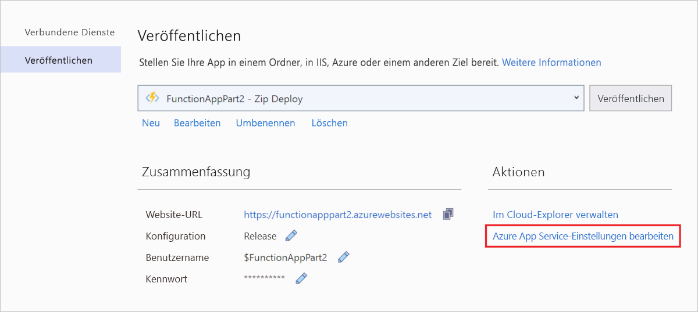

# <a name="connect-functions-to-azure-storage-using-visual-studio"></a>Verbinden von Funktionen mit Azure Storage mithilfe von Visual Studio

[!INCLUDE [functions-add-storage-binding-intro](../../includes/functions-add-storage-binding-intro.md)]

In diesem Artikel wird beschrieben, wie Sie die Funktion, die Sie im [Vorheriger Schnellstartartikel] erstellt haben, mithilfe von Visual Studio mit Azure Storage verbinden. Die Ausgabebindung, die Sie dieser Funktion hinzufügen, schreibt Daten aus der HTTP-Anforderung in eine Nachricht in einer Azure Queue Storage-Warteschlange. 

Die meisten Bindungen erfordern eine gespeicherte Verbindungszeichenfolge, die Functions verwendet, um auf den gebundenen Dienst zuzugreifen. Um dies zu vereinfachen, verwenden Sie das Speicherkonto, das Sie mit Ihrer Funktions-App erstellt haben. Die Verbindung mit diesem Konto ist bereits in einer App-Einstellung namens `AzureWebJobsStorage` gespeichert.  

## <a name="prerequisites"></a>Voraussetzungen

Bevor Sie mit diesem Artikel beginnen, sind folgende Schritte erforderlich: 

 - Absolvieren Sie [Teil 1 der Visual Studio-Schnellstartanleitung][./functions-create-first-function-vs-code.md]. 

- Melden Sie sich über Visual Studio bei Ihrem Azure-Abonnement an.

## <a name="download-the-function-app-settings"></a>Herunterladen der Funktions-App-Einstellungen

Im [vorherigen Schnellstartartikel](functions-create-first-function-vs-code.md) haben Sie zusammen mit dem erforderlichen Storage-Konto eine Funktions-App in Azure erstellt. Die Verbindungszeichenfolge für dieses Konto wird sicher in App-Einstellungen in Azure gespeichert. In diesem Artikel schreiben Sie Nachrichten in eine Speicherwarteschlange in demselben Konto. Um bei der lokalen Ausführung der Funktion eine Verbindung mit Ihrem Storage-Konto herzustellen, müssen Sie App-Einstellungen in die Datei *local.settings.json* herunterladen. 

1. Klicken Sie im **Projektmappen-Explorer** mit der rechten Maustaste auf das Projekt, und wählen Sie **Veröffentlichen** aus. 

1. Wählen Sie unter **Aktionen** die Option **Azure App Service-Einstellungen bearbeiten**. 

    

1. Kopieren Sie unter **AzureWebJobsStorage** den Zeichenfolgenwert **Remote** in das Feld **Lokal**, und wählen Sie dann **OK** aus. 

Die Speicherbindung, die für die Verbindung die Einstellung `AzureWebJobsStorage` verwendet, kann nun bei lokaler Ausführung eine Verbindung mit Ihrer Queue Storage-Instanz herstellen.

## <a name="register-binding-extensions"></a>Registrieren von Bindungserweiterungen

Da Sie eine Queue Storage-Ausgabebindung verwenden, müssen Sie vor dem Ausführen des Projekts die Storage-Bindungserweiterung installieren. Mit Ausnahme von HTTP- und Timertriggern werden Bindungen als Erweiterungspakete implementiert. 

1. Wählen Sie im Menü **Extras** die Optionen **NuGet-Paket-Manager** > **Paket-Manager-Konsole** aus. 

1. Fügen Sie in der Konsole den folgenden Befehl [Install-Package](/nuget/tools/ps-ref-install-package) aus, um die Storage-Erweiterungen zu installieren:

    ```Command
    Install-Package Microsoft.Azure.WebJobs.Extensions.Storage -Version 3.0.6
    ````

Dann können Sie dem Projekt die Storage-Ausgabebindung hinzufügen.

## <a name="add-an-output-binding"></a>Hinzufügen einer Ausgabebindung

[!INCLUDE [functions-add-storage-binding-csharp-library](../../includes/functions-add-storage-binding-csharp-library.md)]

## <a name="add-code-that-uses-the-output-binding"></a>Hinzufügen von Code, der die Ausgabebindung verwendet

Nachdem die Bindung definiert wurde, können Sie den `name` der Bindung verwenden, um auf sie als Attribut in der Funktionssignatur zuzugreifen. Durch die Verwendung einer Ausgabebindung müssen Sie weder den Azure Storage-SDK-Code für die Authentifizierung verwenden, noch einen Warteschlangenverweis abrufen oder Daten schreiben. Die Functions-Runtime und die Warteschlangenausgabebindung übernehmen diese Aufgaben für Sie.

[!INCLUDE [functions-add-storage-binding-csharp-library-code](../../includes/functions-add-storage-binding-csharp-library-code.md)]

## <a name="run-the-function-locally"></a>Lokales Ausführen der Funktion

[!INCLUDE [functions-run-function-test-local-vs](../../includes/functions-run-function-test-local-vs.md)]

Eine neue Warteschlange mit dem Namen `outqueue` wird in Ihrem Speicherkonto von der Functions-Runtime erstellt, wenn die Ausgabebindung zum ersten Mal verwendet wird. Mit dem Cloud-Explorer überprüfen Sie, ob die Warteschlange zusammen mit der neuen Nachricht erstellt wurde.

## <a name="examine-the-output-queue"></a>Überprüfen der Ausgabewarteschlange

1. Öffnen Sie in Visual Studio im Menü **Ansicht** die Option **Cloud-Explorer**.

1. Erweitern Sie im **Cloud-Explorer** Ihr Azure-Abonnement und **Speicherkonten** und anschließend das von Ihrer Funktion verwendete Speicherkonto. Den Namen des Speicherkontos finden Sie in der Datei *local.settings.json* in der Verbindungszeichenfolge`AzureWebJobsStorage`.  

1. Erweitern Sie den Knoten **Warteschlangen**, und doppelklicken Sie anschließend auf die Warteschlange namens **outqueue**, um die Inhalte der Warteschlange in Visual Studio anzuzeigen. 

   Die Warteschlange enthält die Meldung, die die Warteschlangen-Ausgabebindung erstellt hat, als Sie die per HTTP ausgelöste Funktion ausgeführt haben. Wenn Sie die Funktion mit dem `name`-Standardwert *Azure* aufgerufen haben, lautet die Warteschlangenmeldung *Name passed to the function: Azure* (An die Funktion übergebener Name: Azure).

    

1. Führen Sie die Funktion erneut aus, und senden Sie eine andere Anforderung. Daraufhin wird eine neue Nachricht in der Warteschlange angezeigt.  

Nun ist es an der Zeit, die aktualisierte Funktions-App erneut in Azure zu veröffentlichen.

## <a name="redeploy-and-verify-the-updated-app"></a>Erneutes Bereitstellen und Überprüfen der aktualisierten App

1. Klicken Sie im **Projektmappen-Explorer** mit der rechten Maustaste auf das Projekt, und wählen Sie **Veröffentlichen** und anschließend **Veröffentlichen** aus, um das Projekt erneut in Azure zu veröffentlichen.

1. Nach Abschluss der Bereitstellung können Sie die erneut bereitgestellte Funktion wieder in einem Browser testen. Fügen Sie wie zuvor die Abfragezeichenfolge `&name=<yourname>` an die URL an.

1. [Zeigen Sie wieder die Nachricht in der Speicherwarteschlange an](#examine-the-output-queue), um zu überprüfen, ob die Ausgabebindung erneut eine neue Nachricht in der Warteschlange generiert.

## <a name="clean-up-resources"></a>Bereinigen von Ressourcen

[!INCLUDE [Clean-up resources](../../includes/functions-quickstart-cleanup.md)]

## <a name="next-steps"></a>Nächste Schritte

Sie haben Ihre mittels HTTP ausgelöste Funktion so aktualisiert, dass sie Daten in eine Speicherwarteschlange schreibt. Weitere Informationen zur Entwicklung von Functions finden Sie unter [Entwickeln von Azure Functions mithilfe von Visual Studio](functions-develop-vs.md).

Als Nächstes sollten Sie die Application Insights-Überwachung für Ihre Funktions-App aktivieren:

> [!div class="nextstepaction"]
> [Aktivieren der Application Insights-Integration](functions-monitoring.md#manually-connect-an-app-insights-resource)

[Azure Storage Explorer]: https://storageexplorer.com/
[Vorheriger Schnellstartartikel]: functions-create-your-first-function-visual-studio.md
