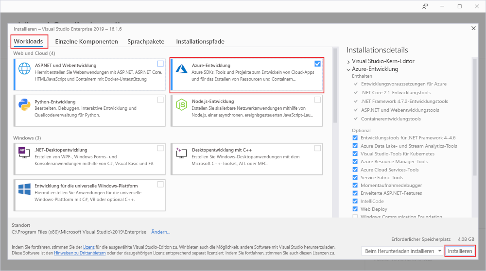

# Erstellen Ihrer ersten Funktion mit Visual Studio

Mit Azure Functions können Sie Code in einer [serverlosen](https://azure.microsoft.com/solutions/serverless/) Umgebung ausführen, ohne vorher eine VM erstellen oder eine Webanwendung veröffentlichen zu müssen.

In diesem Artikel erfahren Sie, wie Sie mit Visual Studio 2019 eine Funktion vom Typ „hello world“ lokal erstellen und testen und anschließend in Azure veröffentlichen. Diese Schnellstartanleitung gilt für Visual Studio 2019. Wenn Sie ein Functions-Projekt mit Visual Studio 2017 erstellen, müssen Sie zuerst die [aktuellen Azure Functions-Tools](functions-develop-vs.md#check-your-tools-version) installieren.

## Voraussetzungen

Für dieses Tutorial müssen Sie zunächst [Visual Studio 2019](https://azure.microsoft.com/downloads/) installieren. Vergewissern Sie sich, dass auch die Workload **Azure-Entwicklung** installiert ist.

[!INCLUDE [quickstarts-free-trial-note](../../includes/quickstarts-free-trial-note.md)]

## Erstellen eines Funktionen-App-Projekts

[!INCLUDE [Create a project using the Azure Functions template](../../includes/functions-vstools-create.md)]

Visual Studio erstellt ein Projekt und eine Klasse mit Codebausteinen für den Funktionstyp „HTTP-Trigger“. Mit dem Attribut `FunctionName` der Methode wird der Name der Funktion festgelegt. Der Standardname lautet `HttpTrigger`. Mit dem Attribut `HttpTrigger` wird angegeben, dass die Funktion von einer HTTP-Anforderung ausgelöst wird. Mit Code in den Codebausteinen wird eine HTTP-Antwort gesendet, die einen Wert aus dem Anforderungstext oder der Abfragezeichenfolge enthält.

Sie können die Funktionalität Ihrer Funktion mithilfe von Eingabe- und Ausgabebindungen erweitern, indem Sie die geeigneten Attribute auf die Methode anwenden. Weitere Informationen finden Sie im Abschnitt [Trigger und Bindungen](functions-dotnet-class-library.md#triggers-and-bindings) in der [C#-Entwicklerreferenz zu Azure Functions](functions-dotnet-class-library.md).

Nachdem Sie nun Ihr Funktionsprojekt und eine Funktion mit HTTP-Trigger erstellt haben, können Sie sie auf Ihrem lokalen Computer testen.

## Lokales Ausführen der Funktion

Visual Studio wird in Azure Functions Core Tools integriert, sodass Sie Ihre Funktionen mithilfe der vollständigen Functions-Runtime lokal testen können.  

[!INCLUDE [functions-run-function-test-local-vs](../../includes/functions-run-function-test-local-vs.md)]

Nachdem Sie sichergestellt haben, dass die Funktion auf Ihrem lokalen Computer richtig ausgeführt wird, können Sie das Projekt in Azure veröffentlichen.

## Veröffentlichen des Projekts in Azure

Sie müssen in Ihrem Azure-Abonnement über eine Funktions-App verfügen, bevor Sie Ihr Projekt veröffentlichen können. Bei der Veröffentlichung in Visual Studio wird eine Funktions-App für Sie erstellt, wenn Sie das Projekt zum ersten Mal veröffentlichen.

[!INCLUDE [Publish the project to Azure](../../includes/functions-vstools-publish.md)]

## Testen der Funktion in Azure

1. Kopieren Sie die Basis-URL der Funktions-App von der Seite „Veröffentlichungsprofil“. Ersetzen Sie den Teil `localhost:port` der URL, die Sie beim lokalen Testen der Funktion verwendet haben, durch die neue Basis-URL. Stellen Sie wie zuvor sicher, dass Sie die Abfragezeichenfolge `?name=<YOUR_NAME>` an diese URL anhängen und die Anforderung ausführen.

    Die URL, über die Ihre per HTTP ausgelöste Funktion aufgerufen wird, sollte das folgende Format haben:

        http://<APP_NAME>.azurewebsites.net/api/<FUNCTION_NAME>?name=<YOUR_NAME> 

2. Fügen Sie diese neue URL für die HTTP-Anforderung in die Adresszeile des Browsers ein. Hier ist die Antwort des Browsers auf die von der Funktion zurückgegebene GET-Remoteanforderung abgebildet:

    

## Nächste Schritte

Sie haben Visual Studio genutzt, um eine C#-Funktions-App in Azure mit einer einfachen Funktion zu erstellen und zu veröffentlichen, die per HTTP ausgelöst wird. Weitere Informationen zum Entwickeln von Funktionen als .NET-Klassenbibliotheken finden Sie unter [C#-Entwicklerreferenz zu Azure Functions](functions-dotnet-class-library.md).

> [!div class="nextstepaction"]
> [Hinzufügen einer Azure Storage-Warteschlangenbindung zu Ihrer Funktion](functions-add-output-binding-storage-queue-vs.md)
