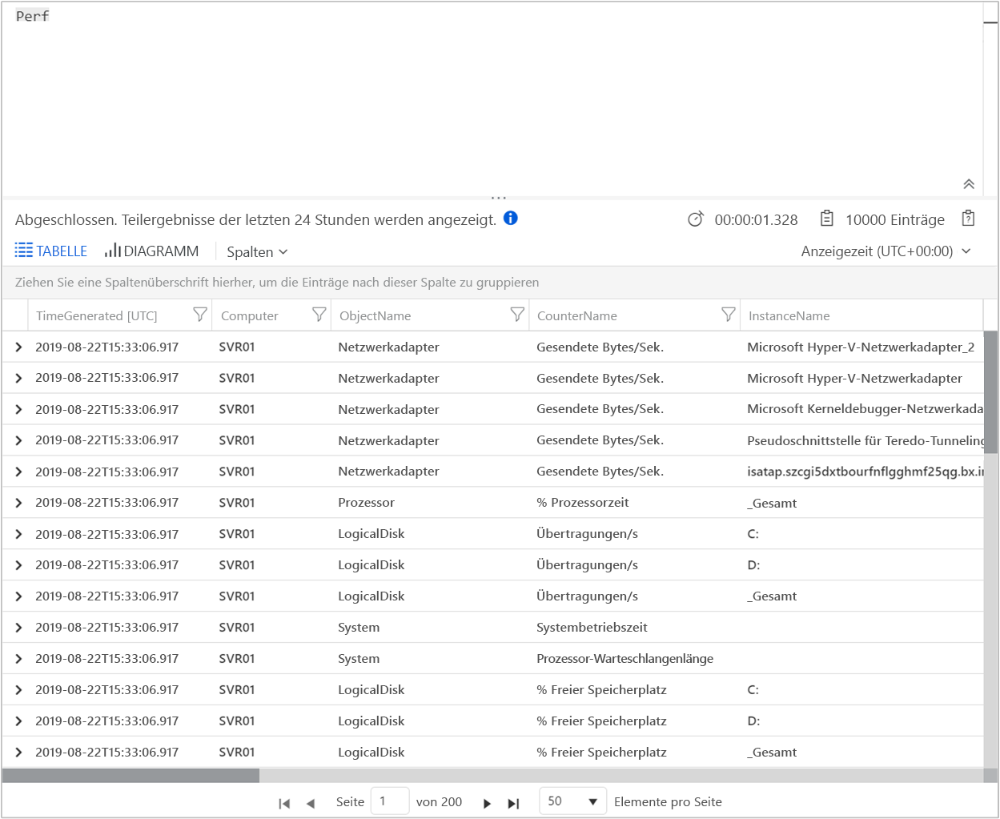

# Sammeln von Daten von einem virtuellen Azure-Computer mit Azure Monitor

[Azure Monitor](../overview.md) kann Daten direkt von Ihren virtuellen Azure-Computern zur detaillierten Analyse und Korrelation in einem Log Analytics-Arbeitsbereich sammeln. Wenn Sie die Log Analytics-VM-Erweiterung für [Windows](../../virtual-machines/extensions/oms-windows.md) und [Linux](../../virtual-machines/extensions/oms-linux.md) installieren, kann Azure Monitor Daten von Ihren virtuellen Azure-Computern sammeln. Diese Schnellstartanleitung zeigt Ihnen, wie Sie mit der VM-Erweiterung in wenigen einfachen Schritten Daten von Ihren Azure-Linux-VMs oder Azure-Windows-VMs konfigurieren und sammeln.  
 
Dieser Schnellstart setzt voraus, dass Sie über einen virtuellen Azure-Computer verfügen. Wenn nicht, können Sie mit unseren VM-Schnellstarts [eine Windows-VM erstellen](../../virtual-machines/windows/quick-create-portal.md) oder [eine Linux-VM erstellen](../../virtual-machines/linux/quick-create-cli.md).

## Anmelden beim Azure-Portal

Melden Sie sich unter [https://portal.azure.com](https://portal.azure.com) beim Azure-Portal an. 

## Erstellen eines Arbeitsbereichs

1. Wählen Sie im Azure-Portal **Alle Dienste** aus. Geben Sie in der Liste mit den Ressourcen **Log Analytics** ein. Sobald Sie mit der Eingabe beginnen, wird die Liste auf der Grundlage Ihrer Eingabe gefiltert. Wählen Sie **Log Analytics-Arbeitsbereiche** aus.

       

2. Wählen Sie die Option **Erstellen** und anschließend Optionen für die folgenden Elemente aus:

   * Geben Sie einen Namen für den neuen **Log Analytics-Arbeitsbereich** ein, z.B. *DefaultLAWorkspace*.  
   * Wählen Sie ein **Abonnement** aus, mit dem eine Verknüpfung erstellt werden soll, indem Sie in der Dropdownliste einen anderen Eintrag auswählen, falls der Standardeintrag nicht geeignet ist.
   * Wählen Sie für **Ressourcengruppe** eine vorhandene Ressourcengruppe aus, die einen oder mehrere virtuelle Azure-Computer enthält.  
   * Wählen Sie den **Speicherort** für die Bereitstellung Ihrer virtuellen Computer aus.  Weitere Informationen finden Sie auf der Seite zur [Verfügbarkeit von Log Analytics in den einzelnen Regionen](https://azure.microsoft.com/regions/services/).
   * Wenn Sie einen Arbeitsbereich in einem neuen Abonnement erstellen, das nach dem 2. April 2018 erstellt wurde, wird automatisch der Tarif *Pro GB* verwendet. In diesem Fall ist keine Tarifauswahloption verfügbar.  Wenn Sie einen Arbeitsbereich für ein Abonnement erstellen, das vor dem 2. April erstellt oder mit einer vorhandenen EA-Registrierung verknüpft wurde, wählen Sie Ihren bevorzugten Tarif aus.  Weitere Informationen zu den einzelnen Tarifen finden Sie unter [Log Analytics – Preise](https://azure.microsoft.com/pricing/details/log-analytics/).
  
         

3. Wählen Sie nach dem Bereitstellen der erforderlichen Informationen im Bereich **Log Analytics-Arbeitsbereich** die Option **OK** aus.  

Die Informationen werden überprüft, und der Arbeitsbereich wird erstellt. Sie können den Fortschritt im Menü unter **Benachrichtigungen** nachverfolgen. 

## Aktivieren der Log Analytics-VM-Erweiterung

[!INCLUDE [log-analytics-agent-note](../../../includes/log-analytics-agent-note.md)] 

Für bereits in Azure bereitgestellte Windows- und Linux-VMs installieren Sie den Log Analytics-Agent mit Log Analytics-VM-Erweiterung. Die Verwendung der Erweiterung vereinfacht den Installationsvorgang. Außerdem wird der Agent zum Senden von Daten an den angegebenen Log Analytics-Arbeitsbereich automatisch konfiguriert. Der Agent wird bei Veröffentlichung einer neuen Version auch automatisch aktualisiert, damit Sie immer über die neuesten Features und Fixes verfügen. Überprüfen Sie vor dem Fortfahren, ob der virtuelle Computer ausgeführt wird. Andernfalls wird der Vorgang nicht abgeschlossen.  

>[!NOTE]
>Der Log Analytics-Agent für Linux kann nicht für die Berichterstattung für mehrere Log Analytics-Arbeitsbereiche konfiguriert werden. 

1. Wählen Sie links oben im Azure-Portal **Alle Dienste** aus. Geben Sie in der Liste mit den Ressourcen **Log Analytics** ein. Sobald Sie mit der Eingabe beginnen, wird die Liste auf der Grundlage Ihrer Eingabe gefiltert. Wählen Sie **Log Analytics-Arbeitsbereiche** aus.

2. Wählen Sie in der Liste der Log Analytics-Arbeitsbereiche den zuvor erstellten *DefaultLAWorkspace*.

3. Wählen Sie im linken Menü unter „Arbeitsbereichsdatenquellen“ die Option **Virtuelle Computer** aus.  

4. Wählen Sie in der Liste **Virtuelle Computer** einen virtuellen Computer aus, auf dem Sie den Agent installieren möchten. Beachten Sie, dass der **Log Analytics-Verbindungsstatus** für den virtuellen Computer **Nicht verbunden** lautet.

5. Klicken Sie in den Details Ihres virtuellen Computers auf **Verbinden**. Der Agent wird automatisch installiert und für den Log Analytics-Arbeitsbereich konfiguriert. Dieser Vorgang dauert einige Minuten. Während dieses Zeitraums wird **Verbindung wird hergestellt...** als **Status** angezeigt.

6. Nachdem der Agent installiert und verbunden wurde, ändert sich der **Log Analytics-Verbindungsstatus** in **Dieser Arbeitsbereich**.

## Sammeln von Ereignis- und Leistungsdaten

Azure Monitor kann Ereignisse aus den Windows-Ereignisprotokollen oder Linux-Syslog und Leistungsindikatoren sammeln, die Sie für längerfristige Analysen und Berichte angeben, und Maßnahmen einleiten, wenn eine bestimmte Bedingung erkannt wird. Führen Sie diese Schritte aus, um die Sammlung von Ereignissen aus dem Systemprotokoll von Windows und Linux Syslog sowie mehreren allgemeinen Leistungsindikatoren zu konfigurieren.  

### Datensammlung auf Windows-VM

1. Wählen Sie **Erweiterte Einstellungen**.

    

2. Wählen Sie **Daten** und dann **Windows-Ereignisprotokolle**.

3. Sie können ein Ereignisprotokoll hinzufügen, indem Sie den Namen des Protokolls eingeben.  Geben Sie **System** ein, und wählen Sie dann das Pluszeichen ( **+** ) aus.

4. Aktivieren Sie in der Tabelle die Schweregrade **Fehler** und **Warnung**.

5. Wählen Sie ganz oben auf der Seite **Speichern** aus, um die Konfiguration zu speichern.

6. Wählen Sie **Windows-Leistungsdaten**, um die Sammlung von Leistungsindikatoren auf einem Windows-Computer zu aktivieren.

7. Wenn Sie die Windows-Leistungsindikatoren zum ersten Mal für einen neuen Log Analytics-Arbeitsbereich konfigurieren, haben Sie die Möglichkeit, schnell mehrere allgemeine Indikatoren zu erstellen. Diese werden in einer Liste aufgeführt, und neben jedem Indikator finden Sie ein Kontrollkästchen.

    

    Wählen Sie **Ausgewählte Leistungsindikatoren hinzufügen** aus.  Sie werden hinzugefügt und mit einem Stichprobenintervall von zehn Sekunden voreingestellt.
  
8. Wählen Sie ganz oben auf der Seite **Speichern** aus, um die Konfiguration zu speichern.

### Datensammlung auf Linux-VM

1. Wählen Sie **Syslog**.  

2. Sie können ein Ereignisprotokoll hinzufügen, indem Sie den Namen des Protokolls eingeben.  Geben Sie **Syslog** ein, und wählen Sie dann das Pluszeichen ( **+** ) aus.  

3. Deaktivieren Sie in der Tabelle die Schweregrade **Info**, **Hinweis** und **Debuggen**. 

4. Wählen Sie ganz oben auf der Seite **Speichern** aus, um die Konfiguration zu speichern.

5. Klicken Sie auf **Linux-Leistungsdaten**, um die Erfassung von Leistungsindikatoren auf einem Linux-Computer zu aktivieren. 

6. Wenn Sie die Linux-Leistungsindikatoren zum ersten Mal für einen neuen Log Analytics-Arbeitsbereich konfigurieren, haben Sie die Möglichkeit, schnell mehrere allgemeine Indikatoren zu erstellen. Diese werden in einer Liste aufgeführt, und neben jedem Indikator finden Sie ein Kontrollkästchen.

    

    Wählen Sie **Nachstehende Konfiguration auf meine Computer anwenden**  und dann **Ausgewählte Leistungsindikatoren hinzufügen** aus.  Sie werden hinzugefügt und mit einem Stichprobenintervall von zehn Sekunden voreingestellt.  

7. Wählen Sie ganz oben auf der Seite **Speichern** aus, um die Konfiguration zu speichern.

## Anzeigen gesammelter Daten

Jetzt haben Sie die Datensammlung aktiviert und können ein einfaches Protokollsuchebeispiel ausführen, um einige Daten aus den Ziel-VMs anzuzeigen.  

1. Wählen Sie im ausgewählten Arbeitsbereich im linken Bereich **Protokolle** aus.

2. Geben Sie auf der Seite „Protokollabfrage“ im Abfrageeditor `Perf` ein, und wählen Sie **Ausführen** aus.

     

    Die Abfrage in der folgenden Abbildung gibt beispielsweise 10.000 Leistungsdatensätze zurück. Ihre Ergebnisse werden deutlich geringer ausfallen.

    

## Bereinigen von Ressourcen

Wenn Sie den Log Analytics-Arbeitsbereich nicht mehr benötigen, löschen Sie ihn. Wählen Sie zu diesem Zweck den Log Analytics-Arbeitsbereich aus, den Sie zuvor erstellt haben, und wählen Sie auf der Ressourcenseite **Löschen** aus.

## Nächste Schritte

Jetzt sammeln Sie Betriebs- und Leistungsdaten von Ihren Windows- oder Linux-VMs und können problemlos beginnen, *kostenlos* Daten zu untersuchen, zu analysieren und Aktionen an ihnen vorzunehmen.  

Um zu erfahren, wie Sie die Daten anzeigen und analysieren, fahren Sie mit dem Tutorial fort.

> [!div class="nextstepaction"]
> [Anzeigen oder Analysieren der Daten in Log Analytics](../../azure-monitor/learn/tutorial-viewdata.md)
