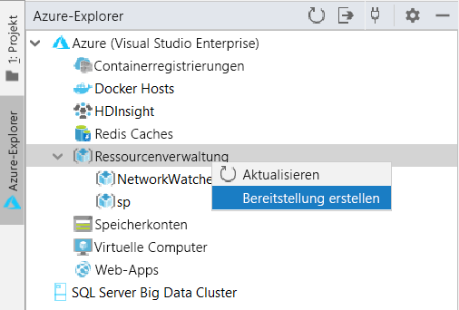
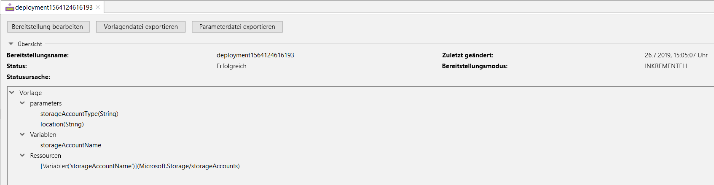
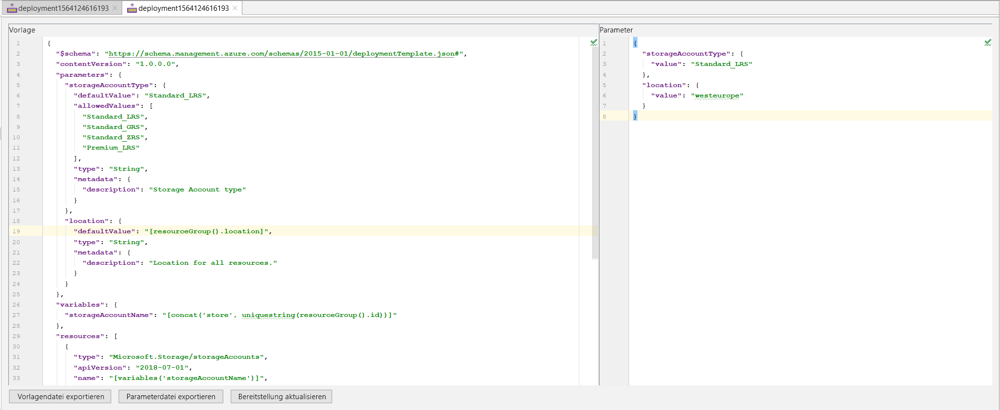
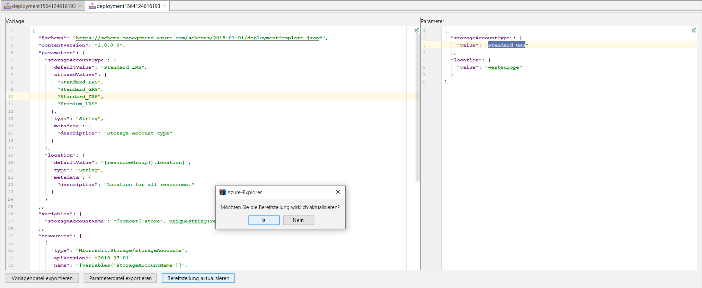
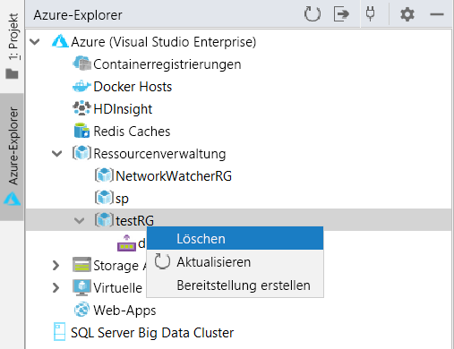

# Schnellstart: Erstellen und Bereitstellen von Azure Resource Manager-Vorlagen über IntelliJ IDEA

Hier erfahren Sie, wie Sie mithilfe von IntelliJ IDEA eine Resource Manager-Vorlage in Azure bereitstellen und die Vorlage direkt in der IDE bearbeiten und aktualisieren. Resource Manager-Vorlagen sind JSON-Dateien, mit denen die Ressourcen definiert werden, die Sie für Ihre Lösung bereitstellen müssen. Weitere Informationen zu den Konzepten der Bereitstellung und Verwaltung Ihrer Azure-Lösungen finden Sie unter [Übersicht über Azure Resource Manager](resource-group-overview.md).

Nach Abschluss des Tutorials stellen Sie ein Azure Storage-Konto bereit. Andere Azure-Ressourcen werden nach dem gleichen Verfahren bereitgestellt.

Wenn Sie kein Azure-Abonnement besitzen, können Sie ein [kostenloses Konto](https://azure.microsoft.com/free/) erstellen, bevor Sie beginnen.

## Voraussetzungen

Damit Sie die Anweisungen in diesem Artikel ausführen können, benötigen Sie Folgendes:

* Eine installierte Instanz von [IntelliJ IDEA](https://www.jetbrains.com/idea/download/) (Ultimate Edition oder Community Edition)
* Wenn das [Azure-Toolkit für IntelliJ](https://plugins.jetbrains.com/plugin/8053) installiert ist, entnehmen Sie weitere Informationen dem [IntelliJ-Handbuch zur Verwaltung von Plug-Ins](https://www.jetbrains.com/help/idea/managing-plugins.html).
* Sie müssen für das Azure-Toolkit für IntelliJ bei Ihrem Azure-Konto [angemeldet sein](https://docs.microsoft.com/java/azure/intellij/azure-toolkit-for-intellij-sign-in-instructions).

## Bereitstellen einer Schnellstartvorlage

Anstatt eine Vorlage von Grund auf neu zu erstellen, können Sie auch eine Vorlage aus [Azure-Schnellstartvorlagen](https://azure.microsoft.com/resources/templates/) öffnen. Azure-Schnellstartvorlagen ist ein Repository für Resource Manager-Vorlagen. Die in dieser Schnellstartanleitung verwendete Vorlage heißt [Standardspeicherkonto erstellen](https://github.com/Azure/azure-quickstart-templates/tree/master/101-storage-account-create/). Sie definiert eine Azure Storage-Kontoressource.

1. Klicken Sie mit der rechten Maustaste, und speichern Sie [`azuredeploy.json`](https://raw.githubusercontent.com/Azure/azure-quickstart-templates/master/101-storage-account-create/azuredeploy.json) und [`azuredeploy.parameters.json`](https://raw.githubusercontent.com/Azure/azure-quickstart-templates/master/101-storage-account-create/azuredeploy.parameters.json) auf Ihrem lokalen Computer.

1. Ist Ihr Azure-Toolkit ordnungsgemäß installiert und angemeldet, sollte auf der IntelliJ IDEA-Seitenleiste der Azure-Explorer angezeigt werden. Klicken Sie mit der rechten Maustaste auf **Ressourcenverwaltung**, und wählen Sie **Bereitstellung erstellen** aus.

    

1. Konfigurieren Sie die Werte für **Bereitstellungsname**, **Abonnement**, **Ressourcengruppe** und **Region**. Hier stellen wir die Vorlage in der neuen Ressourcengruppe `testRG` bereit. Wählen Sie dann für **Ressourcenvorlage** den Pfad zur Datei `azuredeploy.json` und für **Ressourcenparameter** den Pfad zur Datei `azuredeploy.parameters.json` aus, die Sie heruntergeladen haben.

    

1. Nach dem Klicken auf „OK“ wird die Bereitstellung gestartet. Bis zum Abschluss der Bereitstellung können Sie den Fortschritt unten in IntelliJ IDEA auf der **Statusleiste** verfolgen.

    

## Durchsuchen einer vorhandenen Bereitstellung

1. Nach Abschluss der Bereitstellung können Sie sehen, dass die neue Ressourcengruppe `testRG` und eine neue Bereitstellung erstellt wurden. Klicken Sie mit der rechten Maustaste auf die Bereitstellung, und eine Liste möglicher Aktionen wird angezeigt. Wählen Sie jetzt **Eigenschaften anzeigen** aus.

    

1. Eine Registerkartenansicht mit nützlichen Eigenschaften wie Bereitstellungsstatus und Vorlagenstruktur wird geöffnet.

    

## Bearbeiten und Aktualisieren einer vorhandenen Bereitstellung

1. Wählen Sie im Kontextmenü oder in der eben erwähnten Eigenschaftenansicht die Option **Bereitstellung bearbeiten** aus. Eine weitere Registerkartenansicht mit den Vorlagen- und Parameterdateien für die Bereitstellung in Azure wird geöffnet. Klicken Sie zum lokalen Speichern dieser Dateien auf **Export Template File** (Vorlagendatei exportieren) oder **Export Parameter File** (Parameterdatei exportieren).

    

1. Sie können die beiden Dateien auf dieser Seite bearbeiten und die Änderungen in Azure bereitstellen. Hier ändern wir den Wert von **storageAccountType** in Parameterdateien von `Standard_LRS` in `Standard_GRS`. Klicken Sie im unteren Bereich auf **Updatebereitstellung**, und bestätigen Sie das Update.

    

1. Nach Abschluss der Updatebereitstellung können Sie im Portal überprüfen, ob das erstellte Speicherkonto in `Standard_GRS` geändert wurde.

## Bereinigen von Ressourcen

1. Wenn Sie die Azure-Ressourcen nicht mehr benötigen, löschen Sie die Ressourcengruppe, um die bereitgestellten Ressourcen zu bereinigen. Sie können dazu das Azure-Portal oder die Azure-Befehlszeilenschnittstelle verwenden. Klicken Sie in IntelliJ IDEA im Azure-Explorer mit der rechten Maustaste auf die erstellte **Ressourcengruppe**, und wählen Sie „Löschen“ aus.

    

> [!NOTE]
> Beachten Sie, dass beim Löschen einer Bereitstellung nicht die von der Bereitstellung erstellten Ressourcen gelöscht werden. Löschen Sie die entsprechende Ressourcengruppe oder bestimmte Ressourcen, wenn Sie sie nicht mehr benötigen.

## Nächste Schritte

In dieser Schnellstartanleitung geht es in erster Linie um die Bereitstellung einer vorhandenen Azure-Schnellstartvorlage mithilfe von IntelliJ IDEA. Darüber hinaus haben Sie erfahren, wie Sie eine vorhandene Bereitstellung in Azure anzeigen und aktualisieren. Die Azure-Schnellstartvorlagen decken unter Umständen nicht alle Ihre Anforderungen ab. Weitere Informationen zur Vorlagenentwicklung finden Sie in unserer neuen Tutorialreihe für Anfänger:

> [!div class="nextstepaction"]
> [Tutorials für Anfänger](./template-tutorial-create-first-template.md)

> [!div class="nextstepaction"]
> [Azure für Java-Cloudentwickler](https://docs.microsoft.com/azure/java)
