# <a name="creating-and-deploying-azure-resource-groups-through-visual-studio"></a>Erstellen und Bereitstellen von Azure-Ressourcengruppen mit Visual Studio

Mit Visual Studio können Sie ein Projekt erstellen, das Ihre Infrastruktur und Ihren Code in Azure bereitstellt. Beispielsweise können Sie den Webhost, die Website und den Code für die Website bereitstellen. Visual Studio bietet viele verschiedene Starter-Vorlagen für die Bereitstellung gängiger Szenarien. In diesem Artikel stellen Sie eine Web-App bereit.

Informationen zur Verwendung von Visual Studio 2019 oder höher mit den installierten Workloads für ASP.NET und die Azure-Entwicklung finden Sie in [diesem Artikel](/visualstudio/install/install-visual-studio?view=vs-2019). Bei Verwendung von Visual Studio 2017 ist der Ablauf größtenteils identisch.

## <a name="create-azure-resource-group-project"></a>Erstellen eines Azure-Ressourcengruppenprojekts

In diesem Abschnitt erstellen Sie ein Azure-Ressourcengruppenprojekt mit der Vorlage **Web-App**.

1. Wählen Sie in Visual Studio **Datei** > **Neu** und **Projekt** aus. Wählen Sie die Projektvorlage **Azure-Ressourcengruppe** und dann **Weiter** aus.

    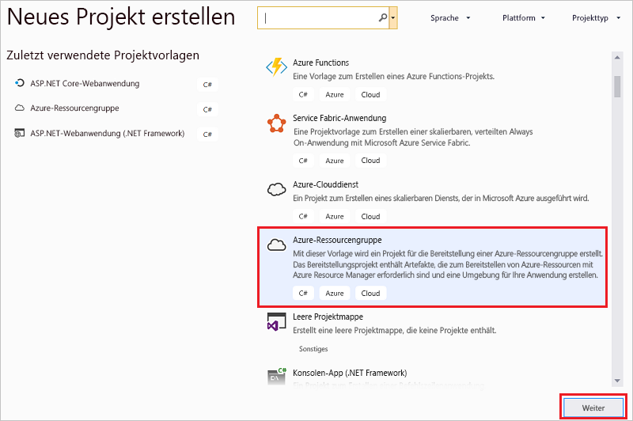

1. Geben Sie dem Projekt einen Namen. Die anderen Standardeinstellungen können wahrscheinlich übernommen werden, überprüfen Sie sie jedoch dennoch, damit sie in Ihrer Umgebung funktionieren. Wählen Sie abschließend die Option **Erstellen**.

    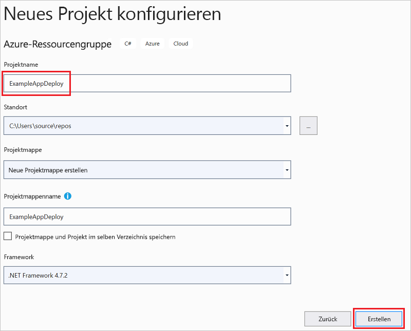

1. Wählen Sie die Vorlage aus, die Sie im Azure-Ressourcen-Manager bereitstellen möchten. Je nach Art des bereitzustellenden Projekts stehen Ihnen viele verschiedene Optionen zur Verfügung. In diesem Artikel wählen Sie die Vorlage **Web-App** und **OK** aus.

    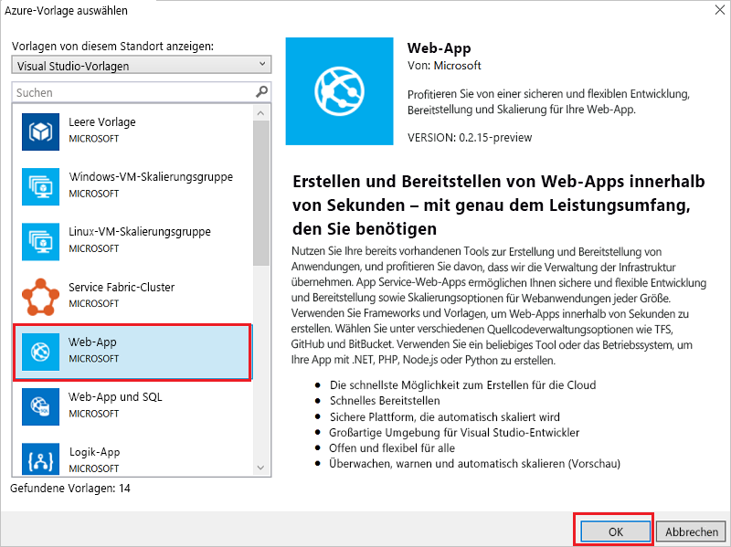

    Die Vorlage, die Sie auswählen, ist lediglich der Ausgangspunkt. Sie können Ressourcen hinzufügen und entfernen, um Ihr Szenario auszuführen.

1. In Visual Studio wird ein Ressourcengruppen-Bereitstellungsprojekt für die Web-App erstellt. Im Knoten im Bereitstellungsprojekt werden die Dateien für das Projekt angezeigt.

    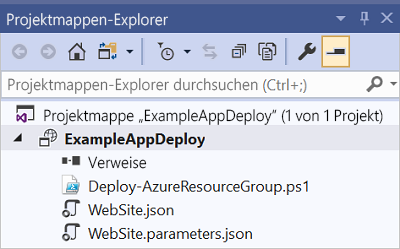

    Da Sie die Vorlage „Web-App“ ausgewählt haben, werden die folgenden Dateien angezeigt:

   | Dateiname | Beschreibung |
   | --- | --- |
   | Deploy-AzureResourceGroup.ps1 |Ein PowerShell-Skript, das PowerShell-Befehle für die Bereitstellung in Azure Resource Manager ausführt. Über dieses PowerShell-Skript wird in Visual Studio Ihre Vorlage bereitgestellt. |
   | WebSite.json |Die Resource Manager-Vorlage, die sowohl die für Azure bereitzustellende Infrastruktur als auch die Parameter definiert, die Sie bei der Bereitstellung angeben können. Sie definiert auch die Abhängigkeiten zwischen Ressourcen, damit sie von Resource Manager in der richtigen Reihenfolge bereitgestellt werden. |
   | WebSite.parameters.json |Eine Parameterdatei, die Werte enthält, die für die Vorlage erforderlich sind. Parameterwerte werden zum Anpassen der einzelnen Bereitstellungen übergeben. |

    Alle Ressourcengruppen-Bereitstellungsprojekte enthalten diese grundlegenden Dateien. Andere Projekte enthalten möglicherweise zusätzliche Dateien zur Unterstützung weiterer Funktionen.

## <a name="customize-resource-manager-template"></a>Anpassen der Resource Manager-Vorlage

Sie können ein Bereitstellungsprojekt anpassen, indem Sie die Resource Manager-Vorlage bearbeiten, in der die bereitzustellenden Ressourcen beschrieben werden. Weitere Informationen über die Elemente von Ressourcen-Manager-Vorlagen finden Sie unter [Erstellen von Azure-Ressourcen-Manager-Vorlagen](resource-group-authoring-templates.md).

1. Öffnen Sie **WebSite.json**, um die Vorlage zu bearbeiten.

1. Der Visual Studio-Editor bietet Tools, die das Bearbeiten der Resource Manager-Vorlage erleichtern. Die in der Vorlage definierten Elemente werden gut sichtbar im Fenster **JSON-Gliederung** angezeigt.

   

1. Wählen Sie ein Element in der Gliederung aus, um zum entsprechenden Teil der Vorlage zu wechseln.

   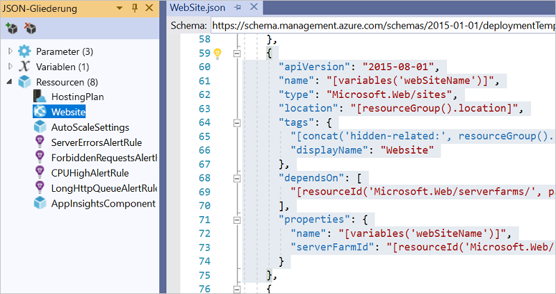

1. Sie können eine Ressource hinzufügen, indem Sie entweder die Schaltfläche **Ressource hinzufügen** am oberen Rand der JSON-Gliederung auswählen oder mit der rechten Maustaste auf **Ressourcen** und anschließend auf **Neue Ressource hinzufügen** klicken.

   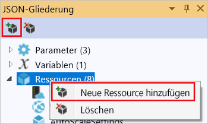

1. Wählen Sie **Speicherkonto**, aus, und geben Sie einen Namen ein. Geben Sie einen Namen mit maximal elf Zeichen ein, der nur Zahlen und Kleinbuchstaben enthält.

   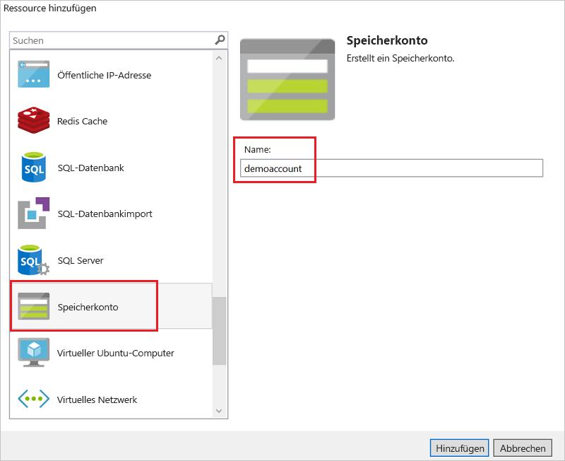

1. Beachten Sie, dass nicht nur die Ressource hinzugefügt wurde, sondern auch ein Parameter für das Typenspeicherkonto sowie eine Variable für den Namen des Speicherkontos.

   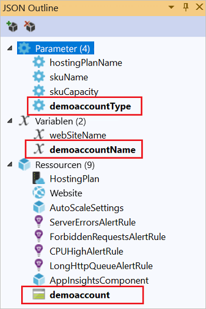

1. Der Parameter für den Speicherkontotyp ist mit zulässigen Typen und einem Standardtyp vordefiniert. Diese Werte können Sie so beibehalten oder für Ihr Szenario bearbeiten. Wenn Sie verhindern möchten, dass über diese Vorlage ein **Premium_LRS**-Speicherkonto bereitgestellt wird, entfernen Sie es aus den zulässigen Typen.

   ```json
   "demoaccountType": {
     "type": "string",
     "defaultValue": "Standard_LRS",
     "allowedValues": [
       "Standard_LRS",
       "Standard_ZRS",
       "Standard_GRS",
       "Standard_RAGRS"
     ]
   }
   ```

1. Visual Studio bietet auch IntelliSense, damit Sie besser sehen, welche Eigenschaften beim Bearbeiten der Vorlage verfügbar sind. Wenn Sie beispielsweise die Eigenschaften für Ihren App Service-Plan bearbeiten möchten, navigieren Sie zur Ressource **HostingPlan**, und fügen Sie einen Wert für die Eigenschaften (**properties**) hinzu. Intellisense zeigt daraufhin die verfügbaren Werte sowie eine Beschreibung des Werts an.

   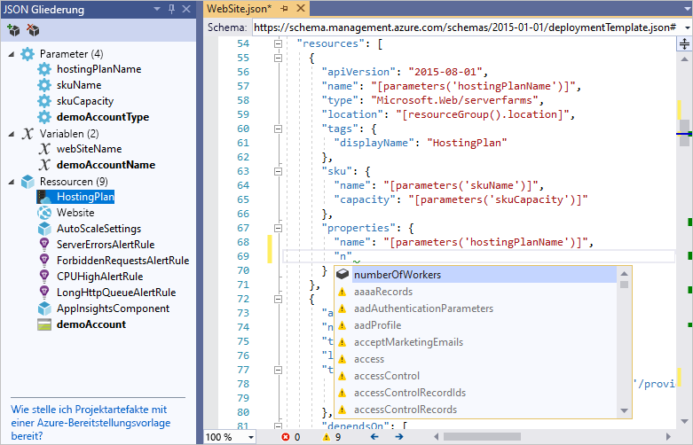

   Sie können **numberOfWorkers** auf „1“ festlegen und die Datei speichern.

   ```json
   "properties": {
     "name": "[parameters('hostingPlanName')]",
     "numberOfWorkers": 1
   }
   ```

1. Öffnen Sie die Datei **WebSite.parameters.json**. Sie verwenden die Parameterdatei, um bei der Bereitstellung Werte zu übergeben, mit denen die bereitgestellte Ressource angepasst wird. Geben Sie dem Hostingplan einen Namen, und speichern Sie die Datei.

   ```json
   {
     "$schema": "https://schema.management.azure.com/schemas/2015-01-01/deploymentParameters.json#",
     "contentVersion": "1.0.0.0",
     "parameters": {
       "hostingPlanName": {
         "value": "demoHostPlan"
       }
     }
   }
   ```

## <a name="deploy-project-to-azure"></a>Bereitstellen des Projekts in Azure

Sie können das Projekt jetzt in einer Ressourcengruppe bereitstellen.

Standardmäßig verwendet das PowerShell-Skript („Deploy-AzureResourceGroup.ps1“) im Projekt das AzureRM-Modul. Wenn das AzureRM-Modul noch installiert ist und Sie es weiterhin verwenden möchten, können Sie dieses Standardskript verwenden. Mit diesem Skript können Sie die Lösung über die Visual Studio-Oberfläche bereitstellen.

Wenn Sie jedoch die Migration zum neuen [Az-Modul](/powershell/azure/new-azureps-module-az) durchgeführt haben, müssen Sie dem Projekt ein neues Skript hinzufügen. Kopieren Sie zum Hinzufügen eines Skripts, das das Az-Modul verwendet, das Skript [Deploy-AzTemplate.ps1](https://github.com/Azure/azure-quickstart-templates/blob/master/Deploy-AzTemplate.ps1), und fügen Sie es dem Projekt hinzu. Um dieses Skript für die Bereitstellung zu verwenden, müssen Sie es über eine PowerShell-Konsole ausführen, anstatt die Visual Studio-Bereitstellungsoberfläche zu verwenden.

In diesem Artikel werden beide Ansätze beschrieben. In diesem Artikel wird das Skript für das AzureRM-Modul als Standardskript und das Skript für das Az-Modul als neues Skript bezeichnet.

### <a name="az-module-script"></a>Skript für das Az-Modul

Öffnen Sie für das Skript für das Az-Modul eine PowerShell-Konsole, und führen Sie Folgendes aus:

```powershell
.\Deploy-AzTemplate.ps1 -ArtifactStagingDirectory . -Location centralus -TemplateFile WebSite.json -TemplateParametersFile WebSite.parameters.json
```

### <a name="azurerm-module-script"></a>Skript für das AzureRM-Modul

Verwenden Sie Visual Studio für das Skript für das AzureRM-Modul:

1. Wählen Sie im Kontextmenü des Bereitstellungsprojektknotens **Bereitstellen** > **Neu**.

    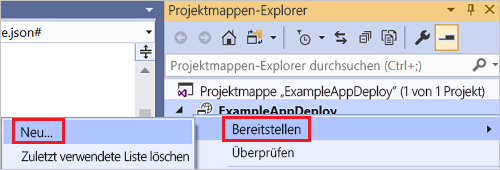

1. Das Dialogfeld **Für Ressourcengruppe bereitstellen** wird angezeigt. Wählen Sie im Dropdownfeld **Ressourcengruppe** eine vorhandene Ressourcengruppe aus, oder erstellen Sie eine neue. Klicken Sie auf **Bereitstellen**.

    

1. Im Fenster **Ausgabe** wird der Status der Bereitstellung angezeigt. Nachdem die Bereitstellung abgeschlossen ist, wird die letzte Meldung mit dem Hinweis angezeigt, dass die Bereitstellung erfolgreich war. Sie sieht in etwa wie folgt aus:

   ```output
   18:00:58 - Successfully deployed template 'website.json' to resource group 'ExampleAppDeploy'.
   ```

## <a name="view-deployed-resources"></a>Anzeigen der bereitgestellten Ressourcen

Überprüfen wir die Ergebnisse.

1. Öffnen Sie in einem Browser das [Azure-Portal](https://portal.azure.com/) , und melden Sie sich an Ihrem Konto an. Wählen Sie zum Anzeigen der Ressourcengruppe die Option **Ressourcengruppen** sowie die bereitgestellte Ressourcengruppe aus.

1. Alle bereitgestellten Ressourcen werden angezeigt. Beachten Sie, dass der Name des Speicherkontos nicht genau wie der Name lautet, den Sie beim Hinzufügen der Ressource angegeben haben. Das Speicherkonto muss eindeutig sein. Mit der Vorlage wird automatisch eine Zeichenfolge an den von Ihnen angegebenen Namen angefügt, damit die Eindeutigkeit sichergestellt ist.

    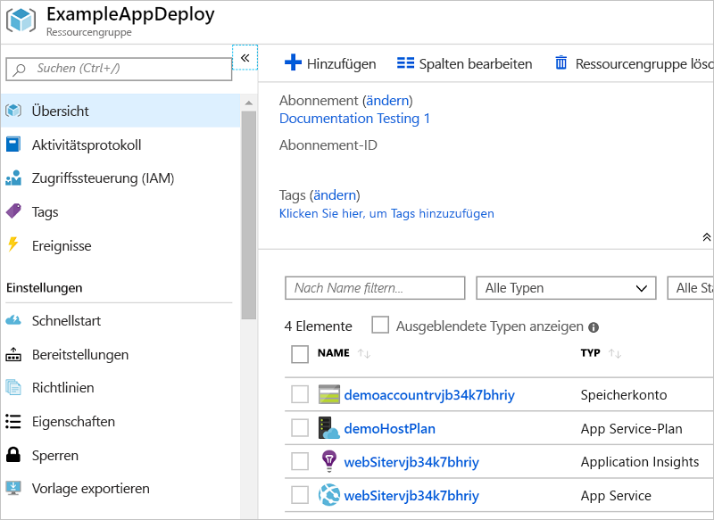

## <a name="add-code-to-project"></a>Hinzufügen von Code zum Projekt

Jetzt haben Sie die Infrastruktur für Ihre App bereitgestellt, im Projekt ist jedoch kein Code bereitgestellt.

1. Fügen Sie Ihrer Visual Studio-Projektmappe ein Projekt hinzu: Klicken Sie mit der rechten Maustaste auf die Projektmappe, und wählen Sie **Hinzufügen** > **Neues Projekt** aus.

    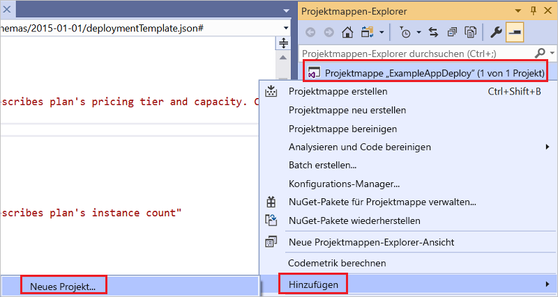

1. Fügen Sie eine **ASP.NET Core-Webanwendung** hinzu.

    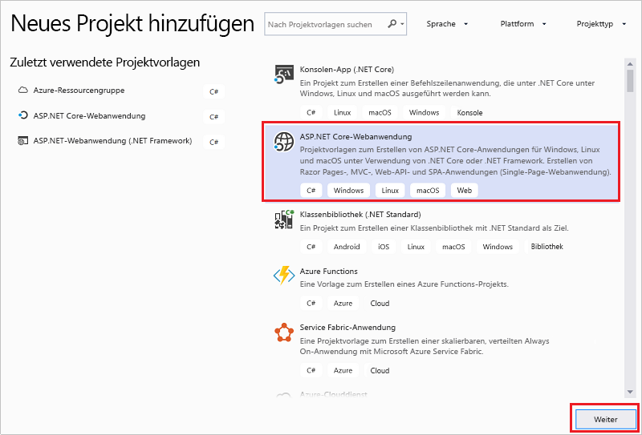

1. Geben Sie der Web-App einen Namen, und wählen Sie **Erstellen** aus.

    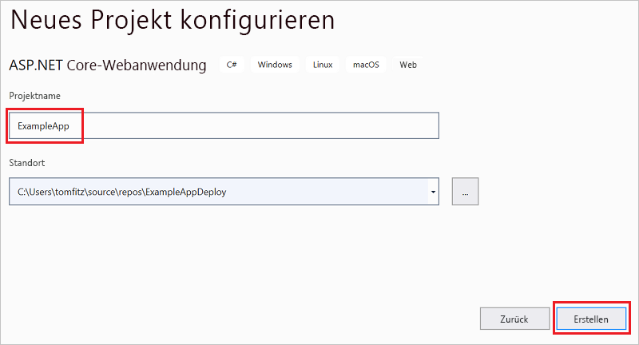

1. Wählen Sie **Webanwendung** und dann **Erstellen** aus.

    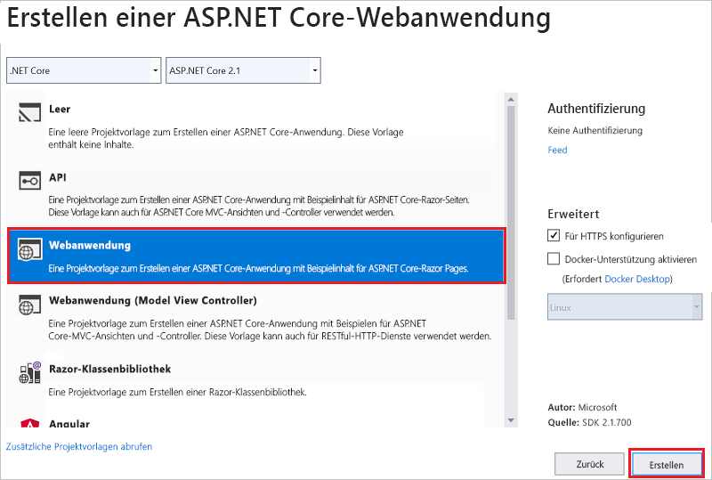

1. Nachdem die Web-App in Visual Studio erstellt wurde, werden beide Projekte in der Projektmappe angezeigt.

    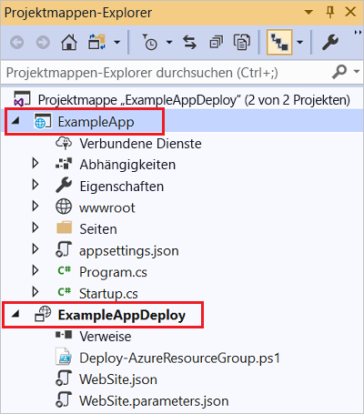

1. Nun müssen Sie sicherstellen, dass Ihr Ressourcengruppenprojekt über das neue Projekt informiert ist. Wechseln Sie wieder zu Ihrem Ressourcengruppenprojekt (ExampleAppDeploy). Klicken Sie mit der rechten Maustaste auf **Verweise**, und wählen Sie **Verweis hinzufügen**.

    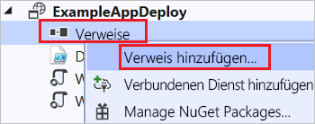

1. Wählen Sie das Web-App-Projekt aus, das Sie erstellt haben.

   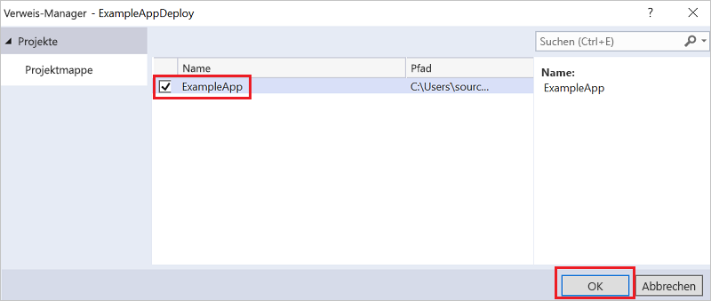

   Durch Hinzufügen eines Verweises verknüpfen Sie das Web-App-Projekt mit dem Ressourcengruppenprojekt und legen automatisch einige Eigenschaften fest. Die Eigenschaften werden im Fenster **Eigenschaften** für den Verweis angezeigt. **Dateipfad einbeziehen** enthält den Pfad, unter dem das Paket erstellt wird. Beachten Sie den Ordner (ExampleApp) und die Datei (package.zip). Sie müssen diese Werte kennen, da Sie sie als Parameter angeben, wenn Sie die App bereitstellen.

   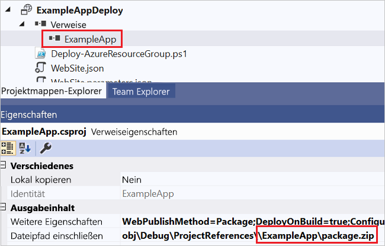

1. Wechseln Sie wieder zur Vorlage („WebSite.json“), und fügen Sie ihr eine Ressource hinzu.

    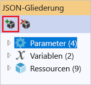

1. Wählen Sie nun **Web Deploy für Web Apps**aus.

    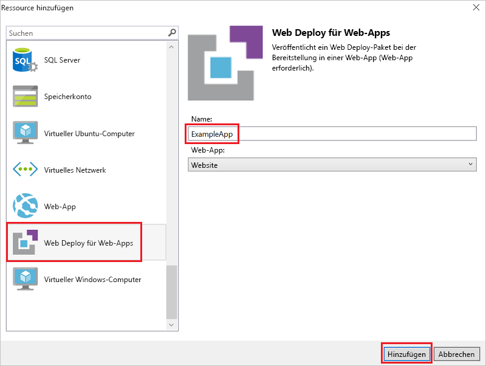

   Speichern Sie die Vorlage.

1. In der Vorlage sind einige neue Parameter enthalten. Diese wurden im vorherigen Schritt hinzugefügt. Die Werte für **_artifactsLocation** oder **_artifactsLocationSasToken** werden automatisch generiert und müssen daher nicht angegeben werden. Sie müssen jedoch den Ordner- und Dateinamen für das Verzeichnis festlegen, das das Bereitstellungspaket enthält. Die Namen dieser Parameter enden mit **PackageFolder** und **PackageFileName**. Der erste Teil des Namens ist der Name der hinzugefügten Web Deploy-Ressource. In diesem Artikel sind dies **ExampleAppPackageFolder** und **ExampleAppPackageFileName**.

   Öffnen Sie **Website.parameters.json**, und legen Sie diese Parameter auf die Werte fest, die in den Verweiseigenschaften angezeigt werden. Legen Sie **ExampleAppPackageFolder** auf den Namen des Ordners fest. Legen Sie **ExampleAppPackageFileName** auf den Namen der ZIP-Datei fest.

   ```json
   {
     "$schema": "https://schema.management.azure.com/schemas/2015-01-01/deploymentParameters.json#",
     "contentVersion": "1.0.0.0",
     "parameters": {
       "hostingPlanName": {
         "value": "demoHostPlan"
       },
       "ExampleAppPackageFolder": {
         "value": "ExampleApp"
       },
       "ExampleAppPackageFileName": {
         "value": "package.zip"
       }
     }
   }
   ```

## <a name="deploy-code-with-infrastructure"></a>Bereitstellen von Code mit der Infrastruktur

Da Sie dem Projekt Code hinzugefügt haben, läuft die Bereitstellung hier etwas anders ab. Bei der Bereitstellung stellen Sie Artefakte für Ihr Projekt an einem Speicherort bereit, auf den Resource Manager zugreifen kann. Die Artefakte werden in einem Speicherkonto bereitgestellt.

### <a name="az-module-script"></a>Skript für das Az-Modul

Eine kleine Änderung müssen Sie an der Vorlage vornehmen, wenn Sie das Skript für das Az-Modul verwenden. In diesem Skript wird dem Speicherort für Artefakte ein Schrägstrich hinzugefügt. In der Vorlage wird dieser Schrägstrich jedoch nicht erwartet. Öffnen Sie „WebSite.json“, und suchen Sie die Eigenschaften für die MSDeploy-Erweiterung. Sie enthält die Eigenschaft **packageUri**. Entfernen Sie den Schrägstrich zwischen dem Speicherort für Artefakte und dem Paketordner.

Dies sollte wie folgt aussehen:

```json
"packageUri": "[concat(parameters('_artifactsLocation'), parameters('ExampleAppPackageFolder'), '/', parameters('ExampleAppPackageFileName'), parameters('_artifactsLocationSasToken'))]",
```

Beachten Sie, dass im vorherigen Beispiel kein Schrägstrich (`'/',`) zwischen **parameters('_artifactsLocation')** und **parameters('ExampleAppPackageFolder')** steht.

Erstellen Sie das Projekt neu. Durch Erstellen des Projekts wird sichergestellt, dass die bereitzustellenden Dateien dem Stagingordner hinzugefügt werden.

Öffnen Sie dann eine PowerShell-Konsole, und führen Sie Folgendes aus:

```powershell
.\Deploy-AzTemplate.ps1 -ArtifactStagingDirectory .\bin\Debug\staging\ExampleAppDeploy -Location centralus -TemplateFile WebSite.json -TemplateParametersFile WebSite.parameters.json -UploadArtifacts -StorageAccountName <storage-account-name>
```

### <a name="azurerm-module-script"></a>Skript für das AzureRM-Modul

Verwenden Sie Visual Studio für das Skript für das AzureRM-Modul:

1. Wählen Sie für die erneute Bereitstellung die Option **Bereitstellen** und die zuvor bereitgestellte Ressourcengruppe aus.

    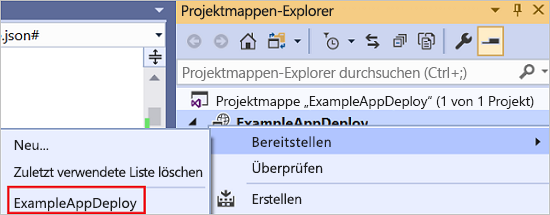

1. Wählen Sie als **Artefaktspeicherkonto** das mit dieser Ressourcengruppe bereitgestellte Speicherkonto aus.

   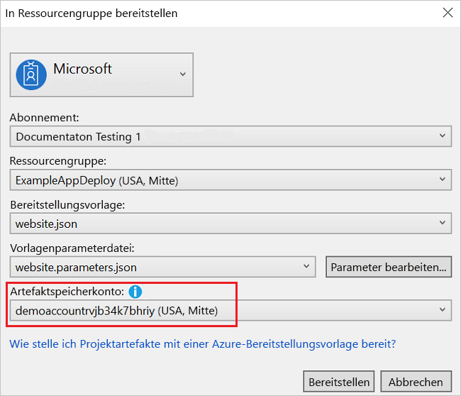

## <a name="view-web-app"></a>Anzeigen der Web-App

1. Wählen Sie Ihre Web-App im Portal aus, nachdem die Bereitstellung abgeschlossen ist. Wählen Sie die URL zum Navigieren zur Website aus.

   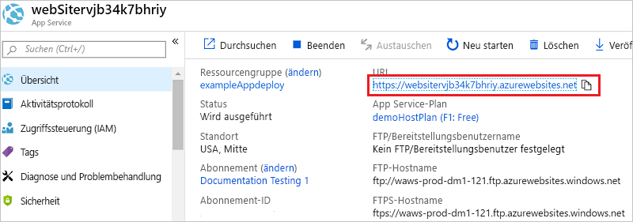

1. Sie können sehen, dass Sie die ASP.NET-Standard-App erfolgreich bereitgestellt haben.

   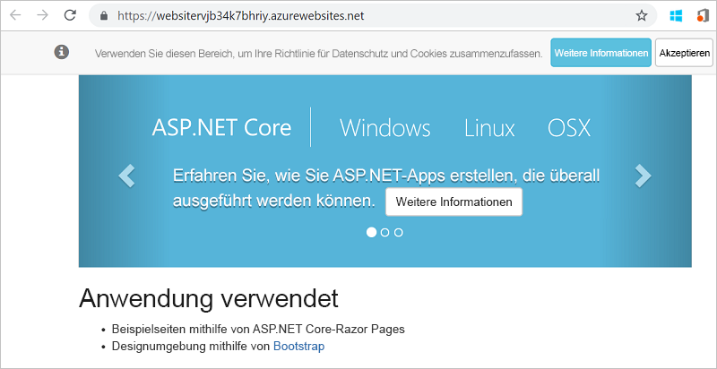

## <a name="add-operations-dashboard"></a>Hinzufügen des Dashboards für Abläufe

Sie sind nicht auf die Ressourcen beschränkt, die über die Visual Studio-Benutzeroberfläche zur Verfügung stehen. Sie können Ihre Bereitstellung anpassen, indem Sie der Vorlage eine benutzerdefinierte Ressource hinzufügen. Fügen Sie ein Dashboard für Abläufe zum Verwalten der bereitgestellten Ressource hinzu, um das Hinzufügen einer Ressource zu veranschaulichen.

1. Öffnen Sie die Datei „WebSite.json“, und fügen Sie nach der Speicherkontoressource, aber noch vor der schließenden eckigen Klammer (`]`) des Ressourcenabschnitts den folgenden JSON-Code hinzu.

   ```json
    ,{
      "properties": {
        "lenses": {
          "0": {
            "order": 0,
            "parts": {
              "0": {
                "position": {
                  "x": 0,
                  "y": 0,
                  "colSpan": 4,
                  "rowSpan": 6
                },
                "metadata": {
                  "inputs": [
                    {
                      "name": "resourceGroup",
                      "isOptional": true
                    },
                    {
                      "name": "id",
                      "value": "[resourceGroup().id]",
                      "isOptional": true
                    }
                  ],
                  "type": "Extension/HubsExtension/PartType/ResourceGroupMapPinnedPart"
                }
              },
              "1": {
                "position": {
                  "x": 4,
                  "y": 0,
                  "rowSpan": 3,
                  "colSpan": 4
                },
                "metadata": {
                  "inputs": [],
                  "type": "Extension[azure]/HubsExtension/PartType/MarkdownPart",
                  "settings": {
                    "content": {
                      "settings": {
                        "content": "__Customizations__\n\nUse this dashboard to create and share the operational views of services critical to the application performing. To customize simply pin components to the dashboard and then publish when you're done. Others will see your changes when you publish and share the dashboard.\n\nYou can customize this text too. It supports plain text, __Markdown__, and even limited HTML like images  and <a href='https://azure.microsoft.com' target='_blank'>links</a> that open in a new tab.\n",
                        "title": "Operations",
                        "subtitle": "[resourceGroup().name]"
                      }
                    }
                  }
                }
              }
            }
          }
        },
        "metadata": {
          "model": {
            "timeRange": {
              "value": {
                "relative": {
                  "duration": 24,
                  "timeUnit": 1
                }
              },
              "type": "MsPortalFx.Composition.Configuration.ValueTypes.TimeRange"
            }
          }
        }
      },
      "apiVersion": "2015-08-01-preview",
      "name": "[concat('ARM-',resourceGroup().name)]",
      "type": "Microsoft.Portal/dashboards",
      "location": "[resourceGroup().location]",
      "tags": {
        "hidden-title": "[concat('OPS-',resourceGroup().name)]"
      }
    }
   ```

1. Stellen Sie das Projekt erneut bereit.

1. Zeigen Sie das Dashboard nach Abschluss der Bereitstellung im Portal an. Wählen Sie **Dashboard** und dann das bereitgestellte Dashboard aus.

   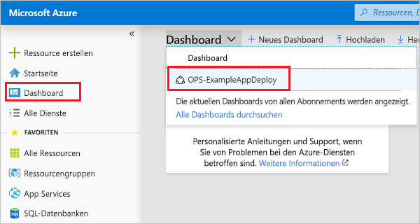

1. Das angepasste Dashboard wird angezeigt.

   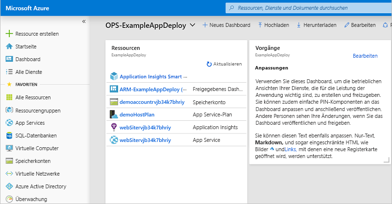

Sie können den Zugriff auf das Dashboard verwalten, indem Sie RBAC-Gruppen verwenden. Außerdem können Sie die Darstellung des Dashboards anpassen, nachdem es bereitgestellt wurde. Wenn Sie die Ressourcengruppe jedoch erneut bereitstellen, wird das Dashboard auf den Standardzustand in der Vorlage zurückgesetzt. Weitere Informationen über das Erstellen von Dashboards finden Sie unter [Programmgesteuertes Erstellen von Azure-Dashboards](../azure-portal/azure-portal-dashboards-create-programmatically.md).

## <a name="clean-up-resources"></a>Bereinigen von Ressourcen

Wenn Sie die Azure-Ressourcen nicht mehr benötigen, löschen Sie die Ressourcengruppe, um die bereitgestellten Ressourcen zu bereinigen.

1. Wählen Sie im Azure-Portal im linken Menü die Option **Ressourcengruppen** aus.

1. Klicken Sie auf den Namen der Ressourcengruppe.

1. Wählen Sie **Ressourcengruppe löschen** aus dem Menü ganz oben aus.

## <a name="next-steps"></a>Nächste Schritte

In dieser Schnellstartanleitung haben Sie erfahren, wie Vorlagen mit Visual Studio erstellt und bereitgestellt werden. Weitere Informationen zur Vorlagenentwicklung finden Sie in unserer neuen Tutorialreihe für Anfänger:

> [!div class="nextstepaction"]
> [Tutorials für Anfänger](./template-tutorial-create-first-template.md)
