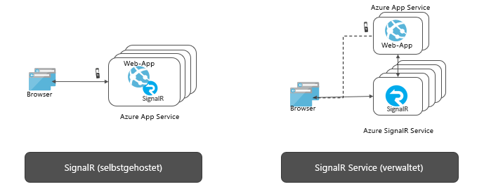

# Was ist Azure SignalR Service?

Der Azure SignalR-Dienst vereinfacht den Vorgang des Hinzufügens von Echtzeitwebfunktionen zu Anwendungen über HTTP. Diese Echtzeitfunktionalität ermöglicht es dem Dienst, Inhaltsaktualisierungen an verbundene Clients zu senden, z.B. an eine Single-Page-Web- oder mobile Anwendung. Das Ergebnis ist, dass Clients aktualisiert werden, ohne dass der Server abgefragt werden muss oder neue HTTP-Anforderungen für Updates gesendet werden müssen.

Dieser Artikel enthält eine Übersicht über den Azure SignalR-Dienst.

## Welche Funktion hat der Azure SignalR-Dienst?

Bei jedem Szenario, das ein Pushen von Daten vom Server an Clients in Echtzeit erfordert, kann Azure SignalR Service verwendet werden.

Auch herkömmliche Echtzeitfunktionen, die häufig Abrufe vom Server erfordern, können Azure SignalR Service nutzen.

Azure SignalR Service wird in einer Vielzahl von Branchen für unterschiedlichste Anwendungstypen verwendet, die Inhaltsupdates in Echtzeit erfordern. Die folgende Liste enthält einige Beispiele, für die sich Azure SignalR Service besonders eignet:

* **Sehr häufige Datenaktualisierungen:** Spiele, Abstimmungen, Befragungen, Auktionen
* **Dashboards und Überwachung:** Unternehmens-Dashboard, Finanzmarktdaten, sofortige Vertriebsupdates, Ranglisten bei Mehrspieler-Games und IoT-Überwachung
* **Chat:** Live-Chatraum, Chatbot, Online-Kundensupport, Einkaufshilfen in Echtzeit, Messenger, In-Game-Chat usw.
* **Echtzeitstandort auf Karten:** Nachverfolgung in der Logistik, Nachverfolgung des Lieferstatus, Transportstatusupdates, GPS-Apps
* **Zielgerichtete Werbung in Echtzeit:** personalisierte Push-Werbung und Angebote beim Lesen, interaktive Anzeigen
* **Zusammenarbeits-Apps:** gemeinsames Verfassen, Whiteboard-Apps und Software für Teambesprechungen
* **Pushbenachrichtigungen:** soziale Netzwerke, E-Mail, Spiele, Reisewarnung
* **Echtzeitübertragungen:** Live-Übertragung von Audio-/Videosendungen, Live-Untertitelung, Übersetzung, Übertragungen von Veranstaltungen/Nachrichten
* **IoT und verbundene Geräte:** IoT-Echtzeitmetriken, Remotesteuerung, Echtzeitstatus und Standortverfolgung
* **Automatisierung:** Echtzeitauslöser aus Upstreamereignissen

## Welche Vorteile bietet Azure SignalR Service?

**Standardbasiert:**

SignalR stellt eine Abstraktion einer Reihe von Verfahren bereit, die zum Erstellen von Echtzeitwebanwendungen verwendet werden. [WebSockets](https://wikipedia.org/wiki/WebSocket) ermöglichen einen optimalen Transport, aber es werden andere Verfahren wie [Server-Sent Events (SSE)](https://wikipedia.org/wiki/Server-sent_events) und „Long Polling“ genutzt, wenn andere Optionen nicht verfügbar sind. SignalR kann das richtige Transportverfahren basierend auf den Features, die auf dem Server und dem Client unterstützt werden, automatisch erkennen und initialisieren.

**Native Unterstützung von ASP.NET Core:**

SignalR Service bietet eine native Programmiererfahrung mit ASP.NET Core und ASP.NET. Das Entwickeln neuer SignalR-Anwendungen mit SignalR Service oder das Migrieren vorhandener SignalR-basierter Anwendungen zu SignalR Service erfordert nur wenig Aufwand.
SignalR Service unterstützt auch die neue ASP.NET Core-Funktion serverseitiger Blazor.

**Umfassende Clientunterstützung:**

SignalR Service funktioniert mit einer breiten Palette von Clients, z. B. Web- und mobile Browser, Desktop-Apps, mobile Apps, Serverprozesse, IoT-Geräte und Spielekonsolen. SignalR Service bietet SDKs in verschiedenen Sprachen. Zusätzlich zu den nativen SDKs für ASP.NET Core oder ASP.NET C# bietet SignalR Service auch ein JavaScript-Client-SDK, das Webclients und viele JavaScript-Frameworks ermöglicht. Das Java-Client-SDK wird auch für Java-Anwendungen unterstützt, einschließlich nativer Android-Apps. SignalR Service unterstützt die REST-API und serverlose Szenarien über die Integration mit Azure Functions und Event Grid.

**Verarbeitung umfangreicher Clientverbindungen:**

SignalR Service ist für sehr große Echtzeitanwendungen konzipiert. Damit erlaubt SignalR Service die Zusammenarbeit mehrerer Instanzen und damit eine Skalierung auf Millionen von Clientverbindungen. Der Dienst unterstützt außerdem mehrere globale Regionen für Sharding, Hochverfügbarkeit oder Notfallwiederherstellung.

**Keine selbst gehosteten SignalR-Instanzen:**

Im Vergleich zu selbst gehosteten SignalR-Anwendungen entfällt durch den Wechsel zu SignalR Service der Aufwand für die Verwaltung der zugrunde liegenden Komponenten für die Skalierung und die Verarbeitung der Clientverbindungen. Der vollständig verwaltete Dienst vereinfacht darüber hinaus Webanwendungen und spart Hostingkosten. SignalR Service bietet globale Reichweite und erstklassige Rechenzentren und Netzwerke, eine Skalierung auf Millionen von Verbindungen und eine garantierte SLA – und alles bei vollständiger Compliance und Sicherheit nach Azure-Standard.

**Funktionsreiche APIs für unterschiedliche Nachrichtenmuster:**

SignalR Service ermöglicht es dem Server, Nachrichten an eine bestimmte Verbindung, an alle Verbindungen oder an eine Teilmenge von Verbindungen zu senden, die zu einem bestimmten Benutzer gehören oder in einer beliebigen Gruppe platziert wurden.

## Verwenden des Azure SignalR-Diensts

Es gibt viele verschiedene Möglichkeiten für die Programmierung mit Azure SignalR Service, wie z. B.:

- **[ Skalieren einer ASP.NET Core SignalR-App](signalr-concept-scale-aspnet-core.md)** : Integrieren Sie den Azure SignalR-Dienst in eine ASP.NET Core SignalR-Anwendung, um durch horizontale Hochskalierung Hunderttausende von Verbindungen zu ermöglichen.
- **[Erstellen von serverlosen Echtzeitanwendungen](signalr-concept-azure-functions.md)** : Verwenden Sie die Integration von Azure Functions in den Azure SignalR-Dienst, um serverlose Echtzeitanwendungen in Sprachen wie JavaScript, C# und Java zu erstellen.
- **[Senden von Nachrichten vom Server an Clients über die REST API](https://github.com/Azure/azure-signalr/blob/dev/docs/rest-api.md)** : Der Azure SignalR-Dienst bietet eine REST-API, um es Anwendungen zu ermöglichen, Nachrichten an mit dem SignalR-Dienst verbundene Clients in allen REST-fähigen Programmiersprachen zu senden.