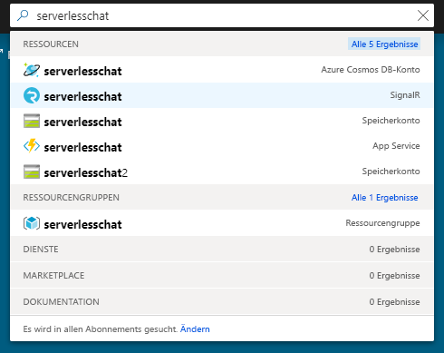
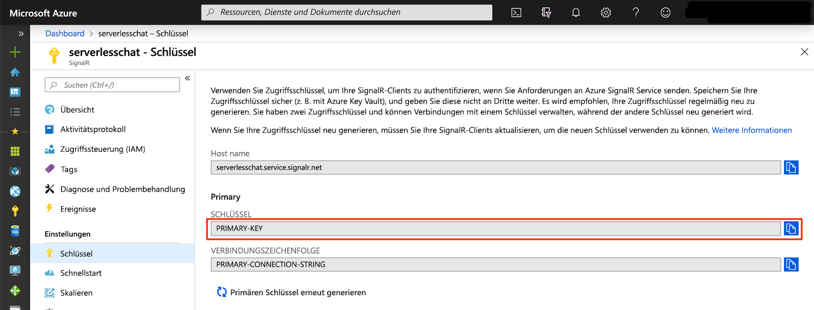

# <a name="quickstart-create-a-chat-room-with-azure-functions-and-signalr-service-using-python"></a>Schnellstart: Erstellen eines Chatraums mit Azure Functions und SignalR Service mithilfe von Python

Mit dem Azure SignalR-Dienst können Sie Ihrer Anwendung ganz einfach Echtzeitfunktionen hinzufügen. Azure Functions ist eine serverlose Plattform, mit der Sie Ihren Code ohne Verwaltung von Infrastruktur ausführen können. Erfahren Sie in diesem Schnellstart, wie Sie den SignalR-Dienst und Azure Functions verwenden, um eine serverlose Chatanwendung in Echtzeit zu erstellen.

## <a name="prerequisites"></a>Voraussetzungen

Dieser Schnellstart kann unter MacOS, Windows oder Linux ausgeführt werden.

Stellen Sie sicher, dass Sie einen Code-Editor wie [Visual Studio Code](https://code.visualstudio.com/) installiert haben.

Installieren Sie die [Azure Functions Core Tools (v2)](https://github.com/Azure/azure-functions-core-tools#installing) (Version 2.7.1505 oder höher), um in Python programmierte Azure Functions-Apps lokal auszuführen.

Azure Functions erfordert [Python 3.6](https://www.python.org/downloads/).

Um Erweiterungen zu installieren, erfordern die Azure Functions Core Tools zurzeit die Installation des [.NET Core SDK](https://www.microsoft.com/net/download). Allerdings sind keine Kenntnisse von .NET erforderlich, um Azure Functions-Apps in Python zu erstellen.

[!INCLUDE [quickstarts-free-trial-note](../../includes/quickstarts-free-trial-note.md)]

## <a name="log-in-to-azure"></a>Anmelden an Azure

Melden Sie sich unter <https://portal.azure.com/> mit Ihrem Azure-Konto beim Azure-Portal an.

[!INCLUDE [Create instance](includes/signalr-quickstart-create-instance.md)]

[!INCLUDE [Clone application](includes/signalr-quickstart-clone-application.md)]

## <a name="configure-and-run-the-azure-function-app"></a>Konfigurieren und Ausführen der Azure Functions-App

1. Bestätigen Sie im Browser, in dem das Azure-Portal geöffnet ist, dass die von Ihnen zuvor bereitgestellte SignalR-Dienstinstanz erfolgreich erstellt wurde, indem Sie nach ihrem Namen im Suchfeld oben im Portal suchen. Wählen Sie die Instanz aus, um sie zu öffnen.

    

1. Wählen Sie **Schlüssel** aus, um die Verbindungszeichenfolgen für die SignalR-Dienstinstanz anzuzeigen.

1. Wählen Sie die primäre Verbindungszeichenfolge aus, und kopieren Sie diese.

    

1. Öffnen Sie in Ihrem Code-Editor den Ordner *src/chat/python* im geklonten Repository.

1. Um Python-Funktionen lokal entwickeln und testen zu können, müssen Sie in einer Python 3.6-Umgebung arbeiten. Führen Sie die folgenden Befehle aus, um eine virtuelle Umgebung mit dem Namen `.venv` zu erstellen und zu aktivieren.

    **Linux oder macOS**:

    ```bash
    python3.6 -m venv .venv
    source .venv/bin/activate
    ```

    **Windows:**

    ```powershell
    py -3.6 -m venv .venv
    .venv\scripts\activate
    ```

1. Benennen Sie *local.settings.sample.json* in *local.settings.json* um.

1. Fügen Sie in **local.settings.json** die Verbindungszeichenfolge in den Wert der **AzureSignalRConnectionString**-Einstellung ein. Speichern Sie die Datei .

1. Python-Funktionen sind in Ordnern organisiert. In jedem Ordner befinden sich zwei Dateien: *function.json* definiert die Bindungen, die in der Funktion verwendet werden, und *\_\_init\_\_.py* ist der Text der Funktion. Es gibt zwei durch HTTP ausgelöste Funktionen in dieser Funktions-App:

    - **negotiate**: Verwendet die *SignalRConnectionInfo*-Eingabebindung, um gültige Verbindungsinformationen zu generieren und zurückzugeben.
    - **messages**: Empfängt eine Chatnachricht im Anforderungstext und verwendet die *SignalR*-Ausgabebindung, um die Nachricht an alle verbundenen Clientanwendungen zu senden.

1. Stellen Sie im Terminal sicher, dass Sie sich im Ordner *src/chat/python* befinden. Verwenden Sie die Azure Functions Core Tools zum Installieren von Erweiterungen, die zum Ausführen der App erforderlich sind.

    ```bash
    func extensions install
    ```

1. Führen Sie die Funktions-App aus.

    ```bash
    func start
    ```

    

[!INCLUDE [Run web application](includes/signalr-quickstart-run-web-application.md)]

[!INCLUDE [Cleanup](includes/signalr-quickstart-cleanup.md)]

## <a name="next-steps"></a>Nächste Schritte

In diesem Schnellstart haben Sie eine serverlose Echtzeitanwendung in VS Code erstellt und ausgeführt. Im nächsten Schritt erfahren Sie mehr darüber, wie Sie Azure Functions aus VS Code bereitstellen.

> [!div class="nextstepaction"]
> [Bereitstellen von Azure Functions mit VS Code](https://code.visualstudio.com/tutorials/functions-extension/getting-started)