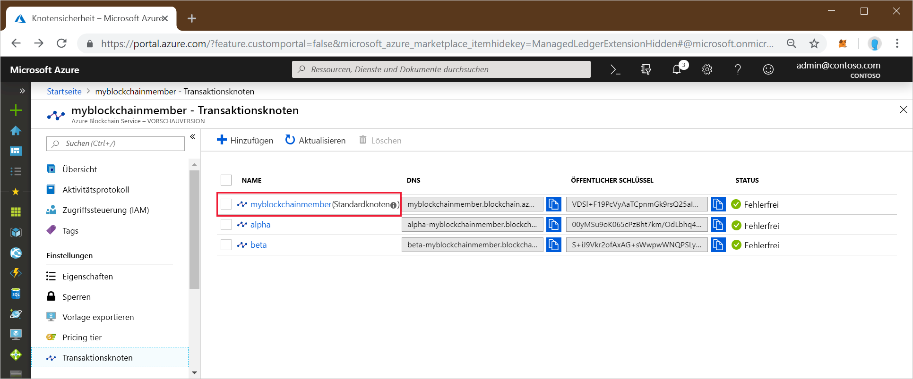
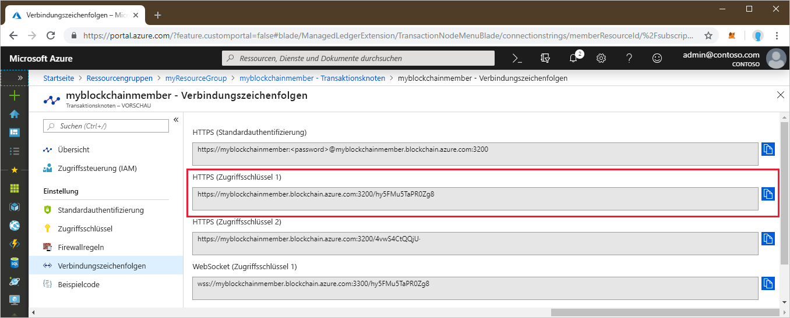

# <a name="quickstart-use-geth-to-connect-to-a-transaction-node"></a>Schnellstart: Herstellen einer Verbindung mit einem Transaktionsknoten mithilfe von Geth

Geth ist ein Go Ethereum-Client, mit dem Sie eine Geth-Instanz an einen Azure Blockchain-Transaktionsknoten anfügen können.

[!INCLUDE [quickstarts-free-trial-note](../../../includes/quickstarts-free-trial-note.md)]

## <a name="prerequisites"></a>Voraussetzungen

* Installieren Sie [Geth](https://github.com/ethereum/go-ethereum/wiki/geth).
* [Quickstart: Create a blockchain member using the Azure portal (Schnellstart: Erstellen eines Blockchainmitglieds über das Azure-Portal)](create-member.md) oder [Schnellstart: Erstellen eines Blockchainmitglieds für den Azure Blockchain-Dienst mithilfe der Azure CLI](create-member-cli.md)

## <a name="get-the-geth-connection-string"></a>Abrufen der Geth-Verbindungszeichenfolge

Die Geth-Verbindungszeichenfolge finden Sie im Azure-Portal.

1. Melden Sie sich beim [Azure-Portal](https://portal.azure.com) an.
1. Navigieren Sie zu Ihrem Azure Blockchain-Mitglied. Klicken Sie auf **Transaktionsknoten** und dann auf den Link „default transaction node“ (Standardtransaktionsknoten).

    

1. Wählen Sie **Connection strings** (Verbindungszeichenfolgen).
1. Kopieren Sie die Verbindungszeichenfolge aus **HTTPS (Access key 1)** (HTTPS (Zugriffsschlüssel 1)). Sie benötigen den Befehl für den nächsten Abschnitt.

    

## <a name="connect-to-geth"></a>Herstellen einer Verbindung mit Geth

1. Öffnen Sie eine Eingabeaufforderung oder Shell.
1. Verwenden Sie den Unterbefehl „geth attach“, um eine Anfügung an die ausgeführte Geth-Instanz auf Ihrem Transaktionsknoten durchzuführen. Fügen Sie die Verbindungszeichenfolge als Argument für den Unterbefehl ein. Beispiel:

    ```
    geth attach <connection string>
    ```

1. Sobald eine Verbindung mit der Ethereum-Konsole des Transaktionsknotens hergestellt wurde, können Sie die Web3-JavaScript- DApp-API oder die Administrator-API aufrufen.

    Mit der folgenden API können Sie beispielsweise den Wert von chainId ermitteln:

    ```bash
    admin.nodeInfo.protocols.istanbul.config.chainId
    ```

    In diesem Fall lautet der Wert von chainId 297.

    

1. Geben Sie `exit` ein, um die Verbindung zur Konsole zu trennen.

## <a name="next-steps"></a>Nächste Schritte

In diesem Schnellstart haben Sie den Geth-Client verwendet, um eine Anfügung an eine Geth-Instanz auf einem Azure Blockchain-Transaktionsknoten durchzuführen. Im nächsten Tutorial erfahren Sie, wie Sie das Azure Blockchain Development Kit für Ethereum und Truffle verwenden, um eine Smart Contract-Funktion über eine Transaktion zu erstellen, bereitstellen und auszuführen.

> [!div class="nextstepaction"]
> [Erstellen und Bereitstellen von Smart Contracts mithilfe von Visual Studio Code](send-transaction.md)