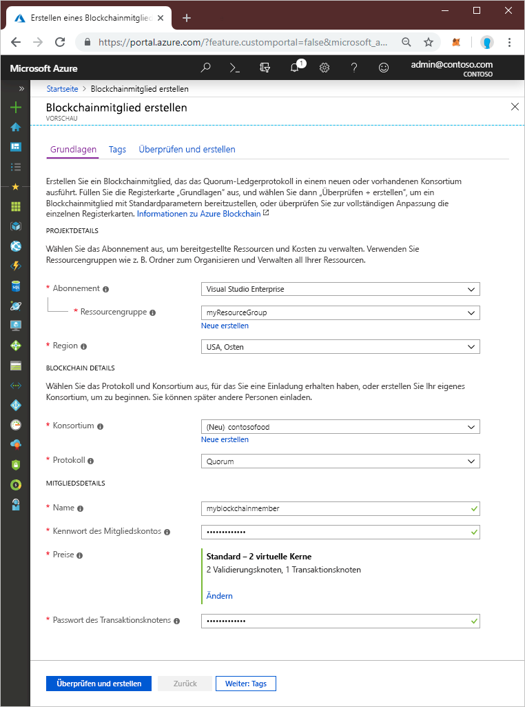
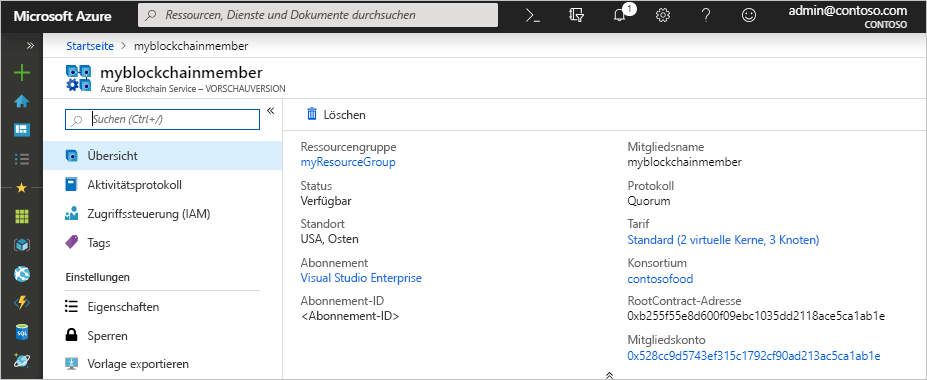

# Schnellstart: Erstellen eines Blockchainmitglieds für Azure Blockchain Service mithilfe des Azure-Portals

Bei Azure Blockchain handelt es sich um eine Blockchainplattform, über die Sie Ihre Geschäftslogik in einem Smart Contract ausführen können. In dieser Schnellstartanleitung wird veranschaulicht, wie Sie zum Einstieg ein Blockchainmitglied über das Azure-Portal erstellen.

[!INCLUDE [quickstarts-free-trial-note](../../../includes/quickstarts-free-trial-note.md)]

## Erstellen eines Blockchainmitglieds

Erstellen Sie ein Blockchainmitglied, das das Quorum-Ledgerprotokoll in einem neuen oder vorhandenen Konsortium ausführt.

1. Melden Sie sich beim [Azure-Portal](https://portal.azure.com) an.
1. Klicken Sie im Azure-Portal links oben auf **Ressource erstellen**.
1. Wählen Sie **Blockchain** > **Azure Blockchain Service** aus.
1. Vervollständigen Sie die Vorlage.

    

    Einstellung | BESCHREIBUNG
    --------|------------
    Blockchainmitglied | Wählen Sie einen eindeutiger Namen aus, der Ihr Blockchainmitglied in Azure Blockchain Service identifiziert. Der Name des Blockchainmitglieds darf nur Kleinbuchstaben und Zahlen enthalten. Das erste Zeichen muss ein Buchstabe sein. Der Wert muss zwischen 2 und 20 Zeichen umfassen.
    Subscription | Wählen Sie das Azure-Abonnement aus, das Sie für Ihren Dienst verwenden möchten. Falls Sie über mehrere Abonnements verfügen, wählen Sie das Abonnement aus, über das die Ressource abgerechnet wird.
    Resource group | Ein neuer Ressourcengruppenname oder ein bereits vorhandener Name aus Ihrem Abonnement
    Region | Der Speicherort muss für alle Mitglieder des Konsortiums identisch sein.
    Mitgliedskontokennwort | Das Mitgliedskontokennwort wird zum Verschlüsseln des privaten Schlüssels für das Ethereum-Konto verwendet, das für Ihr Mitglied erstellt wird. Sie verwenden das Mitgliedskonto und das Mitgliedskontokennwort für die Verwaltung des Konsortiums.
    Konsortiumsname | Geben Sie für ein neues Konsortium einen eindeutigen Namen ein. Wenn Sie einem Konsortium über eine Einladung beitreten, entspricht der Wert dem Konsortium, dem Sie beitreten.
    BESCHREIBUNG | Beschreibung des Konsortiums.
    Protocol |  Die Vorschauversion unterstützt das Quorum-Protokoll.
    Preise | Die Knotenkonfiguration für Ihren neuen Dienst. Wählen Sie **Standard** aus. Die Standardeinstellung umfasst zwei Validierungsknoten und einen Transaktionsknoten.
    Kennwort des Transaktionsknotens | Das Kennwort für den Standardtransaktionsknoten des Mitglieds. Verwenden Sie das Kennwort für die Standardauthentifizierung, wenn Sie eine Verbindung mit dem öffentlichen Endpunkt des Standardtransaktionsknotens des Blockchainmitglieds herstellen.

1. Wählen Sie **Erstellen** aus, um den Dienst bereitzustellen. Die Bereitstellung dauert ungefähr 10 Minuten.
1. Klicken Sie in der Symbolleiste auf **Benachrichtigungen**, um den Bereitstellungsprozess zu überwachen.
1. Wenn die Bereitstellung abgeschlossen ist, navigieren Sie zu Ihrem Blockchainmitglied.

Klicken Sie auf **Übersicht**, um die grundlegenden Informationen über Ihren Dienst, einschließlich der RootContract-Adresse und des Mitgliedskontos, anzuzeigen.

## Bereinigen von Ressourcen

Das von Ihnen erstellte Mitglied können Sie für die nächste Schnellstartanleitung oder das nächste Tutorial verwenden. Wenn Ressourcen nicht mehr benötigt werden, können Sie diese löschen, indem Sie die `myResourceGroup`-Ressourcengruppe löschen, die Sie mit Azure Blockchain erstellt haben.

So löschen Sie die Ressourcengruppe:

1. Navigieren Sie im Azure-Portal im linken Navigationsbereich zu **Ressourcengruppe**, und wählen Sie die Ressourcengruppe aus, die gelöscht werden soll.
2. Wählen Sie die Option **Ressourcengruppe löschen**. Überprüfen Sie den Löschvorgang, indem Sie den Ressourcengruppennamen eingeben und auf **Löschen** klicken.

## Nächste Schritte

> [!div class="nextstepaction"]
> [Verwenden von MetaMask zum Verbinden und Bereitstellen eines Smart Contracts](connect-metamask.md)