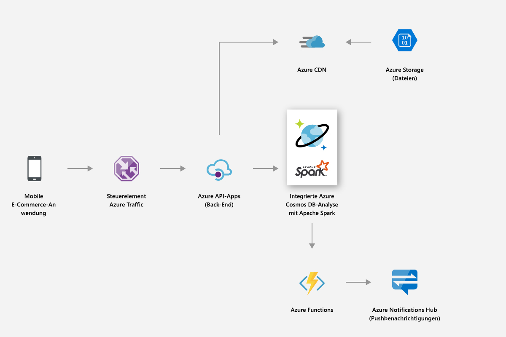
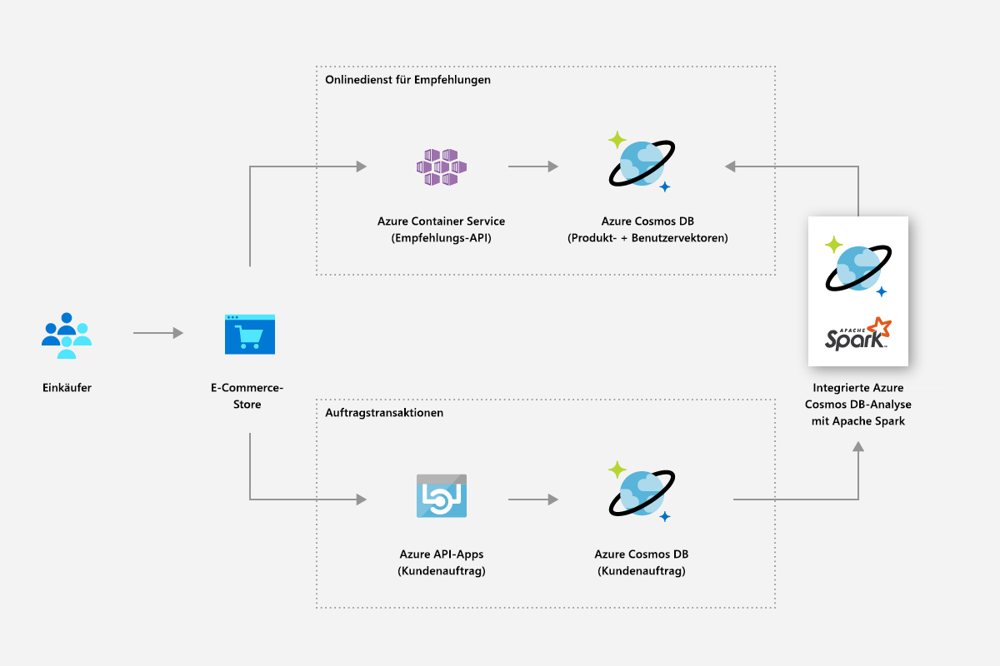
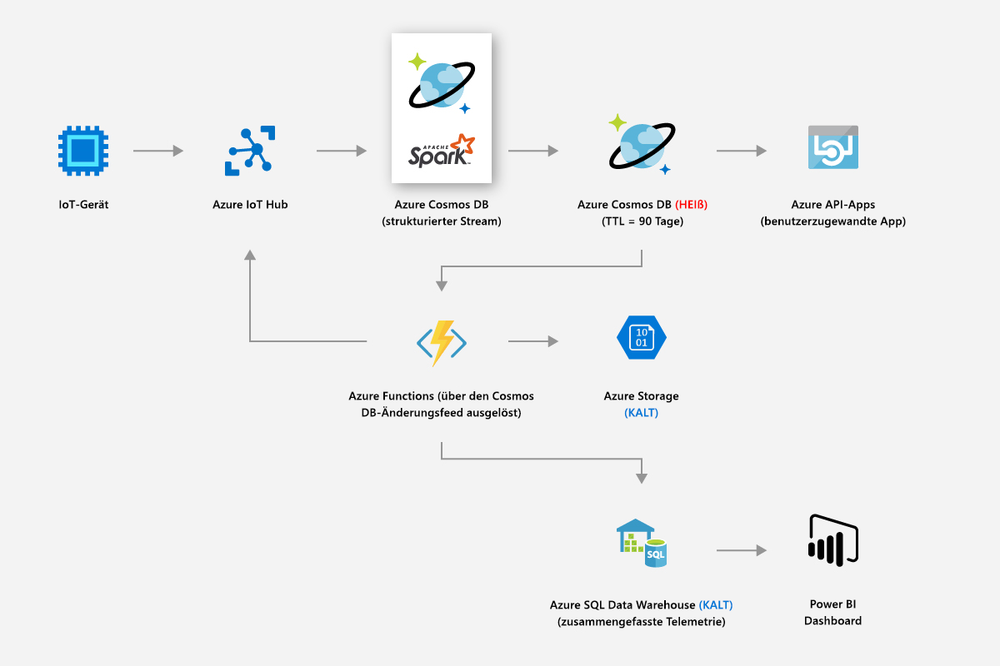
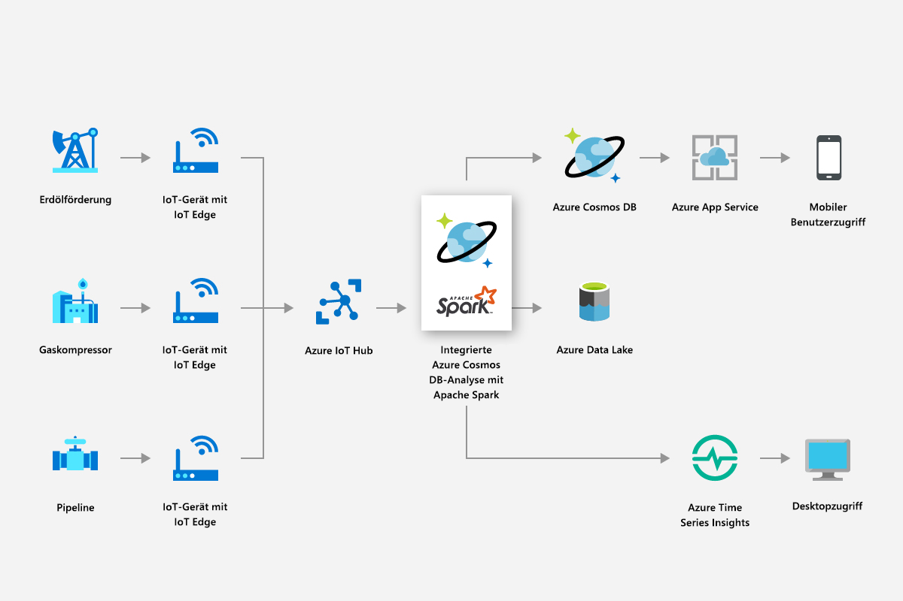
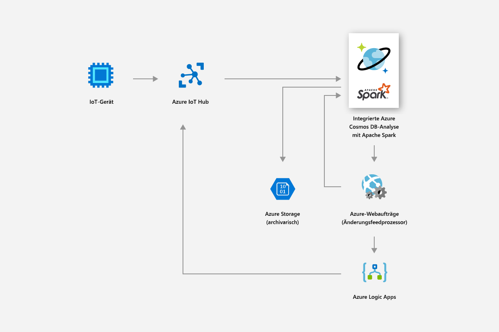
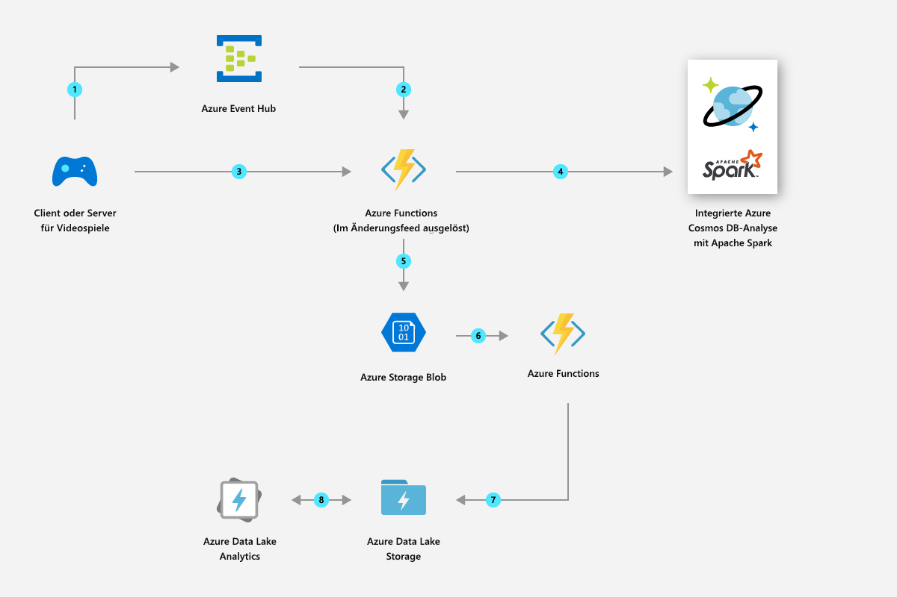

# Lösungen, die global verteilte Analysen in Azure Cosmos DB verwenden

Dieser Artikel beschreibt die Lösungen, die mit der global verteilten Analyse in Azure Cosmos DB erstellt werden können.

## Einzelhandel und Konsumgüter

Sie können die Spark-Unterstützung in Azure Cosmos DB nutzen, um Empfehlungen und Angebote in Echtzeit bereitzustellen. Mit der Personalisierung in Echtzeit und den Produktempfehlungen können Sie Ihren Kunden helfen, die erforderlichen Artikel zu finden.

* Sie können die integrierte Machine Learning-Unterstützung der Apache Spark-Runtime verwenden, um Empfehlungen für alle Produktkataloge in Echtzeit zu generieren.

* Sie können Clickstreamdaten, Kaufdaten und Kundendaten analysieren, um gezielte Empfehlungen zu geben, die den Lebensdauerwert erhöhen.

* Mit dem globalen Verteilungsfeature von Azure Cosmos DB können große Mengen an Produktdaten, die über Regionen verteilt sind, in Millisekunden analysiert werden.

* Sie können schnell Erkenntnisse zu den geografisch verteilten Benutzern und Daten gewinnen. Sie können die Konvertierungsrate für Aktionen verbessern, indem Sie die richtige Anzeige zur richtigen Zeit für den richtigen Benutzer bereitstellen.

* Sie können die integrierte Spark-Streamingfunktion nutzen, um Livedaten aufzuwerten, indem Sie sie mit statischen Kundendaten kombinieren. Auf diese Weise können Sie personalisiertere und gezieltere Anzeigen in Echtzeit und in Bezug auf die Tätigkeit des Kunden bereitstellen.

Die folgende Abbildung zeigt, wie die Spark-Unterstützung von Azure Cosmos DB zur Optimierung von Preisen und Werbeaktionen verwendet wird:

Die folgende Abbildung zeigt, wie die Spark-Unterstützung von Azure Cosmos DB in der Empfehlungs-Engine in Echtzeit verwendet wird:

## Fertigung und IoT

Die integrierte Analyseplattform von Azure Cosmos DB ermöglicht Ihnen die Echtzeitanalyse von IoT-Daten von Millionen von Geräten auf globaler Ebene. Sie können moderne Innovationen wie die Vorhersage von Wetterverhältnissen, Vorhersageanalysen und Energieoptimierungen durchführen.

* Mithilfe von Azure Cosmos DB können Sie Daten wie Echtzeit-Ressourcenmetriken und Wetterfaktoren analysieren und dann Smart Grid-Analysen anwenden, um die Leistung der angeschlossenen Geräte in der Praxis zu optimieren. Die Smart Grid-Analysen sind der Schlüssel zur Kontrolle der Betriebskosten, zur Verbesserung der Netzsicherheit und zur Bereitstellung personalisierter Energiedienstleistungen für Verbraucher.

Die folgende Abbildung zeigt, wie die Spark-Unterstützung von Azure Cosmos DB verwendet wird, um Metriken von IoT-Geräten zu lesen und Smart Grid-Analysen anzuwenden:

## Predictive Maintenance

* Die Instandhaltung von Ressourcen wie Kompressoren, die in kleinen Bohranlagen auf Hochseeplattformen eingesetzt werden, ist ein komplexes Unterfangen. Diese Ressourcen sind weltweit verteilt und generieren Petabytes an Daten. Mithilfe von Azure Cosmos DB können Sie eine End-to-End-Datenpipeline für die Vorhersage aufbauen, die Spark-Streaming verwendet, um große Mengen an Sensortelemetrie zu verarbeiten, Ressourcenteile zu lagern und Sensorzuordnungsdaten zu speichern.

* Sie können Machine Learning-Modelle erstellen und bereitstellen, um Ressourcenausfälle vor dem Auftreten vorherzusagen und Wartungsaufträge zu erteilen, bevor der Fehler auftritt.

In der folgenden Abbildung wird gezeigt, wie die Spark-Unterstützung von Azure Cosmos DB zum Erstellen eines prädiktiven Wartungssystems verwendet wird:

In der folgenden Abbildung wird gezeigt, wie die Spark-Unterstützung von Azure Cosmos DB zum Erstellen eines Echtzeit-Fahrzeugdiagnosesystems verwendet wird:

## Spiele

* Mit der integrierten Spark-Unterstützung ermöglicht Ihnen Azure Cosmos DB die einfache Erstellung, Skalierung und Bereitstellung fortschrittlicher Analyse- und Machine Learning-Modelle in wenigen Minuten, um das bestmögliche Spieleerlebnis zu schaffen.

* Sie können Spieler-, Kauf- und Verhaltensdaten analysieren, um relevante personalisierte Angebote zu erstellen, um hohe Konvertierungsraten zu erzielen.

* Mit Spark Machine Learning können Sie Telemetriedaten zu Spielen analysieren und entsprechende Erkenntnisse gewinnen. Sie können langsame Ladezeiten und Probleme im Spiel diagnostizieren und verhindern.

In der folgenden Abbildung wird gezeigt, wie die Spark-Unterstützung von Azure Cosmos DB für die Analyse von Spielen verwendet wird:

## Nächste Schritte

* Weitere Informationen zu den Vorzügen von Azure Cosmos DB finden Sie im [Übersichtsartikel](introduction.md).
* [Erste Schritte mit der Azure Cosmos DB-API für MongoDB](mongodb-introduction.md)
* [Erste Schritte mit der Cassandra-API von Azure Cosmos DB](cassandra-introduction.md)
* [Erste Schritte mit der Gremlin-API von Azure Cosmos DB](graph-introduction.md)
* [Erste Schritte mit der Tabellen-API von Azure Cosmos DB](table-introduction.md)
