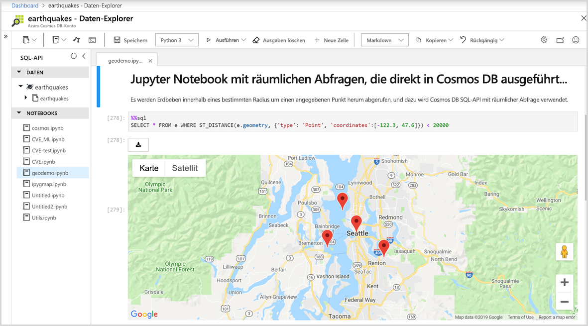

# Integrierte Unterstützung von Jupyter-Notebooks in Azure Cosmos DB

Jupyter Notebook ist eine Open-Source-Webanwendung, mit der Sie Dokumente erstellen und freigeben können, die Livecode, Gleichungen, Visualisierungen und beschreibenden Text enthalten. Azure Cosmos DB unterstützt integrierte Jupyter Notebooks für alle APIs wie Cassandra, MongoDB, SQL, Gremlin und Tabellen. Die integrierte Unterstützung für Notebooks für alle Azure Cosmos DB-APIs und -Datenmodelle ermöglichen Ihnen die Ausführung interaktiver Abfragen. Die Jupyter-Notebooks werden unter den Azure Cosmos-Konten ausgeführt und ermöglichen Entwicklern die Durchführung von Datenuntersuchungen, Datenbereinigungen, Datentransformationen, numerischen Simulationen, statistischer Modellierung, Datenvisualisierung und maschinellem Lernen.

Die Jupyter-Notebooks unterstützen Magic-Befehle, die die Funktionen des Kernels um zusätzliche Befehle erweitern. Mit einem Magic-Befehl von Cosmos können die Funktionen des Python-Kernels im Jupyter-Notebook so erweitert werden, dass Sie Azure Cosmos-SQL-API-Abfragen zusätzlich zu Apache Spark ausführen können. Sie können Python- und SQL-API-Abfragen leicht kombinieren, um Daten abzufragen und zu visualisieren, indem Sie umfassende Visualisierungsbibliotheken verwenden, die in Renderbefehle integriert sind.
Im Azure-Portal ist die Benutzeroberfläche für Jupyter-Notebooks nativ in Azure Cosmos-Konten integriert. Dies ist in der folgenden Abbildung dargestellt:

## Vorteile von Jupyter-Notebooks

Jupyter-Notebooks wurden ursprünglich für Data Science-Anwendungen entwickelt, die in Python/R geschrieben wurden. Sie können aber auf verschiedene Weise auch für andere Arten von Projekten verwendet werden, z. B.:

* ***Datenvisualisierungen:** Mit Jupyter-Notebooks können Sie Daten in Form eines gemeinsam verwendeten Notebooks visualisieren, mit dem ein Dataset als Grafik gerendert wird. Ein Jupyter-Notebook ermöglicht Ihnen das Verfassen und Freigeben von Visualisierungen und das Vornehmen von interaktiven Änderungen am freigegebenen Code und Dataset.

* **Codefreigabe:** Dienste wie GitHub verfügen über Möglichkeiten zum Freigeben von Code, aber sie sind größtenteils nicht interaktiv. Mit einem Jupyter-Notebook können Sie Code anzeigen und ausführen und die Ergebnisse direkt im Azure-Portal darstellen.

* **Liveinteraktionen mit Code:** Jupyter-Notebook-Code ist dynamisch. Er kann bearbeitet und in Echtzeit inkrementell erneut ausgeführt werden. Mit Notebooks können auch Benutzersteuerelemente (z. B. Schieberegler oder Texteingabefelder) eingebettet werden, die als Eingabequellen für Code, Demos oder Proof of Concepts (POCs) genutzt werden können.

* **Dokumentation zu Codebeispielen und Ergebnisse von Datenuntersuchungen:** Wenn Sie über ein Codeelement verfügen, dessen Funktionsweise Sie in Azure Cosmos DB mit Echtzeitausgabe Zeile für Zeile erläutern möchten, können Sie es in ein Jupyter-Notebook einbetten. Der Code bleibt voll funktionsfähig. Sie können mit der Interaktivität gleichzeitig die Dokumentation hinzufügen.

* **Magic-Befehle von Cosmos:** In Jupyter-Notebooks können Sie benutzerdefinierte Magic-Befehle für Azure Cosmos DB verwenden, um das interaktive Computing zu vereinfachen. Ein Beispiel hierfür ist der Magic-Befehl „%%sql“, der Ihnen das Abfragen eines Cosmos-Containers per SQL-API direkt in einem Notebook ermöglicht.

* **Umgebung vom Typ „Alles an einem Ort“:** Bei Jupyter-Notebooks werden Code, Rich Text, Bilder, Videos, Animationen, mathematische Gleichungen, Plots, Karten, interaktive Werte, Widgets und grafische Benutzeroberflächen zu einem Dokument kombiniert.

## Komponenten eines Jupyter-Notebooks

Jupyter-Notebooks können mehrere Arten von Komponenten enthalten, die jeweils als diskrete Blöcke organisiert sind:

* **Text und HTML:** Nur-Text oder in der Markdownsyntax kommentierter Text zum Generieren von HTML-Code kann jederzeit in das Dokument eingefügt werden. CSS-Stile können auch inline eingefügt oder der Vorlage hinzugefügt werden, die zum Generieren des Notebooks verwendet wird.

* **Code und Ausgabe:** Jupyter-Notebooks unterstützen Python-Code. Die Ergebnisse des ausgeführten Codes werden direkt nach den Codeblöcken angezeigt, und die Codeblöcke können mehrfach in beliebiger Reihenfolge ausgeführt werden.

* **Visualisierungen:** Grafiken und Diagramme können aus dem Code generiert werden, indem Module wie Matplotlib, Plotly oder Bokeh genutzt werden. Ähnlich wie bei der Ausgabe werden diese Visualisierungen inline neben dem Code angezeigt, mit dem sie generiert werden.

* **Multimedia:** Da das Jupyter-Notebook auf Webtechnologie basiert, können alle Arten von Multimediaelementen angezeigt werden, die auf einer Webseite unterstützt werden. Sie können sie als HTML-Elemente in ein Notebook einbetten oder mit dem `IPython.display`-Modul programmgesteuert generieren.

* **Daten:** Daten aus Azure Cosmos-Containern und die Ergebnisse der Abfragen können programmgesteuert in ein Jupyter-Notebook importiert werden. Ein Beispiel hierfür ist das Einfügen von Code in das Notebook zum Abfragen der Daten, indem eine der Cosmos DB-APIs oder nativ integriertes Apache Spark verwendet wird.

## Nächste Schritte

Informationen zu den ersten Schritten mit integrierten Jupyter-Notebooks in Azure Cosmos DB finden Sie in den folgenden Artikeln:

* [Enable notebooks in an Azure Cosmos account](enable-notebooks.md) (Aktivieren von Notebooks in einem Azure Cosmos-Konto)
* [Use notebook features and commands](use-notebook-features-and-commands.md) (Verwenden von Notebookfeatures und -befehlen)

