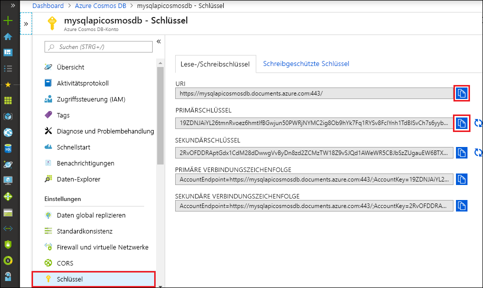

# <a name="quickstart-build-a-python-application-using-an-azure-cosmos-db-sql-api-account"></a>Schnellstart: Erstellen einer Python-Anwendung mithilfe eines SQL-API-Kontos für Azure Cosmos DB

> [!div class="op_single_selector"]
> * [.NET V3](create-sql-api-dotnet.md)
> * [.NET V4](create-sql-api-dotnet-V4.md)
> * [Java](create-sql-api-java.md)
> * [Node.js](create-sql-api-nodejs.md)
> * [Python](create-sql-api-python.md)
> * [Xamarin](create-sql-api-xamarin-dotnet.md)

In dieser Schnellstartanleitung wird veranschaulicht, wie Sie mithilfe des Azure-Portals ein [SQL-API-Konto](sql-api-introduction.md), eine Dokumentdatenbank und einen Container für Azure Cosmos DB erstellen. Anschließend erstellen Sie eine auf dem Python SDK für [SQL-API](sql-api-sdk-python.md) basierende Konsolen-App und führen sie aus.

Azure Cosmos DB ist der global verteilte Microsoft-Datenbankdienst mit mehreren Modellen. Sie können Dokumente, Schlüssel/Werte, Datenbanken mit breiten Spalten und Graphdatenbanken schnell erstellen und abfragen. Alle diese Vorgänge profitieren von den Verteilungs- und Skalierungsoptionen von Azure Cosmos DB.

In diesem Schnellstart wird Version 4 des [Python SDK](https://pypi.org/project/azure-cosmos/#history) verwendet.

[!INCLUDE [quickstarts-free-trial-note](../../includes/quickstarts-free-trial-note.md)][!INCLUDE [cosmos-db-emulator-docdb-api](../../includes/cosmos-db-emulator-docdb-api.md)]

## <a name="prerequisites"></a>Voraussetzungen

* [Python 3.6 oder höher](https://www.python.org/downloads/) mit der ausführbaren `python`-Datei unter Ihrem Pfad (`PATH`).
* [Visual Studio Code](https://code.visualstudio.com/)
* [Python-Erweiterung für Visual Studio Code](https://marketplace.visualstudio.com/items?itemName=ms-python.python#overview)

## <a name="create-a-database-account"></a>Erstellen eines Datenbankkontos

[!INCLUDE [cosmos-db-create-dbaccount](../../includes/cosmos-db-create-dbaccount.md)]

## <a name="add-a-container"></a>Hinzufügen eines Containers

[!INCLUDE [cosmos-db-create-collection](../../includes/cosmos-db-create-collection.md)]

## <a name="add-sample-data"></a>Hinzufügen von Beispieldaten

[!INCLUDE [cosmos-db-create-sql-api-add-sample-data](../../includes/cosmos-db-create-sql-api-add-sample-data.md)]

## <a name="query-your-data"></a>Abfragen Ihrer Daten

[!INCLUDE [cosmos-db-create-sql-api-query-data](../../includes/cosmos-db-create-sql-api-query-data.md)]

## <a name="clone-the-sample-application"></a>Klonen der Beispielanwendung

Klonen Sie zunächst eine SQL-API-App aus GitHub, legen Sie die Verbindungszeichenfolge fest, und führen Sie sie aus.

1. Öffnen Sie eine Eingabeaufforderung, erstellen Sie einen neuen Ordner namens „git-samples“, und schließen Sie die Eingabeaufforderung.

    ```cmd
    md "git-samples"
    ```
   Bei einer Bash-Eingabeaufforderung sollten Sie stattdessen den folgenden Befehl verwenden:

   ```bash
   mkdir "git-samples"
   ```

2. Öffnen Sie ein Git-Terminalfenster (z.B. git bash), und verwenden Sie den Befehl `cd`, um in den neuen Ordner zu gelangen und dort die Beispiel-App zu installieren.

    ```bash
    cd "git-samples"
    ```

3. Führen Sie den folgenden Befehl aus, um das Beispielrepository zu klonen. Dieser Befehl erstellt eine Kopie der Beispiel-App auf Ihrem Computer. 

    ```bash
    git clone https://github.com/Azure-Samples/azure-cosmos-db-python-getting-started.git
    ```  

## <a name="update-your-connection-string"></a>Aktualisieren der Verbindungszeichenfolge

Wechseln Sie nun zurück zum Azure-Portal, um die Informationen der Verbindungszeichenfolge abzurufen und in die App zu kopieren.

1. Wählen Sie im [Azure-Portal](https://portal.azure.com/) unter Ihrem Azure Cosmos-Konto im Navigationsbereich auf der linken Seite **Schlüssel** aus. Mithilfe der Schaltflächen zum Kopieren auf der rechten Seite des Bildschirms kopieren Sie im nächsten Schritt den **URI** und den **Primärschlüssel** in die Datei `cosmos_get_started.py`.

    

2. Öffnen Sie die Datei `cosmos_get_started.py` in „\git-samples\azure-cosmos-db-python-getting-started“ in Visual Studio Code.

3. Kopieren Sie den **URI**-Wert aus dem Portal (mithilfe der Schaltfläche zum Kopieren), und legen Sie ihn in ``cosmos_get_started.py`` als Wert der Variablen **endpoint** fest. 

    `endpoint = 'https://FILLME.documents.azure.com',`

4. Kopieren Sie anschließend den Wert für **PRIMARY KEY** aus dem Portal, und legen Sie ihn als Wert von **key** in ``cosmos_get_started.py`` fest. Sie haben die App nun mit allen erforderlichen Informationen für die Kommunikation mit Azure Cosmos DB aktualisiert. 

    `key = 'FILLME'`

5. Speichern Sie die Datei ``cosmos_get_started.py``.

## <a name="review-the-code"></a>Überprüfen des Codes

Dieser Schritt ist optional. Informieren Sie sich über die im Code erstellten Datenbankressourcen, oder springen Sie weiter zu [Aktualisieren der Verbindungszeichenfolge](#update-your-connection-string).

Die folgenden Codeausschnitte stammen alle aus der Datei `cosmos_get_started.py`.

* Der CosmosClient wird initialisiert. Achten Sie darauf, die Werte für „endpoint“ und „key“ zu aktualisieren, wie im Abschnitt [Aktualisieren der Verbindungszeichenfolge](#update-your-connection-string) beschrieben. 

    [!code-python[](~/azure-cosmos-db-python-getting-started/cosmos_get_started.py?name=create_cosmos_client)]

* Es wird eine neue Datenbank erstellt.

    [!code-python[](~/azure-cosmos-db-python-getting-started/cosmos_get_started.py?name=create_database_if_not_exists)]

* Eine neuer Container mit 400 RU/s an [bereitgestelltem Durchsatz](request-units.md) wird erstellt. Wir wählen `lastName` als [Partitionsschlüssel](partitioning-overview.md#choose-partitionkey) aus. Dies ermöglicht uns die Durchführung von effizienten Abfragen, bei denen nach dieser Eigenschaft gefiltert wird. 

    [!code-python[](~/azure-cosmos-db-python-getting-started/cosmos_get_started.py?name=create_container_if_not_exists)]

* Einige Elemente werden dem Container hinzugefügt. Bei Containern handelt es sich um eine Sammlung von Elementen (JSON-Dokumente), die unterschiedliche Schemas aufweisen können. Die ```get_[name]_family_item```-Hilfsmethoden geben Darstellungen einer Familie zurück, die in Azure Cosmos DB als JSON-Dokumente gespeichert sind.

    [!code-python[](~/azure-cosmos-db-python-getting-started/cosmos_get_started.py?name=create_item)]

* Punktlesevorgänge (Schlüsselwertsuchen) werden mit der `read_item`-Methode durchgeführt. Wir geben die [RU-Gebühr](request-units.md) für jeden Vorgang aus.
    [!code-python[](~/azure-cosmos-db-python-getting-started/cosmos_get_started.py?name=read_item)]

* Für die Durchführung einer Abfrage wird die SQL-Abfragesyntax verwendet. Da wir Partitionsschlüsselwerte von ```lastName``` in der WHERE-Klausel verwenden, wird diese Abfrage von Azure Cosmos DB auf effiziente Weise an die relevanten Partitionen weitergeleitet, um die Leistung zu verbessern.

    [!code-python[](~/azure-cosmos-db-python-getting-started/cosmos_get_started.py?name=query_items)]
   
## <a name="run-the-app"></a>Ausführen der App

1. Klicken Sie in Visual Studio Code auf **Ansicht** > **Befehlspalette**. 

2. Geben Sie an der Eingabeaufforderung **Python: Select Interpreter** ein, und wählen Sie die gewünschte Python-Version aus.

    Die Fußzeile in Visual Studio Code wird mit dem ausgewählten Interpreter aktualisiert. 

3. Klicken Sie auf **Ansicht** > **Integriertes Terminal**, um das in Visual Studio Code integrierte Terminal zu öffnen.

4. Vergewissern Sie sich im Fenster des integrierten Terminals, dass Sie sich im Ordner „azure-cosmos-db-python-getting-started“ befinden. Wechseln Sie andernfalls mithilfe des folgenden Befehls zum Beispielordner: 

    ```cmd
    cd "\git-samples\azure-cosmos-db-python-getting-started"`
    ```

5. Führen Sie den folgenden Befehl aus, um das Paket „azure-cosmos“ zu installieren: 

    ```python
    pip install --pre azure-cosmos
    ```

    Sollte beim Installieren von „azure-cosmos“ eine Fehlermeldung mit dem Hinweis angezeigt werden, dass der Zugriff verweigert wurde, müssen Sie [Visual Studio Code als Administrator ausführen](https://stackoverflow.com/questions/37700536/visual-studio-code-terminal-how-to-run-a-command-with-administrator-rights).

6. Führen Sie den folgenden Befehl aus, um das Beispiel auszuführen und neue Dokumente in Azure Cosmos DB zu erstellen und zu speichern:

    ```python
    python cosmos_get_started.py
    ```

7. Wählen Sie im Azure-Portal **Daten-Explorer** > **AzureSampleFamilyDatabase** > **Elemente** aus, um sich zu vergewissern, dass die neuen Elemente erstellt und gespeichert wurden. Zeigen Sie die Elemente an, die erstellt wurden. Hier ist als Referenz ein JSON-Beispieldokument für die Familie Andersen angegeben:

```json
{
    "id": "Andersen-1569479288379",
    "lastName": "Andersen",
    "district": "WA5",
    "parents": [
        {
            "familyName": null,
            "firstName": "Thomas"
        },
        {
            "familyName": null,
            "firstName": "Mary Kay"
        }
    ],
    "children": null,
    "address": {
        "state": "WA",
        "county": "King",
        "city": "Seattle"
    },
    "registered": true,
    "_rid": "8K5qAIYtZXeBhB4AAAAAAA==",
    "_self": "dbs/8K5qAA==/colls/8K5qAIYtZXc=/docs/8K5qAIYtZXeBhB4AAAAAAA==/",
    "_etag": "\"a3004d78-0000-0800-0000-5d8c5a780000\"",
    "_attachments": "attachments/",
    "_ts": 1569479288
}
```

## <a name="review-slas-in-the-azure-portal"></a>Überprüfen von SLAs im Azure-Portal

[!INCLUDE [cosmosdb-tutorial-review-slas](../../includes/cosmos-db-tutorial-review-slas.md)]

## <a name="clean-up-resources"></a>Bereinigen von Ressourcen

[!INCLUDE [cosmosdb-delete-resource-group](../../includes/cosmos-db-delete-resource-group.md)]

## <a name="next-steps"></a>Nächste Schritte

In diesem Schnellstart haben Sie gelernt, wie Sie ein Azure Cosmos-Konto erstellen, einen Container mit dem Daten-Explorer erstellen und eine App ausführen. Jetzt können Sie zusätzliche Daten in Ihr Cosmos DB-Konto importieren. 

> [!div class="nextstepaction"]
> [Importieren von Daten in Azure Cosmos DB für die SQL-API](import-data.md)


