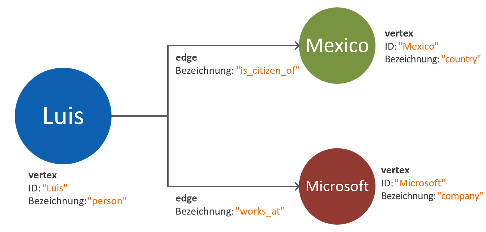
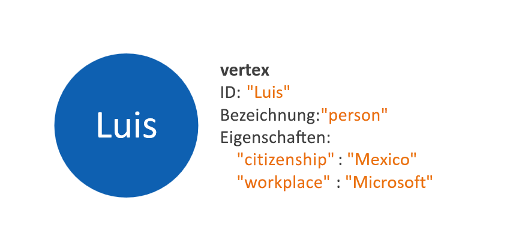
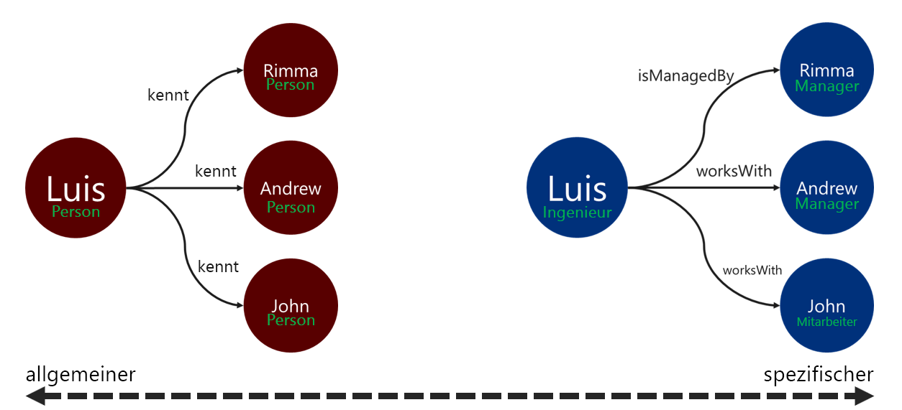

# Modellieren von Graphdaten für die Gremlin-API von Azure Cosmos DB

Das folgende Dokument enthält Empfehlungen für die Modellierung von Graphdaten. Dieser Schritt ist entscheidend, um die Skalierbarkeit und Leistung eines Graphdatenbanksystems zu gewährleisten, auch wenn sich die Daten weiterentwickeln. Ein effizientes Datenmodell ist insbesondere bei großen Graphen wichtig.

## Requirements (Anforderungen)

Der in dieser Anleitung beschriebene Prozess basiert auf folgenden Annahmen:
 * Die **Entitäten** im Aufgabenbereich sind bekannt. Diese Entitäten müssen bei jeder Anforderung _atomisch_ genutzt werden. Das heißt, das Datenbanksystem ist nicht darauf ausgelegt, die Daten einer einzelnen Entität in mehreren Abfrageanforderungen abzurufen.
 * Die **Lese- und Schreibanforderungen** für das Datenbanksystem sind bekannt. Von diesen Anforderungen hängt ab, welche Optimierungen für das Graphdatenmodell erforderlich sind.
 * Die Prinzipien des [Eigenschaftsgraph-Standards von Apache Tinkerpop](http://tinkerpop.apache.org/docs/current/reference/#graph-computing) sind bekannt.

## Wann benötige ich eine Graphdatenbank?

Eine Graphdatenbanklösung kann optimal angewendet werden, wenn die Entitäten und Beziehungen in einer Datendomäne folgende Merkmale aufweisen: 

* Die Entitäten sind durch beschreibende Beziehungen **stark vernetzt**. Der Vorteil in diesem Szenario besteht darin, dass die Beziehungen persistent gespeichert werden.
* Es gibt **zyklische Beziehungen** und **Entitäten mit Selbstverweis**. Dieses Muster stellt bei relationalen Datenbanken oder Dokumentdatenbanken häufig eine Herausforderung dar.
* Zwischen Entitäten gibt es **Beziehungen, die sich dynamisch entwickeln**. Dieses Muster ist insbesondere bei hierarchischen oder auf einer Baumstruktur basierenden Daten mit zahlreichen Ebenen anzutreffen.
* Zwischen Entitäten gibt es **m:n-Beziehungen**.
* Es gibt **Schreib- und Leseanforderungen (sowohl für Entitäten als auch für Beziehungen)** . 

Sind die obigen Kriterien erfüllt, hat ein Ansatz mit einer Graphdatenbank voraussichtlich Vorteile für die **Abfragekomplexität**, die **Skalierbarkeit des Datenmodells** und die **Abfrageleistung**.

Im nächsten Schritt muss bestimmt werden, ob der Graph für Analysen oder für Transaktionen verwendet wird. Wenn der Graph für Workloads mit hohen Rechen- und Datenverarbeitungsanforderungen vorgesehen ist, sollten Sie sich mit dem [Cosmos DB Spark-Connector](https://docs.microsoft.com/azure/cosmos-db/spark-connector) sowie mit der Verwendung der [GraphX-Bibliothek](https://spark.apache.org/graphx/) vertraut machen. 

## Verwenden von Graphobjekten

Im [Eigenschaftsgraph-Standard von Apache Tinkerpop](http://tinkerpop.apache.org/docs/current/reference/#graph-computing) sind zwei Arten von Objekten definiert: **Scheitelpunkte** und **Kanten**. 

Im Anschluss finden Sie die bewährten Methoden für die Eigenschaften in den Graphobjekten:

| Object | Eigenschaft | type | Notizen |
| --- | --- | --- |  --- |
| Scheitelpunkt | id | Zeichenfolge | Individuell pro Partition erzwungen. Ist beim Einfügen kein Wert angegeben, wird ein automatisch generierter GUID gespeichert. |
| Scheitelpunkt | label | Zeichenfolge | Diese Eigenschaft dient zum Definieren der Art von Entität, die der Scheitelpunkt darstellt. Ist kein Wert angegeben, wird der Standardwert „vertex“ verwendet. |
| Scheitelpunkt | properties | Zeichenfolge, boolescher Wert, numerischer Wert | Eine Liste separater Eigenschaften, die in jedem Scheitelpunkt als Schlüssel-Wert-Paare gespeichert sind. |
| Scheitelpunkt | Partitionsschlüssel | Zeichenfolge, boolescher Wert, numerischer Wert | Diese Eigenschaft definiert den Speicherort für den Scheitelpunkt und die zugehörigen ausgehenden Kanten. Weitere Informationen zur Graphpartitionierung finden Sie [hier](graph-partitioning.md). |
| Microsoft Edge | id | Zeichenfolge | Individuell pro Partition erzwungen. Standardmäßig automatisch generiert. Kanten müssen in der Regel nicht individuell anhand einer ID abgerufen werden. |
| Microsoft Edge | label | Zeichenfolge | Diese Eigenschaft dient zum Definieren der Art von Beziehung zwischen zwei Scheitelpunkten. |
| Microsoft Edge | properties | Zeichenfolge, boolescher Wert, numerischer Wert | Eine Liste separater Eigenschaften, die in jeder Kante als Schlüssel-Wert-Paare gespeichert sind. |

> [!NOTE]
> Für Kanten ist kein Partitionsschlüsselwert erforderlich, da der Wert automatisch auf der Grundlage des Quellscheitelpunkts zugewiesen wird. Weitere Informationen finden Sie im [Artikel zur Graphpartitionierung](graph-partitioning.md).

## Richtlinien für die Modellierung von Entitäten und Beziehungen

Im diesem Abschnitt finden Sie eine Reihe von Richtlinien für die Modellierung von Daten einer Graphdatenbank der Gremlin-API von Azure Cosmos DB. Bei diesen Richtlinien wird davon ausgegangen, dass eine Datendomänendefinition sowie Abfragen für diese Domäne vorhanden sind.

> [!NOTE]
> Die folgenden Schritte sind Empfehlungen. Das endgültige Modell muss evaluiert und getestet werden, bevor es für die Produktion in Betracht gezogen wird. Die folgenden Empfehlungen gelten außerdem speziell für die Gremlin-API-Implementierung von Azure Cosmos DB. 

### Modellieren von Scheitelpunkten und Eigenschaften 

Im ersten Schritt für ein Graphdatenmodell muss jede identifizierte Entität einem **Scheitelpunktobjekt** zugeordnet werden. Eine 1: 1-Zuordnung aller Entitäten zu Scheitelpunkten sollte ein erster Schritt sein, wobei die Zuordnung ggf. später noch geändert werden kann.

Ein häufig begangener Fehler besteht darin, Eigenschaften einer einzelnen Entität als separate Scheitelpunkte zuzuordnen. Im folgenden Beispiel ist die gleiche Entität auf zwei verschiedene Arten dargestellt:

* **Scheitelpunktbasierte Eigenschaften:** Bei diesem Ansatz werden die Eigenschaften der Entität mithilfe von drei separaten Scheitelpunkten und zwei Kanten beschrieben. Dadurch verringert sich zwar möglicherweise die Redundanz, dafür erhöht sich die Komplexität. Eine höhere Modellkomplexität kann längere Wartezeiten, eine höhere Abfragekomplexität sowie höhere Computekosten zur Folge haben. Darüber hinaus erschwert dieses Modell unter Umständen auch die Partitionierung.

* **In Scheitelpunkte eingebettete Eigenschaften:** Bei diesem Ansatz wird die Liste mit Schlüssel-Wert-Paaren verwendet, um alle Eigenschaften der Entität innerhalb eines Scheitelpunkts darzustellen. Dadurch verringert sich die Modellkomplexität, was wiederum zu einfacheren Abfragen und kosteneffizienteren Traversierungen führt.

> [!NOTE]
> In den obigen Beispielen werden anhand eines vereinfachten Graphmodells lediglich die beiden Aufteilungsarten für Entitätseigenschaften miteinander verglichen.

Das Muster der **in Scheitelpunkte eingebetteten Eigenschaften** ist in der Regel die leistungsfähigere und besser skalierbare Lösung. Bei neuen Graphdatenmodellen sollte daher standardmäßig zunächst dieses Muster in Betracht gezogen werden.

Es gibt jedoch Szenarien, in denen unter Umständen Verweise auf eine Eigenschaft vorzuziehen sind. Ein Beispiel wäre etwa, wenn die referenzierte Eigenschaft häufig aktualisiert wird. Durch die Verwendung eines separaten Scheitelpunkts zur Darstellung einer häufig aktualisierten Eigenschaft sind für die Aktualisierung weniger Schreibvorgänge erforderlich.

### Beziehungsmodellierung mit Kantenrichtungen

Nach Abschluss der Scheitelpunktmodellierung können die Kanten hinzugefügt werden, um die gegenseitigen Beziehungen anzugeben. Der erste Aspekt, der ausgewertet werden muss, ist die **Richtung der Beziehung**. 

Kantenobjekte haben eine Standardrichtung, die bei einer Traversierung unter Verwendung der Funktion `out()` oder `outE()` verwendet wird. Die Verwendung dieser natürlichen Richtung ist effizient, da alle Scheitelpunkte mit ihren ausgehenden Kanten gespeichert werden. 

Eine Traversierung entgegen der Kantenrichtung (mit der Funktion `in()`) hat dagegen immer eine partitionsübergreifende Abfrage zur Folge. Informieren Sie sich eingehender über die [Graphpartitionierung](graph-partitioning.md). Wenn kontinuierlich Traversierungen unter Verwendung der Funktion `in()` erforderlich sind, empfiehlt es sich, Kanten in beiden Richtungen hinzuzufügen.

Die Kantenrichtung kann mithilfe des Prädikats `.to()` oder `.from()` im Gremlin-Schritt `.addE()` bestimmt werden. Alternativ kann die [Bulk Executor-Bibliothek für die Gremlin-API](bulk-executor-graph-dotnet.md) verwendet werden.

> [!NOTE]
> Kantenobjekte haben standardmäßig eine Richtung.

### Beziehungsbezeichnungen

Die Verwendung aussagekräftiger Beziehungsbezeichnungen kann zur Verbesserung der Effizienz von Kantenauflösungsvorgängen beitragen. Dieses Muster kann wie folgt angewendet werden:
* Verwenden Sie spezifische Begriffe für Beziehungsbezeichnungen.
* Ordnen Sie die Bezeichnung des Quellscheitelpunkts der Bezeichnung des Zielscheitelpunkts mit dem Beziehungsnamen zu.

Je spezifischer die Bezeichnung, die bei der Traversierung zum Filtern der Kanten verwendet wird, desto besser. Diese Entscheidung kann sich auch erheblich auf die Abfragekosten auswirken. Die Abfragekosten können jederzeit [mithilfe des Schritts „Ausführungsprofil“](graph-execution-profile.md) ausgewertet werden.

## Nächste Schritte: 
* Sehen Sie sich die Liste mit den unterstützten [Gremlin-Schritten](gremlin-support.md) an.
* Informieren Sie sich über das [Verwenden eines partitionierten Graphen in Azure Cosmos DB](graph-partitioning.md) für große Graphen.
* Verwenden Sie den [Schritt „Ausführungsprofil“](graph-execution-profile.md), um Ihre Gremlin-Abfragen auszuwerten.
