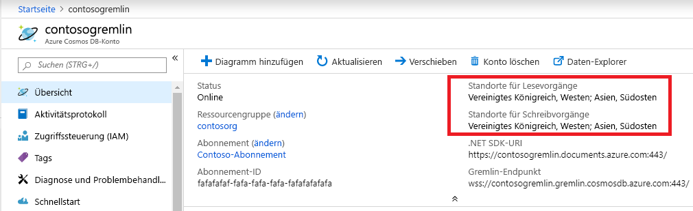

# <a name="regional-endpoints-for-azure-cosmos-db-graph-account"></a>Regionale Endpunkte für Azure Cosmos DB-Graphkonto
Die Azure Cosmos DB-Graphdatenbank ist [global verteilt](distribute-data-globally.md), sodass Anwendungen mehrere Leseendpunkte verwenden können. Für Anwendungen, die Schreibzugriff an mehreren Speicherorten benötigen muss die [Multimaster](how-to-multi-master.md)-Funktion aktiviert sein.

Gründe für die Auswahl mehrerer Regionen:
1. **Horizontale Leseskalierbarkeit**: Wenn die Anwendungslast zunimmt, kann es ratsam sein, Lesedatenverkehr an verschiedene Azure-Regionen weiterzuleiten.
2. **Niedrigere Latenz**: Sie die Netzwerklatenz bei jedem Durchlauf verringern, indem Sie Lese- und Schreibdatenverkehr an die nächstgelegene Azure-Region weiterleiten.

Die Anforderung an die **Datenresidenz** Anforderung wird durch Festlegen der Azure Resource Manager-Richtlinie für das Cosmos DB-Konto erfüllt. Der Kunde kann Regionen einschränken, in die Cosmos DB Daten repliziert.

## <a name="traffic-routing"></a>Routing von Datenverkehr

Die Cosmos DB-Graphdatenbank-Engine wird in mehreren Regionen ausgeführt, von denen jede mehrere Cluster enthält. Jeder Cluster verfügt über Hunderte von Computern. Der DNS CNAME *accountname.gremlin.cosmos.azure.com* des Cosmos DB-Graphkontos wird in den DNS A-Eintrag eines Clusters aufgelöst. Eine einzelne IP-Adresse eines Lastenausgleichs blendet die interne Clustertopologie aus.

Ein regionaler DNS CNAME-Eintrag wird für jede Region des Cosmos DB-Graphkontos erstellt. Das Format des regionalen Endpunkts ist *Kontoname-region.gremlin.cosmos.azure.com*. Das Regionssegment des regionalen Endpunkts wird abgerufen, indem alle Leerzeichen aus dem Namen der [Azure-Region](https://azure.microsoft.com/global-infrastructure/regions) entfernt werden. Die Region `"East US 2"` für das globale Datenbankkonto `"contoso"` hätte beispielsweise *contoso-eastus2.gremlin.cosmos.azure.com* als DNS CNAME.

Der TinkerPop Gremlin-Client ist für die Verwendung mit einem einzelnen Server konzipiert. Die Anwendung kann globale schreibbare DNS CNAME-Einträge für Lese- und Schreibdatenverkehr verwenden. Regionsabhängige Anwendungen müssen den regionalen Endpunkt für Lesedatenverkehr verwenden. Verwenden Sie den regionalen Endpunkt nur für Schreibdatenverkehr, wenn eine bestimmte Region für das Akzeptieren von Schreibvorgängen konfiguriert ist. 

> [!NOTE]
> Die Cosmos DB-Graph-Engine kann den Schreibvorgang in der Leseregion akzeptieren, indem Datenverkehr über einen Proxy an die Schreibregion geleitet wird. Das Senden von Schreibvorgängen in einen schreibgeschützten Bereich wird nicht empfohlen, da dadurch die Durchlauflatenz zunimmt und in Zukunft Einschränkungen unterliegt.

Der CNAME des globalen Datenbankkontos verweist immer auf eine gültige Schreibregion. Beim serverseitigen Failover der Schreibregion aktualisiert Cosmos DB den CNAME des globalen Datenbankkontos so, dass er auf eine neue Region verweist. Wenn die Anwendung nach einem Failover keine Umleitung des Datenverkehrs verarbeiten kann, sollte sie den DNS CNAME des globalen Datenbankkontos verwenden.

> [!NOTE]
> Cosmos DB leitet Datenverkehr nicht basierend auf der geografischen Nähe des Aufrufers weiter. Jede Anwendung kann die richtige Region gemäß den eindeutigen Anwendungsanforderungen auswählen.

## <a name="portal-endpoint-discovery"></a>Ermittlung des Portalendpunkts

Die Liste der Regionen für das Azure Cosmos DB-Graphkonto lässt sich am einfachsten über das Übersichtsblatt im Azure Portal abrufen. Dies funktioniert für Anwendungen, die Regionen nicht häufig ändern, oder eine Möglichkeit zum Aktualisieren der Liste über die Anwendungskonfiguration haben.



Im folgenden Beispiel werden allgemeine Prinzipien für den Zugriff auf den regionalen Gremlin-Endpunkt veranschaulicht. Die Anwendung sollte die Anzahl der Regionen, an die der Datenverkehr gesendet werden soll, sowie die Anzahl der entsprechenden Gremlin-Clients berücksichtigen.

```csharp
// Example value: Central US, West US and UK West. This can be found in the overview blade of you Azure Cosmos DB Gremlin Account. 
// Look for Write Locations in the overview blade. You can click to copy and paste.
string[] gremlinAccountRegions = new string[] {"Central US", "West US" ,"UK West"};
string gremlinAccountName = "PUT-COSMOSDB-ACCOUNT-NAME-HERE";
string gremlinAccountKey = "PUT-ACCOUNT-KEY-HERE";
string databaseName = "PUT-DATABASE-NAME-HERE";
string graphName = "PUT-GRAPH-NAME-HERE";

foreach (string gremlinAccountRegion in gremlinAccountRegions)
{
  // Convert preferred read location to the form "[acountname]-[region].gremlin.cosmos.azure.com".
  string regionalGremlinEndPoint = $"{gremlinAccountName}-{gremlinAccountRegion.ToLowerInvariant().Replace(" ", string.Empty)}.gremlin.cosmos.azure.com";

  GremlinServer regionalGremlinServer = new GremlinServer(
    hostname: regionalGremlinEndPoint, 
    port: 443,
    enableSsl: true,
    username: "/dbs/" + databaseName + "/colls/" + graphName,
    password: gremlinAccountKey);

  GremlinClient regionalGremlinClient = new GremlinClient(
    gremlinServer: regionalGremlinServer,
    graphSONReader: new GraphSON2Reader(),
    graphSONWriter: new GraphSON2Writer(),
    mimeType: GremlinClient.GraphSON2MimeType);
}
```

## <a name="sdk-endpoint-discovery"></a>Ermittlung des SDK-Endpunkts

Die Anwendung kann mithilfe des [Azure Cosmos DB SDK](sql-api-sdk-dotnet.md) Lese- und Schreibspeicherorte für das Graphkonto ermitteln. Diese Speicherorte können jederzeit durch eine manuelle Neukonfiguration auf Serverseite oder ein automatisches Failover geändert werden.

Das TinkerPop Gremlin SDK enthält keine API zum Ermitteln von Regionen für Cosmos DB-Graphdatenbankkonten. Anwendungen, für die der Endpunkt zur Laufzeit ermittelt werden muss, müssen im Prozessbereich zwei separate SDKs hosten.

```csharp
// Depending on the version and the language of the SDK (.NET vs Java vs Python)
// the API to get readLocations and writeLocations may vary.
IDocumentClient documentClient = new DocumentClient(
    new Uri(cosmosUrl),
    cosmosPrimaryKey,
    connectionPolicy,
    consistencyLevel);

DatabaseAccount databaseAccount = await cosmosClient.GetDatabaseAccountAsync();

IEnumerable<DatabaseAccountLocation> writeLocations = databaseAccount.WritableLocations;
IEnumerable<DatabaseAccountLocation> readLocations = databaseAccount.ReadableLocations;

// Pick write or read locations to construct regional endpoints for.
foreach (string location in readLocations)
{
  // Convert preferred read location to the form "[acountname]-[region].gremlin.cosmos.azure.com".
  string regionalGremlinEndPoint = location
    .Replace("http:\/\/", string.Empty)
    .Replace("documents.azure.com:443/", "gremlin.cosmos.azure.com");
  
  // Use code from the previous sample to instantiate Gremlin client.
}
```

## <a name="next-steps"></a>Nächste Schritte
* [Verwalten eines Azure Cosmos-Kontos](how-to-manage-database-account.md) in Azure Cosmos DB
* [Hochverfügbarkeit](high-availability.md) in Azure Cosmos DB
* [Globale Verteilung mit Azure Cosmos DB: Hintergrundinformationen](global-dist-under-the-hood.md)
* [Azure CLI-Beispiele](cli-samples.md) für Azure Cosmos DB
