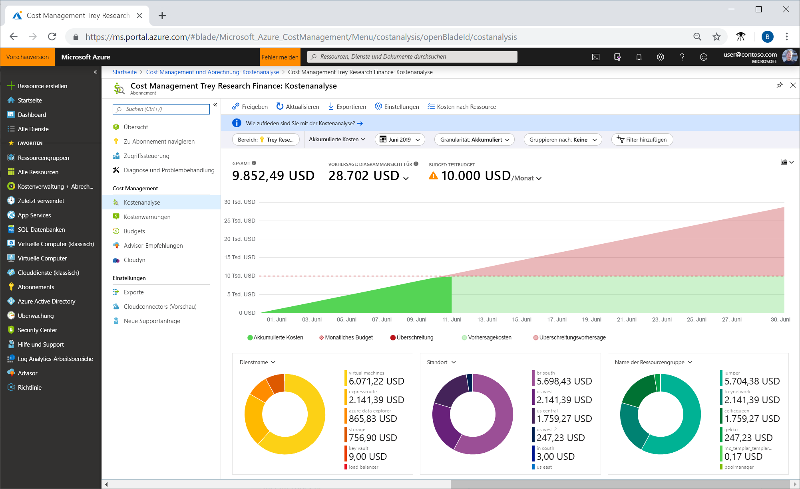
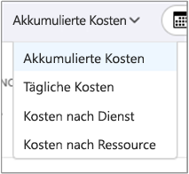
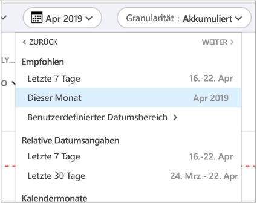
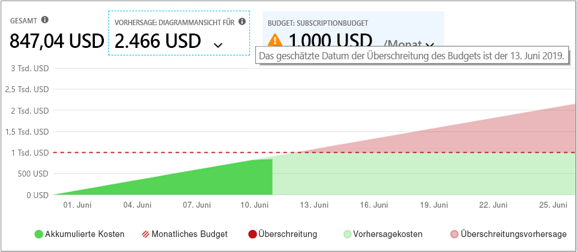
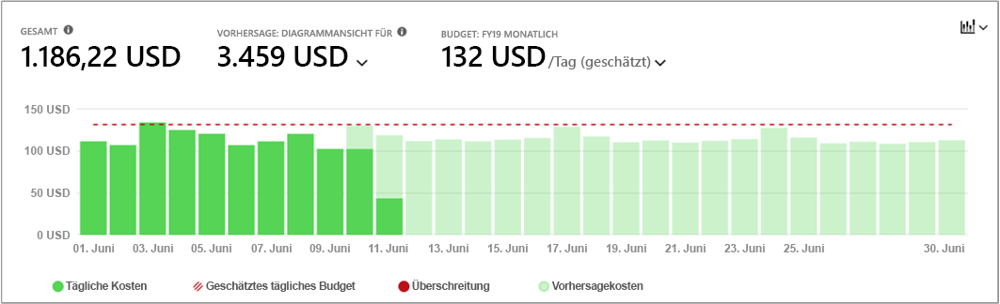
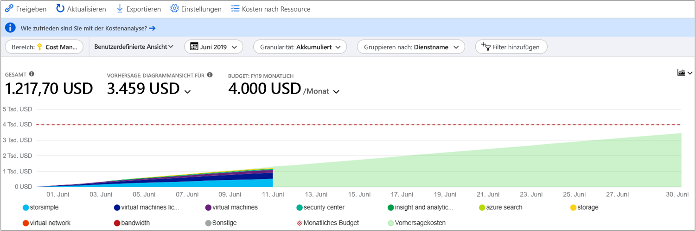
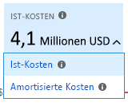
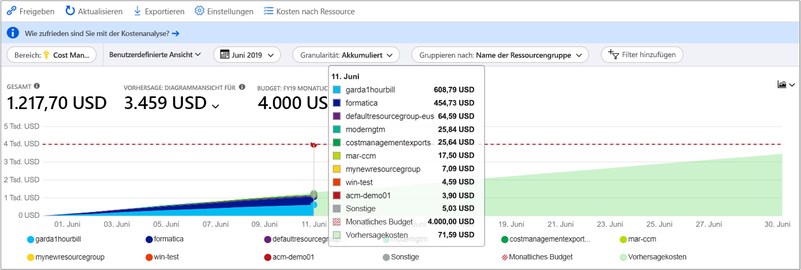
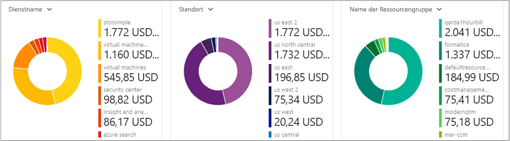
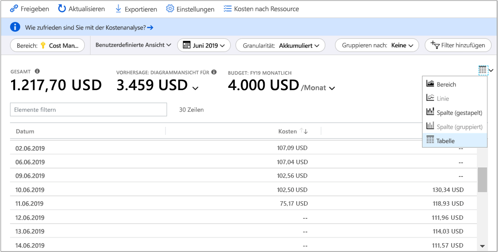

# <a name="quickstart-explore-and-analyze-costs-with-cost-analysis"></a>Schnellstart: Ermitteln und Analysieren von Kosten mit der Kostenanalyse

Voraussetzung für die Kontrolle und Optimierung von Azure-Kosten sind Kenntnisse über die Kostenstellen in Ihrer Organisation. Außerdem sollte bekannt sein, wie hoch die Kosten für Ihre Dienste sind und für welche Umgebungen und Systeme diese Aufwendungen genutzt werden. Der Überblick über sämtliche Kosten ist entscheidend, um Ausgabestrukturen Ihrer Organisation genau nachvollziehen zu können. Ausgabestrukturen können verwendet werden, um Kontrollmechanismen wie Budgets zu erzwingen.

In diesem Schnellstart ermitteln Sie mithilfe der Kostenanalyse Azure-Kosten, die für Ihre Organisation anfallen, und analysieren diese. Durch die Anzeige aggregierter Kosten nach Organisationen können Sie ermitteln, wo Kosten im Zeitverlauf anfallen, und Ausgabentrends nachvollziehen. Mithilfe der akkumulierten Kosten können Sie unter Berücksichtigung von Budgets Kostenschätzungen für monatliche, vierteljährliche oder jährliche Zeiträume erstellen. Ein Budget trägt zur Einhaltung finanzieller Vorgaben bei. Mithilfe eines Budgets können Sie zudem die täglichen oder monatlichen Kosten anzeigen, um Ausgabenunregelmäßigkeiten zu vermeiden. Des Weiteren können Sie die Daten des aktuellen Berichts herunterladen, um diese noch genauer zu analysieren oder sie in externen Systemen zu verwenden.

In dieser Schnellstartanleitung wird Folgendes vermittelt:

- Überprüfen von Kosten mithilfe der Kostenanalyse
- Anpassen von Kostenansichten
- Herunterladen von Kostenanalysedaten


## <a name="prerequisites"></a>Voraussetzungen

Die Kostenanalyse unterstützt verschiedene Arten von Azure-Kontotypen. Die vollständige Liste der unterstützten Kontotypen finden Sie unter [Grundlegendes zu Cost Management-Daten](understand-cost-mgt-data.md). Um Kostendaten anzeigen zu können, müssen Sie mindestens über Lesezugriff auf Ihr Azure-Konto verfügen.

Bei [EA](https://azure.microsoft.com/pricing/enterprise-agreement/)-Kunden (Enterprise Agreement) benötigen Sie mindestens Lesezugriff auf einen oder mehrere der folgenden Bereiche, um Kostendaten anzeigen zu können.

- Abrechnungskonto
- Department
- Registrierungskonto
- Verwaltungsgruppe
- Abonnement
- Ressourcengruppe

Weitere Informationen zum Zuweisen des Zugriffs auf Cost Management-Daten finden Sie unter [Assign access to Cost Management data](assign-access-acm-data.md) (Zuweisen des Zugriffs auf Cost Management-Daten).

## <a name="sign-in-to-azure"></a>Anmelden bei Azure

- Melden Sie sich unter https://portal.azure.com beim Azure-Portal an.

## <a name="review-costs-in-cost-analysis"></a>Überprüfen von Kosten mithilfe der Kostenanalyse

Um Ihre Kosten in der Kostenanalyse zu überprüfen, öffnen Sie den Bereich im Azure-Portal und wählen Sie im Menü **Kostenanalyse** aus. Navigieren Sie beispielsweise zu **Abonnements**, und wählen Sie dann ein Abonnement in der Liste und **Kostenanalyse** im Menü aus. Verwenden Sie **Bereich**, um in einen anderen Bereich der Kostenanalyse zu wechseln. Weitere Informationen zu Bereichen finden Sie unter [Verstehen von und Arbeiten mit Bereichen](understand-work-scopes.md).

Der von Ihnen ausgewählte Bereich wird in der gesamten Kostenverwaltung verwendet, um Daten zu konsolidieren und den Zugriff auf Kosteninformationen zu steuern. Wenn Sie Bereiche verwenden, wählen Sie diese nicht mehrfach aus. Wählen Sie stattdessen einen größeren Bereich aus, in dem andere zusammengefasst werden, und filtern Sie diesen dann bis zu den benötigten verschachtelten Bereichen. Es ist wichtig, dieses Vorgehen zu verstehen, da möglicherweise nicht alle Benutzer Zugriff auf einen einzelnen übergeordneten Bereich haben, der mehrere verschachtelte Bereiche abdeckt.

Die Kostenanalyseansicht umfasst anfänglich die folgenden Bereiche:

**Ansicht „Akkumulierte Kosten“:** Ermöglicht die Konfiguration der vordefinierten Ansicht für die Kostenanalyse. Jede Ansicht enthält den Datumsbereich, die Granularität, „Gruppieren nach“ und Filtereinstellungen. In der Standardansicht werden die akkumulierten Kosten für den aktuellen Abrechnungszeitraum angezeigt, aber dies kann in andere integrierte Ansichten geändert werden. Weitere Informationen finden Sie unter [Anpassen von Kostenansichten](#customize-cost-views).

**Ist-Kosten:** Zeigt die Gesamtkosten für den Verbrauch und die Einkäufe für den aktuellen Monat so an, wie sie anfallen und wie sie in Ihrer Rechnung aufgeführt werden.

**Prognose:** Gibt die prognostizierten Gesamtkosten für den von Ihnen gewählten Zeitraum an (Vorschauphase).

**Budget:** geplantes Ausgabenlimit für den ausgewählten Bereich (falls verfügbar).

**Kumulierte Granularität**: Gibt die aggregierten täglichen Gesamtkosten ab dem Beginn des Abrechnungszeitraums an. Nachdem Sie für Ihr Abrechnungskonto oder Abonnement [ein Budget erstellt haben](tutorial-acm-create-budgets.md), können Sie sich Ausgabentrends für Ihr Budget anzeigen lassen. Zeigen Sie auf ein Datum, um die akkumulierten Kosten bis zu einem bestimmten Tag anzuzeigen.

**Pivot-/Ringdiagramme** – Stellen Sie dynamische Pivotdiagramme bereit, die die Gesamtkosten nach einem gemeinsamen Satz von Standardeigenschaften aufschlüsseln. Darin sind die Kosten für den aktuellen Monat absteigend sortiert. Sie können die Pivotdiagramme jederzeit anpassen, indem Sie einen anderen Pivotbereich auswählen. Die Kosten werden standardmäßig nach Dienst (Kategorie der Verbrauchseinheit), Standort (Region) und untergeordnetem Bereich kategorisiert. Beispielsweise Registrierungskonten unter Abrechnungskonten, Ressourcengruppen unter Abonnements und Ressourcen unter Ressourcengruppen.



## <a name="customize-cost-views"></a>Anpassen von Kostenansichten

Die Kostenanalyse weist vier integrierte Ansichten auf, die für die häufigsten Ziele optimiert sind:

Sicht | Beantworten von Fragen wie...
--- | ---
Akkumulierte Kosten | Wie viel habe ich bisher in diesem Monat ausgegeben? Wird mein Budget überschritten?
Kosten pro Tag | Gab es in den letzten 30 Tagen einen Anstieg in den täglichen Kosten?
Kosten nach Dienst | Wie hat meine monatliche Nutzung über die letzten 3 Rechnungen variiert?
Kosten nach Ressource | Welche Ressourcen kosten diesen Monat bisher am meisten?



Es gibt jedoch viele Fälle, in denen eine ausführlichere Analyse erforderlich ist. Wählen Sie zur Anpassung der Ansicht oben auf der Seite den Datumsbereich aus.

In der Kostenanalyse werden standardmäßig die Daten für den aktuellen Monat angezeigt. Verwenden Sie die Datumsauswahl, um schnell zu gängigen Datumsbereichen zu wechseln. Beispiele sind die letzten 7 Tage, der letzte Monat, das laufende Jahr oder ein benutzerdefinierter Datumsbereich. Abonnements mit nutzungsbasierter Bezahlung enthalten außerdem Datumsbereiche auf der Grundlage Ihres Abrechnungszeitraums, der nicht an den Kalendermonat gebunden ist, wie der laufende Abrechnungszeitraum oder die letzte Rechnung. Verwenden Sie die Links **<VORHERIGER** und **NÄCHSTER>** oben im Menü, um zum vorherigen bzw. nächsten Zeitraum zu wechseln. Beispielsweise wechselt **<VORHERIGER** von den letzten 7 Tagen zum Zeitraum vor 8–14 Tagen und dann weiter zu vor 15–21 Tagen.



Standardmäßig werden in der Kostenanalyse **akkumulierte** Kosten angezeigt. Diese umfassen die Kosten pro Tag und die summierten Kosten der Vortage. Dadurch wird der Anstieg der aggregierten Kosten pro Tag visualisiert. In dieser Ansicht wird besonders gut dargestellt, in welchem Verhältnis Ausgabentrends und Budget innerhalb eines festgelegten Zeitbereichs stehen.

Wenn Sie die Diagrammansicht der Prognose verwenden, können Sie potenzielle Budgetüberschreitungen identifizieren. Wenn eine potenzielle Budgetüberschreitung erkannt wird, wird die projizierte Überschreitung rot angezeigt. Darüber hinaus wird im Diagramm ein Hinweissymbol angezeigt. Oberhalb des Symbols wird das geschätzte Datum der Budgetüberschreitung eingeblendet.



Es gibt auch die **Tagesansicht**, die die Kosten für jeden Tag anzeigt. Die Tagesansicht zeigt keinen Wachstumstrend an. Die Ansicht ist so konzipiert, dass Unregelmäßigkeiten als Kostenspitzen oder -einbrüche von Tag zu Tag dargestellt werden. Wenn Sie ein Budget ausgewählt haben, wird in der Tagesansicht auch das geschätzte Tagesbudget angezeigt. Wenn die täglichen Kosten dauerhaft über dem Tagesbudget liegen, ist davon auszugehen, dass Ihr Monatsbudget überschritten wird. Das geschätzte Tagesbudget ist lediglich ein Hilfsmittel, mit dem Sie Ihr Budget auf einer granulareren Ebene visualisieren können. Wenn bei täglichen Kosten Schwankungen auftreten, ist der Vergleich von geschätztem Tagesbudget und Monatsbudget ungenauer.

Hier ist eine Tagesansicht mit den aktuellen Ausgaben und aktivierter Ausgabenprognose dargestellt.


Wenn Sie die Ausgabenprognose deaktivieren, werden keine projizierten Ausgaben für zukünftige Termine angezeigt. Beim Anzeigen von Kosten für vergangene Zeiträume werden keine Kosten für die Kostenprognose eingeblendet.

Im Allgemeinen können Sie erwarten, dass Daten oder Benachrichtigungen zu verbrauchten Ressourcen innerhalb von 8–12 Stunden angezeigt werden.


**Gruppieren nach** allgemeinen Eigenschaften, um Kosten aufzuschlüsseln und die größten Verursacher zu ermitteln. Um beispielsweise nach Ressourcentags zu gruppieren, wählen Sie den Tagschlüssel aus, nach dem Sie gruppieren möchten. Die Kosten werden nach jedem Tagwert aufgeschlüsselt, mit einem Zusatzsegment für Ressourcen, auf die das betreffende Tag nicht angewendet wurde.

Die meisten [Azure-Ressourcen unterstützen das Tagging](../azure-resource-manager/tag-support.md), aber einige Tags sind in Cost Management und für die Abrechnung nicht verfügbar. Darüber hinaus werden Ressourcengruppentags nicht unterstützt. Cost Management unterstützt nur Ressourcentags ab dem Datum, an dem die Tags direkt auf die Ressource angewendet werden. Sehen Sie sich das Video [How to review tag policies with Azure Cost Management](https://www.youtube.com/watch?v=nHQYcYGKuyw) (Überprüfen von Tagrichtlinien mithilfe von Azure Cost Management) an, um mehr zur Verwendung von Azure-Tagrichtlinen zum Verbessern der Sichtbarkeit von Kosten zu erfahren.

Hier ist eine Ansicht der Azure-Dienstkosten für den aktuellen Monat dargestellt.



Standardmäßig werden in der Kostenanalyse alle Kosten für Verbrauch und Einkäufe angezeigt, wie sie anfallen und in Ihrer Rechnung erscheinen. Dies wird auch als **Ist-Kosten** bezeichnet. Das Anzeigen der tatsächlichen Kosten ist ideal geeignet, um Ihre Rechnung abzugleichen. Hohe Werte bei den Kosten für Einkäufe können ein Alarmsignal sein, wenn Sie nach Anomalien bei den Ausgaben und anderen Kostenveränderungen suchen. Wechseln Sie zu **Amortisierte Kosten**, um Spitzenwerte auszugleichen, die durch Einkaufskosten für Reservierungen verursacht werden. 



Bei den amortisierten Kosten werden Reservierungseinkäufe in tägliche Blöcke unterteilt und auf die Dauer des Reservierungszeitraums aufgeteilt. Beispiel: Anstelle eines Einkaufs in Höhe von 365 USD am 1. Januar sehen Sie für jeden Tag vom 1. Januar bis zum 31. Dezember einen Einkauf in Höhe von 1 USD. Zusätzlich zur einfachen Amortisierung werden diese Kosten auch neu zugeteilt und den spezifischen Ressourcen zugeordnet, die die Reservierung genutzt haben. Falls die Kosten von 1 USD beispielsweise auf zwei virtuelle Computer aufgeteilt waren, werden für den Tag zwei Gebühren von jeweils 0,50 USD angezeigt. Wenn ein Teil der Reservierung für den Tag nicht genutzt wird, wird eine Gebühr von 0,50 USD für den entsprechenden virtuellen Computer und eine weitere Gebühr von 0,50 USD mit dem Gebührentyp `UnusedReservation` angezeigt. Beachten Sie, dass nicht verwendete Reservierungskosten nur unter den amortisierten Kosten angezeigt werden.

Aufgrund der veränderten Anzeige von Kosten ist es wichtig zu beachten, dass für die Ansicht mit den Ist-Kosten und den amortisierten Kosten unterschiedliche Gesamtwerte angezeigt werden. Im Allgemeinen verringern sich die Gesamtkosten für Monate mit einem Reservierungseinkauf, wenn die amortisierten Kosten angezeigt werden, und sie erhöhen sich für Monate, die auf einen Reservierungseinkauf folgen. Die Amortisierung ist nur für Reservierungseinkäufe verfügbar und gilt derzeit nicht für Marketplace-Einkäufe.

In der folgenden Abbildung sind Ressourcengruppennamen dargestellt. Sie können nach Tag gruppieren, um die Gesamtkosten pro Tag anzuzeigen, oder die Ansicht **Kosten nach Ressource** verwenden, um alle Tags für eine bestimmte Ressource anzuzeigen.



Beim Gruppieren von Kosten nach einem bestimmten Attribut wird die Top-10-Liste der Kostenverursacher angezeigt (von den höchsten zu den niedrigsten Kosten). Bei mehr als 10 werden die obersten 9 Kostenverursacher mit einer Gruppe **Others** (Weitere) angezeigt, die alle verbleibenden Gruppen gemeinsam abdeckt. Beim Gruppieren nach Tags wird unter Umständen eine Gruppe vom Typ **Ohne Markierungen** für Kosten angezeigt, auf die der Tagschlüssel nicht angewendet wurde. **Keine Markierungen** wird immer zuletzt angezeigt, selbst wenn die Kosten ohne Markierungen die Kosten mit Markierungen übersteigen. Kosten ohne Markierungen werden unter **Weitere** angezeigt, wenn 10 oder mehr Tagwerte vorhanden sind.

Für *klassische* virtuelle Computer, Netzwerke und Speicherressourcen werden keine ausführlichen Abrechnungsdaten bereitgestellt. Sie werden beim Gruppieren der Kosten als **Classic services** (Klassische Dienste) gruppiert.

Pivotdiagramme unterhalb des Hauptdiagramms enthalten verschiedene Gruppierungen und bieten damit einen allgemeinen Überblick über die Gesamtkosten für den ausgewählten Zeitraum und die ausgewählten Filter. Wählen Sie eine Eigenschaft oder ein Tag aus, um aggregierte Kosten anhand beliebiger Dimensionen anzuzeigen.



Sie können das vollständige Dataset für eine beliebige Ansicht anzeigen. Auswahlaktionen und angewendete Filter betreffen jeweils die angezeigten Daten. Wenn Sie das gesamte Dataset anzeigen möchten, klicken Sie auf die Liste **Diagrammtyp** und anschließend auf die Ansicht **Tabelle**.




## <a name="understanding-grouping-and-filtering-options"></a>Grundlegendes zu Gruppierungs- und Filteroptionen

In der folgenden Tabelle sind einige der häufigsten Gruppierungs- und Filteroptionen und deren Anwendungsmöglichkeiten aufgeführt.

| Eigenschaft | Einsatzgebiete |
| --- | --- |
| **Abrechnungszeitraum** | Unterteilung der Kosten nach Rechnungsmonat. Wichtig für Abonnements mit nutzungsbasierter Bezahlung und Dev/Test-Abonnements, die nicht an Kalendermonate gebunden sind. Für EA/MCA-Konten können Kalendermonate in der Datumsauswahl bzw. die monatliche Granularität verwendet werden, um dasselbe Ziel zu erreichen. |
| **Gebührentyp** | Unterteilt nach Kosten für Verbrauch, Einkauf, Erstattung und nicht verwendete Reservierungen. Reservierungseinkäufe und Erstattungen sind nur verfügbar, wenn Aktionskosten verwendet werden, und nicht in den amortisierten Kosten. Kosten für nicht verwendete Reservierungen sind nur verfügbar, wenn Sie sich die amortisierten Kosten ansehen. |
| **Cloud** | Kosten werden nach AWS und Azure unterteilt. AWS-Kosten sind nur über Verwaltungsgruppen, externe Abrechnungskonten und externe Abonnements verfügbar. |
| **Abteilung** / **Rechnungsabschnitt** | Kosten werden nach EA-Abteilung oder MCA-Rechnungsabschnitt unterteilt. Nur für EA/MCA-Abrechnungskonten und MCA-Abrechnungsprofile verfügbar. |
| **Registrierungskonto** | Kosten werden nach EA-Kontobesitzer unterteilt. Nur für EA-Abrechnungskosten und -Abteilungen verfügbar. |
| **Frequency** | Nach nutzungsbasierten, einmaligen und wiederkehrenden Kosten unterteilt. |
| **Verbrauchseinheit** | Kosten werden nach Azure-Verbrauchseinheit unterteilt. Nur für Azure-Verbrauch verfügbar. Für alle Einkäufe und die Marketplace-Nutzung wird „Nicht angegeben“ oder „Nicht zugewiesen“ angezeigt. |
| **Herausgebertyp** | Wird nach AWS-, Azure- und Marketplace-Kosten unterteilt. |
| **Reservierung** | Kosten werden nach Reservierung unterteilt. Jeder Verbrauch, der keine Reservierung enthält, wird als „Nicht angegeben“ angezeigt. |
| **Ressource** | Die Kosten werden nach Ressource unterteilt. Alle Einkäufe werden als „Nicht angegeben“ angezeigt, da sie auf Ebene des Abrechnungskontos (EA/Nutzungsbasierte Zahlung) oder des MCA-Abrechnungsprofils angewendet werden.  |
| **Ressourcengruppe** | Die Kosten werden nach Ressourcengruppe unterteilt. Nur für andere Nutzungsarten als die klassische Nutzung verfügbar. Für die klassische Ressourcennutzung wird „Sonstiges“ und für Einkäufe „Nicht angegeben“ angezeigt. |
| **Ressourcentyp** | Die Kosten werden nach Ressourcentyp unterteilt. Nur für andere Nutzungsarten als die klassische Nutzung verfügbar. Für die klassische Ressourcennutzung wird „Sonstiges“ und für Einkäufe „Nicht angegeben“ angezeigt. |
| **Dienstname** oder **Kategorie der Verbrauchseinheit** | Die Kosten werden nach Azure-Dienst unterteilt. Nur für Azure-Verbrauch verfügbar. Für alle Einkäufe und die Marketplace-Nutzung wird „Nicht angegeben“ oder „Nicht zugewiesen“ angezeigt. |
| **Dienstebene** oder **Unterkategorie der Verbrauchseinheit** | Die Kosten werden nach der Unterklassifizierung der Verbrauchseinheit für die Azure-Nutzung unterteilt. Nur für Azure-Verbrauch verfügbar. Für alle Einkäufe und die Marketplace-Nutzung wird „Nicht angegeben“ oder „Nicht zugewiesen“ angezeigt. |
| **Abonnement** | Die Kosten werden nach Abonnement unterteilt. Für alle Einkäufe wird „Nicht angegeben“ angezeigt. |
| **Tag** | Die Kosten werden nach Tagwerten für einen bestimmten Tagschlüssel unterteilt. |

Informationen zu den Bedingungen finden Sie unter [Grundlegendes zu den Bedingungen in der Datei für die Azure-Nutzung und -Gebühren](../billing/billing-understand-your-usage.md).


## <a name="saving-and-sharing-customized-views"></a>Speichern und Freigeben von benutzerdefinierten Ansichten

Speichern Sie benutzerdefinierte Ansichten, und geben Sie sie für andere Benutzer frei, indem Sie die Kostenanalyse im Dashboard des Azure-Portals anheften oder einen Link zur Kostenanalyse kopieren. 

Klicken Sie zum Anheften der Kostenanalyse oben rechts auf das Stecknadelsymbol. Beim Anheften der Kostenanalyse wird nur die Diagramm- oder Tabellenhauptansicht gespeichert, falls dies ausgewählt ist. Geben Sie das Dashboard frei, um anderen Personen Zugriff auf die Kachel zu gewähren. Beachten Sie Folgendes: Hierbei wird nur die Dashboardkonfiguration freigegeben, und anderen Personen wird kein Zugriff auf die zugrunde liegenden Daten gewährt. Falls eine Person, die nicht zum Zugreifen auf die Kosten berechtigt ist, über Zugriff auf ein freigegebenes Dashboard verfügt, wird die Meldung „Zugriff verweigert“ angezeigt.

Klicken Sie oben auf dem Blatt auf den Befehl **Teilen**, um einen Link zur Kostenanalyse zu teilen. Eine benutzerdefinierte URL wird angezeigt, über die diese spezifische Ansicht für den jeweiligen Bereich geöffnet wird. Wenn eine Person ohne Zugriff auf die Kosten die URL erhält, wird die Meldung „Zugriff verweigert“ angezeigt. 

Weitere Informationen zum Gewähren des Zugriffs auf die Kosten für jeden unterstützten Bereich finden Sie unter [Verstehen von und Arbeiten mit Bereichen](understand-work-scopes.md).

## <a name="automation-and-offline-analysis"></a>Automatisierung und Offlineanalyse

Es kann vorkommen, dass Sie die Daten zur weiteren Analyse herunterladen, mit Ihren eigenen Daten zusammenführen oder in Ihre eigenen Systeme integrieren müssen. Cost Management verfügt über einige passende Optionen. Wenn Sie eine allgemeine Ad-hoc-Zusammenfassung benötigen, wie beispielsweise bei der Kostenanalyse, sollten Sie zuerst die benötigte Ansicht erstellen und herunterladen. Klicken Sie hierfür auf **Exportieren**, und wählen Sie **Daten in CSV herunterladen** oder **Daten in Excel herunterladen**. Der Excel-Download liefert zusätzlichen Kontext zu der Ansicht, die Sie zum Generieren des Downloads verwendet haben, z. B. Bereich, Abfragekonfiguration, Summe und Generierungsdatum.

Falls Sie das vollständige nicht aggregierte Dataset benötigen, können Sie es über das Abrechnungskonto herunterladen. Wählen Sie links im Portal in der Liste mit den Diensten „Kostenverwaltung + Abrechnung “ > (ggf. Abrechnungskonto auswählen) > „Verbrauch + Gebühren“, und klicken Sie dann auf das Downloadsymbol für den gewünschten Abrechnungszeitraum.

Wenn Sie das Abrufen der Kostendaten automatisieren müssen, können Sie einen ähnlichen Ansatz nutzen: Verwenden Sie die [Query-API](/rest/api/cost-management/query) für eine umfassendere Analyse mit dynamischer Filterung, Gruppierung und Aggregation, oder verwenden Sie die [UsageDetails-API](/rest/api/consumption/usageDetails), um das vollständige nicht aggregierte Dataset zu erhalten. Die GA-Version dieser APIs lautet „2019-01-01“. Verwenden Sie **2019-04-01-preview**, um Zugriff auf die Vorschau der Reservierung und Marketplace-Einkäufe über diese APIs zu erhalten. 

Beispiel: Wir rufen eine aggregierte Ansicht mit Unterteilung der amortisierten Kosten nach Gebührentyp (Verbrauch, Einkauf oder Erstattung), Herausgebertyp (Azure oder Marketplace), Ressourcengruppe (leer für Einkäufe) und Reservierung (leer, falls nicht zutreffend) ab.

```
POST https://management.azure.com/{scope}/providers/Microsoft.CostManagement/query?api-version=2019-04-01-preview
Content-Type: application/json
 
{
  "type": "AmortizedCost",
  "timeframe": "Custom",
  "timePeriod": { "from": "2019-04-01", "to": "2019-04-30" },
  "dataset": {
    "granularity": "None",
    "aggregation": {
      "totalCost": { "name": "PreTaxCost", "function": "Sum" }
    },
    "grouping": [
      { "type": "dimension", "name": "ChargeType" },
      { "type": "dimension", "name": "PublisherType" },
      { "type": "dimension", "name": "Frequency" },
      { "type": "dimension", "name": "ResourceGroup" },
      { "type": "dimension", "name": "SubscriptionName" },
      { "type": "dimension", "name": "SubscriptionId" },
      { "type": "dimension", "name": "ReservationName" },
      { "type": "dimension", "name": "ReservationId" },
    ]
  },
}
```

Gehen Sie wie folgt vor, wenn Sie die Aggregation nicht benötigen und das vollständige unformatierte Dataset bevorzugen:

```
GET https://management.azure.com/{scope}/providers/Microsoft.Consumption/usageDetails?metric=AmortizedCost&$filter=properties/usageStart+ge+'2019-04-01'+AND+properties/usageEnd+le+'2019-04-30'&api-version=2019-04-01-preview
```

Falls Sie für die Ist-Kosten die Anzeige der Einkäufe benötigen, sobald diese anfallen, können Sie **type**/**metric** in **ActualCost** ändern. Weitere Informationen zu diesen APIs finden Sie in der Dokumentation zur [Query-API](/rest/api/cost-management/query) bzw. [UsageDetails-API](/rest/api/consumption/usageDetails). Beachten Sie, dass die veröffentlichten Dokumente für die allgemein verfügbare Version (GA) gelten. Die Funktionsweise ist für die API-Version „2019-04-01-preview“ bis auf das neue „type/metric“-Attribut und die geänderten Eigenschaftennamen aber jeweils gleich. (Unten finden Sie weitere Informationen zu den Eigenschaftennamen.)
 
Cost Management-APIs werden für alle Bereiche oberhalb der Ressourcen verwendet. Dies sind Ressourcengruppe, Abonnement und Verwaltungsgruppe per Azure RBAC-Zugriff, EA-Abrechnungskonten (Registrierungen), Abteilungen und Registrierungskonten per Zugriff über das EA-Portal usw. Weitere Informationen zu Bereichen, z. B. in Bezug auf die Ermittlung Ihrer Bereichs-ID bzw. des Verwaltungszugriffs, finden Sie unter [Verstehen von und Arbeiten mit Bereichen](understand-work-scopes.md).

## <a name="next-steps"></a>Nächste Schritte

Im ersten Tutorial erfahren Sie, wie Sie Budgets erstellen und verwalten.

> [!div class="nextstepaction"]
> [Erstellen und Verwalten von Budgets](tutorial-acm-create-budgets.md)
