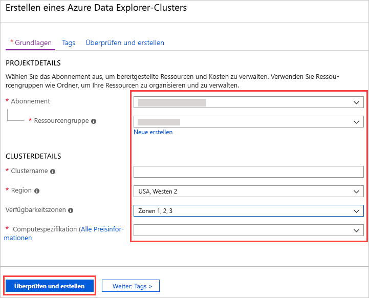

# Schnellstart: Erstellen eines Azure Data Explorer-Clusters und einer Datenbank

> [!div class="op_single_selector"]
> * [Portal](create-cluster-database-portal.md)
> * [BEFEHLSZEILENSCHNITTSTELLE (CLI)](create-cluster-database-cli.md)
> * [PowerShell](create-cluster-database-powershell.md)
> * [C#](create-cluster-database-csharp.md)
> * [Python](create-cluster-database-python.md)
>  

Azure-Daten-Explorer ist ein schneller und hochgradig skalierbarer Dienst zur Untersuchung von Daten (Protokoll- und Telemetriedaten). Um den Azure Data Explorer zu verwenden, erstellen Sie zuerst einen Cluster und anschließend eine oder mehrere Datenbanken in diesem Cluster. Anschließend erfassen (laden) Sie Daten in eine Datenbank, damit Sie diese abfragen können. In diesem Schnellstart erstellen Sie einen Cluster und eine Datenbank.

Wenn Sie über kein Azure-Abonnement verfügen, können Sie ein [kostenloses Azure-Konto](https://azure.microsoft.com/free/) erstellen, bevor Sie beginnen.

## Melden Sie sich auf dem Azure-Portal an.

Melden Sie sich beim [Azure-Portal](https://portal.azure.com/) an.

## Erstellen eines Clusters

Erstellen Sie einen Azure Data Explorer-Cluster mit einem definierten Satz von Compute- und Speicherressourcen in einer Azure-Ressourcengruppe.

1. Klicken Sie in der linken oberen Ecke des Portals auf die Schaltfläche **Ressource erstellen** (+).

1. Suchen Sie nach *Azure Data Explorer*.

   

1. Wählen Sie unter **Azure Data Explorer** unten auf dem Bildschirm **Erstellen** aus.

1. Geben Sie die folgenden Informationen als grundlegende Clusterdetails an.

   

    **Einstellung** | **Empfohlener Wert** | **Feldbeschreibung**
    |---|---|---|
    | Subscription | Ihr Abonnement | Wählen Sie das Azure-Abonnement aus, das Sie für Ihren Cluster verwenden möchten.|
    | Resource group | Ihre Ressourcengruppe | Verwenden Sie eine vorhandene Ressourcengruppe, oder erstellen Sie eine neue Ressourcengruppe. |
    | Clustername | Ein eindeutiger Clustername | Wählen Sie einen eindeutigen Namen aus, der Ihren Cluster identifiziert. Der Domänenname *[Region].kusto.windows.net* wird an den angegebenen Namen angefügt. Der Name darf nur Kleinbuchstaben und Zahlen enthalten. Er muss zwischen 4 und 22 Zeichen lang sein.
    | Region | *USA, Westen* oder *USA, Westen 2* | Wählen Sie *USA, Westen* oder *USA, Westen 2* (wenn Sie Verfügbarkeitszonen verwenden) für diese Schnellstartanleitung aus. Wählen Sie für ein Produktionssystem die Region aus, die Ihre Anforderungen am besten erfüllt.
    | Verfügbarkeitszonen | *1*, *2* und/oder *3* | Platzieren Sie die Clusterinstanzen in verschiedenen Verfügbarkeitszonen derselben Region (optional). [Azure-Verfügbarkeitszonen](/azure/availability-zones/az-overview) sind eindeutige physische Standorte in derselben Azure-Region. Sie schützen einen Azure Data Explorer-Cluster und Daten vor einem teilweisen Regionsausfall. Die Clusterknoten werden standardmäßig im gleichen Rechenzentrum erstellt. Durch die Auswahl mehrerer Verfügbarkeitszonen können Sie einen Single Point of Failure vermeiden und eine Hochverfügbarkeit sicherstellen. Die Bereitstellung in Verfügbarkeitszonen ist nur während der Clustererstellung möglich und kann nicht zu einem späteren Zeitpunkt geändert werden.
    | Computespezifikationen | *D13_v2* | Wählen Sie für diesen Schnellstart die Spezifikation mit dem niedrigsten Preis aus. Wählen Sie für ein Produktionssystem die Spezifikation aus, die Ihre Anforderungen am besten erfüllt.
    | | | |

1. Wählen Sie **Bewerten + erstellen**, um Ihre Clusterdetails zu überprüfen, und dann **Erstellen**, um den Cluster bereitzustellen. Die Bereitstellung dauert normalerweise etwa zehn Minuten.

1. Wählen Sie nach Abschluss der Bereitstellung die Option **Zu Ressourcengruppe wechseln**.

    

## Erstellen einer Datenbank

Sie sind nun für den zweiten Schritt bereit: das Erstellen der Datenbank.

1. Wählen Sie auf der Registerkarte **Übersicht** die Option **Datenbank erstellen** aus.

    

1. Füllen Sie das Formular mit den folgenden Informationen aus.

    

    **Einstellung** | **Empfohlener Wert** | **Feldbeschreibung**
    |---|---|---|
    | Datenbankname | *TestDatabase* | Der Datenbankname muss innerhalb des Clusters eindeutig sein.
    | Aufbewahrungszeitraum | *3650* | Die Zeitspanne (in Tagen), für die garantiert wird, dass die Daten für Abfragen verfügbar bleiben. Die Zeitspanne wird ab dem Zeitpunkt gemessen, zu dem die Daten erfasst werden.
    | Zwischenspeicherungsdauer | *31* | Die Zeitspanne (in Tagen), wie lange häufig abgefragte Daten im SSD-Speicher oder RAM (und nicht im längerfristigen Speicher) verfügbar bleiben.
    | | | |

1. Wählen Sie **Erstellen**, um die Datenbank zu erstellen. Die Erstellung dauert in der Regel weniger als eine Minute. Wenn der Vorgang abgeschlossen ist, gelangen Sie zurück zur Registerkarte **Übersicht** des Clusters.

## Ausführen von grundlegenden Befehlen in der Datenbank

Da Sie nun über einen Cluster und eine Datenbank verfügen, können Sie Abfragen und Befehle ausführen. Es sind noch keine Daten in der Datenbank vorhanden, aber Sie können bereits sehen, wie die Tools funktionieren.

1. Wählen Sie unter Ihrem Cluster **Abfrage** aus. Fügen Sie den Befehl `.show databases` im Abfragefenster ein, und wählen Sie anschließend die Option **Ausführen**.

    

    Im Resultset wird **TestDatabase** angezeigt, die einzige Datenbank im Cluster.

1. Fügen Sie den Befehl `.show tables` im Abfragefenster ein, und wählen Sie die Option **Ausführen**.

    Dieser Befehl gibt ein leeres Resultset zurück, da Sie noch nicht über Tabellen verfügen. Sie fügen im nächsten Artikel dieser Serie eine Tabelle hinzu.

## Beenden und Neustarten des Clusters

Sie können einen Cluster je nach Geschäftsanforderungen beenden und neu starten.

1. Um den Cluster zu beenden, wählen Sie am oberen Rand der Registerkarte **Übersicht** die Option **Beenden** aus.

    Wenn der Cluster beendet wurde, sind Daten nicht für Abfragen verfügbar, und Sie können keine neuen Daten erfassen.

1. Um den Cluster neu zu starten, wählen Sie am oberen Rand der Registerkarte **Übersicht** die Option **Starten** aus.

    Nach dem Neustarten des Clusters dauert es etwa zehn Minuten, bis er verfügbar ist (wie bei der ursprünglichen Bereitstellung). Es dauert zusätzliche Zeit, bis die Daten in den aktiven Cache geladen wurden.  

## Bereinigen von Ressourcen

Falls Sie andere Schnellstartanleitungen und Tutorials durcharbeiten möchten, ist es ratsam, die erstellten Ressourcen beizubehalten. Andernfalls sollten Sie eine Ressourcenbereinigung durchführen, damit keine Kosten entstehen.

1. Wählen Sie ganz links im Azure-Portal die Option **Ressourcengruppen** und anschließend die Ressourcengruppe, die Ihren Data Explorer-Cluster enthält.  

1. Wählen Sie **Ressourcengruppe löschen**, um die gesamte Ressourcengruppe zu löschen. Bei Verwendung einer vorhandenen Ressourcengruppe können Sie auch auswählen, dass nur der Data Explorer-Cluster gelöscht werden soll.

## Nächste Schritte

> [!div class="nextstepaction"]
> [Schnellstart: Erfassen von Daten aus Event Hub in Azure Data Explorer](ingest-data-event-hub.md)

