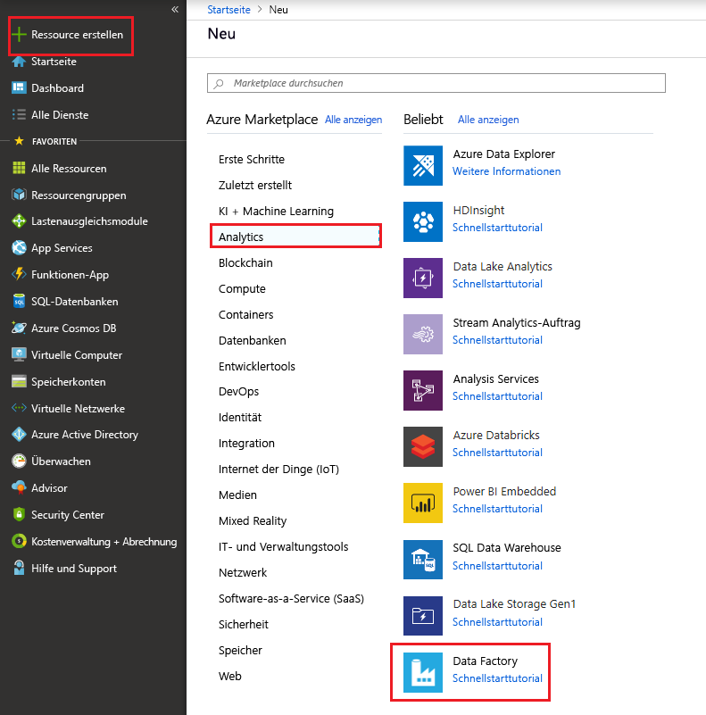

# Kopieren von Daten aus Azure Data Lake Storage Gen1 in Gen2 mit Azure Data Factory

Azure Data Lake Storage Gen2 baut auf [Azure Blob Storage](../storage/blobs/storage-blobs-introduction.md) auf und bietet eine Reihe von Funktionen für die Big Data-Analyse. Er ermöglicht Ihnen die Arbeit mit Ihren Daten über das Dateisystem und den Objektspeicher.

Wenn Sie zurzeit Azure Data Lake Storage Gen1 verwenden, können Sie die neue Gen2-Funktion auswerten, indem Sie mithilfe von Azure Data Factory Daten aus Data Lake Storage Gen1 in Gen2 kopieren.

Azure Data Factory ist ein vollständig verwalteter, cloudbasierter Datenintegrationsdienst. Mithilfe dieses Diensts können Sie den Lake mit Daten aus zahlreichen lokalen und cloudbasierten Datenspeichern füllen und Zeit beim Erstellen von Analyselösungen sparen. Eine ausführliche Liste der unterstützten Connectors finden Sie in der Tabelle [Unterstützte Datenspeicher](copy-activity-overview.md#supported-data-stores-and-formats).

Azure Data Factory bietet eine Lösung zur horizontalen Skalierung und Verschiebung verwalteter Daten. Aufgrund der horizontal skalierbaren Architektur von ADF können Daten mit hohem Durchsatz erfasst werden. Weitere Informationen finden Sie unter [Leistung der Kopieraktivität](copy-activity-performance.md).

In diesem Artikel erfahren Sie, wie Sie das Tool zum Kopieren von Daten in Data Factory zum Kopieren von Daten aus _Azure Data Lake Storage Gen1_ in _Azure Data Lake Storage Gen2_ verwenden. Sie können ähnliche Schritte zum Kopieren von Daten aus anderen Typen von Datenspeichern ausführen.

## Voraussetzungen

* Azure-Abonnement: Wenn Sie kein Azure-Abonnement besitzen, können Sie ein [kostenloses Konto](https://azure.microsoft.com/free/) erstellen, bevor Sie beginnen.
* Sie müssen ein Azure Data Lake Storage Gen1-Konto auswählen, das Daten enthält.
* Azure Storage-Konto mit aktiviertem Data Lake Storage Gen2: [Erstellen Sie ein Speicherkonto](https://ms.portal.azure.com/#create/Microsoft.StorageAccount-ARM), wenn Sie noch keines besitzen.

## Erstellen einer Data Factory

1. Wählen Sie im Menü auf der linken Seite **Ressource erstellen** > **Daten + Analysen** > **Data Factory** aus:
   
   

2. Geben Sie auf der Seite **Neue Data Factory** die in der folgenden Abbildung gezeigten Werte für die Felder an: 
      
   
 
    * **Name**: Geben Sie einen global eindeutigen Namen für die Azure Data Factory ein. Wenn die Fehlermeldung „Data Factory mit dem Namen \"LoadADLSDemo\" ist nicht verfügbar“ angezeigt wird, geben Sie einen anderen Namen für die Data Factory ein. Sie können beispielsweise den Namen _**IhrName**_ **ADFTutorialDataFactory** verwenden. Versuchen Sie erneut, die Data Factory zu erstellen. Benennungsregeln für Data Factory-Artefakte finden Sie im Thema [Data Factory – Benennungsregeln](naming-rules.md).
    * **Abonnement**: Wählen Sie Ihr Azure-Abonnement aus, in dem die Data Factory erstellt werden soll. 
    * **Ressourcengruppe**: Wählen Sie eine vorhandene Ressourcengruppe aus der Dropdownliste aus, oder wählen Sie die Option **Neu erstellen** aus, und geben Sie dann den Namen einer Ressourcengruppe ein. Weitere Informationen über Ressourcengruppen finden Sie unter [Verwenden von Ressourcengruppen zum Verwalten von Azure-Ressourcen](../azure-resource-manager/resource-group-overview.md).  
    * **Version**: Wählen Sie **V2** aus.
    * **Standort**: Wählen Sie den Standort für die Data Factory aus. In der Dropdownliste werden nur unterstützte Standorte angezeigt. Die von der Data Factory verwendeten Datenspeicher können sich an anderen Standorten bzw. in anderen Regionen befinden. 

3. Klicken Sie auf **Erstellen**.
4. Nach Abschluss der Erstellung navigieren Sie zu Ihrer Data Factory. Die Startseite **Data Factory** wird wie in der folgenden Abbildung dargestellt angezeigt: 
   
   

   Wählen Sie die Kachel **Erstellen und überwachen** aus, um die Datenintegrationsanwendung auf einer separaten Registerkarte zu starten.

## Laden von Daten in Azure Data Lake Storage Gen2

1. Wählen Sie auf der Seite **Erste Schritte** die Kachel **Daten kopieren** aus, um das Tool zum Kopieren von Daten zu starten: 

   
2. Geben Sie auf der Seite **Eigenschaften** im Feld **Taskname** den Namen **CopyFromADLSGen1ToGen2** ein, und klicken Sie dann auf **Weiter**:

    
3. Klicken Sie auf der Seite **Quelldatenspeicher** auf **+ Neue Verbindung erstellen**:

    
    
    Wählen Sie im Connectorkatalog **Azure Data Lake Storage Gen1** aus, und klicken Sie auf **Weiter**.
    
    
    
4. Führen Sie auf der Seite **Azure Data Lake Storage Gen1-Verbindung angeben** die folgenden Schritte aus:
   1. Wählen Sie Ihr Data Lake Storage Gen1 für den Kontonamen aus, und geben Sie den **Mandanten** an oder überprüfen Sie den angegebenen Mandanten.
   2. Klicken Sie auf **Verbindung testen**, um die Einstellungen zu überprüfen, und wählen Sie dann **Fertig stellen** aus.
   3. Eine neue Verbindung wird erstellt. Klicken Sie auf **Weiter**.
   
   > [!IMPORTANT]
   > In dieser exemplarischen Vorgehensweise verwenden Sie eine verwaltete Identität für Azure-Ressourcen, um Data Lake Storage Gen1 zu authentifizieren. Achten Sie darauf, dass Sie der verwalteten Dienstidentität (Managed Service Identity, MSI) die entsprechenden Berechtigungen in Azure Data Lake Storage Gen1 erteilen. Befolgen Sie dazu [diese Anweisungen](connector-azure-data-lake-store.md#managed-identity).
   
   
      
5. Navigieren Sie auf der Seite **Eingabedatei oder -ordner auswählen** zu dem Ordner und der Datei, die Sie kopieren möchten. Wählen Sie den Ordner/die Datei aus, und klicken Sie auf **Auswählen**:

    

6. Geben Sie das Kopierverhalten an, indem Sie die Optionen **Dateien rekursiv kopieren** und **Binärkopie** aktivieren. Klicken Sie auf **Weiter**:

    
    
7. Klicken Sie auf der Seite **Zieldatenspeicher** auf **+ Neue Verbindung erstellen**, und wählen Sie anschließend **Azure Data Lake Storage Gen2** und dann **Weiter** aus:

    

8. Führen Sie auf der Seite **Azure Data Lake Storage Gen2-Verbindung angeben** die folgenden Schritte aus:

   1. Wählen Sie in der Dropdownliste „Speicherkontoname“ das Data Lake Storage Gen2-fähige Konto aus.
   2. Wählen Sie **Fertig stellen** aus, um die Verbindung zu erstellen. Klicken Sie anschließend auf **Weiter**.
   
   

9. Geben Sie auf der Seite **Ausgabedatei oder -ordner auswählen** die Zeichenfolge **copyfromadlsgen1** als Name für den Ausgabeordner ein, und klicken Sie dann auf **Weiter**. Die ADF erstellt das entsprechende ADLS Gen2-Dateisystem und die Unterordner während des Kopierens, wenn diese noch nicht existieren.

    

10. Klicken Sie auf der Seite **Einstellungen** auf **Weiter**, um die Standardeinstellungen zu verwenden.

11. Überprüfen Sie auf der Seite **Zusammenfassung** die Einstellungen, und klicken Sie dann auf **Weiter**:

    
12. Klicken Sie auf der Seite **Bereitstellung** auf **Überwachen**, um die Pipeline zu überwachen:

    
13. Beachten Sie, dass die Registerkarte **Überwachen** auf der linken Seite automatisch ausgewählt ist. In der Spalte **Aktionen** werden Links zum Anzeigen von Aktivitätsausführungsdetails und zum erneuten Ausführen der Pipeline angezeigt:

    

14. Klicken Sie in der Spalte **Aktionen** auf den Link **Aktivitätsausführungen anzeigen**, um mit der Pipelineausführung verknüpfte Aktivitätsausführungen anzuzeigen. Da die Pipeline nur eine Aktivität (Copy-Aktivität) enthält, wird nur ein Eintrag angezeigt. Klicken Sie oben auf den Link **Pipelines**, um zurück zur Ansicht mit den Pipelineausführungen zu wechseln. Klicken Sie zum Aktualisieren der Liste auf **Aktualisieren**. 

    

15. Zum Überwachen der Ausführungsdetails jeder Kopieraktivität klicken Sie in der Aktivitätsüberwachungsansicht unter **Aktionen** auf den Link **Details** (Brillensymbol). Sie können Details wie die Menge der Daten, die aus der Quelle in die Senke kopiert wurden, den Datendurchsatz, die Ausführungsschritte mit entsprechender Dauer sowie die verwendeten Konfigurationen überwachen:

    

16. Stellen Sie sicher, dass die Daten in Ihr Data Lake Storage Gen2-Konto kopiert werden.

## Bewährte Methoden

Informationen zum allgemeinen Upgrade von Azure Data Lake Storage (ADLS) Gen1 auf Gen2 finden Sie unter [Upgrade von Big Data-Analyselösungen von Azure Data Lake Storage Gen1 auf Azure Data Lake Storage Gen2](../storage/blobs/data-lake-storage-upgrade.md). In den folgenden Abschnitten werden bewährte Methoden zur Verwendung von ADF zum Upgrade von Daten von Gen1 auf Gen2 vorgestellt.

### Datenpartition für Verlaufsdatenkopie

- Wenn die Gesamtdatengröße in ADLS Gen1 kleiner als **30 TB** ist und die Anzahl der Dateien kleiner als **1 Million** ist, können Sie alle Daten in einer einzelnen Aktivitätsausführung kopieren.
- Wenn Sie eine größere Datenmenge kopieren müssen oder Sie die Datenmigration in Batches verwalten möchten und jeder Batch innerhalb eines bestimmten Zeitfensters abgeschlossen werden soll, wird empfohlen, die Daten zu partitionieren, wodurch auch das Risiko unerwarteter Probleme verringert wird.

Ein PoC (Proof of Concept) wird dringend empfohlen, um die End-to-End-Lösung zu überprüfen und den Kopierdurchsatz in Ihrer Umgebung zu testen. Hauptschritte für den PoC (Proof of Concept): 

1. Erstellen Sie eine ADF-Pipeline mit einer einzelnen Kopieraktivität, um mehrere TBs an Daten von ADLS Gen1 nach ADLS Gen2 zu kopieren und eine Basislinie für die Kopierleistung zu erhalten, beginnend mit [Datenintegrationseinheiten (DIUs)](copy-activity-performance.md#data-integration-units) von 128. 
2. Auf der Grundlage des Kopierdurchsatzes, den Sie im ersten Schritt erhalten, berechnen Sie den geschätzten Zeitaufwand für die gesamte Datenmigration. 
3. (Optional) Erstellen Sie eine Steuertabelle, und definieren Sie den Dateifilter, um die zu migrierenden Dateien zu partitionieren. Möglichkeiten zum Partitionieren der Dateien: 

    - Partitionierung nach Ordnername oder Ordnername mit Platzhalterfilter (empfohlen) 
    - Partitionierung nach der Uhrzeit der letzten Änderung der Datei 

### Netzwerkbandbreite und Speicher-E/A 

Sie können die Parallelität von ADF-Kopieraufträgen steuern, die Daten aus ADLS Gen1 lesen und Daten in ADLS Gen2 schreiben, sodass Sie die Nutzung der Speicher-E/A verwalten können, um die normale Arbeit an ADLS Gen1 während der Migration nicht zu beeinträchtigen.

### Berechtigungen 

In Data Factory unterstützt der [ADLS Gen1-Connector](connector-azure-data-lake-store.md) den Dienstprinzipal und die verwaltete Identität für Azure-Ressourcenauthentifizierungen. Der [ADLS Gen2-Connector](connector-azure-data-lake-storage.md) unterstützt Kontoschlüssel, Dienstprinzipal und die verwaltete Identität für Azure-Ressourcenauthentifizierungen. Damit Data Factory in der Lage ist, nach Bedarf zu navigieren und alle Dateien/Zugriffssteuerungslisten zu kopieren, stellen Sie sicher, dass Sie dem von Ihnen bereitgestellten Konto genügend Berechtigungen für Zugriff/Lesen/Schreiben aller Dateien und das Festlegen von Zugriffssteuerungsliste gewähren. Empfehlen Sie, es während der Migrationsphase als Administrator-/Besitzerrolle zu gewähren. 

### Bewahren von Zugriffssteuerungslisten für Azure Data Lake Storage Gen1

Wenn Sie die Zugriffssteuerungslisten zusammen mit Datendateien beim Upgrade von Data Lake Storage Gen1 auf Gen2 replizieren möchten, finden Sie weitere Informationen unter [Bewahren von Zugriffssteuerungslisten von Data Lake Storage Gen1](connector-azure-data-lake-storage.md#preserve-acls-from-data-lake-storage-gen1). 

### Inkrementelles Kopieren 

Es können mehrere Ansätze verwendet werden, um nur die neuen oder aktualisierten Dateien aus ADLS Gen1 zu laden:

- Laden Sie neue oder aktualisierte Dateien nach zeitpartitioniertem Ordner- oder Dateinamen, z. B. /2019/05/13/13/*;
- Laden Sie neue oder aktualisierte Dateien nach „LastModifiedDate“;
- Identifizieren Sie neue oder aktualisierte Dateien durch ein Tool bzw. eine Lösung von Drittanbietern, und übergeben Sie dann den Datei- oder Ordnernamen per Parameter oder Tabelle/Datei an die ADF-Pipeline.  

Die richtige Häufigkeit für das inkrementelle Laden hängt von der Gesamtzahl der Dateien in ADLS Gen1 und dem Volumen der neuen oder aktualisierten Datei ab, die jedes Mal geladen werden muss.  

## Nächste Schritte

> [!div class="nextstepaction"]
> [Kopieraktivität – Übersicht](copy-activity-overview.md)
> [Azure Data Lake Storage Gen1-Connector](connector-azure-data-lake-store.md)
> [Azure Data Lake Storage Gen2-Connector](connector-azure-data-lake-storage.md)