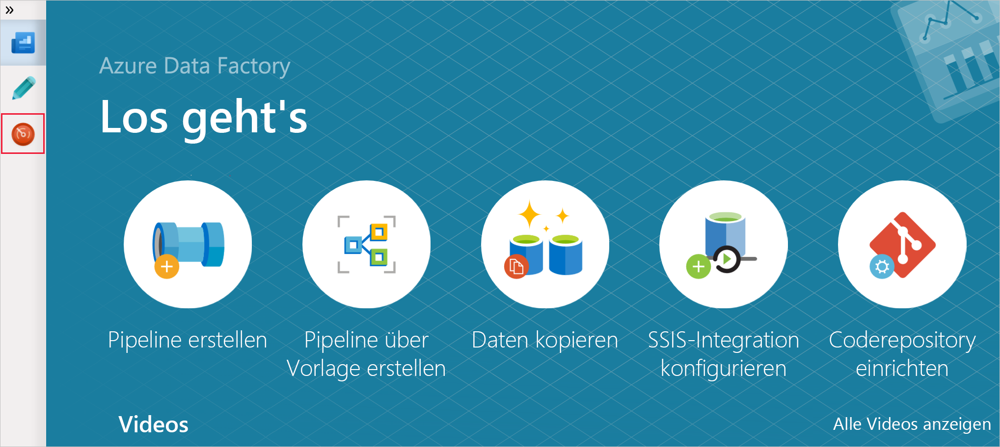
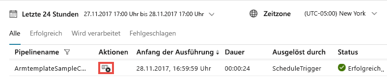
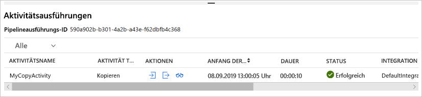

# <a name="tutorial-create-an-azure-data-factory-using-azure-resource-manager-template"></a>Tutorial: Erstellen einer Azure Data Factory-Instanz mit einer Azure Resource Manager-Vorlage

> [!div class="op_single_selector" title1="Wählen Sie die von Ihnen verwendete Version des Data Factory-Diensts aus:"]
> * [Version 1](v1/data-factory-build-your-first-pipeline-using-arm.md)
> * [Aktuelle Version](quickstart-create-data-factory-resource-manager-template.md)

In dieser Schnellstartanleitung wird beschrieben, wie Sie mithilfe einer Azure Resource Manager-Vorlage eine Azure Data Factory erstellen. Die in dieser Data Factory erstellte Pipeline **kopiert** Daten aus einem Ordner in einen anderen Ordner in Azure Blob Storage. Ein Tutorial zum **Transformieren** von Daten mithilfe von Azure Data Factory finden Sie unter [Tutorial: Daten mit Spark transformieren](transform-data-using-spark.md).

> [!NOTE]
> Dieser Artikel enthält keine ausführliche Einführung in den Data Factory-Dienst. Eine Einführung in den Azure Data Factory-Dienst finden Sie unter [Einführung in Azure Data Factory](introduction.md).

[!INCLUDE [data-factory-quickstart-prerequisites](../../includes/data-factory-quickstart-prerequisites.md)]

### <a name="azure-powershell"></a>Azure PowerShell

[!INCLUDE [updated-for-az](../../includes/updated-for-az.md)]

Installieren Sie die aktuellen Azure PowerShell-Module, indem Sie die Anweisungen unter [Installieren und Konfigurieren von Azure PowerShell](/powershell/azure/install-Az-ps) befolgen.

## <a name="resource-manager-templates"></a>Resource Manager-Vorlagen

Allgemeine Informationen zu Azure Resource Manager-Vorlagen finden Sie unter [Erstellen von Azure Resource Manager-Vorlagen](../azure-resource-manager/resource-group-authoring-templates.md).

Der folgende Abschnitt enthält die vollständige Resource Manager-Vorlage zum Definieren von Data Factory-Entitäten, damit Sie das Tutorial schnell durchlaufen und die Vorlage testen können. Informationen zum Definieren der einzelnen Data Factory-Entitäten finden Sie im Abschnitt [Data Factory-Entitäten in der Vorlage](#data-factory-entities-in-the-template).

Weitere Informationen zur JSON-Syntax und Eigenschaften für Data Factory-Ressourcen in einer Vorlage finden Sie unter [Microsoft.DataFactory-Ressourcentypen](/azure/templates/microsoft.datafactory/allversions).

## <a name="data-factory-json"></a>Data Factory-JSON

Erstellen Sie eine JSON-Datei mit dem Namen **ADFTutorialARM.json** im Ordner **C:\ADFTutorial** (wenn der Ordner „ADFTutorial“ noch nicht vorhanden ist, erstellen Sie ihn), die Folgendes enthält:

```json
{  
    "$schema":"http://schema.management.azure.com/schemas/2015-01-01/deploymentTemplate.json#",
    "contentVersion":"1.0.0.0",
    "parameters":{  
        "dataFactoryName":{  
            "type":"string",
            "metadata":"Data Factory Name"
        },
        "dataFactoryLocation":{  
            "type":"string",
            "defaultValue":"East US",
            "metadata":{  
                "description":"Location of the data factory. Currently, only East US, East US 2, and West Europe are supported. "
            }
        },
        "storageAccountName":{  
            "type":"string",
            "metadata":{  
                "description":"Name of the Azure storage account that contains the input/output data."
            }
        },
        "storageAccountKey":{  
            "type":"securestring",
            "metadata":{  
                "description":"Key for the Azure storage account."
            }
        },
        "triggerStartTime": {
            "type": "string",
            "metadata": {
                "description": "Start time for the trigger."
            }
        },
        "triggerEndTime": {
            "type": "string",
            "metadata": {
                "description": "End time for the trigger."
            }
        }
    },      
    "variables":{  
        "factoryId":"[concat('Microsoft.DataFactory/factories/', parameters('dataFactoryName'))]"
    },
    "resources":[  
        {  
            "name":"[parameters('dataFactoryName')]",
            "apiVersion":"2018-06-01",
            "type":"Microsoft.DataFactory/factories",
            "location":"[parameters('dataFactoryLocation')]",
            "identity":{  
                "type":"SystemAssigned"
            },
            "resources":[  
                {  
                    "name":"[concat(parameters('dataFactoryName'), '/ArmtemplateStorageLinkedService')]",
                    "type":"Microsoft.DataFactory/factories/linkedServices",
                    "apiVersion":"2018-06-01",
                    "properties":{  
                        "annotations":[  

                        ],
                        "type":"AzureBlobStorage",
                        "typeProperties":{  
                            "connectionString":"[concat('DefaultEndpointsProtocol=https;AccountName=',parameters('storageAccountName'),';AccountKey=',parameters('storageAccountKey'))]"
                        }
                    },
                    "dependsOn":[  
                        "[parameters('dataFactoryName')]"
                    ]
                },
                {  
                    "name":"[concat(parameters('dataFactoryName'), '/ArmtemplateTestDatasetIn')]",
                    "type":"Microsoft.DataFactory/factories/datasets",
                    "apiVersion":"2018-06-01",
                    "properties":{  
                        "linkedServiceName":{  
                            "referenceName":"ArmtemplateStorageLinkedService",
                            "type":"LinkedServiceReference"
                        },
                        "annotations":[  

                        ],
                        "type":"Binary",
                        "typeProperties":{  
                            "location":{  
                                "type":"AzureBlobStorageLocation",
                                "fileName":"emp.txt",
                                "folderPath":"input",
                                "container":"adftutorial"
                            }
                        }
                    },
                    "dependsOn":[  
                        "[parameters('dataFactoryName')]",
                        "[concat(variables('factoryId'), '/linkedServices/ArmtemplateStorageLinkedService')]"
                    ]
                },
                {  
                    "name":"[concat(parameters('dataFactoryName'), '/ArmtemplateTestDatasetOut')]",
                    "type":"Microsoft.DataFactory/factories/datasets",
                    "apiVersion":"2018-06-01",
                    "properties":{  
                        "linkedServiceName":{  
                            "referenceName":"ArmtemplateStorageLinkedService",
                            "type":"LinkedServiceReference"
                        },
                        "annotations":[  

                        ],
                        "type":"Binary",
                        "typeProperties":{  
                            "location":{  
                                "type":"AzureBlobStorageLocation",
                                "folderPath":"output",
                                "container":"adftutorial"
                            }
                        }
                    },
                    "dependsOn":[  
                        "[parameters('dataFactoryName')]",
                        "[concat(variables('factoryId'), '/linkedServices/ArmtemplateStorageLinkedService')]"
                    ]
                },
                {  
                    "name":"[concat(parameters('dataFactoryName'), '/ArmtemplateSampleCopyPipeline')]",
                    "type":"Microsoft.DataFactory/factories/pipelines",
                    "apiVersion":"2018-06-01",
                    "properties":{  
                        "activities":[  
                            {  
                                "name":"MyCopyActivity",
                                "type":"Copy",
                                "dependsOn":[  

                                ],
                                "policy":{  
                                    "timeout":"7.00:00:00",
                                    "retry":0,
                                    "retryIntervalInSeconds":30,
                                    "secureOutput":false,
                                    "secureInput":false
                                },
                                "userProperties":[  

                                ],
                                "typeProperties":{  
                                    "source":{  
                                        "type":"BinarySource",
                                        "storeSettings":{  
                                            "type":"AzureBlobStorageReadSettings",
                                            "recursive":true
                                        }
                                    },
                                    "sink":{  
                                        "type":"BinarySink",
                                        "storeSettings":{  
                                            "type":"AzureBlobStorageWriteSettings"
                                        }
                                    },
                                    "enableStaging":false
                                },
                                "inputs":[  
                                    {  
                                        "referenceName":"ArmtemplateTestDatasetIn",
                                        "type":"DatasetReference",
                                        "parameters":{  

                                        }
                                    }
                                ],
                                "outputs":[  
                                    {  
                                        "referenceName":"ArmtemplateTestDatasetOut",
                                        "type":"DatasetReference",
                                        "parameters":{  

                                        }
                                    }
                                ]
                            }
                        ],
                        "annotations":[  

                        ]
                    },
                    "dependsOn":[  
                        "[parameters('dataFactoryName')]",
                        "[concat(variables('factoryId'), '/datasets/ArmtemplateTestDatasetIn')]",
                        "[concat(variables('factoryId'), '/datasets/ArmtemplateTestDatasetOut')]"
                    ]
                },
                {  
                    "name":"[concat(parameters('dataFactoryName'), '/ArmTemplateTestTrigger')]",
                    "type":"Microsoft.DataFactory/factories/triggers",
                    "apiVersion":"2018-06-01",
                    "properties":{  
                        "annotations":[  

                        ],
                        "runtimeState":"Started",
                        "pipelines":[  
                            {  
                                "pipelineReference":{  
                                    "referenceName":"ArmtemplateSampleCopyPipeline",
                                    "type":"PipelineReference"
                                },
                                "parameters":{  

                                }
                            }
                        ],
                        "type":"ScheduleTrigger",
                        "typeProperties":{  
                            "recurrence":{  
                                "frequency":"Hour",
                                "interval":1,
                                "startTime":"[parameters('triggerStartTime')]",
                                "endTime":"[parameters('triggerEndTime')]",
                                "timeZone":"UTC"
                            }
                        }
                    },
                    "dependsOn":[  
                        "[parameters('dataFactoryName')]",
                        "[concat(variables('factoryId'), '/pipelines/ArmtemplateSampleCopyPipeline')]"
                    ]
                }
            ]
        }
    ]
}
```
## <a name="parameters-json"></a>Parameter (JSON)

Erstellen Sie eine JSON-Datei namens **ADFTutorialARM-Parameters.json** mit Parametern für die Azure Resource Manager-Vorlage.

> [!IMPORTANT]
> - Geben Sie für die Parameter **storageAccountName** und **storageAccountKey** in dieser Parameterdatei den Namen und den Schlüssel Ihres Azure Storage-Kontos an. Sie haben den Container adftutorial erstellt und die Beispieldatei (emp.txt) in den Eingabeordner dieser Azure Blob Storage-Instanz hochgeladen.
> - Geben Sie einen global eindeutigen Data Factory-Namen für den Parameter **dataFactoryName** an. Beispiel:  ARMTutorialFactoryJohnDoe11282017.
> - Geben Sie für **triggerStartTime** den aktuellen Tag im folgenden Format an: `2019-09-08T00:00:00`.
> - Geben Sie für **triggerEndTime** den nächsten Tag im folgenden Format an: `2019-09-09T00:00:00`. Sie können auch die aktuelle UTC-Zeit prüfen und die nächste oder übernächste Stunde als Endzeit angeben. Geben Sie beispielsweise `2019-09-09:03:00:00` als Endzeit an, wenn die aktuelle UTC-Zeit 01:32 Uhr lautet. In diesem Fall führt der Trigger die Pipeline zweimal aus (um 2 und 3 Uhr).

```json
{  
    "$schema":"https://schema.management.azure.com/schemas/2015-01-01/deploymentParameters.json#",
    "contentVersion":"1.0.0.0",
    "parameters":{  
        "dataFactoryName":{  
            "value":"<datafactoryname>"
        },
        "dataFactoryLocation":{  
            "value":"East US"
        },
        "storageAccountName":{  
            "value":"<yourstorageaccountname>"
        },
        "storageAccountKey":{  
            "value":"<yourstorageaccountkey>"
        },
        "triggerStartTime":{  
            "value":"2019-09-08T11:00:00"
        },
        "triggerEndTime":{  
            "value":"2019-09-08T14:00:00"
        }
    }
}
```

> [!IMPORTANT]
> Für die Entwicklungs-, die Test- und die Produktionsumgebung können jeweils separate JSON-Parameterdateien mit der gleichen Data Factory-JSON-Vorlage verwendet werden. Mithilfe eines PowerShell-Skripts können Sie die Bereitstellung von Data Factory-Entitäten in diesen Umgebungen automatisieren.

## <a name="deploy-data-factory-entities"></a>Bereitstellen der Data Factory-Entitäten

Führen Sie in PowerShell den folgenden Befehl aus, um die Data Factory-Entitäten mit der Resource Manager-Vorlage bereitzustellen, die Sie weiter oben erstellt haben, in Ihrer Ressourcengruppe bereitstellen (in diesem Fall verwenden Sie „ADFTutorialResourceGroup“ als Beispiel).

```powershell
New-AzResourceGroupDeployment -Name MyARMDeployment -ResourceGroupName ADFTutorialResourceGroup -TemplateFile C:\ADFTutorial\ADFTutorialARM.json -TemplateParameterFile C:\ADFTutorial\ADFTutorialARM-Parameters.json
```

Ihnen wird daraufhin eine Ausgabe angezeigt, die in etwa wie im folgenden Beispiel aussieht:

```console
DeploymentName          : MyARMDeployment
ResourceGroupName       : ADFTutorialResourceGroup
ProvisioningState       : Succeeded
Timestamp               : 9/8/2019 10:52:29 AM
Mode                    : Incremental
TemplateLink            : 
Parameters              : 
                          Name                   Type                       Value     
                          =====================  =========================  ==========
                          dataFactoryName        String                     <data factory name>
                          dataFactoryLocation    String                     East US   
                          storageAccountName     String                     <storage account name>
                          storageAccountKey      SecureString                         
                          triggerStartTime       String                     9/8/2019 11:00:00 AM
                          triggerEndTime         String                     9/8/2019 2:00:00 PM
                          
Outputs                 : 
DeploymentDebugLogLevel : 
```

## <a name="start-the-trigger"></a>Starten des Triggers

Die Vorlage stellt die folgenden Data Factory-Entitäten bereit:

- Mit Azure Storage verknüpfter Dienst
- Binärdatasets (Ein- und Ausgabe)
- Pipeline mit Kopieraktivität
- Trigger zum Auslösen der Pipeline

Der bereitgestellte Trigger befindet sich im Status „Beendet“. Eine Möglichkeit zum Starten des Triggers ist die Verwendung des PowerShell-Cmdlets **Start-AzDataFactoryV2Trigger**. Das folgende Verfahren enthält die ausführlichen Schritte:

1. Erstellen Sie im PowerShell-Fenster eine Variable für den Namen der Ressourcengruppe. Kopieren Sie den folgenden Befehl in das PowerShell-Fenster, und drücken Sie die EINGABETASTE. Wenn Sie einen anderen Ressourcengruppennamen für den Befehl „New-AzResourceGroupDeployment“ angegeben haben, aktualisieren Sie den Wert hier.

    ```powershell
    $resourceGroupName = "ADFTutorialResourceGroup"
    ```
2. Erstellen Sie eine Variable für den Namen der Data Factory. Geben Sie den gleichen Namen an, den Sie in der Datei „ADFTutorialARM-Parameters.json“ angegeben haben.

    ```powershell
    $dataFactoryName = "<yourdatafactoryname>"
    ```
3. Legen Sie eine Variable für den Namen des Triggers fest. Der Name des Triggers ist in der Datei mit der Resource Manager-Vorlage (ADFTutorialARM.json) hartcodiert.

    ```powershell
    $triggerName = "ArmTemplateTestTrigger"
    ```
4. Rufen Sie den **Status des Triggers** ab, indem Sie den folgenden PowerShell-Befehl ausführen, nachdem Sie den Namen Ihrer Data Factory und des Triggers angegeben haben:

    ```powershell
    Get-AzDataFactoryV2Trigger -ResourceGroupName $resourceGroupName -DataFactoryName $dataFactoryName -Name $triggerName
    ```

    Hier ist die Beispielausgabe:

    ```json

    TriggerName       : ArmTemplateTestTrigger
    ResourceGroupName : ADFTutorialResourceGroup
    DataFactoryName   : ADFQuickstartsDataFactory0905
    Properties        : Microsoft.Azure.Management.DataFactory.Models.ScheduleTrigger
    RuntimeState      : Stopped
    ```
    
    Beachten Sie, dass der Laufzeitstatus des Triggers **Stopped** (Beendet) lautet.
5. **Starten Sie den Trigger**. Der Trigger führt die Pipeline, die in der Vorlage definiert ist, zur vollen Stunde aus. Wenn Sie diesen Befehl um 14:25 Uhr ausgeführt haben, führt der Trigger die Pipeline also zum ersten Mal um 15:00 Uhr aus. Anschließend wird die Pipeline jede Stunde bis zum Endzeitpunkt ausgeführt, den Sie für den Trigger angegeben haben.

    ```powershell
    Start-AzDataFactoryV2Trigger -ResourceGroupName $resourceGroupName -DataFactoryName $dataFactoryName -TriggerName $triggerName
    ```
    
    Hier ist die Beispielausgabe:
    
    ```console
    Confirm
    Are you sure you want to start trigger 'ArmTemplateTestTrigger' in data factory 'ARMFactory1128'?
    [Y] Yes  [N] No  [S] Suspend  [?] Help (default is "Y"): y
    True
    ```
6. Vergewissern Sie sich, dass der Trigger gestartet wurde, indem Sie den Befehl „Get-AzDataFactoryV2Trigger“ erneut ausführen.

    ```powershell
    Get-AzDataFactoryV2Trigger -ResourceGroupName $resourceGroupName -DataFactoryName $dataFactoryName -TriggerName $triggerName
    ```
    
    Hier ist die Beispielausgabe:
    
    ```console
    TriggerName       : ArmTemplateTestTrigger
    ResourceGroupName : ADFTutorialResourceGroup
    DataFactoryName   : ADFQuickstartsDataFactory0905
    Properties        : Microsoft.Azure.Management.DataFactory.Models.ScheduleTrigger
    RuntimeState      : Started
    ```

## <a name="monitor-the-pipeline"></a>Überwachen der Pipeline

1. Klicken Sie nach der Anmeldung beim [Azure-Portal](https://portal.azure.com/) auf **Alle Dienste**, führen Sie eine Schlüsselwortsuche durch (beispielsweise nach **data fa**), und wählen Sie **Data Factorys** aus.

2. Klicken Sie auf der Seite **Data Factorys** auf die Data Factory, die Sie erstellt haben. Filtern Sie die Liste mit dem Namen Ihrer Data Factory, falls dies erforderlich ist.

3. Klicken Sie auf der Data Factory-Seite auf die Kachel **Erstellen und überwachen**.

4. Wählen Sie auf der Seite **Erste Schritte** die Registerkarte **Überwachen** aus.  

    > [!IMPORTANT]
    > Sie sehen, dass die Pipeline nur zur vollen Stunde ausgeführt wird (z.B. 4 Uhr, 5 Uhr, 6 Uhr usw.). Klicken Sie in der Symbolleiste auf **Aktualisieren**, um die Liste zu aktualisieren, wenn die Uhrzeit die nächste volle Stunde erreicht.

5. Klicken Sie in der Spalte **Aktionen** auf den Link **View Activity Runs** (Aktivitätsausführungen anzeigen).

    

6. Sie sehen die Aktivitätsausführungen, die der Pipelineausführung zugeordnet sind. In dieser Schnellstartanleitung verfügt die Pipeline nur über eine Aktivität vom Typ „Kopieren“. Aus diesem Grund wird eine Ausführung für diese Aktivität angezeigt.

    
7. Klicken Sie unter in der Spalte „Aktionen“ auf den Link **Ausgabe**. Die Ausgabe des Kopiervorgangs wird im Fenster **Ausgabe** angezeigt. Klicken Sie auf die Schaltfläche „Maximieren“, um die vollständige Ausgabe anzuzeigen. Sie können das maximierte Ausgabefenster schließen.

8. Beenden Sie den Trigger, nachdem eine erfolgreiche oder nicht erfolgreiche Ausführung angezeigt wird. Der Trigger führt die Pipeline einmal pro Stunde aus. Die Pipeline kopiert für jede Ausführung dieselbe Datei aus dem Eingabeordner in den Ausgabeordner. Führen Sie den folgenden Befehl im PowerShell-Fenster aus, um den Trigger zu beenden.
    
    ```powershell
    Stop-AzDataFactoryV2Trigger -ResourceGroupName $resourceGroupName -DataFactoryName $dataFactoryName -Name $triggerName
    ```

[!INCLUDE [data-factory-quickstart-verify-output-cleanup.md](../../includes/data-factory-quickstart-verify-output-cleanup.md)]

## <a name="data-factory-entities-in-the-template"></a> JSON-Definitionen für Entitäten

In der JSON-Vorlage werden folgende Data Factory-Entitäten definiert:

- [Mit Azure Storage verknüpfter Dienst](#azure-storage-linked-service)
- [Binäres Eingabedataset](#binary-input-dataset)
- [Binäres Ausgabedataset](#binary-output-dataset)
- [Datenpipeline mit einer Kopieraktivität](#data-pipeline)
- [Trigger](#trigger)

#### <a name="azure-storage-linked-service"></a>Mit Azure Storage verknüpfter Dienst

Die AzureStorageLinkedService-Instanz verknüpft Ihr Azure Storage-Konto mit der Data Factory. Sie haben im Rahmen der Schritte zur Erfüllung der Voraussetzungen einen Container erstellt und Daten in dieses Speicherkonto hochgeladen. In diesem Abschnitt geben Sie Name und Schlüssel Ihres Azure Storage-Kontos an. Informationen zu JSON-Eigenschaften zum Definieren eines mit Azure Storage verknüpften Diensts finden Sie unter [Mit Azure Storage verknüpfter Dienst](connector-azure-blob-storage.md#linked-service-properties).

```json
{  
    "name":"[concat(parameters('dataFactoryName'), '/ArmtemplateStorageLinkedService')]",
    "type":"Microsoft.DataFactory/factories/linkedServices",
    "apiVersion":"2018-06-01",
    "properties":{  
        "annotations":[  

        ],
        "type":"AzureBlobStorage",
        "typeProperties":{  
            "connectionString":"[concat('DefaultEndpointsProtocol=https;AccountName=',parameters('storageAccountName'),';AccountKey=',parameters('storageAccountKey'))]"
        }
    },
    "dependsOn":[  
        "[parameters('dataFactoryName')]"
    ]
}
```

Die Verbindungszeichenfolge (connectionString) enthält die Parameter „storageAccountName“ und „storageAccountKey“. Die Werte für diese Parameter werden mithilfe einer Konfigurationsdatei übergeben. In der Definition werden außerdem die in der Vorlage definierten Variablen „azureStorageLinkedService“ und „dataFactoryName“ verwendet.

#### <a name="binary-input-dataset"></a>Binäres Eingabedataset

Der mit Azure Storage verknüpfte Dienst gibt die Verbindungszeichenfolge an, die der Data Factory-Dienst zur Laufzeit für die Herstellung einer Verbindung zu Ihrem Azure Storage-Konto verwendet. In der Definition des Binärdatasets geben Sie die Namen des Blobcontainers, des Ordners und der Datei mit den Eingabedaten an. Informationen zu JSON-Eigenschaften zum Definieren eines Binärdatasets finden Sie unter [Eigenschaften des Dataset-Typs „Binär“](format-binary.md#dataset-properties).

```json
{  
    "name":"[concat(parameters('dataFactoryName'), '/ArmtemplateTestDatasetIn')]",
    "type":"Microsoft.DataFactory/factories/datasets",
    "apiVersion":"2018-06-01",
    "properties":{  
        "linkedServiceName":{  
            "referenceName":"ArmtemplateStorageLinkedService",
            "type":"LinkedServiceReference"
        },
        "annotations":[  

        ],
        "type":"Binary",
        "typeProperties":{  
            "location":{  
                "type":"AzureBlobStorageLocation",
                "fileName":"emp.txt",
                "folderPath":"input",
                "container":"adftutorial"
            }
        }
    },
    "dependsOn":[  
        "[parameters('dataFactoryName')]",
        "[concat(variables('factoryId'), '/linkedServices/ArmtemplateStorageLinkedService')]"
    ]
}
```

#### <a name="binary-output-dataset"></a>Binäres Ausgabedataset

Sie geben den Namen des Ordners in der Azure Blob Storage-Instanz an, die die kopierten Daten aus dem Eingabeordner enthält. Informationen zu JSON-Eigenschaften zum Definieren eines Binärdatasets finden Sie unter [Eigenschaften des Dataset-Typs „Binär“](format-binary.md#dataset-properties).

```json
{  
    "name":"[concat(parameters('dataFactoryName'), '/ArmtemplateTestDatasetOut')]",
    "type":"Microsoft.DataFactory/factories/datasets",
    "apiVersion":"2018-06-01",
    "properties":{  
        "linkedServiceName":{  
            "referenceName":"ArmtemplateStorageLinkedService",
            "type":"LinkedServiceReference"
        },
        "annotations":[  

        ],
        "type":"Binary",
        "typeProperties":{  
            "location":{  
                "type":"AzureBlobStorageLocation",
                "folderPath":"output",
                "container":"adftutorial"
            }
        }
    },
    "dependsOn":[  
        "[parameters('dataFactoryName')]",
        "[concat(variables('factoryId'), '/linkedServices/ArmtemplateStorageLinkedService')]"
    ]
}
```

#### <a name="data-pipeline"></a>Datenpipeline

In diesem Abschnitt definieren Sie eine Pipeline, die Daten aus einem Binärdataset in ein anderes Binärdataset kopiert. Informationen zu JSON-Elementen zum Definieren einer Pipeline für dieses Beispiel finden Sie unter [Pipeline-JSON](concepts-pipelines-activities.md#pipeline-json).

```json
{  
    "name":"[concat(parameters('dataFactoryName'), '/ArmtemplateSampleCopyPipeline')]",
    "type":"Microsoft.DataFactory/factories/pipelines",
    "apiVersion":"2018-06-01",
    "properties":{  
        "activities":[  
            {  
                "name":"MyCopyActivity",
                "type":"Copy",
                "dependsOn":[  

                ],
                "policy":{  
                    "timeout":"7.00:00:00",
                    "retry":0,
                    "retryIntervalInSeconds":30,
                    "secureOutput":false,
                    "secureInput":false
                },
                "userProperties":[  

                ],
                "typeProperties":{  
                    "source":{  
                        "type":"BinarySource",
                        "storeSettings":{  
                            "type":"AzureBlobStorageReadSettings",
                            "recursive":true
                        }
                    },
                    "sink":{  
                        "type":"BinarySink",
                        "storeSettings":{  
                            "type":"AzureBlobStorageWriteSettings"
                        }
                    },
                    "enableStaging":false
                },
                "inputs":[  
                    {  
                        "referenceName":"ArmtemplateTestDatasetIn",
                        "type":"DatasetReference",
                        "parameters":{  

                        }
                    }
                ],
                "outputs":[  
                    {  
                        "referenceName":"ArmtemplateTestDatasetOut",
                        "type":"DatasetReference",
                        "parameters":{  

                        }
                    }
                ]
            }
        ],
        "annotations":[  

        ]
    },
    "dependsOn":[  
        "[parameters('dataFactoryName')]",
        "[concat(variables('factoryId'), '/datasets/ArmtemplateTestDatasetIn')]",
        "[concat(variables('factoryId'), '/datasets/ArmtemplateTestDatasetOut')]"
    ]
}
```

#### <a name="trigger"></a>Trigger

In diesem Abschnitt definieren Sie einen Trigger, der die Pipeline einmal pro Stunde ausführt. Der bereitgestellte Trigger befindet sich im Status „Beendet“. Starten Sie den Trigger mithilfe des Cmdlets **Start-AzDataFactoryV2Trigger**. Weitere Informationen zu Triggern finden Sie im Artikel [Pipelineausführung und -trigger](concepts-pipeline-execution-triggers.md#triggers).

```json
{  
    "name":"[concat(parameters('dataFactoryName'), '/ArmTemplateTestTrigger')]",
    "type":"Microsoft.DataFactory/factories/triggers",
    "apiVersion":"2018-06-01",
    "properties":{  
        "annotations":[  

        ],
        "runtimeState":"Started",
        "pipelines":[  
            {  
                "pipelineReference":{  
                    "referenceName":"ArmtemplateSampleCopyPipeline",
                    "type":"PipelineReference"
                },
                "parameters":{  

                }
            }
        ],
        "type":"ScheduleTrigger",
        "typeProperties":{  
            "recurrence":{  
                "frequency":"Hour",
                "interval":1,
                "startTime":"[parameters('triggerStartTime')]",
                "endTime":"[parameters('triggerEndTime')]",
                "timeZone":"UTC"
            }
        }
    },
    "dependsOn":[  
        "[parameters('dataFactoryName')]",
        "[concat(variables('factoryId'), '/pipelines/ArmtemplateSampleCopyPipeline')]"
    ]
}
```

## <a name="reuse-the-template"></a>Wiederverwenden der Vorlage

In diesem Tutorial haben Sie eine Vorlage zum Definieren von Data Factory-Entitäten und eine Vorlage zum Übergeben von Parameterwerten erstellt. Mit der gleichen Vorlage können Sie Data Factory-Entitäten in unterschiedlichen Umgebungen bereitstellen. Hierzu müssen Sie lediglich eine Parameterdatei für die jeweilige Umgebung erstellen und beim Bereitstellen in dieser Umgebung verwenden.

Beispiel:

```powershell
New-AzResourceGroupDeployment -Name MyARMDeployment -ResourceGroupName ADFTutorialResourceGroup -TemplateFile ADFTutorialARM.json -TemplateParameterFile ADFTutorialARM-Parameters-Dev.json

New-AzResourceGroupDeployment -Name MyARMDeployment -ResourceGroupName ADFTutorialResourceGroup -TemplateFile ADFTutorialARM.json -TemplateParameterFile ADFTutorialARM-Parameters-Test.json

New-AzResourceGroupDeployment -Name MyARMDeployment -ResourceGroupName ADFTutorialResourceGroup -TemplateFile ADFTutorialARM.json -TemplateParameterFile ADFTutorialARM-Parameters-Production.json
```

Der erste Befehl verwendet eine Parameterdatei für die Entwicklungsumgebung, der zweite eine Parameterdatei für die Testumgebung und der dritte eine Parameterdatei für die Produktion.

Mit der Vorlage können auch wiederholte Aufgaben durchgeführt werden. Es kann beispielsweise sein, dass Sie zahlreiche Data Factorys mit einer Pipeline oder mehreren Pipelines erstellen, die die gleiche Logik implementieren, aber für die einzelnen Data Factorys jeweils ein anderes Azure Storage-Konto verwendet wird. In diesem Szenario können Sie zur Erstellung der Data Factorys die gleiche Vorlage in der gleichen Umgebung (Entwicklungs-, Test- oder Produktionsumgebung) mit unterschiedlichen Parameterdateien verwenden.

## <a name="next-steps"></a>Nächste Schritte

Die Pipeline in diesem Beispiel kopiert Daten in einem Azure Blob Storage von einem Speicherort in einen anderen. Arbeiten Sie die [Tutorials](tutorial-copy-data-dot-net.md) durch, um zu erfahren, wie Sie Data Factory in anderen Szenarien verwenden können.
