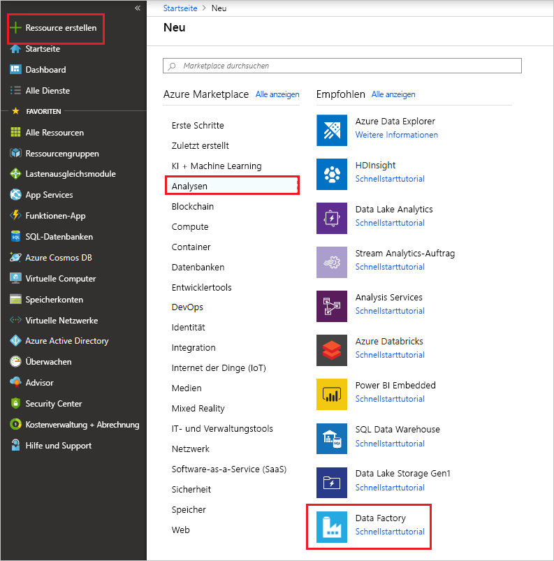

# <a name="transform-data-using-mapping-data-flows"></a>Transformieren von Daten mithilfe von Mapping Data Flow

Falls Sie noch nicht mit Azure Data Factory vertraut sind, ist es ratsam, den Artikel [Einführung in Azure Data Factory](introduction.md) zu lesen.

In diesem Tutorial erstellen Sie mithilfe der Azure Data Factory-Benutzeroberfläche eine Pipeline, mit der Daten aus einer Azure Data Lake Storage (ADLS) Gen2-Quelle in eine ADLS Gen2-Senke kopiert und mithilfe von Mapping Data Flow transformiert werden. Das Konfigurationsmuster in diesem Tutorial kann beim Transformieren von Daten mithilfe von Mapping Data Flow erweitert werden.

In diesem Tutorial führen Sie die folgenden Schritte aus:

> [!div class="checklist"]
> * Erstellen einer Data Factory
> * Erstellen einer Pipeline mit einer Datenflussaktivität
> * Erstellen einer Mapping Data Flow-Funktion mit vier Transformationen 
> * Ausführen eines Testlaufs für die Pipeline
> * Überwachen einer Datenflussaktivität

## <a name="prerequisites"></a>Voraussetzungen
* **Azure-Abonnement**. Wenn Sie über kein Azure-Abonnement verfügen, können Sie ein [kostenloses Azure-Konto](https://azure.microsoft.com/free/) erstellen, bevor Sie beginnen.
* **Azure-Speicherkonto**. Sie verwenden den ADLS-Speicher als *Quelldatenspeicher* und *Senkendatenspeicher*. Wenn Sie kein Speicherkonto besitzen, finden Sie unter [Informationen zu Azure-Speicherkonten](../storage/common/storage-quickstart-create-account.md) Schritte zum Erstellen eines solchen Kontos.

Die Datei, die in diesem Tutorial transformiert wird, ist „MoviesDB.csv“, die sich [hier](https://raw.githubusercontent.com/djpmsft/adf-ready-demo/master/moviesDB.csv) befindet. Zum Abrufen der Datei aus GitHub kopieren Sie den Inhalt in einen Text-Editor Ihrer Wahl, und speichern Sie ihn lokal als CSV-Datei. Wenn Sie die Datei in Ihr Speicherkonto hochladen möchten, finden Sie Informationen dazu unter [Hochladen von Blobs mit dem Azure-Portal](../storage/blobs/storage-quickstart-blobs-portal.md). In den Beispielen wird auf einen Container mit dem Namen „sample-data“ verwiesen.

## <a name="create-a-data-factory"></a>Erstellen einer Data Factory

In diesem Schritt erstellen Sie eine Data Factory und öffnen die Data Factory-Benutzeroberfläche, um eine Pipeline in der Data Factory zu erstellen. 

1. Öffnen Sie **Microsoft Edge** oder **Google Chrome**. Die Data Factory-Benutzeroberfläche wird derzeit nur in den Webbrowsern Microsoft Edge und Google Chrome unterstützt.
2. Klicken Sie im Menü auf der linken Seite auf **+ Ressource erstellen** > **Analytics** > **Data Factory**: 
  
   

3. Geben Sie auf der Seite **Neue Data Factory** unter **Name** den Namen **ADFTutorialDataFactory** ein. 
 
   Der Name der Azure Data Factory muss *global eindeutig*sein. Wenn eine Fehlermeldung zum Namenswert angezeigt wird, geben Sie einen anderen Namen für die Data Factory ein. (Verwenden Sie beispielsweise „IhrNameADFTutorialDataFactory“.) Benennungsregeln für Data Factory-Artefakte finden Sie im Thema [Azure Data Factory – Benennungsregeln](naming-rules.md).
        
     
4. Wählen Sie das **Azure-Abonnement** aus, in dem die Data Factory erstellt werden soll. 
5. Führen Sie unter **Ressourcengruppe** einen der folgenden Schritte aus:
     
    a. Wählen Sie die Option **Use existing**(Vorhandene verwenden) und dann in der Dropdownliste eine vorhandene Ressourcengruppe.

    b. Wählen Sie **Neu erstellen**, und geben Sie den Namen einer Ressourcengruppe ein. 
         
    Weitere Informationen zu Ressourcengruppen finden Sie unter [Verwenden von Ressourcengruppen zum Verwalten von Azure-Ressourcen](../azure-resource-manager/resource-group-overview.md). 
6. Wählen Sie unter **Version** die Option **V2**.
7. Wählen Sie unter **Standort** einen Standort für die Data Factory aus. In der Dropdownliste werden nur unterstützte Standorte angezeigt. Datenspeicher (etwa Azure Storage und SQL-Datenbank) und Computeeinheiten (etwa Azure HDInsight), die von der Data Factory genutzt werden, können sich in anderen Regionen befinden.
8. Klicken Sie auf **Erstellen**. 
9. Nach Abschluss der Erstellung wird der Hinweis im Benachrichtigungscenter angezeigt. Wählen Sie **Zu Ressource wechseln** aus, um zur Data Factory-Seite zu navigieren.
10. Klicken Sie auf **Erstellen und überwachen**, um die Data Factory-Benutzeroberfläche auf einer separaten Registerkarte zu starten.

## <a name="create-a-pipeline-with-a-data-flow-activity"></a>Erstellen einer Pipeline mit einer Datenflussaktivität

In diesem Schritt erstellen Sie eine Pipeline, die eine Datenflussaktivität enthält.

1. Wählen Sie auf der Seite **Erste Schritte** die Option **Pipeline erstellen** aus. 

   

1. Geben Sie auf der Registerkarte **Allgemein** für die Pipeline als **Name** der Pipeline **TransformMovies** ein.
1. Setzen Sie auf der oberen Leiste der Factory den Schieberegler **Datenfluss debuggen** auf „Ein“. Der Debugmodus ermöglicht das interaktive Testen von Transformationslogik mit einem aktiven Spark-Cluster. Die Aufwärmphase von Datenflussclustern dauert 5 bis 7 Minuten. Den Benutzern wird empfohlen, zuerst den Debugmodus zu aktivieren, wenn sie die Entwicklung eines Datenflusses planen. Weitere Informationen finden Sie unter [Debugmodus](concepts-data-flow-debug-mode.md).

    
1. Erweitern Sie im Bereich **Aktivitäten** das Accordion-Element **Verschieben und transformieren**. Ziehen Sie die **Datenfluss**-Aktivität per Drag & Drop aus dem Bereich auf die Pipelinecanvas.

    
1. Wählen Sie im Popupfenster **Datenfluss hinzufügen** die Option **Neuen Datenfluss erstellen** aus, und geben Sie dem Datenfluss den Namen **TransformMovies**. Klicken Sie anschließend auf „Fertig stellen“.

    

## <a name="build-transformation-logic-in-the-data-flow-canvas"></a>Erstellen von Transformationslogik auf der Datenflusscanvas

Sobald Sie den Datenfluss erstellen, werden Sie automatisch zur Datenflusscanvas geführt. In diesem Schritt erstellen Sie einen Datenfluss, der die Datei „moviesDB.csv“ aus dem ADLS-Speicher abruft und die durchschnittliche Bewertung von Komödien von 1910 bis 2000 aggregiert. Anschließend schreiben Sie diese Datei zurück in den ADLS-Speicher.

1. Fügen Sie auf der Datenflusscanvas eine Quelle hinzu, indem Sie auf das Feld **Quelle hinzufügen** klicken.

    
1. Geben Sie der Quelle den Namen **MoviesDB**. Klicken Sie auf **Neu**, um ein neues Quelldataset zu erstellen.
    
    
1. Wählen Sie **Azure Data Lake Storage Gen2** aus. Klicken Sie auf „Weiter“.

    
1. Wählen Sie **DelimitedText** aus. Klicken Sie auf „Weiter“.

    
1. Geben Sie dem Dataset den Namen **MoviesDB**. Wählen Sie in der Dropdownliste für den verknüpften Dienst die Option **Neu** aus.

    
1. Geben Sie im Erstellungsbildschirm für einen verknüpften Dienst dem verknüpften ADLS Gen2-Dienst den Namen **ADLSGen2**, und geben Sie die Authentifizierungsmethode an. Dann geben Sie Ihre Verbindungsanmeldeinformationen ein. In diesem Tutorial wird der Kontoschlüssel zum Herstellen einer Verbindung mit dem Speicherkonto verwendet. Sie können auf **Verbindung testen** klicken, um zu überprüfen, ob Ihre Anmeldeinformationen korrekt eingegeben wurden. Wenn Sie fertig sind, klicken Sie auf „Erstellen“.

    
1. Wenn Sie sich wieder im Erstellungsbildschirm für das Dataset befinden, geben Sie den Speicherort Ihrer Datei unter dem Feld **Dateipfad** ein. In diesem Tutorial befindet sich die Datei „moviesDB.csv“ im Container „sample-data“. Da die Datei Header enthält, aktivieren Sie das Kontrollkästchen **Erste Zeile als Header**. Wählen Sie **Aus Verbindung/Speicher** aus, um das Headerschema direkt aus der Datei in den Speicher zu importieren. Klicken Sie anschließend auf „OK“.

    
1. Wenn Ihr Debugcluster gestartet wurde, wechseln Sie zur Registerkarte **Datenvorschau** der Quelltransformation, und klicken Sie auf **Aktualisieren**, um eine Momentaufnahme der Daten zu erhalten. Mithilfe der Datenvorschau können Sie überprüfen, ob die Transformation ordnungsgemäß konfiguriert ist.
    
    
1. Klicken Sie auf der Datenflusscanvas neben dem Quellknoten auf das Pluszeichen, um eine neue Transformation hinzuzufügen. Als erste Transformation fügen Sie einen **Filter** hinzu.
    
    
1. Geben Sie der Filtertransformation den Namen **FilterYears**. Klicken Sie auf das Ausdrucksfeld neben **Filtern nach**, um den Ausdrucks-Generator zu öffnen. Hier geben Sie dann die Filterbedingung an. 
    
    
1. Mit dem Datenfluss-Ausdrucks-Generator können Sie Ausdrücke interaktiv erstellen, die dann in verschiedenen Transformationen verwendet werden können. Ausdrücke können integrierte Funktionen, Spalten aus dem Eingabeschema und benutzerdefinierte Parameter enthalten. Weitere Informationen zum Erstellen von Ausdrücken finden Sie unter [Mapping Data Flow: Ausdrucks-Generator](concepts-data-flow-expression-builder.md).
    
    In diesem Tutorial möchten Sie Filme des Genres „Komödie“ filtern, die zwischen den Jahren 1910 und 2000 entstanden sind. Da die Jahresangabe derzeit eine Zeichenfolge ist, müssen Sie sie mithilfe der Funktion ```toInteger()``` in eine ganze Zahl konvertieren. Verwenden Sie die Operatoren für größer als oder gleich (>=) und kleiner als oder gleich (<=) für einen Vergleich mit den Literalwerten für die Jahre 1910 und 2000. Verbinden Sie diese Ausdrücke mit dem Und-Operator (&&). Der Ausdruck sieht wie folgt aus:

    ```toInteger(year) >= 1910 && toInteger(year) <= 2000```

    Um zu ermitteln, welche Filme Komödien sind, können Sie mithilfe der Funktion ```rlike()``` nach dem Muster „Comedy“ in der Spalte „genres“ suchen. Verbinden Sie den rlike-Ausdruck mit dem Jahresvergleich, um Folgendes zu erhalten:

    ```toInteger(year) >= 1910 && toInteger(year) <= 2000 && rlike(genres, 'Comedy')```

    Wenn ein Debugcluster aktiv ist, können Sie die Logik überprüfen. Klicken Sie dazu auf **Aktualisieren**, um die Ausdrucksausgabe im Vergleich zu den verwendeten Eingaben anzuzeigen. Es gibt mehrere Möglichkeiten, wie Sie diese Logik mithilfe der Ausdruckssprache für Datenflüsse erzielen können.
    
    

    Sobald Sie den Ausdruck fertiggestellt haben, klicken Sie auf **Speichern und beenden**.

1. Rufen Sie eine **Datenvorschau** ab, um zu überprüfen, ob der Filter ordnungsgemäß funktioniert.
    
    
1. Als nächste Transformation fügen Sie eine **Aggregat**-Transformation unter **Schemamodifizierer** hinzu.
    
    
1. Geben Sie der Aggregattransformation den Namen **AggregateComedyRatings**. Wählen Sie auf der Registerkarte **Gruppieren nach** in der Dropdownliste die Option **year** aus, um die Aggregationen nach dem Jahr zu gruppieren, in dem der Film entstanden ist.
    
    
1. Wechseln Sie zur Registerkarte **Aggregate**. Geben Sie im linken Textfeld der Aggregatspalte den Namen **AverageComedyRating**. Klicken Sie auf das rechte Ausdrucksfeld, um den Aggregatausdruck über den Ausdrucks-Generator einzugeben.
    
    
1. Verwenden Sie die Aggregatfunktion ```avg()```, um den Durchschnitt der Spalte **Rating** zu erhalten. Da **Rating** eine Zeichenfolge ist und ```avg()``` eine numerische Eingabe benötigt, muss der Wert über die Funktion ```toInteger()``` in eine Zahl konvertiert werden. Dieser Ausdruck sieht wie folgt aus:

    ```avg(toInteger(Rating))```
    
    Klicken Sie anschließend auf **Speichern und beenden**. 

    
1. Wechseln Sie zur Registerkarte **Datenvorschau**, um die Transformationsausgabe anzuzeigen. Es sind nur zwei Spalten vorhanden: **year** und **AverageComedyRating**.
    
    
1. Als Nächstes fügen Sie eine Transformation vom Typ **Senke** unter **Ziel** hinzu.
    
    
1. Geben Sie der Senke den Namen **Sink**. Klicken Sie auf **Neu**, um das Senkendataset zu erstellen.
    
    
1. Wählen Sie **Azure Data Lake Storage Gen2** aus. Klicken Sie auf „Weiter“.

    
1. Wählen Sie **DelimitedText** aus. Klicken Sie auf „Weiter“.

    
1. Geben Sie dem Senkendataset den Namen **MoviesSink**. Wählen Sie als verknüpften Dienst den verknüpften ADLS Gen2-Dienst aus, den Sie in Schritt 6 erstellt haben. Geben Sie einen Ausgabeordner ein, in den die Daten geschrieben werden sollen. In diesem Tutorial wird in den Ordner „output“ im Container „sample-data“ geschrieben. Der Ordner muss nicht vorab vorhanden sein und kann dynamisch erstellt werden. Aktivieren Sie das Kontrollkästchen **Erste Zeile als Header**, und wählen Sie für **Schema importieren** die Option **Kein** aus. Klicken Sie auf Fertig stellen.
    
    

Sie haben nun die Erstellung des Datenflusses beendet. Jetzt können Sie ihn in ihrer Pipeline ausführen.

## <a name="running-and-monitoring-the-data-flow"></a>Ausführen und Überwachen des Datenflusses

Sie können eine Pipeline vor der Veröffentlichung debuggen. In diesem Schritt lösen Sie eine Debugausführung der Datenflusspipeline aus. Während bei der Datenvorschau keine Daten geschrieben werden, werden bei einer Debugausführung Daten in das Senkenziel geschrieben.

1. Wechseln Sie zur Pipelinecanvas. Klicken Sie auf **Debuggen**, um eine Debugausführung auszulösen.
    
    
1. Für das Debuggen der Pipeline von Datenflussaktivitäten wird der aktive Debugcluster verwendet, doch dauert die Initialisierung dennoch mindestens eine Minute. Sie können den Fortschritt über die Registerkarte **Ausgabe** verfolgen. Wenn die Ausführung erfolgreich ist, klicken Sie auf das Brillensymbol, um den Überwachungsbereich zu öffnen.
    
    
1. Im Überwachungsbereich werden die Anzahl der Zeilen und die Zeit für die einzelnen Transformationsschritte angezeigt.
    
    
1. Klicken Sie auf eine Transformation, um ausführliche Informationen über die Spalten und die Partitionierung der Daten zu erhalten.
    
    

Wenn Sie dieses Tutorial richtig durchgeführt haben, sollten 83 Zeilen und 2 Spalten in den Senkenordner geschrieben worden sein. Sie können sich von der Richtigkeit der Daten überzeugen, indem Sie den Blobspeicher überprüfen.

## <a name="next-steps"></a>Nächste Schritte

Mit der Pipeline in diesem Tutorial wird ein Datenfluss ausgeführt, der die durchschnittliche Bewertung von Komödien zwischen 1910 und 2000 aggregiert und die Daten in ADLS schreibt. Es wurde Folgendes vermittelt:

> [!div class="checklist"]
> * Erstellen einer Data Factory
> * Erstellen einer Pipeline mit einer Datenflussaktivität
> * Erstellen einer Mapping Data Flow-Funktion mit vier Transformationen 
> * Ausführen eines Testlaufs für die Pipeline
> * Überwachen einer Datenflussaktivität

Erfahren Sie mehr über die [Ausdruckssprache für Datenflüsse](data-flow-expression-functions.md).