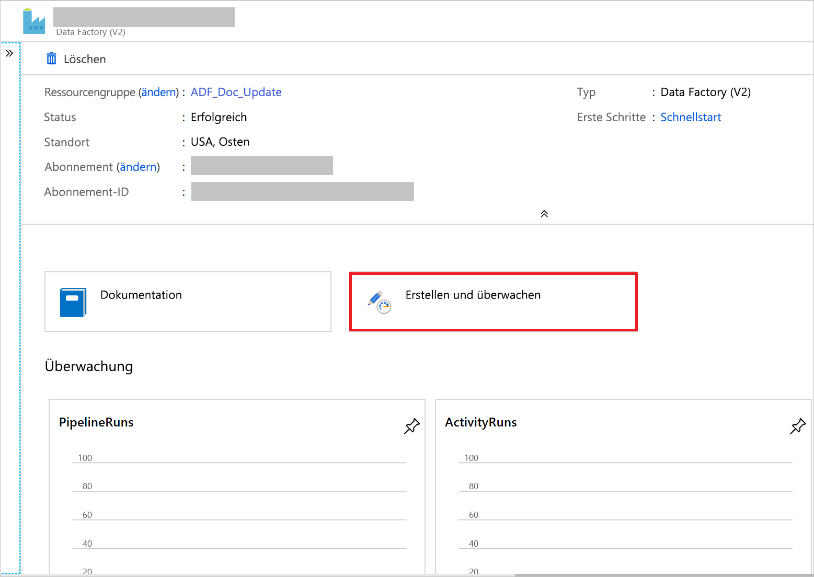

# <a name="incrementally-load-data-from-an-azure-sql-database-to-azure-blob-storage"></a>Inkrementelles Laden von Daten aus Azure SQL-Datenbank in Azure Blob Storage
In diesem Tutorial erstellen Sie eine Azure Data Factory mit einer Pipeline, bei der Deltadaten aus einer Tabelle in Azure SQL-Datenbank in Azure Blob Storage geladen werden. 

In diesem Tutorial führen Sie die folgenden Schritte aus:

> [!div class="checklist"]
> * Vorbereiten des Datenspeichers zum Speichern des Grenzwerts.
> * Erstellen einer Data Factory.
> * Erstellen Sie verknüpfte Dienste. 
> * Erstellen des Quell-, Senken-, Grenzwertdatasets
> * Erstellen einer Pipeline.
> * Ausführen der Pipeline.
> * Überwachen der Pipelineausführung. 
> * Überprüfen der Ergebnisse
> * Hinzufügen von weiteren Daten zur Quelle
> * Erneutes Ausführen der Pipeline
> * Überwachen der zweiten Pipelineausführung
> * Überprüfen der Ergebnisse der zweiten Ausführung


## <a name="overview"></a>Übersicht
Allgemeines Lösungsdiagramm: 


Hier sind die wesentlichen Schritte beim Erstellen dieser Lösung aufgeführt: 

1. **Select the watermark column (Wählen Sie die Grenzwert-Spalte aus)** .
    Wählen Sie eine Spalte im Quelldatenspeicher aus, die verwendet werden kann, um die neuen oder aktualisierten Datensätze für jede Ausführung in Segmente aufzuteilen. Normalerweise steigen die Daten in dieser ausgewählten Spalte (z.B. Last_modify_time oder ID), wenn Zeilen erstellt oder aktualisiert werden. Der maximale Wert in dieser Spalte wird als Grenzwert verwendet.

2. **Prepare a data store to store the watermark value (Vorbereiten eines Datenspeichers zum Speichern des Grenzwerts)** . In diesem Tutorial speichern Sie den Grenzwert in einer SQL-Datenbank.
    
3. **Erstellen einer Pipeline mit dem folgenden Workflow:** 
    
    Die Pipeline in dieser Lösung enthält die folgenden Aktivitäten:
  
    * Erstellen Sie zwei Lookup-Aktivitäten. Verwenden Sie die erste Lookup-Aktivität, um den letzten Grenzwert abzurufen. Verwenden Sie die zweite Lookup-Aktivität, um den neuen Grenzwert abzurufen. Diese Grenzwerte werden an die Copy-Aktivität übergeben. 
    * Erstellen Sie eine Copy-Aktivität, die Zeilen aus dem Quelldatenspeicher kopiert, wobei der Wert der Grenzwertspalte größer als der alte Grenzwert und kleiner als der neue Grenzwert ist. Anschließend werden die Deltadaten aus dem Quelldatenspeicher als neue Datei in einen Blobspeicher kopiert. 
    * Erstellen Sie eine StoredProcedure-Aktivität, die den Grenzwert für die Pipeline aktualisiert, die nächstes Mal ausgeführt wird. 


Wenn Sie kein Azure-Abonnement besitzen, können Sie ein [kostenloses Konto](https://azure.microsoft.com/free/) erstellen, bevor Sie beginnen.

## <a name="prerequisites"></a>Voraussetzungen
* **Azure SQL-Datenbank**. Sie verwenden die Datenbank als den Quelldatenspeicher. Wenn Sie keine SQL-Datenbank besitzen, finden Sie Schritte zum Erstellen einer solchen Datenbank unter [Erstellen einer Azure SQL-Datenbank im Azure-Portal](../sql-database/sql-database-get-started-portal.md).
* **Azure Storage**. Sie verwenden den Blobspeicher als Senkendatenspeicher. Wenn Sie kein Speicherkonto besitzen, finden Sie unter [Erstellen eines Speicherkontos](../storage/common/storage-quickstart-create-account.md) Schritte zum Erstellen eines solchen Kontos. Erstellen Sie einen Container mit dem Namen „adftutorial“. 

### <a name="create-a-data-source-table-in-your-sql-database"></a>Erstellen einer Datenquelltabelle in Ihrer SQL-Datenbank
1. Öffnen Sie SQL Server Management Studio. Klicken Sie im **Server-Explorer** mit der rechten Maustaste auf die Datenbank, und wählen Sie **Neue Abfrage**.

2. Führen Sie den folgenden SQL-Befehl für Ihre SQL-Datenbank aus, um eine Tabelle mit dem Namen `data_source_table` als Quelldatenspeicher zu erstellen. 
    
    ```sql
    create table data_source_table
    (
        PersonID int,
        Name varchar(255),
        LastModifytime datetime
    );

    INSERT INTO data_source_table
    (PersonID, Name, LastModifytime)
    VALUES
    (1, 'aaaa','9/1/2017 12:56:00 AM'),
    (2, 'bbbb','9/2/2017 5:23:00 AM'),
    (3, 'cccc','9/3/2017 2:36:00 AM'),
    (4, 'dddd','9/4/2017 3:21:00 AM'),
    (5, 'eeee','9/5/2017 8:06:00 AM');
    ```
    In diesem Tutorial verwenden Sie „LastModifytime“ als die Grenzwertspalte. Die Daten im Quelldatenspeicher sind in der folgenden Tabelle dargestellt:

    ```
    PersonID | Name | LastModifytime
    -------- | ---- | --------------
    1 | aaaa | 2017-09-01 00:56:00.000
    2 | bbbb | 2017-09-02 05:23:00.000
    3 | cccc | 2017-09-03 02:36:00.000
    4 | dddd | 2017-09-04 03:21:00.000
    5 | eeee | 2017-09-05 08:06:00.000
    ```

### <a name="create-another-table-in-your-sql-database-to-store-the-high-watermark-value"></a>Erstellen einer anderen Tabelle in SQL-Datenbank zum Speichern des hohen Grenzwerts
1. Führen Sie den folgenden SQL-Befehl für Ihre SQL-Datenbank aus, um eine Tabelle mit dem Namen `watermarktable` zum Speichern des Grenzwerts zu erstellen:  
    
    ```sql
    create table watermarktable
    (
    
    TableName varchar(255),
    WatermarkValue datetime,
    );
    ```
2. Legen Sie den Standardwert für den hohen Grenzwert mit dem Tabellennamen des Quelldatenspeichers fest. In diesem Tutorial lautet der Tabellenname „data_source_table“.

    ```sql
    INSERT INTO watermarktable
    VALUES ('data_source_table','1/1/2010 12:00:00 AM')    
    ```
3. Überprüfen Sie die Daten in der Tabelle `watermarktable`.
    
    ```sql
    Select * from watermarktable
    ```
    Ausgabe: 

    ```
    TableName  | WatermarkValue
    ----------  | --------------
    data_source_table | 2010-01-01 00:00:00.000
    ```

### <a name="create-a-stored-procedure-in-your-sql-database"></a>Erstellen einer gespeicherten Prozedur in Ihrer SQL-Datenbank 

Führen Sie den folgenden Befehl zum Erstellen einer gespeicherten Prozedur in Ihrer SQL-Datenbank aus.

```sql
CREATE PROCEDURE usp_write_watermark @LastModifiedtime datetime, @TableName varchar(50)
AS

BEGIN
    
    UPDATE watermarktable
    SET [WatermarkValue] = @LastModifiedtime 
WHERE [TableName] = @TableName
    
END
```

## <a name="create-a-data-factory"></a>Erstellen einer Data Factory

1. Starten Sie den Webbrowser **Microsoft Edge** oder **Google Chrome**. Die Data Factory-Benutzeroberfläche wird zurzeit nur in den Webbrowsern Microsoft Edge und Google Chrome unterstützt.
2. Klicken Sie im Menü auf der linken Seite auf **+ Ressource erstellen** > **Analytics** > **Data Factory**: 
   
   

3. Geben Sie auf der Seite **Neue Data Factory** unter **Name** den Namen **ADFIncCopyTutorialDF** ein. 
 
   Der Name der Azure Data Factory muss **global eindeutig**sein. Wenn ein rotes Ausrufezeichen mit dem folgenden Fehler angezeigt wird, können Sie den Namen der Data Factory ändern (z.B. in „<IhrName>ADFIncCopyTutorialDF“) und dann versuchen, die Erstellung erneut durchzuführen. Benennungsregeln für Data Factory-Artefakte finden Sie im Artikel [Azure Data Factory – Benennungsregeln](naming-rules.md).
  
       `Data factory name "ADFIncCopyTutorialDF" is not available`
4. Wählen Sie Ihr **Azure-Abonnement** aus, in dem die Data Factory erstellt werden soll. 
5. Führen Sie für die **Ressourcengruppe** einen der folgenden Schritte aus:
     
      - Wählen Sie die Option **Use existing**(Vorhandene verwenden) und dann in der Dropdownliste eine vorhandene Ressourcengruppe. 
      - Wählen Sie **Neu erstellen**, und geben Sie den Namen einer Ressourcengruppe ein.   
         
        Weitere Informationen über Ressourcengruppen finden Sie unter [Verwenden von Ressourcengruppen zum Verwalten von Azure-Ressourcen](../azure-resource-manager/resource-group-overview.md).  
6. Wählen Sie **V2** als **Version** aus.
7. Wählen Sie den **Standort** für die Data Factory aus. In der Dropdownliste werden nur unterstützte Standorte angezeigt. Die von der Data Factory verwendeten Datenspeicher (Azure Storage, Azure SQL-Datenbank usw.) und Computedienste (HDInsight usw.) können sich in anderen Regionen befinden.
8. Klicken Sie auf **Create**.      
9. Nach Abschluss der Erstellung wird die Seite **Data Factory** wie in der Abbildung angezeigt.
   
   
10. Klicken Sie auf die Kachel **Erstellen und überwachen**, um die Azure Data Factory-Benutzeroberfläche (User Interface, UI) auf einer separaten Registerkarte zu starten.

## <a name="create-a-pipeline"></a>Erstellen einer Pipeline
In diesem Tutorial erstellen Sie eine Pipeline mit zwei Lookup-Aktivitäten, einer Kopieraktivität und einer StoredProcedure-Aktivität, die in einer Pipeline verkettet sind. 

1. Klicken Sie auf der Seite **Erste Schritte** der Data Factory-Benutzeroberfläche auf die Kachel **Pipeline erstellen**. 

       
3. Geben Sie im **Eigenschaftenfenster** auf der Seite **Allgemein** für die Pipeline den Namen **IncrementalCopyPipeline** ein. 

4. Wir fügen die erste Lookup-Aktivität hinzu, um den alten Grenzwert abzurufen. Erweitern Sie in der Toolbox **Aktivitäten** die Option **Allgemein**, und ziehen Sie die **Lookup**-Aktivität auf die Oberfläche des Pipeline-Designers. Ändern Sie den Namen der Aktivität in **LookupOldWaterMarkActivity**.

   
5. Wechseln Sie zur Registerkarte **Einstellungen**, und klicken Sie unter **Source Dataset** (Quelldataset) auf **+ Neu**. In diesem Schritt erstellen Sie ein Dataset für Daten in der Tabelle **watermarktable**. Diese Tabelle enthält den alten Grenzwert, der für den vorherigen Kopiervorgang verwendet wurde. 

6. Wählen Sie im Fenster **Neues Dataset** die Option **Azure SQL-Datenbank** aus, und klicken Sie auf **Weiter**. Daraufhin wird ein neues Fenster für das Dataset geöffnet. 

7. Geben Sie im Fenster **Eigenschaften festlegen** für das Dataset unter **Name** den Namen **WatermarkDataset** ein.

8. Wählen Sie unter **Verknüpfter Dienst** die Option **Neu** aus, und führen Sie dann die folgenden Schritte aus:

    1. Geben Sie unter **Name** den Namen **AzureSqlDatabaseLinkedService** ein. 
    2. Wählen Sie unter **Servername** Ihre Azure SQL Server-Instanz aus.
    3. Wählen Sie in der Dropdownliste den **Datenbanknamen** aus. 
    4. Geben Sie **Benutzername** & **Kennwort** ein. 
    5. Klicken Sie zum Testen der Verbindung mit der Azure SQL-Datenbank auf **Verbindung testen**.
    6. Klicken Sie auf **Fertig stellen**.
    7. Vergewissern Sie sich, dass unter **Verknüpfter Dienst** die Option **AzureSqlDatabaseLinkedService** ausgewählt ist.
       
        
    8. Wählen Sie **Fertig stellen** aus.
9. Wählen Sie auf der Registerkarte **Verbindung** unter **Tabelle** die Option **[dbo].[watermarktable]** aus. Klicken Sie auf **Datenvorschau**, wenn Sie für die Daten der Tabelle eine Vorschau anzeigen möchten.

    
10. Wechseln Sie zum Pipeline-Editor, indem Sie oben auf die Registerkarte „Pipeline“ oder in der Strukturansicht auf der linken Seite auf den Namen der Pipeline klicken. Vergewissern Sie sich im Eigenschaftenfenster für die **Lookup**-Aktivität, dass im Feld **Source Dataset** (Quelldataset) die Option **WatermarkDataset** ausgewählt ist. 

11. Erweitern Sie in der Toolbox **Aktivitäten** die Option **Allgemein**, und ziehen Sie eine weitere **Lookup**-Aktivität auf die Oberfläche des Pipeline-Designers. Legen Sie den Namen im Eigenschaftenfenster auf der Registerkarte **Allgemein** auf **LookupNewWaterMarkActivity** fest. Mit dieser Lookup-Aktivität wird der neue Grenzwert aus der Tabelle mit den Quelldaten auf das Ziel kopiert. 

12. Wechseln Sie im Eigenschaftenfenster für die zweite **Lookup**-Aktivität zur Registerkarte **Einstellungen**, und klicken Sie auf **Neu**. Sie erstellen ein Dataset zum Verweisen auf die Quelltabelle, die den neuen Grenzwert (maximaler Wert für LastModifyTime) enthält. 

13. Wählen Sie im Fenster **Neues Dataset** die Option **Azure SQL-Datenbank** aus, und klicken Sie auf **Weiter**. 
14. Geben Sie im Fenster **Eigenschaften festlegen** unter **Name** den Namen **SourceDataset** ein. Wählen Sie unter **Verknüpfter Dienst** die Option **AzureSqlDatabaseLinkedService**.
15. Wählen Sie unter „Tabelle“ die Option **[dbo].[data_source_table]** . Zu einem späteren Zeitpunkt des Tutorials geben Sie eine Abfrage für dieses Dataset an. Die Abfrage hat Vorrang vor der Tabelle, die Sie in diesem Schritt angeben.
16. Wählen Sie **Fertig stellen** aus. 
17. Wechseln Sie zum Pipeline-Editor, indem Sie oben auf die Registerkarte „Pipeline“ oder in der Strukturansicht auf der linken Seite auf den Namen der Pipeline klicken. Vergewissern Sie sich im Eigenschaftenfenster für die **Lookup**-Aktivität, dass im Feld **Source Dataset** (Quelldataset) die Option **SourceDataset** ausgewählt ist. 
18. Wählen Sie im Feld **Abfrage verwenden** die Option **Abfrage**, und geben Sie die folgende Abfrage ein: Sie wählen hierbei in der Tabelle **data_source_table** lediglich den höchsten Wert von **LastModifytime** aus. Stellen Sie sicher, dass Sie auch **Nur erste Zeile** mit einem Häkchen versehen haben.

    ```sql
    select MAX(LastModifytime) as NewWatermarkvalue from data_source_table
    ```

    
19. Erweitern Sie in der Toolbox **Aktivitäten** die Option **Move & Transform** (Verschieben und transformieren), ziehen Sie die **Copy**-Aktivität aus der Toolbox „Aktivitäten“, und legen Sie den Namen auf **IncrementalCopyActivity** fest. 

20. **Verbinden Sie beide Lookup-Aktivitäten mit der Copy-Aktivität**, indem Sie die **grüne Schaltfläche**, die den Lookup-Aktivitäten zugeordnet ist, auf die Copy-Aktivität ziehen. Lassen Sie die Maustaste los, wenn Sie sehen, dass sich die Rahmenfarbe der Copy-Aktivität in Blau ändert. 

    
21. Wählen Sie die **Copy-Aktivität** aus, und vergewissern Sie sich, dass die Eigenschaften für die Aktivität im **Eigenschaftenfenster** angezeigt werden. 

22. Wechseln Sie im **Eigenschaftenfenster** zur Registerkarte **Quelle**, und führen Sie die folgenden Schritte aus:

    1. Wählen Sie im Feld **Source Dataset** (Quelldataset) die Option **SourceDataset**. 
    2. Wählen Sie im Feld **Abfrage verwenden** die Option **Abfrage**. 
    3. Geben Sie im Feld **Abfrage** die folgende SQL-Abfrage ein. 

        ```sql
        select * from data_source_table where LastModifytime > '@{activity('LookupOldWaterMarkActivity').output.firstRow.WatermarkValue}' and LastModifytime <= '@{activity('LookupNewWaterMarkActivity').output.firstRow.NewWatermarkvalue}'
        ```
    
        
23. Wechseln Sie zur Registerkarte **Senke**, und klicken Sie für das Feld **Sink Dataset** auf **+ Neu**. 

24. In diesem Tutorial hat der Datenspeicher den Typ „Azure Blob Storage“. Wählen Sie daher die Option **Azure Blob Storage** aus, und klicken Sie im Fenster **Neues Dataset** auf **Weiter**. 
25. Wählen Sie im Fenster **Format auswählen** den Formattyp Ihrer Daten aus, und klicken Sie dann auf **Weiter**.
25. Geben Sie im Fenster **Eigenschaften festlegen** unter **Name** den Namen **SinkDataset** ein. Wählen Sie unter **Verknüpfter Dienst** die Option **+ Neu** aus. In diesem Schritt erstellen Sie eine Verbindung (verknüpfter Dienst) mit Ihrem **Azure Blob Storage**.
26. Führen Sie im Fenster **New Linked Service (Azure Blob Storage)** (Neuer verknüpfter Dienst (Azure Blob Storage)) die folgenden Schritte aus: 

    1. Geben Sie unter **Name** die Zeichenfolge **AzureStorageLinkedService** ein. 
    2. Wählen Sie unter **Speicherkontoname** Ihr Azure Storage-Konto aus.
    3. Testen Sie die Verbindung, und klicken Sie dann auf **Fertig stellen**. 

27. Vergewissern Sie sich, dass im Fenster **Eigenschaften festlegen** unter **Verknüpfter Dienst** die Option **AzureStorageLinkedService** ausgewählt ist. Klicken Sie dann auf **Fertig stellen**.
28. Wechseln Sie zur Registerkarte **Verbindung** von „SinkDataset“, und führen Sie die folgenden Schritte aus:
    1. Geben Sie im Feld **Dateipfad** die Zeichenfolge **adftutorial/incrementalcopy** ein. **adftutorial** ist der Name des Blobcontainers, und **incrementalcopy** ist der Ordnername. In diesem Codeausschnitt wird davon ausgegangen, dass Sie einen Blobcontainer mit dem Namen „adftutorial“ in Ihrem Blobspeicher besitzen. Erstellen Sie den Container, wenn er noch nicht vorhanden ist, oder geben Sie den Namen eines bereits vorhandenen ein. Azure Data Factory erstellt den Ausgabeordner **incrementalcopy** automatisch, falls er nicht vorhanden ist. Sie können auch die Schaltfläche **Durchsuchen** für den **Dateipfad** verwenden, um zu einem Ordner in einem Blobcontainer zu navigieren.
    2. Wählen Sie für den Teil **Datei** des Felds **Dateipfad** die Option **Dynamischen Inhalt hinzufügen [ALT+P]** aus, und geben Sie dann `@CONCAT('Incremental-', pipeline().RunId, '.txt')`in das geöffnete Fenster ein. Klicken Sie dann auf **Fertig stellen**. Der Dateiname wird mit dem Ausdruck dynamisch generiert. Jede Pipelineausführung verfügt über eine eindeutige ID. Die Copy-Aktivität nutzt die Ausführungs-ID zum Generieren des Dateinamens. 

28. Wechseln Sie zum **Pipeline**-Editor, indem Sie oben auf die Registerkarte „Pipeline“ oder in der Strukturansicht auf der linken Seite auf den Namen der Pipeline klicken. 
29. Erweitern Sie in der Toolbox **Aktivitäten** die Option **Allgemein**, und ziehen Sie die **Stored Procedure**-Aktivität aus der Toolbox **Aktivitäten** auf die Oberfläche des Pipeline-Designers. **Verbinden** Sie die grüne Ausgabe (Erfolgreich) der **Copy**-Aktivität mit der **Stored Procedure**-Aktivität. 

24. Wählen Sie im Pipeline-Designer die Option **Stored Procedure-Aktivität** aus, und ändern Sie den Namen in **StoredProceduretoWriteWatermarkActivity**. 

25. Wechseln Sie zur Registerkarte **SQL-Konto**, und wählen Sie unter **Verknüpfter Dienst** die Option **AzureSqlDatabaseLinkedService** aus. 

26. Wechseln Sie zur Registerkarte **Gespeicherte Prozedur**, und führen Sie die folgenden Schritte aus: 

    1. Wählen Sie unter **Name der gespeicherten Prozedur** die Option **usp_write_watermark**. 
    2. Klicken Sie zum Angeben von Werten für die Parameter der gespeicherten Prozedur auf **Import parameter** (Importparameter), und geben Sie die folgenden Werte für die Parameter ein: 

        | NAME | type | Wert | 
        | ---- | ---- | ----- | 
        | LastModifiedtime | Datetime | @{activity('LookupNewWaterMarkActivity').output.firstRow.NewWatermarkvalue} |
        | TableName | Zeichenfolge | @{activity('LookupOldWaterMarkActivity').output.firstRow.TableName} |

    
27. Klicken Sie zum Überprüfen der Pipelineeinstellungen in der Symbolleiste auf **Überprüfen**. Vergewissern Sie sich, dass keine Validierungsfehler vorliegen. Schließen Sie das Fenster **Pipeline Validation Report** (Pipelineüberprüfungsbericht), indem Sie auf >> klicken.   

28. Veröffentlichen Sie Entitäten (verknüpfte Dienste, Datasets und Pipelines) für den Azure Data Factory-Dienst, indem Sie die Schaltfläche **Alle veröffentlichen** wählen. Warten Sie, bis eine Meldung angezeigt wird, dass die Veröffentlichung erfolgreich war. 


## <a name="trigger-a-pipeline-run"></a>Auslösen einer Pipelineausführung
1. Klicken Sie auf der Symbolleiste auf **Trigger hinzufügen** und dann auf **Trigger Now** (Jetzt auslösen). 

2. Wählen Sie im Fenster **Pipelineausführung** die Option **Fertig stellen** aus. 

## <a name="monitor-the-pipeline-run"></a>Überwachen der Pipelineausführung

1. Wechseln Sie im linken Bereich zur Registerkarte **Überwachen**. Sie können den Status der Pipelineausführung anzeigen, die vom manuellen Trigger ausgelöst wird. Klicken Sie auf die Schaltfläche **Aktualisieren**, um die Liste zu aktualisieren. 
    
2. Wenn Sie mit dieser Pipelineausführung verknüpfte Aktivitätsausführungen anzeigen möchten, klicken Sie in der Spalte **Aktionen** auf den ersten Link (**View Activity Runs** (Aktivitätsausführungen anzeigen)). Sie können zurück zur vorherigen Ansicht wechseln, indem Sie oben auf **Pipelines** klicken. Klicken Sie auf die Schaltfläche **Aktualisieren**, um die Liste zu aktualisieren.


## <a name="review-the-results"></a>Überprüfen der Ergebnisse
1. Stellen Sie eine Verbindung mit Ihrem Azure Storage-Konto her, indem Sie Tools wie [Azure Storage-Explorer](https://azure.microsoft.com/features/storage-explorer/) verwenden. Vergewissern Sie sich, dass im Ordner **incrementalcopy** des Containers **adftutorial** eine Ausgabedatei erstellt wird.

    
2. Wenn Sie die Ausgabedatei öffnen, können Sie sehen, dass alle Daten aus **data_source_table** in die Blobdatei kopiert werden. 

    ```
    1,aaaa,2017-09-01 00:56:00.0000000
    2,bbbb,2017-09-02 05:23:00.0000000
    3,cccc,2017-09-03 02:36:00.0000000
    4,dddd,2017-09-04 03:21:00.0000000
    5,eeee,2017-09-05 08:06:00.0000000
    ```
3. Überprüfen Sie den aktuellen Wert aus `watermarktable`. Sie sehen, dass der Grenzwert aktualisiert wurde.

    ```sql
    Select * from watermarktable
    ```
    
    Hier sehen Sie die Ausgabe:
 
    | TableName | Grenzwert |
    | --------- | -------------- |
    | „Data_source_table“ | 2017-09-05    8:06:00.000 | 

## <a name="add-more-data-to-source"></a>Hinzufügen von weiteren Daten zur Quelle

Fügen Sie neue Daten in die SQL-Datenbank (Datenquellenspeicher) ein.

```sql
INSERT INTO data_source_table
VALUES (6, 'newdata','9/6/2017 2:23:00 AM')

INSERT INTO data_source_table
VALUES (7, 'newdata','9/7/2017 9:01:00 AM')
``` 

Die aktualisierten Daten in der SQL-Datenbank lauten:

```
PersonID | Name | LastModifytime
-------- | ---- | --------------
1 | aaaa | 2017-09-01 00:56:00.000
2 | bbbb | 2017-09-02 05:23:00.000
3 | cccc | 2017-09-03 02:36:00.000
4 | dddd | 2017-09-04 03:21:00.000
5 | eeee | 2017-09-05 08:06:00.000
6 | newdata | 2017-09-06 02:23:00.000
7 | newdata | 2017-09-07 09:01:00.000
```


## <a name="trigger-another-pipeline-run"></a>Auslösen einer weiteren Pipelineausführung
1. Wechseln Sie zur Registerkarte **Bearbeiten**. Klicken Sie in der Strukturansicht auf die Pipeline, falls sie im Designer nicht geöffnet ist. 

2. Klicken Sie auf der Symbolleiste auf **Trigger hinzufügen** und dann auf **Trigger Now** (Jetzt auslösen). 


## <a name="monitor-the-second-pipeline-run"></a>Überwachen der zweiten Pipelineausführung

1. Wechseln Sie zur Registerkarte **Überwachen** auf der linken Seite. Sie können den Status der Pipelineausführung anzeigen, die vom manuellen Trigger ausgelöst wird. Klicken Sie auf die Schaltfläche **Aktualisieren**, um die Liste zu aktualisieren. 
    
2. Wenn Sie mit dieser Pipelineausführung verknüpfte Aktivitätsausführungen anzeigen möchten, klicken Sie in der Spalte **Aktionen** auf den ersten Link (**View Activity Runs** (Aktivitätsausführungen anzeigen)). Sie können zurück zur vorherigen Ansicht wechseln, indem Sie oben auf **Pipelines** klicken. Klicken Sie auf die Schaltfläche **Aktualisieren**, um die Liste zu aktualisieren.


## <a name="verify-the-second-output"></a>Überprüfen der zweiten Ausgabe

1. Im Blobspeicher sehen Sie, dass eine weitere Datei erstellt wurde. In diesem Tutorial ist der neue Dateiname Name `Incremental-<GUID>.txt`. Wenn Sie diese Datei öffnen, sehen Sie zwei Zeilen mit Datensätzen.

    ```
    6,newdata,2017-09-06 02:23:00.0000000
    7,newdata,2017-09-07 09:01:00.0000000    
    ```
2. Überprüfen Sie den aktuellen Wert aus `watermarktable`. Sie sehen, dass der Grenzwert erneut aktualisiert wurde.

    ```sql
    Select * from watermarktable
    ```
    Beispielausgabe: 
    
    | TableName | Grenzwert |
    | --------- | --------------- |
    | „Data_source_table“ | 2017-09-07 09:01:00.000 |


     
## <a name="next-steps"></a>Nächste Schritte
In diesem Tutorial haben Sie die folgenden Schritte ausgeführt: 

> [!div class="checklist"]
> * Vorbereiten des Datenspeichers zum Speichern des Grenzwerts.
> * Erstellen einer Data Factory.
> * Erstellen Sie verknüpfte Dienste. 
> * Erstellen des Quell-, Senken-, Grenzwertdatasets
> * Erstellen einer Pipeline.
> * Ausführen der Pipeline.
> * Überwachen der Pipelineausführung. 
> * Überprüfen der Ergebnisse
> * Hinzufügen von weiteren Daten zur Quelle
> * Erneutes Ausführen der Pipeline
> * Überwachen der zweiten Pipelineausführung
> * Überprüfen der Ergebnisse der zweiten Ausführung

In diesem Tutorial hat die Pipeline Daten aus einer einzelnen Tabelle einer SQL-Datenbank in einen Blobspeicher kopiert. Fahren Sie mit dem folgenden Tutorial fort, um zu erfahren, wie Sie Daten aus mehreren Tabellen einer lokalen SQL Server-Datenbank in eine SQL-Datenbank kopieren. 

> [!div class="nextstepaction"]
>[Inkrementelles Laden von mehreren SQL Server-Tabellen in Azure SQL-Datenbank](tutorial-incremental-copy-multiple-tables-portal.md)


