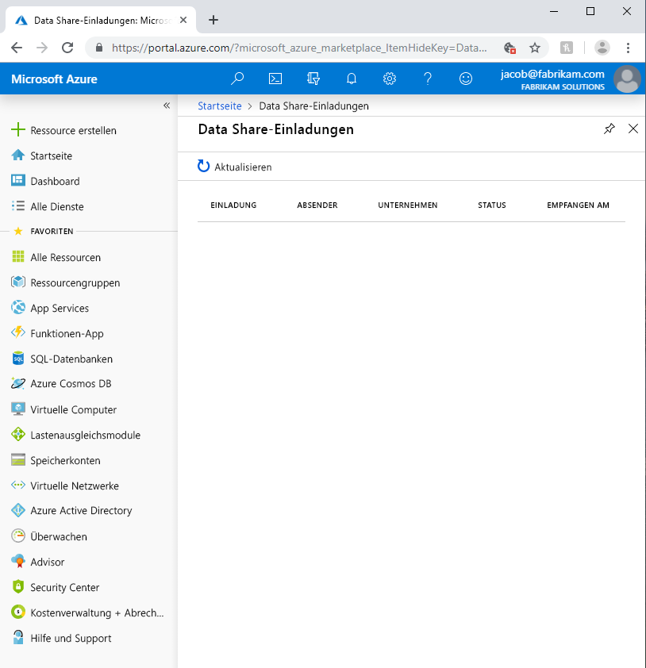
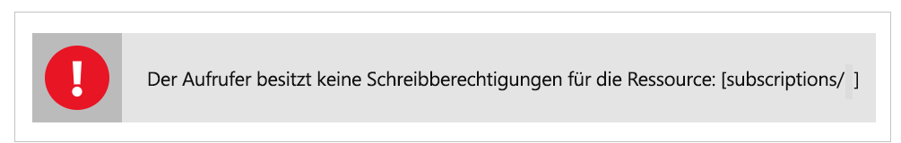

# Behandeln allgemeiner Probleme in Azure Data Share (Vorschauversion)

In diesem Artikel erfahren Sie, wie Sie allgemeine Probleme mit Azure Data Share (Vorschauversion) behandeln. 

## Azure Data Share-Einladungen 

Wenn ein neuer Benutzer in der gesendeten E-Mail-Einladung auf **Einladung akzeptieren** klickt, kann es vorkommen, dass eine leere Einladungsliste angezeigt wird. 

Der obige Fehler ist ein bekanntes Problem mit dem Dienst. Eine Lösung ist bereits in Arbeit. Gehen Sie zur Umgehung des Problems wie folgt vor: 

1. Navigieren Sie im Azure-Portal zu **Abonnements**.
1. Wählen Sie das Abonnement aus, das Sie für Azure Data Share verwenden.
1. Klicken Sie auf **Ressourcenanbieter**.
1. Suchen Sie nach „Microsoft.DataShare“.
1. Klicken Sie auf **Registrieren**.

Für diese Schritte wird die [Azure-RBAC-Rolle „Mitwirkender“](https://docs.microsoft.com/azure/role-based-access-control/built-in-roles#contributor) benötigt. 

Wenn immer noch keine Data Share-Einladung angezeigt wird, wenden Sie sich an Ihren Datenanbieter, und stellen Sie sicher, dass die Einladung an Ihre E-Mail-Adresse für die Anmeldung bei Azure und *nicht* an Ihren E-Mail-Alias gesendet wurde. 

> [!IMPORTANT]
> Wenn Sie bereits eine Azure Data Share-Einladung angenommen und den Dienst beendet haben, bevor Sie Speicher konfiguriert haben, gehen Sie wie in der [Anleitung zum Konfigurieren einer Datasetzuordnung](how-to-configure-mapping.md) beschrieben vor, um die Konfiguration Ihrer Datenfreigabe abzuschließen und Daten zu empfangen. 

## Fehler beim Erstellen oder Empfangen einer neuen Data Share-Instanz

„Error: Operation returned an invalid status code 'BadRequest'“ (Fehler: Der Vorgang hat den ungültigen Statuscode "BadRequest" zurückgegeben.)

„Fehler: AuthorizationFailed“

"Error: role assignment to storage account" (Fehler: Rollenzuweisung zu Speicherkonto)

Sollte einer der obigen Fehler auftreten, wenn Sie eine neue Datenfreigabe erstellen oder erhalten, verfügen Sie nicht über die erforderlichen Berechtigungen für das Speicherkonto. Die erforderliche Berechtigung lautet *Microsoft.Authorization/role assignments/write*. Sie ist Teil der Speicherbesitzerrolle oder kann einer benutzerdefinierten Rolle zugewiesen werden. Auch wenn Sie das Speicherkonto selbst erstellt haben, sind Sie NICHT automatisch der Besitzer des Speicherkontos. Führen Sie die folgenden Schritte aus, um sich selbst zum Besitzer des Speicherkontos zu machen. Alternativ können Sie eine benutzerdefinierte Rolle mit dieser Berechtigung erstellen und sich selbst dieser Rolle hinzufügen.  

1. Navigieren Sie im Azure-Portal zu dem Speicherkonto.
1. Wählen Sie **Zugriffssteuerung (IAM)** aus.
1. Klicken Sie auf **Hinzufügen**.
1. Fügen Sie sich als Besitzer hinzu.

## Nächste Schritte

Informationen zum Freigeben von Daten finden Sie im Tutorial [Share your data using Azure Data Share Preview](share-your-data.md) (Freigeben Ihrer Daten mithilfe von Azure Data Share (Vorschauversion)).

