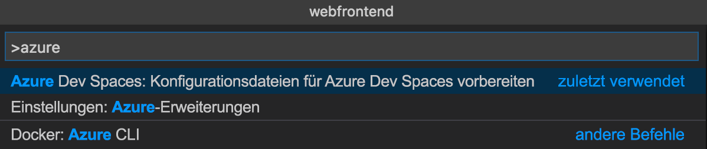
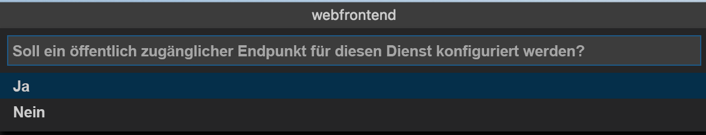

# <a name="quickstart-debug-and-iterate-with-visual-studio-code-and-nodejs-on-kubernetes-using-azure-dev-spaces"></a>Schnellstart: Debuggen und Iterieren mit Visual Studio Code und Node.js in Kubernetes mithilfe von Azure Dev Spaces

In diesem Leitfaden lernen Sie Folgendes:

- Einrichten von Azure Dev Spaces mit einem verwalteten Kubernetes-Cluster in Azure
- Iteratives Entwickeln von Code in Containern mit Visual Studio Code
- Debuggen des Codes in Ihrem Entwicklerbereich über Visual Studio Code

Azure Dev Spaces ermöglicht außerdem das Debuggen und Durchlaufen mit:
- [Java und Visual Studio Code](quickstart-java.md)
- [.NET Core und Visual Studio Code](quickstart-netcore.md)
- [.NET Core und Visual Studio](quickstart-netcore-visualstudio.md)

## <a name="prerequisites"></a>Voraussetzungen

- Ein Azure-Abonnement. Falls Sie über kein Azure-Abonnement verfügen, können Sie ein [kostenloses Konto](https://azure.microsoft.com/free) erstellen.
- [Installation von Visual Studio Code](https://code.visualstudio.com/download).
- Installation der [Azure Dev Spaces](https://marketplace.visualstudio.com/items?itemName=azuredevspaces.azds)-Erweiterung für Visual Studio Code.
- [Azure-CLI installiert](/cli/azure/install-azure-cli?view=azure-cli-latest).

## <a name="create-an-azure-kubernetes-service-cluster"></a>Erstellen eines Azure Kubernetes Service-Clusters

Sie müssen in einer [unterstützten Region][supported-regions] einen AKS-Cluster erstellen. Mit den unten angegebenen Befehlen wird eine Ressourcengruppe mit dem Namen *MyResourceGroup* und der AKS-Cluster *MyAKS* erstellt.

```cmd
az group create --name MyResourceGroup --location eastus
az aks create -g MyResourceGroup -n MyAKS --location eastus --disable-rbac --generate-ssh-keys
```

## <a name="enable-azure-dev-spaces-on-your-aks-cluster"></a>Aktivieren von Azure Dev Spaces in Ihrem AKS-Cluster

Verwenden Sie den Befehl `use-dev-spaces`, um Dev Spaces in Ihrem AKS-Cluster zu aktivieren, und befolgen Sie die angezeigten Anweisungen. Mit dem unten angegebenen Befehl wird Dev Spaces im Cluster *MyAKS* in der Gruppe *MyResourceGroup* aktiviert und der Entwicklerbereich *default* erstellt.

> [!NOTE]
> Mit dem Befehl `use-dev-spaces` wird außerdem die Azure Dev Spaces-Befehlszeilenschnittstelle installiert, falls diese nicht bereits installiert ist. Die Azure Dev Spaces-Befehlszeilenschnittstelle kann nicht in Azure Cloud Shell installiert werden.

```cmd
$ az aks use-dev-spaces -g MyResourceGroup -n MyAKS

'An Azure Dev Spaces Controller' will be created that targets resource 'MyAKS' in resource group 'MyResourceGroup'. Continue? (y/N): y

Creating and selecting Azure Dev Spaces Controller 'MyAKS' in resource group 'MyResourceGroup' that targets resource 'MyAKS' in resource group 'MyResourceGroup'...2m 24s

Select a dev space or Kubernetes namespace to use as a dev space.
 [1] default
Type a number or a new name: 1

Kubernetes namespace 'default' will be configured as a dev space. This will enable Azure Dev Spaces instrumentation for new workloads in the namespace. Continue? (Y/n): Y

Configuring and selecting dev space 'default'...3s

Managed Kubernetes cluster 'MyAKS' in resource group 'MyResourceGroup' is ready for development in dev space 'default'. Type `azds prep` to prepare a source directory for use with Azure Dev Spaces and `azds up` to run.
```

## <a name="get-sample-application-code"></a>Abrufen des Codes für die Beispielanwendung

In diesem Artikel verwenden Sie die [Azure Dev Spaces-Beispielanwendung](https://github.com/Azure/dev-spaces), um die Nutzung von Azure Dev Spaces zu veranschaulichen.

Klonen Sie die Anwendung von GitHub.

```cmd
git clone https://github.com/Azure/dev-spaces
```

## <a name="prepare-the-sample-application-in-visual-studio-code"></a>Vorbereiten der Beispielanwendung in Visual Studio Code

Öffnen Sie Visual Studio Code, klicken Sie auf *Datei* und dann auf *Öffnen...* , navigieren Sie zum Verzeichnis *dev-spaces/samples/nodejs/getting-started/webfrontend*, und klicken Sie auf *Öffnen*.

Das Projekt *webfrontend* ist nun in Visual Studio Code geöffnet. Um die Anwendung in Ihrem Entwicklungsbereich auszuführen, generieren Sie in der Befehlspalette mithilfe der Azure Dev Spaces-Erweiterung die Docker- und die Helm-Chart-Ressourcen.

Klicken Sie zum Öffnen der Befehlspalette in Visual Studio Code auf *Ansicht* und dann auf *Befehlspalette*. Beginnen Sie mit dem Eingeben von `Azure Dev Spaces`, und klicken Sie auf `Azure Dev Spaces: Prepare configuration files for Azure Dev Spaces`.



Wenn Sie von Visual Studio Code auch zum Konfigurieren Ihres öffentlichen Endpunkts aufgefordert werden, wählen Sie `Yes` aus, um einen öffentlichen Endpunkt zu aktivieren.



Dieser Befehl generiert ein Dockerfile und ein Helm-Chart, um Ihr Projekt für die Ausführung in Azure Dev Spaces vorzubereiten. Außerdem wird das Verzeichnis *.vscode* mit der grundlegenden Debugkonfiguration Ihres Projekts generiert.

## <a name="build-and-run-code-in-kubernetes-from-visual-studio-code"></a>Erstellen und Ausführen von Code in Kubernetes über Visual Studio Code

Klicken Sie links auf das Symbol *Debuggen* und dann oben auf *Launch Server (AZDS)* (Server starten (AZDS)).


Mit diesem Befehl wird Ihr Dienst in Azure Dev Spaces erstellt und ausgeführt. Im Fenster *Terminal* am unteren Rand werden die Buildausgabe und die URLs zur Ausführung von Azure Dev Spaces für Ihren Dienst angezeigt. In der *Debugging-Konsole* wird die Protokollausgabe angezeigt.

> [!Note]
> Falls in der *Befehlspalette* keine Azure Dev Spaces-Befehle angezeigt werden, sollten Sie überprüfen, ob die [Visual Studio Code-Erweiterung für Azure Dev Spaces](https://marketplace.visualstudio.com/items?itemName=azuredevspaces.azds) installiert wurde. Vergewissern Sie sich auch, dass Sie das Verzeichnis *dev-spaces/samples/nodejs/getting-started/webfrontend* in Visual Studio Code geöffnet haben.

Wenn Sie die öffentliche URL öffnen, sehen Sie, dass der Dienst ausgeführt wird.

Klicken Sie auf *Debuggen* und dann auf *Debuggen beenden*, um den Debugger zu beenden.

## <a name="update-code"></a>Aktualisieren des Codes

Zum Bereitstellen einer aktualisierten Version Ihres Diensts können Sie Dateien in Ihrem Projekt aktualisieren und *Launch Server* (Server starten) erneut ausführen. Beispiel:

1. Falls Ihre Anwendung noch ausgeführt wird, klicken Sie auf *Debuggen* und anschließend auf *Debuggen beenden*, um sie zu beenden.
1. Aktualisieren Sie die [Zeile 13 in `server.js`](https://github.com/Azure/dev-spaces/blob/master/samples/nodejs/getting-started/webfrontend/server.js#L13) wie folgt:
    
    ```javascript
        res.send('Hello from webfrontend in Azure');
    ```

1. Speichern Sie die Änderungen.
1. Führen Sie *Launch Server* (Server starten) erneut aus.
1. Navigieren Sie zu Ihrem ausgeführten Dienst, und sehen Sie sich Ihre Änderungen an.
1. Klicken Sie auf *Debuggen* und anschließend auf *Debuggen beenden*, um Ihre Anwendung zu beenden.

## <a name="setting-and-using-breakpoints-for-debugging"></a>Festlegen und Verwenden von Haltepunkten für das Debuggen

Starten Sie Ihren Dienst, indem Sie *Launch Server (AZDS)* (Server starten (AZDS)) verwenden.

Navigieren Sie zurück zur Ansicht *Explorer*, indem Sie auf *Ansicht* und dann auf *Explorer* klicken. Öffnen Sie `server.js`, und klicken Sie auf die Zeile 13, um den Cursor darin zu platzieren. Drücken Sie zum Festlegen eines Haltepunkts *F9*, oder klicken Sie auf *Debuggen* und dann auf *Haltepunkt umschalten*.

Öffnen Sie Ihren Dienst in einem Browser. Sie sehen, dass keine Meldung angezeigt wird. Wechseln Sie zurück zu Visual Studio Code. Zeile 13 ist hervorgehoben. Durch den von Ihnen festgelegten Breakpoint wurde der Dienst in Zeile 13 angehalten. Drücken Sie zum Fortsetzen des Diensts *F5*, oder klicken Sie auf *Debuggen* und dann auf *Weiter*. Wechseln Sie zurück zum Browser. Sie sehen, dass die Meldung jetzt angezeigt wird.

Beim Ausführen Ihres Diensts in Kubernetes mit einem angefügten Debugger haben Sie Vollzugriff auf Debuginformationen, z. B. Aufrufliste, lokale Variablen und Ausnahmeninformationen.

Entfernen Sie den Breakpoint, indem Sie Ihren Cursor in `server.js` in der Zeile 13 platzieren und *F9* drücken.

Klicken Sie auf *Debuggen* und dann auf *Debuggen beenden*, um den Debugger zu beenden.

## <a name="update-code-from-visual-studio-code"></a>Aktualisieren von Code aus Visual Studio Code

Ändern Sie den Debugmodus in *Attach to a Server (AZDS)* (An Server anfügen (AZDS)), und starten Sie den Dienst:


Mit diesem Befehl wird Ihr Dienst in Azure Dev Spaces erstellt und ausgeführt. Außerdem wird im Container Ihres Diensts ein Prozess vom Typ [nodemon](https://nodemon.io) gestartet und VS Code angefügt. Der Prozess *nodemon* lässt automatische Neustarts zu, wenn Änderungen am Quellcode vorgenommen werden, um auf ähnliche Weise wie auf Ihrem lokalen Computer eine schnellere Entwicklung von inneren Schleifen zu ermöglichen.

Navigieren Sie nach dem Starten des Diensts über Ihren Browser dorthin, und interagieren Sie damit.

Wechseln Sie während der Ausführung des Diensts zu VS Code zurück, und aktualisieren Sie die Zeile 13 in `server.js`. Beispiel:
```javascript
    res.send('Hello from webfrontend in Azure while debugging!');
```

Speichern Sie die Datei, und kehren Sie über einen Browser zu Ihrem Dienst zurück. Interagieren Sie mit dem Dienst, und achten Sie auf die Anzeige Ihrer aktualisierten Meldung.

Während der Ausführung von *nodemon* wird der Node-Prozess automatisch neu gestartet, sobald Codeänderungen erkannt werden. Dieser Prozess des automatischen Neustarts ähnelt dem Bearbeiten und Neustarten Ihres Diensts auf Ihrem lokalen Computer, um eine Umgebung für die Entwicklung von inneren Schleifen bereitzustellen.

## <a name="clean-up-your-azure-resources"></a>Bereinigen Ihrer Azure-Ressourcen

```cmd
az group delete --name MyResourceGroup --yes --no-wait
```

## <a name="next-steps"></a>Nächste Schritte

Informieren Sie sich darüber, wie Azure Dev Spaces Sie bei der Entwicklung komplexerer containerübergreifender Anwendungen unterstützt und wie Sie die gemeinsame Entwicklung vereinfachen können, indem Sie in verschiedenen Bereichen mit verschiedenen Versionen oder Branches Ihres Codes arbeiten.

> [!div class="nextstepaction"]
> [Arbeiten mit mehreren Containern und Teamentwicklung](multi-service-nodejs.md)


[supported-regions]: about.md#supported-regions-and-configurations
