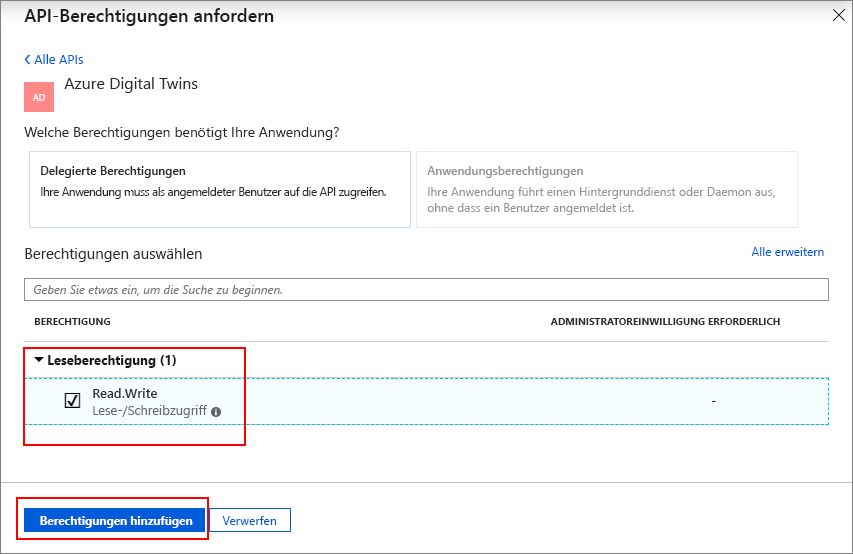

# <a name="azure-digital-twins-swagger-reference-documentation"></a>Referenzdokumentation: Azure Digital Twins-Swagger

Jede bereitgestellte Azure Digital Twins-Instanz enthält ihre eigene automatisch generierte Swagger-Referenzdokumentation.

[Swagger](https://swagger.io/) (oder [OpenAPI](https://www.openapis.org/)) vereinigt komplexe API-Informationen in einer interaktiven und sprachunabhängigen Referenzressource. Swagger stellt wichtiges Referenzmaterial dazu bereit, welche JSON-Nutzlasten, HTTP-Methoden und speziellen Endpunkte zum Ausführen von Vorgängen für eine API zu verwenden sind.

## <a name="swagger-summary"></a>Swagger-Zusammenfassung

Swagger stellt eine interaktive Zusammenfassung Ihrer API bereit. Dazu gehören:

* API- und Objektmodellinformationen
* REST-API-Endpunkte, die erforderliche Anforderungsnutzlasten, Header, Parameter, Kontextpfade und HTTP-Methoden angeben
* Testen von API-Funktionalitäten
* Beispielantwortinformationen zum Überprüfen und Bestätigen von HTTP-Antworten
* Fehlercodeinformationen

Swagger ist ein praktisches Tool zur Unterstützung beim Entwickeln und Testen von Aufrufen, die an die Azure Digital Twins-Verwaltungs-APIs gesendet werden.

[!INCLUDE [Digital Twins Swagger](../../includes/digital-twins-swagger.md)]

## <a name="reference-material"></a>Referenzmaterial

Das automatisch generierte Swagger-Referenzmaterial enthält eine schnelle Übersicht über wichtige Konzepte, verfügbare Verwaltungs-API-Endpunkte und eine Beschreibung aller Objektmodelle, die Sie beim Entwickeln und Testen verwenden können.

Eine präzise Zusammenfassung beschreibt die API.

[](media/how-to-use-swagger/swagger_management_top.PNG#lightbox)

Verwaltungs-API-Objektmodelle werden ebenfalls aufgelistet.

[](media/how-to-use-swagger/swagger_management_models.PNG#lightbox)

Sie können jedes aufgelistete Objektmodell auswählen, um eine detailliertere Zusammenfassung der Schlüsselattribute zu erhalten.

[](media/how-to-use-swagger/swagger_management_model.PNG#lightbox)

Die generierten Swaggerobjektmodelle eignen sich ideal zum Anzeigen aller verfügbaren [Objekte und APIs](./concepts-objectmodel-spatialgraph.md) von Azure Digital Twins. Entwickler können diese Ressource verwenden, wenn sie Lösungen in Azure Digital Twins erstellen.

## <a name="endpoint-summary"></a>Zusammenfassung der Endpunkte

Swagger stellt auch eine umfassende Übersicht über alle Endpunkte bereit, aus denen die Verwaltungs-APIs bestehen.

Für jeden aufgelisteten Endpunkt werden auch die erforderlichen Anforderungsinformationen aufgeführt. Dazu gehören:

* Erforderliche Parameter
* Datentypen der erforderlichen Parameter
* HTTP-Methode zum Zugreifen auf die Ressource

[](media/how-to-use-swagger/swagger_management_endpoints.PNG#lightbox)

Wählen Sie eine Ressource aus, um eine detailliertere Übersicht zu erhalten.

## <a name="use-swagger-to-test-endpoints"></a>Verwenden von Swagger zum Testen von Endpunkten

Eine der leistungsstarken Funktionalitäten von Swagger besteht darin, einen API-Endpunkt direkt über die Benutzeroberfläche der Dokumentation zu testen.

Nachdem Sie einen bestimmten Endpunkt ausgewählt haben, wird **Jetzt ausprobieren** angezeigt.

[](media/how-to-use-swagger/swagger_management_try.PNG#lightbox)

Erweitern Sie diesen Abschnitt, um Eingabefelder für jeden erforderlichen und optionalen Parameter anzuzeigen. Geben Sie die richtigen Werte ein, und wählen Sie **Ausführen** aus.

[](media/how-to-use-swagger/swagger_management_tried.PNG#lightbox)

Wenn Sie den Test ausgeführt haben, können Sie die Antwortdaten überprüfen.

## <a name="swagger-response-data"></a>Swagger-Antwortdaten

Jeder aufgelistete Endpunkt enthält auch Antworttextdaten, um Ihre Entwicklung und Tests zu überprüfen. Diese Beispiele enthalten die Statuscodes und JSON-Objekte, die für erfolgreiche HTTP-Anforderungen angezeigt werden sollen.

[](media/how-to-use-swagger/swagger_management_response.PNG#lightbox)

Die Beispiele enthalten auch Fehlercodes zur Unterstützung beim Debuggen oder Verändern von fehlgeschlagenen Tests.

## <a name="swagger-oauth-20-authorization"></a>Swagger-OAuth 2.0-Autorisierung

Weitere Informationen zum interaktiven Testen von Anforderungen, die durch OAuth 2.0 geschützt sind, finden Sie in der [offiziellen Dokumentation](https://swagger.io/docs/specification/authentication/oauth2/).

> [!NOTE]
> Der Benutzerprinzipal, der die Azure Digital Twins-Ressource erstellt hat, verfügt über eine Raumadministrator-Rollenzuweisung und kann zusätzliche Rollenzuweisungen für andere Benutzer erstellen.

1. Führen Sie die Schritte in [diesem Schnellstart](https://docs.microsoft.com/azure/active-directory/develop/quickstart-v1-integrate-apps-with-azure-ad) aus, um eine Azure AD-Anwendung vom Typ ***Web-App/API*** zu erstellen. Alternativ können Sie eine vorhandene App-Registrierung wiederverwenden.

2. Fügen Sie der App-Registrierung die folgende Antwort-URL hinzu:

    ```plaintext
    https://YOUR_SWAGGER_URL/ui/oauth2-redirect-html
    ```
    | NAME  | Ersetzen durch | Beispiel |
    |---------|---------|---------|
    | YOUR_SWAGGER_URL | Dokumentations-URL Ihrer Verwaltungs-REST-API aus dem Portal  | `https://yourDigitalTwinsName.yourLocation.azuresmartspaces.net/management/swagger` |

3. Erteilen Sie die Berechtigungen für den Zugriff auf Azure Digital Twins durch Ihre App. Geben Sie unter **Erforderliche Berechtigungen** `Azure Digital Twins` ein, und wählen Sie **Delegierte Berechtigungen** aus. Wählen Sie dann **Berechtigungen erteilen** aus.

    

4. Konfigurieren Sie das Anwendungsmanifest so, dass impliziter OAuth 2.0-Fluss zulässig ist. Klicken Sie auf **Manifest**, um das Anwendungsmanifest für Ihre App zu öffnen. Legen Sie *oauth2AllowImplicitFlow* auf `true` fest.

    

5. Kopieren Sie die ID Ihrer Azure AD-App.

Nach Abschluss der Azure Active Directory-Registrierung:

6. Klicken Sie auf Ihrer Swagger-Seite auf die Schaltfläche **Autorisieren**.

    [](media/how-to-use-swagger/swagger-select-authorize-btn.png#lightbox)

7. Fügen Sie die Anwendungs-ID in das Feld **client_id** ein.

    [](media/how-to-use-swagger/swagger-auth-form.png#lightbox)

8. Sie werden dann zum folgenden Erfolgsmodal umgeleitet.

    [](media/how-to-use-swagger/swagger_auth_redirect.PNG#lightbox)

## <a name="next-steps"></a>Nächste Schritte

- Weitere Informationen zu Azure Digital Twins-Objektmodellen und zum Raumintelligenzgraph finden Sie unter [Grundlegendes zum Azure Digital Twins-Objektmodell](./concepts-objectmodel-spatialgraph.md).

- Wie eine Authentifizierung über Ihre Verwaltungs-API erfolgt, erfahren Sie unter [Authentifizieren über APIs](./security-authenticating-apis.md).