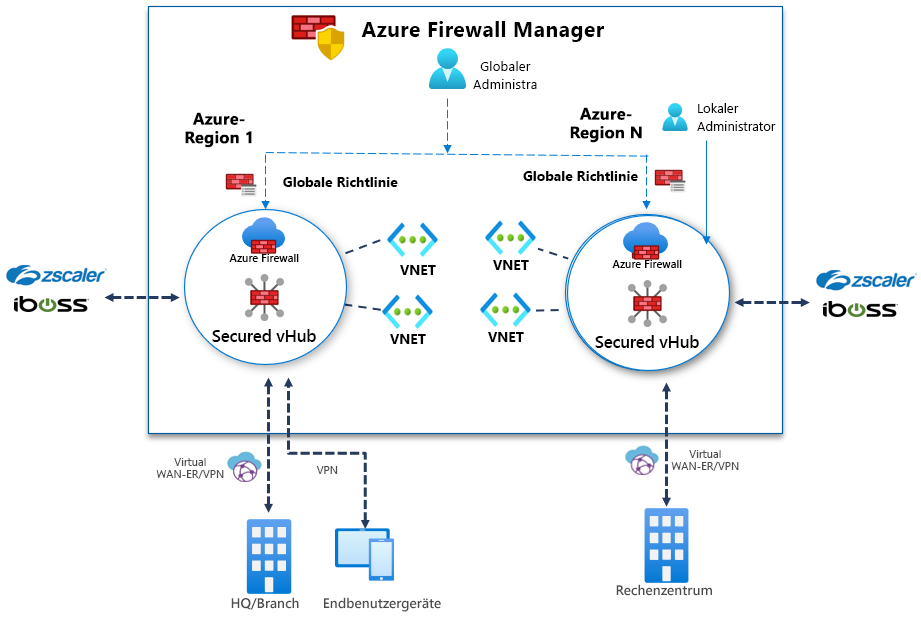

# Was ist Azure Firewall Manager (Vorschau)?

[!INCLUDE [Preview](../../includes/firewall-manager-preview-notice.md)]

Azure Firewall Manager (Vorschau) ist ein Sicherheitsverwaltungsdienst, der eine zentrale Sicherheitsrichtlinien- und Routenverwaltung für cloudbasierte Sicherheitsperimeter bereitstellt. Der Dienst arbeitet mit [Azure Virtual WAN Hub](../virtual-wan/virtual-wan-about.md#resources) zusammen, einer von Microsoft verwalteten Ressource, mit der Sie ganz einfach Hub-and-Spoke-Architekturen erstellen können. Wenn einem solchen Hub Sicherheits- und Routingrichtlinien zugeordnet werden, wird dieser als *[geschützter virtueller Hub](secured-virtual-hub.md)* bezeichnet. 

## Features von Azure Firewall Manager (Vorschau)

Die Vorschau von Azure Firewall Manager bietet die folgenden Features:

### Zentrale Azure Firewall-Bereitstellung und -Konfiguration

Sie können zentral mehrere Azure Firewall-Instanzen bereitstellen und konfigurieren, die sich über verschiedene Azure-Regionen und -Abonnements erstrecken. 

### Hierarchische Richtlinien (global und lokal)

Sie können mit Azure Firewall Manager (Vorschau) Azure Firewall-Richtlinien für mehrere geschützte virtuelle Hubs zentral verwalten. Ihre zentralen IT-Teams können globale Firewallrichtlinien erstellen, um organisationsweite und teamübergreifende Firewallrichtlinien zu erzwingen. Lokal erstellte Firewallrichtlinien ermöglichen ein DevOps-Self-Service-Modell für mehr Agilität.

### Integration von Drittanbieter-SECaaS-Lösungen für höhere Sicherheit

Zusätzlich zur Azure Firewall können Sie SECaaS-Anbieter (Security-as-a-Service) von Drittanbietern integrieren, um zusätzlichen Netzwerkschutz für Ihre VNET-Verbindungen und Internetverbindungen von Zweigstellen zu erzielen.

- Filterung von V2I-Datenverkehr (VNET-to-Internet)

   - Filtern Sie ausgehenden VNET-Datenverkehr mit einem Drittanbieter-Sicherheitsanbieter Ihrer Wahl.
   - Nutzen Sie fortschrittlichen Internetschutz für Ihre in Azure ausgeführten Cloudworkloads.

- Filtern von B2I-Datenverkehr (Branch-to-Internet)

   Nutzen Sie Ihre Azure-Konnektivität und die globale Verteilung, um für B2I-Szenarien auf einfache Weise eine Drittanbieterfilterung hinzuzufügen.

Weitere Informationen zu vertrauenswürdigen Sicherheitsanbietern finden Sie unter [Was sind vertrauenswürdige Sicherheitsanbieter (Vorschau)?](trusted-security-partners.md).

### Zentrale Routenverwaltung

Leiten Sie den Datenverkehr zur Filterung und Protokollierung einfach an Ihren geschützten Hub weiter, ohne dass Sie manuell benutzerdefinierte Routen (UDR) für virtuelle Spoke-Netzwerke einrichten müssen. Sie können für die Filterung von B2I-Datenverkehr Anbieter von Drittanbietern verwenden, gemeinsam mit Azure Firewall für B2V (Branch-to-VNET), V2V (VNET-to-VNET) und V2I (VNET-to-Internet). Sie können auch Lösungen von Drittanbietern für die V2I-Datenverkehrsfilterung verwenden, solange Azure Firewall nicht für B2V oder V2V benötigt wird. 

## Regionale Verfügbarkeit

Für die öffentliche Vorschau werden die folgenden Regionen unterstützt:

- „Europa, Westen“, „Europa, Norden“, „Frankreich, Mitte“, „Frankreich, Süden“, „Vereinigtes Königreich, Süden“, „Vereinigtes Königreich, Westen“
- „Australien, Osten“, „Australien, Mitte“, „Australien, Mitte 2“, „Australien, Südosten“
- Kanada, Mitte
- „USA, Osten“, „USA, Westen“, „USA, Osten 2“, „USA, Süden-Mitte“, „USA, Westen 2“, „USA, Norden-Mitte“, „USA, Westen-Mitte“

Azure Firewall-Richtlinien können ausschließlich in diesen Regionen erstellt, aber regionsübergreifend verwendet werden. Beispielsweise können Sie eine Richtlinie in „USA, Westen“ erstellen und in „USA, Osten“ verwenden. 

## Bekannte Probleme

Für Azure Firewall Manager (Vorschau) sind die folgenden Probleme bekannt:

|Problem  |BESCHREIBUNG  |Lösung  |
|---------|---------|---------|
|Keine Unterstützung von manuell erstellten zentralen VNETs|Aktuell unterstützt Azure Firewall Manager Netzwerke, die mit virtuellen Hubs erstellt werden. Die Verwendung eigener, manuell erstellter Hub-VNETs wird noch nicht unterstützt.|Verwenden Sie Azure Firewall Manager vorerst mit Hub-and-Spoke-Netzwerken, die mit virtuellen Hubs erstellt wurden. Das Problem wird zurzeit untersucht.
|Einschränkungen für Drittanbieterfilterung|Eine V2I-Datenverkehrsfilterung mit Anbietern von Drittanbietern wird mit Azure Firewall B2V und V2V nicht unterstützt.|Das Problem wird zurzeit untersucht.|
|Aktuell keine Unterstützung für eine Trennung des Datenverkehrs|Die Trennung von Office 365- und öffentlichem Azure-PaaS-Datenverkehr wird aktuell nicht unterstützt. Daher wird bei Auswahl eines Drittanbieters für V2I oder B2I auch der gesamte öffentliche Azure-PaaS- und Office 365-Datenverkehr über den Partnerdienst gesendet.|Die Datenverkehrstrennung am Hub wird aktuell untersucht.
|Ein Hub pro Region|Sie können nicht mehr als einen Hub pro Region verwenden.|Erstellen Sie mehrere virtuelle WANs in einer Region.|
|Basisrichtlinien müssen in derselben Region wie die lokale Richtlinie vorliegen|Erstellen Sie sämtliche Ihrer lokalen Richtlinien in derselben Region wie die Basisrichtlinie. Eine in einer Region erstellte Richtlinie kann weiterhin auf einen geschützten Hub aus einer anderen Region angewendet werden.|Das Problem wird zurzeit untersucht.|

## Nächste Schritte

- [Übersicht über die Bereitstellung von Azure Firewall Manager (Vorschau)](deployment-overview.md)
- Weitere Informationen über [geschützte virtuelle Hubs](secured-virtual-hub.md)